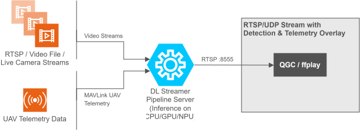

# UAV Vision Analytics Application

<!--hide_directive

  <a class="icon_github" href="https://github.com/open-edge-platform/edge-ai-suites/tree/main/federal-aerospace/apps/uav-vision-aalytics">
     GitHub
  </a>
  <a class="icon_document" href="https://github.com/open-edge-platform/edge-ai-suites/tree/main/federal-aerospace/apps/uav-vision-aalytics/README.md">
     Readme
  </a>
  <a class="icon_download" href="https://github.com/open-edge-platform/edge-ai-suites/releases/download/2026.2/uav-vision-analytics.zip">
     Download Package
  </a>

hide_directive-->

UAV Vision Analytics demonstrats how AI-based object detection can be integrated with UAV
flight controller telemetry on a companion compute platform.

Based on DL Streamer Pipeline Server, the application processes video from a UAV-mounted
camera or a simulated video file, detects objects across ten object classes, and outputs an
RTSP stream annotated with MAVLink telemetry (GPS, altitude, speed, heading). The stream is
consumable by any capable client, such as QGroundControl (QGC), VLC, and ffplay.
It runs the YOLOv8n-VisDrone, a model designed to recognize imagery typical for drone video.

The application supports two deployment modes depending on whether an external SDK is available.

| Component                                      | Role                                                                                                    |
| ---------------------------------------------- | ------------------------------------------------------------------------------------------------------- |
| RTSP / Video File / Live Camera Streams        | Input video source — UAV camera feed, a recorded video file, or a simulated RTSP stream                 |
| MAVLink UAV Telemetry                          | Telemetry input — GPS, altitude, speed, and heading received from the flight controller over UDP        |
| DL Streamer Pipeline Server (CPU / GPU / NPU)  | Core inference engine — runs YOLOv8n-VisDrone object detection and renders the telemetry overlay on each frame |
| RTSP Stream with Detection & Telemetry Overlay | Annotated output stream — processed video with bounding boxes and telemetry overlay, served over RTSP   |

## Deployment Modes

The application supports two deployment modes.

### 1. Standalone Mode (pymavlink)

Self-contained mode using PX4 SITL simulation and pymavlink for MAVLink communication. No external dependencies required.

[Get Started — Standalone Mode](./get-started/get-started-standalone.md)

### 2. UAV Mission Compute SDK Mode

Integration mode that connects to a running instance of the UAV Mission Compute SDK, enabling full mission control and multi-camera pipeline management.

[Get Started — UAV Mission Compute SDK Mode](./get-started/get-started-uavsdk.md)

To learn more about the application and how to use it, see the
[User Guides](./how-to-guides.md).

# AI Agent Skills

This application supports AI agent skills for GitHub Copilot and compatible coding agents. Skills cover operational tasks (running pipelines, benchmarking, troubleshooting) and application creation (scaffolding new pymavlink or UAVSDK stacks).

## Intended and Responsible Use

### Intended Use

This project is intended to demonstrate the capabilities of Intel Edge AI for UAV object
detection and live telemetry overlay. It is provided for reference and demonstration purposes
only, and is not intended to be deployed as-is or for alternate use cases or applications.

### Responsible Use

Intel is committed to respecting human rights and avoiding complicity in human rights abuses. See [Intel's Global Human Rights Principles](https://www.intel.com/content/www/us/en/policy/policy-human-rights.html). Intel's products and software are intended only to be used in applications that do not cause or contribute to a violation of an internationally recognized human right.

If you or anyone on your team becomes aware of instances of potentially inappropriate use, regardless of severity, notify [responsible-ai@intel.com](mailto:responsible-ai@intel.com) or use the [Ethics Reporting Portal](https://www.intel.com/content/www/us/en/corporate-responsibility/ethics-and-compliance.html) immediately.

:::{toctree}
:hidden:
Get Started - Standalone <./get-started-standalone.md>
Get Started - SDK <./get-started-uavsdk.md>
User Guides <./how-to-guides.md>
System Requirements <./system-requirements.md>
Release Notes <./release-notes.md>
:::
