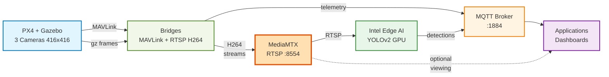

<!--
SPDX-FileCopyrightText: (C) 2026 Intel Corporation
SPDX-License-Identifier: Apache-2.0
-->

# Edge AI UAV (Uncrewed Aerial Vehicle) Platform

Multi-camera UAV simulation with Intel Edge AI — PX4 + Gazebo + OpenVINO vision processing.

## Quick Start

```bash
# 1. Start core infra (sim + bridges + MQTT + RTSP + observability)
make up-sim-camera

# 2. Wait for PX4 healthy (~60-90 sec)
docker compose ps px4

# 3. Start AI helpers + sample apps
make apps
```

Open **http://localhost:5002**

See [GETTING_STARTED.md](GETTING_STARTED.md) for full setup, troubleshooting, and ports.

## What It Does

A PX4 UAV simulation with 3 cameras (nadir, forward, rear) streams live H264 video via RTSP through OpenVINO vehicle detection on Intel GPU. The dashboard shows real-time detections, bounding boxes, and flight telemetry.



## Structure

```
Makefile         Shortcuts: make up-sim-camera / make apps / make down / make apps-down
infra/           PX4 + Gazebo + MQTT bridges + observability (InfluxDB/Grafana)
  px4-sim/       Single PX4 image (local + remote); includes mavlink-router
  scripts/       deploy_remote.sh, test_api.sh
sample-apps/     AI helper (vision-processor) + edge-ai-showcase dashboard + mission scripts
mcp-server/      MCP server for AI agent control
docs/            Architecture, ports, Ethernet guide
docker-compose.yml             Simulation stack (multi-cam default, configurable via .env)
docker-compose.ethernet.yml    Override for remote FC over Ethernet
```

## Key Ports

| Service | URL |
|---|---|
| Edge AI Dashboard | http://localhost:5002 |
| REST API (arm/fly/land) | http://localhost:8080 |
| RTSP Streams | rtsp://localhost:8554/uav-1/{camera} |
| MQTT broker | localhost:1884 |
| Grafana | http://localhost:3000 |

**View live camera**: `ffplay rtsp://localhost:8554/uav-1/nadir`

## Notices and Disclaimers

**Notice for FFmpeg:**

FFmpeg is an open source project licensed under LGPL and GPL. See https://www.ffmpeg.org/legal.html. You are solely responsible for determining if your use of FFmpeg requires any additional licenses. Intel is not responsible for obtaining any such licenses, nor liable for any licensing fees due, in connection with your use of FFmpeg.

**Notice for GStreamer:**

GStreamer is an open source framework licensed under LGPL. See https://gstreamer.freedesktop.org/documentation/frequently-asked-questions/licensing.html. You are solely responsible for determining if your use of GStreamer requires any additional licenses. Intel is not responsible for obtaining any such licenses, nor liable for any licensing fees due, in connection with your use of GStreamer.

