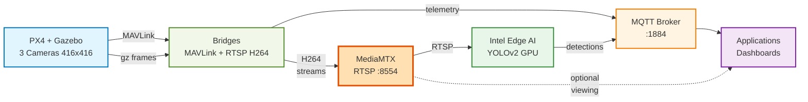

<!--
SPDX-FileCopyrightText: (C) 2026 Intel Corporation
SPDX-License-Identifier: Apache-2.0
-->

# Edge AI UAV (Uncrewed Aerial Vehicle) Platform

> This SDK is intended as a development kit and reference solution for evaluating Intel Edge AI capabilities on UAV platforms.

Multi-camera UAV simulation with Intel Edge AI — PX4 + Gazebo + OpenVINO vision processing.

---

## Where to Start

| I want to… | Go here |
|---|---|
| Run the demo end-to-end | [Quick Start](#quick-start) below |
| Understand the full architecture | [docs/ARCHITECTURE.md](docs/ARCHITECTURE.md) |
| Configure cameras, switch USB/sim | [docs/CAMERA-MODES.md](docs/CAMERA-MODES.md) |
| See all ports and services | [docs/PORTS.md](docs/PORTS.md) |
| Connect a real PX4 over Ethernet | [docs/ETHERNET-PX4.md](docs/ETHERNET-PX4.md) |
| Troubleshoot a broken stack | [GETTING_STARTED.md](GETTING_STARTED.md) |

---

## Prerequisites

- **OS**: Ubuntu 24.04
- **Docker Engine** 24+ and Docker Compose v2 (`docker compose version`)
- **Intel GPU** for vision inference
- **RAM**: 16 GB minimum (sim mode); 8 GB sufficient for USB camera mode
- **Disk**: ~15 GB for Docker images

```bash
# Verify Intel GPU render nodes are present
ls /dev/dri/renderD*
```

---

## Quick Start

```bash
# 1. Create .env and detect GPU devices
make init

# 2. Start core infra (PX4 + Gazebo + camera bridges + MQTT + RTSP + observability)
make up-sim-camera

# 3. Start AI helpers + sample apps
make apps
```

Open **http://localhost:5002**

See [GETTING_STARTED.md](GETTING_STARTED.md) for full setup, troubleshooting, and ports.

---

## What It Does

A PX4 UAV simulation with 3 cameras (nadir, forward, rear) streams live H264 video via RTSP through OpenVINO vehicle detection on Intel GPU. The dashboard shows real-time detections, bounding boxes, and flight telemetry.



---

## Camera Modes

| Mode | Command | PX4 | Cameras |
|---|---|---|---|
| Simulated (default) | `make up-sim-camera` | Gazebo SITL | 3 virtual cameras (nadir, forward, rear) |
| Real USB camera | `make up-usb-camera` | SIH (no Gazebo) | 1 USB/V4L2 device |

---

## Key Makefile Targets

```bash
make init                  # Create .env, detect GPU
make up-sim-camera         # Start sim stack (includes Grafana/InfluxDB)
make up-sim-camera-lean    # Start sim stack without observability (~300 MB RAM saved)
make up-usb-camera         # Start USB camera stack
make up-usb-camera-lean    # Start USB camera stack without observability
make apps                  # Start vision processor + dashboard
make apps-down             # Stop apps only
make down                  # Stop all containers
make logs                  # Tail core infra logs
make apps-logs             # Tail app logs
```

---

## Structure

```
Makefile                     Shortcuts for common dev workflows
infra/                       Infrastructure definitions
  px4-sim/                   PX4 SITL + Gazebo image; also used for remote FC deploy
  bridges/companion/         MAVLink ↔ MQTT bridge (companion_bridge.py — REST API)
  bridges/camera/            Gazebo cameras → RTSP (ffmpeg H264)
  bridges/usb-camera/        USB/V4L2 device → RTSP
  mediamtx/                  RTSP server config
  mosquitto/                 MQTT broker config
  grafana/                   Dashboards provisioning (Flight Telemetry, Platform Health)
  metrics-manager/           Host GPU/CPU/power metrics → InfluxDB
sample-apps/
  helpers/vision-processor/  YOLOv2-tiny on Intel GPU; outputs detections to MQTT + RTSP
  edge-ai-showcase/          Flask dashboard (detections, telemetry, arm/fly/land)
  mission-simulation/        Scripted waypoint missions via REST API
mcp-server/                  MCP server — AI agent control of the UAV stack
docs/                        Architecture, ports, camera modes, Ethernet guide
docker-compose.yml           Core simulation stack
docker-compose.ethernet.yml  Override for remote PX4 FC over Ethernet
```

---

## Key Ports

| Service | URL | Purpose |
|---|---|---|
| Edge AI Dashboard | http://localhost:5002 | Live camera feeds, detections, arm/fly/land |
| REST API | http://localhost:8080 | UAV commands (arm, takeoff, land, goto) |
| RTSP Streams | rtsp://localhost:8554/uav-1/{cam} | Raw + annotated video |
| MQTT broker | localhost:1884 | Telemetry + detection events |
| Grafana | http://localhost:3000 | Flight telemetry + platform health dashboards |
| InfluxDB | http://localhost:8086 | Time-series data UI |

## Disabling Observability (Save ~300 MB RAM)

Grafana, InfluxDB, topic-extractor, and metrics-manager are grouped under the
`observability` profile. They are **on by default** but can be omitted for
tighter memory budgets.

```bash
# Start without observability stack (~300 MB RAM saved)
make up-sim-camera-lean    # sim cameras, no Grafana/InfluxDB
make up-usb-camera-lean    # USB camera, no Grafana/InfluxDB

# Standard start includes observability (default)
make up-sim-camera         # includes Grafana + InfluxDB
```

Or stop observability on an already-running stack:
```bash
docker compose stop grafana influxdb topic-extractor metrics-manager
```

**View live camera**: `ffplay rtsp://localhost:8554/uav-1/nadir`

## Notices and Disclaimers

**Notice for FFmpeg:**

FFmpeg is an open source project licensed under LGPL and GPL. See https://www.ffmpeg.org/legal.html. You are solely responsible for determining if your use of FFmpeg requires any additional licenses. Intel is not responsible for obtaining any such licenses, nor liable for any licensing fees due, in connection with your use of FFmpeg.

**Notice for GStreamer:**

GStreamer is an open source framework licensed under LGPL. See https://gstreamer.freedesktop.org/documentation/frequently-asked-questions/licensing.html. You are solely responsible for determining if your use of GStreamer requires any additional licenses. Intel is not responsible for obtaining any such licenses, nor liable for any licensing fees due, in connection with your use of GStreamer.

