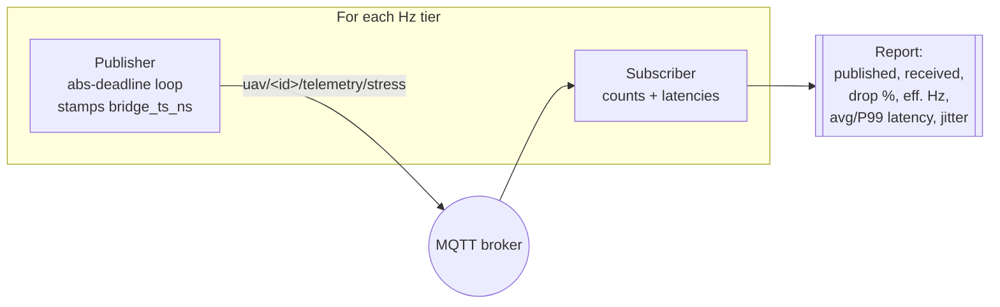

<!--
SPDX-FileCopyrightText: (C) 2026 Intel Corporation
SPDX-License-Identifier: Apache-2.0
-->

# Benchmarking Design

This document describes the design and rationale for the MAVLink → MQTT
benchmark in `benchmarks/`.

---

## Goals

The benchmark answers one operational question:

| Script | Question |
|---|---|
| `benchmark_mavlink_mqtt.py` | How fast and reliably does telemetry travel from PX4 → MAVLink → companion-bridge → MQTT broker → subscriber? |

That path is what bounds real-time situational awareness and any downstream
telemetry-driven feature.

---

## Pipeline under test (`--bridge-sweep`)

The bridge stress sweep exercises the *full* PX4 → MAVSDK → companion-bridge
→ MQTT chain.  Three facts about the current implementation are essential
for reading the results:

1. **Reader and publisher rates are decoupled.**  MAVSDK is asked to stream
   every telemetry topic at `READER_RATE_HZ` (default `1000`), which PX4
   clamps down to its native ceiling per topic (attitude ≈ 250 Hz,
   velocity ≈ 100 Hz, position ≈ 50 Hz, gps ≈ 10 Hz).  The MQTT publish
   cap is enforced *separately* per-topic by `_publish_timer`, which fires
   at `RATE_<TOPIC>_HZ` and emits the latest cached MAVSDK reading.
2. **Reader loops cache; publish timers drain.**  Each reader coroutine
   (`_attitude_loop`, `_position_loop`, …) writes a *freshly constructed*
   dict into `_latest[topic]` on every MAVSDK event and does no MQTT work.
   The per-topic `_publish_timer` fires on an absolute-deadline schedule
   and publishes `_latest[topic]` only if it is a *new object* since the
   last tick (`payload is not last_payload`) — so bridge-introduced
   duplicates are suppressed while legitimate content-repeats (e.g. UAV
   hovering with identical position values) still pass through.
3. **Rate caps are read once at process start.**  Changing `RATE_*_HZ` or
   `READER_RATE_HZ` requires recreating the `companion-bridge` container.
   The sweep driver does this automatically each tier via
   `docker compose up -d --no-deps --force-recreate companion-bridge`.

### End-to-end message flow

```mermaid
flowchart LR
    %% =========== PX4 SIM SIDE ===========
    subgraph SIM["PX4 SITL container"]
        direction TB
        FW["PX4 flight stack<br/><i>native stream ceilings</i><br/>attitude ≈ 250 Hz<br/>velocity ≈ 100 Hz<br/>position ≈ 50 Hz<br/>gps ≈ 10 Hz"]
        UDP["MAVLink UDP endpoint<br/><b>udpin://0.0.0.0:14540</b>"]
        FW -->|MAVLink| UDP
    end

    %% =========== BRIDGE SIDE ===========
    subgraph BRIDGE["companion-bridge container"]
        direction TB
        subgraph MSRV["mavsdk_server (C++ child process)"]
            MSRV_NODE["Owns MAVLink socket over shared TCP channel</b><br/>One server-stream per topic"]
        end
        subgraph PY["Python asyncio event loop (single thread)"]
            CFG["<b>configure_telemetry_rates()<br/>READER_RATE_HZ (default 1000)</b><i>Runs once at startup</i>"]
            RD["<b>Reader coroutines</b><br/><code>async for msg in UAV.telemetry.*()<br/>stamp reader_ts_ns"]
            CACHE[("_latest<br/>dict[topic, dict]")]
            TIMER["<b>_publish_timer(topic, hz)</b></br>@ RATE_&lt;TOPIC&gt;_HZ — one timer per topic"]
            PUB["<b>publish(topic, payload)</b><br/>stamp bridge_ts_ns"]
            CFG -.->|programs<br/>MAVLink rate| MSRV_NODE
            RD -->|write| CACHE
            CACHE -->|read| TIMER
            TIMER --> PUB
        end
        subgraph PAHO_THR["paho network thread"]
            PAHO_LOOP["drains send queue → TCP write"]
        end
        UDP -->|MAVLink UDP| MSRV_NODE
        MSRV_NODE ==>|<b>gRPC</b> over TCP Shared CHannel| RD
        PUB -->|enqueue non-blocking| PAHO_LOOP
    end

    %% =========== BROKER ===========
    BROKER(("mosquitto broker<br/>:1883"))
    PAHO_LOOP -->|MQTT PUBLISH<br/>uav/&lt;id&gt;/telemetry/&lt;topic&gt;| BROKER

    %% =========== BENCHMARK DRIVER ===========
    subgraph BENCH["Client"]
        direction TB
        SUB["Subscriber paho.Client subscribes<br/>uav/&lt;id&gt;/telemetry/#"]
        CALC["Per-topic stats<br/>observed Hz = count / window<br/>latency = recv_time − reader_ts_ns<br/>jitter = stdev(inter-arrival)"]
        SUB --> CALC
    end
    BROKER -->|subscription fan-out| SUB
```



### Where the ceiling lives

Empirically (measured by instrumenting reader-loop counters during a sweep),
the pipeline saturates on the **reader side** long before the broker or the
network:

| Stage | Observed behaviour | Notes |
|---|---|---|
| PX4 → MAVLink UDP | Effectively unbounded on loopback | Firmware honours `SET_MESSAGE_INTERVAL` up to its native ceiling |
| **`mavsdk_server` → Python gRPC** | **Per-stream ceiling ≈ 110–120 Hz** when 3+ streams active | Single shared channel; Python's `grpc.aio` is single-threaded and divides capacity roughly evenly across concurrent server-streams. When the reader can't keep `_latest` fresh at the timer's cadence, the `is`-check drops that tick and the observed publish rate falls below the cap. |
| asyncio event loop | Amber above ~800 wakeups/sec | Reader coroutines + `_publish_timer` tasks + REST all share one thread; jitter grows at very high caps |
| `_publish_timer` | Absolute-deadline scheduler; no drift accumulation | Guarantees ≤ cap; skips ticks where `_latest` was not refreshed since last publish |
| `publish()` | No rate gate — just adds `bridge_ts_ns`, `orjson.dumps`, paho publish | Timer owns the rate |
| paho publish → network thread | Non-blocking enqueue | Rarely the limit on loopback |
| mosquitto broker | Sustains many kHz on loopback | Verified independently by `--sweep` mode |
| subscriber fan-out | Bounded by subscriber's paho thread | Watch the **rate CV** metric for uneven delivery |

The distinctive signature of the gRPC ceiling in `--bridge-sweep` output is
that `attitude`, `velocity`, and `position` all report the **same observed
Hz** at high caps (they share the channel), even though their native
ceilings and publish caps differ.  GPS is unaffected — its 10 Hz publish
cap sits well below the per-stream limit.  If you hit the gRPC ceiling and
want to trade freshness for lower gRPC pressure, lower `READER_RATE_HZ`
(e.g. `READER_RATE_HZ=300`); PX4 will still stream fast enough to keep
`_latest` ahead of any publish cap ≤ 200 Hz.

---

## MAVLink → MQTT Benchmark (`benchmark_mavlink_mqtt.py`)

### What it measures

For every telemetry topic published by `companion-bridge`:

- **Message rate (Hz)** — computed from arrival timestamps over the measurement
  window. Checked against the per-topic rate caps configured in
  `companion-bridge` (defaults: `attitude` ≤ 30 Hz, `velocity` ≤ 20 Hz,
  `position` ≤ 20 Hz, `gps` ≤ 5 Hz — see `RATE_<TOPIC>_HZ` in
  [docker-compose.yml](../docker-compose.yml))​.
- **End-to-end latency (avg + P99)** — the bridge stamps every reader-loop
  event with `reader_ts_ns` (nanosecond UNIX epoch) at MAVSDK consumption
  time, and every outbound MQTT message with `bridge_ts_ns` at publish
  time.  The benchmark computes wall-clock receive time minus the *earliest*
  bridge-side stamp available (`reader_ts_ns` when present, else
  `bridge_ts_ns`), so the reported number reflects the full path from
  MAVLink consumption to subscriber receive.
  - Falls back to the ISO `timestamp` field on `status` messages that carry
    neither nanosecond stamp.
- **Jitter (ms)** — standard deviation of inter-arrival intervals, computed
  per topic. High jitter indicates scheduling pressure in the bridge process
  or MQTT broker backpressure.

### Fan-out scaling (`--clients N`)

Each client is an independent `paho-mqtt` connection subscribing to
`uav/{id}/telemetry/#`.  All N clients connect before the measurement window
starts so broker fan-out load is present throughout.

After the window, a **scaling summary** shows per-client rate and average
latency, plus the **coefficient of variation (CV)** of rates across clients.
A CV > 10 % signals uneven broker delivery, which triggers a console warning.

### Rate-cap warnings

The benchmark compares the observed rate for `attitude`, `velocity`, and
`position` against expected ceiling values. If any topic runs more than 1.5×
its cap, it prints a warning pointing to the relevant `RATE_*_HZ` environment
variable in `companion-bridge`.

### Broker stress sweep (`--sweep`)

Passive observation only tells you what the bridge is currently configured
to emit — not what the transport can *sustain*.  The broker stress sweep
answers the second question with a synthetic publisher/subscriber loop that
does not require PX4.

For each rate in `--sweep-rates` (default `10,25,50,100,200,500` Hz):

1. A dedicated publisher connects to the broker and pushes JSON messages
   stamped with `bridge_ts_ns` at exactly that Hz for `--sweep-duration`
   seconds.  The scheduler is absolute-deadline (`start + i·1/Hz`) with a
   sub-millisecond spin at each deadline, so the emit rate does not drift
   at high frequencies.
2. A subscriber on the same broker counts arrivals, computes end-to-end
   latency from `bridge_ts_ns`, and records inter-arrival jitter.
3. After the window a short drain sleep (max 500 ms) lets in-flight
   messages arrive before the tier ends.



The knee — where `drop %` climbs above 2 % or latency / jitter degrade
sharply — is the broker's saturation point on the current host.  It is
independent of the bridge's software rate caps and therefore describes the
transport headroom available for future rate increases.

### Bridge stress sweep (`--bridge-sweep`)

The broker sweep exercises only the transport.  The bridge sweep exercises
the **full pipeline** — PX4 → MAVSDK → companion-bridge → MQTT — because
that is what actually bounds telemetry throughput in production.

The bridge reads its per-topic outbound rate caps (`RATE_ATTITUDE_HZ`,
`RATE_VELOCITY_HZ`, `RATE_POSITION_HZ`, `RATE_GPS_HZ`) and its MAVSDK
subscription rate (`READER_RATE_HZ`, default `1000`) once at process
start, so raising them requires recreating the container.  The sweep
automates this: for each rate in `--sweep-rates`, it

1. sets the four outbound `RATE_*_HZ` env vars in a subprocess environment
   (leaving `READER_RATE_HZ` at the value inherited from the host or
   `.env`),
2. invokes `docker compose up -d --no-deps --force-recreate companion-bridge`
   against `--compose-file` (default `docker-compose.yml` at repo root),
3. blocks on a temporary MQTT subscriber until the bridge publishes its
   first telemetry message (up to `--restart-wait`, default 30 s),
4. measures observed rate, latency, and jitter for `--sweep-duration`
   seconds on `attitude`, `velocity`, `position`, `gps`, and `status`.

On exit — even under `KeyboardInterrupt` or a failed tier — a `finally`
block recreates the container one last time with an empty env override,
so the compose-file defaults are restored and the stack is not left in a
stressed state.

For each tier the sweep reports per-topic received count, observed Hz,
achieved percentage of the cap, and avg / P99 end-to-end latency.
`status` is reported without a `vs cap` column since it is
change-triggered and has no `RATE_STATUS_HZ` env var.

### Design decisions

- **Nanosecond stamps, not sequence numbers.**  `reader_ts_ns` and
  `bridge_ts_ns` are self-contained wall-clock timestamps that survive
  restarts cleanly and require no broker-side state.  `reader_ts_ns` marks
  MAVSDK consumption; `bridge_ts_ns` marks the outbound publish call.  The
  subscriber uses `reader_ts_ns` when present so the reported latency
  includes the publish-timer wait.
- **Monotonic clock for inter-arrival, wall clock for latency.** Inter-arrival
  intervals use `time.monotonic()` (immune to NTP steps). Latency computation
  requires a shared epoch so it uses `time.time_ns()` / `time.time()` matched
  against the bridge's wall-clock stamp.
- **Sanity clamp (-5 s … +60 s).** Rejects obviously stale or negative samples
  caused by clock skew between containers, keeping statistics meaningful even
  when clocks are not perfectly synchronised.
- **Two separate stress modes.** `--sweep` isolates the broker (no PX4
  needed, useful for tuning `mosquitto.conf` or comparing brokers) while
  `--bridge-sweep` measures the pipeline as deployed.  Running both against
  the same broker localises whether a bottleneck lives in the transport or
  in the bridge process itself.
- **Guaranteed restore of bridge defaults.** The `--bridge-sweep` `finally`
  block runs even on Ctrl-C, so an interrupted sweep does not leak a
  stress-configured bridge into subsequent test runs.

---

## Running the benchmarks

See **[Invocation](#invocation)** for the full command reference.  A one-line
summary:

| Mode | Command | Requires |
|---|---|---|
| Passive telemetry observation | `make bench` | Stack running |
| Broker stress sweep (synthetic) | `make bench-sweep` | Broker only |
| End-to-end bridge stress sweep | `make bench-bridge-sweep` | Stack running + UAV armed + `docker compose` |

---

## Interpreting results

### MAVLink → MQTT

| Metric | Healthy range | Action if outside |
|---|---|---|
| `attitude` rate | 27–30 Hz (at default cap 30) | Check `RATE_ATTITUDE_HZ` in companion-bridge env |
| `position` rate | 18–20 Hz (at default cap 20) | Check `RATE_POSITION_HZ` |
| `velocity` rate | 18–20 Hz (at default cap 20) | Check `RATE_VELOCITY_HZ` |
| Avg latency | < 5 ms (loopback) | Check broker load; increase MQTT QoS 0 |
| P99 latency | < 20 ms | Check OS scheduler / container CPU quota |
| Jitter | < 5 ms | High jitter → bridge thread contention |
| Rate CV (multi-client) | < 10 % | > 10 % → broker fan-out bottleneck |

---

## Invocation

All targets assume `make deps` has been run once to populate `.venv/`.

### Passive telemetry observation

```bash
make bench                                     # 20 s window, 1 subscriber
make bench ARGS="--duration 60 --clients 4"    # 60 s, fan-out to 4 subscribers
```

### Broker stress sweep (`--sweep`)

Requires only the MQTT broker (`docker compose up -d mosquitto`).  PX4 does
not need to be running.

```bash
make bench-sweep                                                   # 10,25,50,100,200,500 Hz, 10 s per tier
make bench-sweep SWEEP_RATES="50,100,250,500,1000" SWEEP_DURATION=15
```

Direct invocation:

```bash
.venv/bin/python benchmarks/benchmark_mavlink_mqtt.py \
    --sweep --sweep-rates 10,50,100,500 --sweep-duration 10
```

### Bridge stress sweep (`--bridge-sweep`)

Requires the full stack (`make up-sim-camera`), the UAV providing telemetry (armed or
producing at least one telemetry message), and `docker compose` on `PATH`.

```bash
make bench-bridge-sweep                                            # default caps: 20,50,100,200 Hz
make bench-bridge-sweep BRIDGE_SWEEP_RATES="20,50,100,200,300" SWEEP_DURATION=15
```

Direct invocation with a non-default compose file:

```bash
.venv/bin/python benchmarks/benchmark_mavlink_mqtt.py \
    --bridge-sweep \
    --sweep-rates 20,50,100,200 \
    --sweep-duration 15 \
    --compose-file docker-compose.yml \
    --restart-wait 45
```

### HTML report (`--html-report`)

Any invocation may append `--html-report` to also write a single
self-contained HTML file with a header (run metadata, host system specs,
and deployment-component health) and one focused chart per mode that ran.
Chart.js is loaded from a CDN, so open the file with network access.

`PATH` is optional. With no value the report lands in the current
directory as `mavlink_mqtt_benchmark_<UTC timestamp>.html`:

```bash
# timestamped file in the current directory
.venv/bin/python benchmarks/benchmark_mavlink_mqtt.py \
    --client-sweep --bridge-sweep --sweep \
    --sweep-rates 20,50,100,200 \
    --client-sweep-counts 1,2,5,10,25,50,100 \
    --html-report

# or pick the path explicitly
.venv/bin/python benchmarks/benchmark_mavlink_mqtt.py \
    --sweep --html-report /tmp/bench.html
```

The report has three top-level cards and three plot sections:

| Header card | Contents |
|---|---|
| Run | Timestamp, broker host/port, UAV ID |
| System | Hostname, OS, arch, CPU model + core count, memory |
| Deployment health | Broker reachability badge, live telemetry check, list of `docker compose` containers with state badges |

| Plot section | X axis | Selectable Y metrics |
|---|---|---|
| Client scaling | Subscriber count (1 → 100) | Per-client mean rate, aggregate rate, rate CV, avg latency, P99 latency |
| Bridge stress sweep | Requested cap (Hz) | Observed Hz (with `y = x`), achieved %, avg latency, P99 latency — each plotted per topic |
| MQTT broker sweep | Requested rate (Hz) | Effective rate (with `y = x`), drop %, avg latency, P99 latency, jitter |

Every plot has a **Metric** dropdown above it that switches the Y axis
without a page reload — the raw records are inlined into the page and the
Chart.js instance is rebuilt client-side on change.  The initial metric
matches the summary each mode is best known for (per-client mean rate,
observed Hz, effective rate respectively).

Each plot is followed by its raw-data table.

**Client-sweep mode.** `--client-sweep` runs passive observation at each
count in `--client-sweep-counts` (default `1,2,5,10,25,50,100`) using
`--sweep-duration` per tier.  Requires the stack to be running and the
UAV providing telemetry.  Replaces the single-shot `--clients` passive
observation for the purpose of the HTML report.

### Environment overrides

All modes honour these variables (also settable in `.env`):

| Variable | Default | Notes |
|---|---|---|
| `MQTT_BROKER_HOST` | `localhost` | Broker host |
| `MQTT_BROKER_PORT` | `1884` | Host-mapped broker port |
| `UAV_ID` | `uav-1` | Topic prefix |

Also available as CLI flags (`--host`, `--port`) which take precedence.

