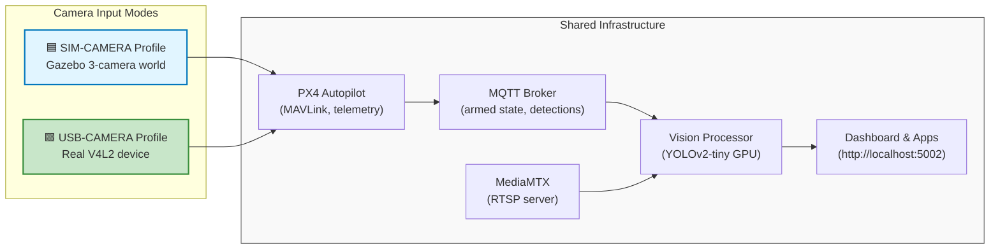
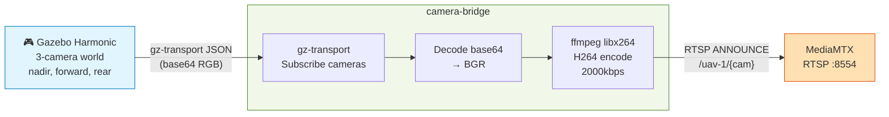
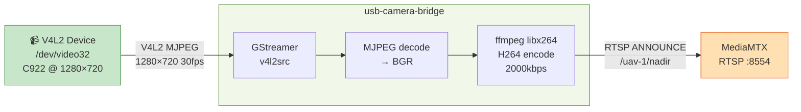
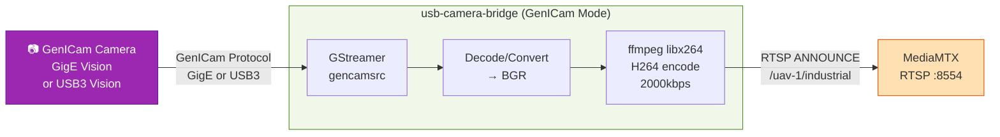

<!--
SPDX-FileCopyrightText: (C) 2026 Intel Corporation
SPDX-License-Identifier: Apache-2.0
-->

# Camera Modes

This document describes the two camera input modes available in the uav-mission-compute-sdk: **simulated cameras** (Gazebo) and **USB cameras** (real hardware).

## Overview



---

## 1. Simulated Cameras (Default)

**Profile**: `sim-camera`  
**Command**: `make up-sim-camera`

### Architecture



### Configuration

**Default environment** (from `.env.example`):

```bash
# Gazebo world with 3 cameras
GZ_WORLD=baylands_multicam
PX4_MODEL_DIR=multi_cam

# Vision processor consumes all 3 streams
VISION_CAMERA_IDS=nadir,forward,rear
```

### RTSP Streams

| Path | Resolution | FPS | Description |
|------|-----------|-----|-------------|
| `/uav-1/nadir` | 416×416 | 20 | Downward-facing |
| `/uav-1/forward` | 416×416 | 20 | Forward 45° |
| `/uav-1/rear` | 416×416 | 20 | Rear 45° |

### Startup

```bash
cd ~/edge-ai-suites/federal-aerospace/uav-mission-compute-sdk
make init                    # Set passwords in .env
make up-sim-camera                      # Start PX4 + Gazebo + camera-bridge
make apps                    # Start vision processor + dashboard
```

### Gazebo Camera Details

- **World file**: `px4-sim/worlds/baylands_multicam.sdf`
  - `nadir`: RGB 416×416 @ 20fps, downward (-90° pitch)
  - `forward`: RGB 416×416 @ 20fps, forward 45° pitch
  - `rear`: RGB 416×416 @ 20fps, rear 45° pitch

- **Model file**: `px4-sim/models/multi_cam/`
  - 3 cameras mounted on vehicle frame
  - Gazebo publishes via gz-transport topics: `/uav/camera/nadir`, `/uav/camera/forward`, `/uav/camera/rear`

### Typical Performance

| Component | CPU | GPU | Memory | Notes |
|-----------|-----|-----|--------|-------|
| px4-gazebo | 150-250% | 40% | 3.8 GB | Sim overhead |
| camera-bridge | ~25% | - | 80 MB | 3 ffmpeg processes |
| vision-processor | 40-70% | 40% | 750 MB | 3 GStreamer pipelines |
| **Total** | **~300%** | **~80%** | **~4.6 GB** | Requires 16 GB RAM |

---

## 2. USB Camera

**Profile**: `usb-camera`  
**Command**: `make up-usb-camera`

### Architecture



### Configuration

**Required in `.env`**:

```bash
# USB device enumeration (run: v4l2-ctl --list-devices)
USB_VIDEO_DEVICE=/dev/video32     # Adjust to your device
USB_CAMERA_ID=nadir               # Which RTSP path to publish as

# Camera capture settings
USB_CAPTURE_WIDTH=1280            # Video resolution width
USB_CAPTURE_HEIGHT=720            # Video resolution height
USB_SENSOR_FPS=30                 # Frames per second (camera capability)
USB_CAPTURE_FORMAT=mjpeg          # mjpeg (compressed) or raw (uncompressed)

# Vision processor: only 1 camera available
VISION_CAMERA_IDS=nadir           # Must match USB_CAMERA_ID
```

### RTSP Streams

| Path | Resolution | FPS | Description |
|------|-----------|-----|-------------|
| `/uav-1/nadir` | 1280×720 | 30 | USB camera output |

### USB Device Discovery

Before starting, enumerate USB video devices:

```bash
v4l2-ctl --list-devices
```

**Example output**:
```
C922 Pro Stream Webcam (usb-0000:00:14.0-1):
    /dev/video32
    /dev/video33
    /dev/media1
```

- `/dev/video32` = main video device ✓ (use this)
- `/dev/video33` = metadata/control device (skip)
- `/dev/media1` = media topology device (skip)

### usb-camera-bridge Container

**Image**: Built from `infra/bridges/usb-camera/Dockerfile`  
**Dependencies**: GStreamer 1.0, FFmpeg, V4L2 utilities  
**Device mapping**: `${USB_VIDEO_DEVICE}:/dev/video0:rw` (remapped to /dev/video0 in container)  
**Network**: Shares Docker bridge (not IPC like camera-bridge)

**GStreamer Pipeline** (internal):
```
v4l2src device=/dev/video0 io-mode=2
  → image/jpeg,width=1280,height=720,framerate=30/1
  → jpegdec
  → videoconvert
  → video/x-raw,format=BGR
  → appsink (push to ffmpeg stdin)

ffmpeg -f rawvideo -pix_fmt bgr24 -s {width}x{height} -r {fps}
  -i pipe:0
  -c:v libx264 -preset ultrafast -b:v 2000k
  -f rtsp rtsp://mediamtx:8554/uav-1/{camera_id}
```

### Startup

```bash
cd ~/edge-ai-suites/federal-aerospace/uav-mission-compute-sdk

# 1. Enumerate USB devices
v4l2-ctl --list-devices

# 2. Update .env with correct USB_VIDEO_DEVICE and VISION_CAMERA_IDS=nadir
nano .env

# 3. Start core infrastructure with USB camera profile
make up-usb-camera

# 4. Start vision processor + dashboard (1 camera)
make apps
```

### Typical Performance

| Component | CPU | GPU | Memory | Notes |
|-----------|-----|-----|--------|-------|
| px4-sitl | 150-250% | 40% | 3.8 GB | Sim still runs for telemetry |
| usb-camera-bridge | ~10% | - | 50 MB | 1 ffmpeg process |
| vision-processor | 15-30% | 25% | 400 MB | 1 GStreamer pipeline |
| **Total** | **~250%** | **~65%** | **~4.2 GB** | Less resource-intensive |

---

## 3. Switching Between Modes

### Mutual Exclusion (Docker Compose Profiles)

Both camera bridges **cannot run simultaneously**. Docker Compose profiles enforce this:

```yaml
# docker-compose.yml
services:
  camera-bridge:
    profiles: ["sim-camera"]        # Only runs with --profile sim-camera
  
  usb-camera-bridge:
    profiles: ["usb-camera"]        # Only runs with --profile usb-camera
```

### From Sim to USB

```bash
cd ~/edge-ai-suites/federal-aerospace/uav-mission-compute-sdk

# 1. Enumerate USB device
v4l2-ctl --list-devices

# 2. Update .env with correct USB_VIDEO_DEVICE
echo "USB_VIDEO_DEVICE=/dev/video32" >> .env   # Adjust to your device

# 3. Stop all containers
make down

# 4. Start with USB profile (sets VISION_CAMERA_IDS=nadir automatically)
make up-usb-camera

# 5. Restart apps with 1-camera config
make apps
```

### From USB to Sim

```bash
cd ~/edge-ai-suites/federal-aerospace/uav-mission-compute-sdk

# 1. Stop all containers
make down

# 2. Start with default sim profile (sets VISION_CAMERA_IDS=nadir,forward,rear automatically)
make up-sim-camera

# 3. Restart apps with 3-camera config
make apps
```

### Environment Variable Checklist

| Variable | Sim Mode | USB Mode | Set by |
|----------|----------|----------|--------|
| `VISION_CAMERA_IDS` | `nadir,forward,rear` | `nadir` | auto (`make up-*`) |
| `GZ_WORLD` | `baylands_multicam` | `baylands_multicam` | `.env` |
| `USB_VIDEO_DEVICE` | — | `/dev/video32` (your device) | `.env` manually |
| `USB_CAMERA_ID` | — | `nadir` | `.env` |
| `USB_CAPTURE_FORMAT` | — | `mjpeg` or `raw` | `.env` |

---

## 4. Dashboard & Vision Processing

### Vision Processor Behavior

The `vision-processor-multicam` container automatically:

1. **Reads `VISION_CAMERA_IDS` at startup** — determines which camera streams to open
2. **For each camera**:
   - Opens RTSP stream from MediaMTX: `rtsp://mediamtx:8554/uav-1/{camera_id}`
   - Subscribes to armed state via MQTT: `uav/uav-1/telemetry/status`
   - Pauses inference when disarmed (saves GPU)
   - Resumes inference when armed
3. **Publishes detections** to MQTT: `uav/uav-1/camera/{camera_id}/detections`
4. **Pushes annotated video** back to MediaMTX: `rtsp://mediamtx:8554/uav-1/{camera_id}/processed`

### Dashboard Features

**URL**: http://localhost:5002

- Camera tiles: One tile per camera in `VISION_CAMERA_IDS`
  - Sim mode: 3 tiles (nadir, forward, rear)
  - USB mode: 1 tile (nadir)
- Detection overlay: Real-time bounding boxes, labels, confidence scores
- ARM/DISARM button: Controls UAV and camera inference
- Telemetry panel: Position, altitude, battery, velocity
- Demo mission button: Pre-programmed waypoint sequence

### Troubleshooting

**No camera frames on dashboard**:
1. Check `VISION_CAMERA_IDS` matches available cameras
   ```bash
   docker logs vision-processor-multicam | grep "Cameras:"
   ```
   Should show: `Cameras: ['nadir', 'forward', 'rear']` (sim) or `Cameras: ['nadir']` (USB)

2. Verify RTSP paths exist at MediaMTX
   ```bash
   docker logs mediamtx | grep -E "rtsp.*announce"
   ```

3. Check vision processor connection to MediaMTX
   ```bash
   docker logs vision-processor-multicam 2>&1 | grep -i "rtsp\|error\|connection"
   ```

4. Ensure UAV is armed (camera inference pauses when disarmed)
   ```bash
   curl http://localhost:8080/state
   ```

---

## 5. Docker Compose Profiles

### Available Profiles

```bash
# Sim cameras (3x Gazebo)
docker compose --profile sim-camera up -d

# USB camera (1x real)
docker compose --profile usb-camera up -d

# Both profiles at shutdown (cleans both)
docker compose --profile sim-camera --profile usb-camera down

# Helper targets
make up-sim-camera              # sim-camera
make up-usb-camera   # usb-camera
make down            # both
```

### Profile Dependencies

```
sim-camera (implies):
  └─ px4
  └─ mediamtx
  └─ mosquitto
  └─ camera-bridge depends on px4

usb-camera (implies):
  └─ px4
  └─ mediamtx
  └─ mosquitto
  └─ usb-camera-bridge depends on px4
     └─ device: ${USB_VIDEO_DEVICE}
```

---

## 6. RTSP Stream Access

> **Prerequisite**: RTSP paths only exist while the UAV is **armed**. Camera bridges kill ffmpeg on disarm and respawn on arm. Arm the UAV first:
> ```bash
> curl -X POST http://localhost:8080/action/arm
> # or use the ARM button on http://localhost:5002
> ```

### View Streams Locally

```bash
# Install ffplay if needed
sudo apt install ffmpeg

# View raw camera feed
ffplay rtsp://localhost:8554/uav-1/nadir

# View annotated feed with detections
ffplay rtsp://localhost:8554/uav-1/nadir/processed

# Capture one frame
ffmpeg -i rtsp://localhost:8554/uav-1/nadir -frames:v 1 frame.jpg

# Stream all 3 cameras (sim mode) to files
for cam in nadir forward rear; do
  ffmpeg -i rtsp://localhost:8554/uav-1/$cam \
    -c:v copy out_$cam.h264 &
done
```

### From Remote Host

```bash
# Over SSH port-forwarding
ssh -L 8554:localhost:8554 user@px4-host

# Then locally:
ffplay rtsp://localhost:8554/uav-1/nadir
```

---

## 7. Environment Variables Reference

### PX4 & Gazebo

| Var | Default | Sim | USB |
|-----|---------|-----|-----|
| `GZ_WORLD` | `baylands_multicam` | 3-camera world | 3-camera world (not used) |
| `PX4_MODEL_DIR` | `multi_cam` | 3-camera model | 3-camera model (not used) |
| `UAV_ID` | `uav-1` | ✓ | ✓ |

### USB Camera Bridge

| Var | Default | Required |
|-----|---------|----------|
| `USB_VIDEO_DEVICE` | `/dev/video0` | Yes (enumerate first) |
| `USB_CAMERA_ID` | `nadir` | Yes |
| `USB_CAPTURE_WIDTH` | `1280` | Optional |
| `USB_CAPTURE_HEIGHT` | `720` | Optional |
| `USB_SENSOR_FPS` | `30` | Optional |
| `USB_CAPTURE_FORMAT` | `mjpeg` | Optional |

### Vision Processor

| Var | Default | Notes |
|-----|---------|-------|
| `VISION_CAMERA_IDS` | `nadir,forward,rear` | **Change to `nadir` for USB mode** |
| `INFERENCE_DEVICE` | `GPU` | CPU or GPU |
| `CONF_THRESH` | `0.4` | Detection confidence (0-1) |

### Common

| Var | Default | Purpose |
|-----|---------|---------|
| `MQTT_BROKER_HOST` | `mosquitto` | MQTT broker hostname |
| `INFLUXDB_PASSWORD` | `change-me` | InfluxDB admin password |
| `GRAFANA_PASSWORD` | `change-me` | Grafana admin password |
| `GPU_DEVICE` | `/dev/dri/card1` | Intel GPU device path |

---

## 8. Makefile Targets

```makefile
make init                # Initialize .env with auto-detected GPU
make build               # Build all images (cache)
make build-nc            # Build all images (no-cache)
make up-sim-camera                  # Start PX4 + Gazebo + sim cameras
make up-usb-camera       # Start PX4 + USB camera bridge
make down                # Stop all containers
make apps                # Start vision processor + dashboard
make logs-infra          # Tail infrastructure logs
make logs-apps           # Tail application logs
make clean               # Remove all containers, networks, volumes
```

---

## 9. Quick Reference: Decision Tree

```
Start here: Which camera source?

┌─────────────────────────────────────────────────────────────┐
│ Do you have a USB camera?                                   │
│ (run: v4l2-ctl --list-devices)                             │
└─────────────────────┬───────────────────────────────────────┘
                      │
        ┌─────────────┴─────────────┐
        │                           │
       YES                         NO
        │                           │
        ▼                           ▼
   USB Camera Mode         Gazebo Sim Mode
   ════════════════         ═══════════════
   1. Enumerate:         1. make init
      v4l2-ctl --list-devices
   2. Update .env:       2. make up-sim-camera
      USB_VIDEO_DEVICE
      USB_CAMERA_ID=nadir
      VISION_CAMERA_IDS=nadir
   3. make up-usb-camera
   4. make apps          3. make up-sim-camera
                         4. make apps

Dashboard: http://localhost:5002
```

---

## 10. Development Workflow

### Add a New Camera (Sim Mode)

1. **Add to Gazebo world** (`px4-sim/worlds/baylands_multicam.sdf`):
   ```xml
   <model name="left">
     <pose>0 0.5 0.3 0 45 0</pose>
     <link name="camera">
       <sensor name="camera" type="camera">
         <camera><image>
           <width>416</width>
           <height>416</height>
         </image></camera>
         <plugin filename="libgazebo_ros_camera.so" name="camera_plugin">
           <ros>
             <namespace>uav</namespace>
             <remapping>image_raw:=camera/left</remapping>
           </ros>
         </plugin>
       </sensor>
     </link>
   </model>
   ```

2. **Update camera-bridge** (`infra/bridges/camera-bridge/camera_bridge.py`):
   ```python
   CAMERAS = ["nadir", "forward", "rear", "left"]  # Add "left"
   ```

3. **Update vision processor** (`.env`):
   ```env
   VISION_CAMERA_IDS=nadir,forward,rear,left
   ```

4. **Restart**:
   ```bash
   make down && make up-sim-camera && make apps
   ```

### Custom USB Camera Settings

Check camera capabilities:
```bash
v4l2-ctl -d /dev/video32 --list-formats
v4l2-ctl -d /dev/video32 --list-framesizes=MJPG
```

Then update `.env`:
```env
USB_CAPTURE_FORMAT=mjpeg
USB_CAPTURE_WIDTH=640
USB_CAPTURE_HEIGHT=480
USB_SENSOR_FPS=60
```

---

## 11. Extending to Industrial Cameras (GenICam)

**Status**: Not tested with current hardware. For developers extending to industrial imaging sensors.

### Overview

Beyond consumer UVC cameras (like the C922), you can extend the system to support **GenICam-compatible industrial cameras** using **GStreamer gencamsrc plugin**:

| Aspect | Consumer (UVC) | Industrial (GenICam) |
|--------|---|---|
| **Camera Type** | C922, webcams | GigE Vision, USB3 Vision |
| **Brands** | Logitech, Razer, etc. | FLIR, Basler, IDS, Lucid, etc. |
| **Protocol** | USB Video Class (UVC) | GenICam (GigE or USB3 Vision) |
| **GStreamer Source** | `v4l2src` | `gencamsrc` (Aravis library) |
| **Current Implementation** | ✅ Tested | 📋 Template provided |

### Architecture



### GStreamer gencamsrc Pipeline

**Source**: GStreamer `gencamsrc` plugin — uses **Aravis library** under the hood for GenICam transport

**GStreamer Pipeline** (single GenICam camera):

```bash
gencamsrc device-index=0 \
  ! videoconvert \
  ! video/x-raw,format=BGR,width=1920,height=1080,framerate=30/1 \
  ! appsink name=sink emit-signals=false max-buffers=2 drop=true sync=false
```

**With DL Streamer inference** (for direct testing without ffmpeg relay):

```bash
gencamsrc device-index=0 \
  ! videoconvert \
  ! gvadetect model=detect.xml \
  ! gvametaconvert \
  ! fakesink
```

### Supported Cameras

**GigE Vision (Gigabit Ethernet)**:
- FLIR Blackfly S, Oryx, Chameleon
- Basler ace2, dart, boost
- IDS ensenso, uEye
- Lucid Triton
- (Many others via Aravis)

**USB3 Vision**:
- FLIR Blackfly S USB3
- Basler boost, dart (USB3 variants)
- IDS ensenso (USB3 models)

**Latency Optimization** (Optional):
- **Intel i226/i225 NIC** with **TSN (Time-Sensitive Networking)**
- Can bound delivery latency for deterministic frame capture
- Useful for high-frequency inspection workflows

### Installation (Host)

**Prerequisites** (Ubuntu 24.04):

```bash
# Install GStreamer gencamsrc and Aravis
sudo apt install gstreamer1.0-plugins-bad gstreamer1.0-rtsp \
                 libgstreamer1.0-dev libgstreamer-plugins-base1.0-dev

# Install Aravis library (GenICam camera support)
sudo apt install libaravis-dev libaravis-0.8

# List available GenICam cameras
aravis-tool -l
```

### Docker Image Extension

To use industrial cameras in the `usb-camera-bridge` container, extend [infra/bridges/usb-camera/Dockerfile](infra/bridges/usb-camera/Dockerfile):

```dockerfile
# Add to existing Dockerfile
RUN apt-get install -y \
    gstreamer1.0-plugins-bad \
    libaravis-dev \
    libaravis-0.8
```

### Implementation Template

**Alternative `usb_camera_bridge_gencam.py`** (pseudo-code):

```python
# infra/bridges/usb-camera/usb_camera_bridge_gencam.py
import gi
gi.require_version('Gst', '1.0')
from gi.repository import Gst

GENCAM_PIPELINE = f"""
    gencamsrc device-index={{camera_index}}
    ! videoconvert
    ! video/x-raw,format=BGR,width={{width}},height={{height}},framerate={{fps}}/1
    ! appsink name=sink emit-signals=false max-buffers=2 drop=true sync=false
"""

class GenICamReader:
    def __init__(self, camera_index, width, height, fps):
        pipeline_str = GENCAM_PIPELINE.format(
            camera_index=camera_index,
            width=width, height=height, fps=fps
        )
        self.pipeline = Gst.parse_launch(pipeline_str)
        self.appsink = self.pipeline.get_by_name('sink')
        
    def start(self):
        self.pipeline.set_state(Gst.State.PLAYING)
        
    def read_frame(self):
        # Block until frame available
        sample = self.appsink.emit('pull-sample')
        if sample:
            buf = sample.get_buffer()
            # Convert to numpy array and return BGR frame
            ...
```

### Configuration (GenICam Mode)

**New environment variables** (if using GenICam implementation):

```bash
# .env
CAMERA_SOURCE=gencam          # or "v4l2" for UVC (default)
GENCAM_DEVICE_INDEX=0         # Which GenICam camera to use (0, 1, 2, ...)
GENCAM_WIDTH=1920
GENCAM_HEIGHT=1080
GENCAM_FPS=30
CAMERA_ID=industrial          # RTSP path identifier
VISION_CAMERA_IDS=industrial  # Match in vision processor
```

### Troubleshooting

**Camera not detected**:
```bash
# List all available GenICam cameras
aravis-tool -l

# Check Aravis library installed
dpkg -l | grep aravis
```

**Pipeline errors**:
```bash
# Test gencamsrc directly
GST_DEBUG=3 gst-launch-1.0 gencamsrc device-index=0 ! fakesink
```

**Latency/frame drop**:
- Reduce resolution or FPS if USB bandwidth limited
- For GigE cameras, ensure network MTU is 9000 (jumbo frames)
  ```bash
  ifconfig | grep MTU
  sudo ip link set dev eth0 mtu 9000
  ```

### Resources

- **Aravis Documentation**: https://aravisproject.github.io/
- **GStreamer gencamsrc**: https://gstreamer.freedesktop.org/documentation/bad/plugins_elements.html
- **GenICam Standard**: https://www.emva.org/standards-technology/genicam/
- **GigE Vision Standard**: https://www.emva.org/standards-technology/gige-vision/
- **Example**: FLIR Blackfly S on Aravis: https://github.com/aravisproject/aravis/wiki/FLIR-Blackfly-S

---

## Glossary

- **gz-transport**: Gazebo middleware for pub/sub (used by Gazebo plugins)
- **V4L2**: Video for Linux 2 (Linux video device standard)
- **MJPEG**: Motion JPEG (compressed, good for USB cameras)
- **RTSP**: Real-Time Streaming Protocol (industry standard video streaming)
- **MediaMTX**: RTSP server (formerly rtsp-simple-server)
- **GStreamer**: Multimedia pipeline framework (used by usb-camera-bridge)
- **FFmpeg**: Video encoder/decoder (used by both camera bridges)
- **Profile**: Docker Compose feature to conditionally include services
