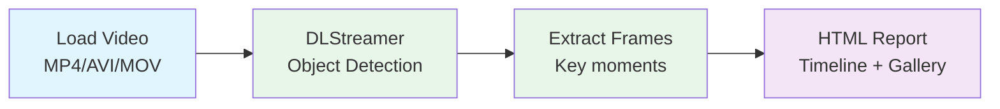

<!--
SPDX-FileCopyrightText: (C) 2026 Intel Corporation
SPDX-License-Identifier: Apache-2.0
-->

# Video File Processing

Analyze recorded video files with DLStreamer object detection → HTML report.

## Workflow



## Use Cases

- Analyze recorded inspection videos
- Review CCTV/security footage
- Batch-process video libraries
- Manufacturing line recordings

## Prompts

**Infrastructure Inspection**
```
"Analyze bridge_inspection_2024.mp4 with DLStreamer, 
detect cracks and rust, generate HTML report"
```

**Traffic Analysis**
```
"Process traffic_cam_footage.mp4 with DLStreamer, 
count vehicles and pedestrians, generate timeline report"
```

**Batch Processing**
```
"Process all MP4 videos in $HOME/inspection_videos/, 
generate individual reports and summary"
```

## Video Sources

```python
# Local file
"/path/to/inspection.mp4"

# URL (downloads automatically)
"https://example.com/footage.mp4"

# Batch (multiple files)
"/path/to/videos/*.mp4"
```

## Output

```
video_processing/
├── input/
│   └── inspection_video.mp4
├── output/
│   ├── annotated_video.mp4      # Processed with boxes
│   ├── frames/                  # Key frames
│   └── detections.json          # Detection data
└── report.html                  # Final report
```

## Performance

| Video Length | Processing Time | Throughput |
|--------------|----------------|------------|
| 1 min | 3-4 min | 15-20 FPS |
| 10 min | 15-20 min | 15-20 FPS |
| 1 hour | 90-120 min | 15-20 FPS |

**Tips**:
- **Fast**: Use YOLO11n (light model), skip frames
- **Accurate**: Use YOLO11m (larger model), full resolution
- **Batch**: Process in parallel with multiple GPUs
