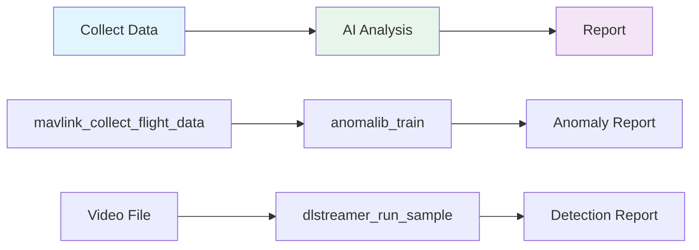

<!--
SPDX-FileCopyrightText: (C) 2026 Intel Corporation
SPDX-License-Identifier: Apache-2.0
-->

# UAV SDK Examples

AI-powered UAV telemetry analysis using MCP tools with Intel Edge AI.

## Quick Start

```bash
# Start UAV stack
docker compose -f docker-compose.yml up -d

# Setup MCP server
cd mcp-server && ./setup.sh

# Use with Claude
claude
```

## Examples

### 1. [Quick Status](05-quick-status.md)
Instant health check and location
```
"What's the UAV status and where is it?"
```

### 2. [Real-Time Monitoring](04-realtime-monitoring-dashboard.md)
Live telemetry with anomaly alerts
```
"Monitor the flight and alert me if anything unusual happens"
```

### 3. [Flight Anomaly Detection](01-flight-anomaly-detection.md)
Detect abnormal behavior (IMU drift, battery issues, GPS problems)
```
"Collect 2 minutes of flight data and detect anomalies"
```

### 4. [Battery Health Prediction](03-battery-health-prediction.md)
Predict degradation and replacement timing
```
"Analyze battery performance and predict when to replace"
```

### 5. [Video Processing](09-video-file-processing.md)
Analyze recorded videos with object detection
```
"Process inspection_video.mp4 with DLStreamer, generate report"
```

## Tool Workflow



## MCP Tools

**MAVLink Telemetry**
- `mavlink_get_telemetry`, `mavlink_get_position`, `mavlink_get_battery`
- `mavlink_get_attitude`, `mavlink_check_health`
- `mavlink_monitor_flight`, `mavlink_collect_flight_data`

**Anomalib** (Anomaly Detection)
- `anomalib_train`, `anomalib_predict`, `anomalib_export`

**DLStreamer** (Video Analytics)
- `dlstreamer_build_pipeline`, `dlstreamer_run_sample`

See [VERIFICATION.md](VERIFICATION.md) for details.
