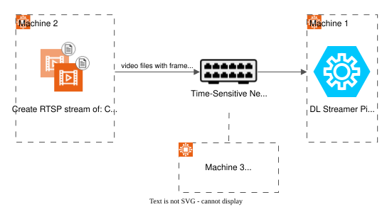

# Measuring HOTA Tracking Accuracy with TSN and Scenescape

This guide explains how to measure **HOTA (Higher Order Tracking Accuracy)** metrics for the
Scenescape object tracker running over a real TSN network — both with and without network
congestion — to quantify the impact of TSN traffic shaping on tracking quality.

---

## Background

### What is HOTA?

HOTA is an industry-standard metric for evaluating multi-object tracking systems. It balances
detection accuracy and association accuracy in a single score:

- **Detection accuracy** — did the tracker find the right objects?
- **Association accuracy** — did the tracker maintain consistent identities over time?

Alongside HOTA, the evaluation also reports:

- **MOTA (Multiple Object Tracking Accuracy)** — focuses on counting errors such as false positives, missed detections, and identity switches
- **IDF1** — measures how consistently the tracker assigns the same ID to the same individual across time

Scenescape's evaluation framework uses the [TrackEval](https://github.com/JonathonLuiten/TrackEval) toolkit to compute these scores. The framework lives at:

```
scenescape/tools/tracker/evaluation/
```

For a full reference, see the [Tracker Evaluation Pipeline README](https://github.com/open-edge-platform/scenescape/blob/2026.1.0/tools/tracker/evaluation/README.md).

### How the Existing Evaluation Pipeline Works

Scenescape ships with a reference dataset in:

```
scenescape/tests/system/metric/dataset/
```

This dataset contains:

| File                                                           | Purpose                                                              |
| -------------------------------------------------------------- | -------------------------------------------------------------------- |
| [`Cam_x1_0.json`][cam-x1-json], [`Cam_x2_0.json`][cam-x2-json] | Per-frame camera detections (bounding boxes) — the **tracker input** |
| [`Cam_x1_0.mp4`][cam-x1-mp4], [`Cam_x2_0.mp4`][cam-x2-mp4]     | Source video files the detections were generated from                |
| `gtLoc.json`                                                   | 3D ground-truth object positions — the **evaluation reference**      |
| `config.json`                                                  | Scene and camera calibration configuration                           |
| `tracker-config.json`                                          | Tracker settings                                                     |

The evaluation pipeline feeds the detection JSON files into the Scenescape controller, collects the 3D tracking output, and compares it against `gtLoc.json` to produce HOTA scores.

### Why a Different Approach Is Needed for TSN Testing

The reference pipeline uses pre-recorded detection files and bypasses the network entirely. To measure the **real-world impact of network conditions on tracking accuracy**, we need to:

1. Stream actual video via RTSP over the TSN network
2. Run DL Streamer inference on live frames to produce detections
3. Capture those detections from MQTT — including any frames dropped due to congestion
4. Reconstruct a complete detection dataset (filling in dropped frames)
5. Feed the reconstructed dataset into the HOTA evaluation pipeline

The key challenge is **frame ordering and dropped frames**: under congestion, some frames arrive out of order or not at all. The test videos have H.264 SEI (Supplemental Enhancement Information) headers injected with a frame number, which makes it possible to detect and compensate for drops.

---

## Prerequisites

- A MOXA TSN switch and three machines with the VLAN configured as per the [HOST VLAN Configuration Guide](../common/create-vlan-on-all-machines.md).

- Ensure iPerf3 is installed on both the client and server machines.

```bash
sudo apt-get update
sudo apt-get install -y iperf3
```

---

## Network Topology



---

## Hardware Setup

| Machine       | Role                                                            |
| ------------- | --------------------------------------------------------------- |
| **Machine 1** | Runs Scenescape; captures MQTT output; runs HOTA evaluation     |
| **Machine 2** | Streams the RTSP test video over the TSN network                |
| **Machine 3** | Injects background traffic with `iperf3` to simulate congestion |

All machines are connected via the MOXA TSN switch and synchronized using PTP.

---

## Step 1 — Machine 2: Stream the Test Video via RTSP

### About the Test Videos

Two pre-prepared MPEG-TS video files are provided. They are derived from the Scenescape reference videos ([`Cam_x1_0.mp4`][cam-x1-mp4] / [`Cam_x2_0.mp4`][cam-x2-mp4]) with two modifications:

- **B-frames removed** — ensures frames are always delivered in decode order, so frame sequence numbers are reliable
- **SEI frame numbers injected** — each frame carries its frame number in an H.264 SEI NAL unit (UUID `12345678-1234-5678-1234-567812345678`), which the GVAPython plugin reads to track drops

The video files are at:

```
usecases/scenescape-deterministic-inference/hota/media/Cam_x1_0_1k_sei.ts
usecases/scenescape-deterministic-inference/hota/media/Cam_x2_0_1k_sei.ts
```

### Start the RTSP Server

On Machine 2, start `mediamtx` (it runs in the background and accepts RTSP publishers):

```bash
# Download mediamtx from https://github.com/bluenviron/mediamtx/releases
tar -xvzf mediamtx_vX.X.X_linux_amd64.tar.gz
# Execute the binary in the same directory as the mediamtx.yml configuration file
./mediamtx
```

### Publish Both Streams

Stream both camera videos simultaneously. Replace `<machine2-tsn-vlan1-ip>` with Machine 2's IP address on the TSN network interface:

```bash
ffmpeg \
  -nostdin -re -stream_loop -1 \
  -i usecases/scenescape-deterministic-inference/hota/media/Cam_x1_0_1k_sei.ts \
  -map 0:v -c copy -f rtsp -rtsp_transport tcp \
    rtsp://<machine2-tsn-vlan1-ip>:8554/hota-metrics-cam1 \
  -nostdin -re -stream_loop -1 \
  -i usecases/scenescape-deterministic-inference/hota/media/Cam_x2_0_1k_sei.ts \
  -map 0:v -c copy -f rtsp -rtsp_transport tcp \
    rtsp://<machine2-tsn-vlan1-ip>:8554/hota-metrics-cam2
```

> **Note:** The `-stream_loop -1` flag loops the video indefinitely. The capture script on Machine 1 stops automatically after collecting the required number of frames.

---

## Step 2 — Machine 1: Configure Scenescape for HOTA Capture

### 2a. Create the Scene and Cameras

If you have not yet started Scenescape, run the following. Otherwise, skip to creating the scene and cameras.

```bash
git clone https://github.com/open-edge-platform/scenescape --branch 2026.1.0
cd scenescape
make demo
```

> **Note:** Use the instructions in the [Scenescape prebuilt containers guide](https://github.com/open-edge-platform/scenescape/blob/2026.1.0/docs/user-guide/how-to-guides/deploy-scenescape-using-prebuilt-containers.md#31-configure-docker-compose-to-use-prebuilt-images) to use the prebuilt images.

Create the `hota-scene` scene and its two cameras, then run the setup script:

```bash
cd edge-ai-suites/federal-and-aerospace-ai-suite/deterministic-threat-detection
bash usecases/scenescape-deterministic-inference/hota/scripts/setup-hota-scene.sh
```

> **Note:** If you downloaded and extracted the zip file, replace `edge-ai-suites/federal-and-aerospace-ai-suite/deterministic-threat-detection/` with the path to your extracted `deterministic-threat-detection/` folder.

This creates the scene `hota-scene` and registers cameras `Cam_x1_0` and `Cam_x2_0` via the Scenescape REST API. See the [Scenescape API Reference](https://github.com/open-edge-platform/scenescape/blob/2026.1.0/docs/user-guide/api-reference.md) for details.

### 2b. Install the SEI Frame-Number Parser

The `sei_parser.py` GVAPython plugin reads the SEI-embedded frame number from each decoded H.264 buffer and injects it as `sei_frame_num` into the internal messages. This is what allows the capture script to detect dropped frames. This information needs to be captured before the frame is decoded.

Copy it into the Scenescape pipeline server scripts directory:

```bash
cp usecases/scenescape-deterministic-inference/hota/scripts/gvapython/sei_parser.py \
  scenescape/dlstreamer-pipeline-server/user_scripts/gvapython/sscape/sei_parser.py
```

### 2c. Deploy the HOTA Pipeline Configuration

A ready-made pipeline configuration is provided at:

```text
usecases/scenescape-deterministic-inference/hota/configs/hota-metrics-config.json
```

It already includes the `sei_parser.py` GVAPython element in the pipeline configuration. The only change required is to substitute `<machine2-tsn-vlan1-ip>` with the actual TSN IP address of Machine 2 in the `hota-metrics-config.json` file.

### 2d. Point Docker Compose to the New Config

In `scenescape/sample_data/docker-compose-dl-streamer-example.yml`, update the `queuing-config` entry under `configs:` at the bottom of the file:

```yaml
configs:
  queuing-config:
    file: ./dlstreamer-pipeline-server/hota-metrics-config.json
```

### 2e. Include the Frame Number in the MQTT Message

Apply the following patch to `sscape_adapter.py` so the adapter publishes the SEI
frame number in the MQTT message:

```bash
git -C /path/to/scenescape apply \
  /path/to/deterministic-threat-detection/usecases/scenescape-deterministic-inference/hota/patches/sscape_adapter_frame_insertion.patch
```

Also expose port 1883 of the broker service in `sample_data/docker-compose-dl-streamer-example.yml` to allow the capture script to connect to the MQTT broker from outside the container network, if not already configured:

```yaml
broker:
  image: eclipse-mosquitto:2.0.22
  ports:
    - "1883:1883"
```

### 2f. Restart Scenescape

Apply the new configuration by restarting Scenescape:

```bash
export no_proxy=$no_proxy,<machine2-tsn-vlan1-ip>
docker compose down --remove-orphans
make demo
```

Verify that it started successfully and the changes are applied:

```bash
docker logs -f scenescape-queuing-video-1
```

You should see the pipeline connecting to both RTSP streams and the SEI parser logging decoded frame numbers such as:

```
[Cam_x1_0] Decoded SEI frame_num = 0
[Cam_x2_0] Decoded SEI frame_num = 0
```

---

## Step 3 — Machine 1: Set Up the Capture and Evaluation Environment

The `hota-metrics` scripts must run from inside the Scenescape evaluation tool directory so they can import `pipeline_engine` and its modules.

```bash
# Copy the hota-metrics scripts into the evaluation tool directory
cp -r usecases/scenescape-deterministic-inference/hota/scripts/hota-metrics \
      scenescape/tools/tracker/evaluation/

cd scenescape/tools/tracker/evaluation/hota-metrics

# Create and activate a Python virtual environment
python3 -m venv .venv
source .venv/bin/activate

# Install evaluation framework dependencies
pip install -r ../requirements.txt

# Install the MQTT client (required by the capture script)
pip install paho-mqtt
```

Start `iperf3` in server mode on Machine 1 so Machine 3 can send congestion traffic over the VLAN 5 interface:

```bash
iperf3 -s -B <machine1-vlan5-ip>
```

---

## Step 4 — Run the Experiment

Run the following across the machines.

### Machine 1: Start the MQTT Capture and Evaluation

```bash
cd scenescape/tools/tracker/evaluation/hota-metrics
python mqtt_camera_capture_processor.py
```

### Machine 3: Start the Traffic Generator (Congestion Test Only)

> **Note:** Skip this step for the **baseline** (no-congestion) run. Run it only when measuring the effect of network congestion.

```bash
cd usecases/scenescape-deterministic-inference/hota/scripts

python3 -m venv .venv
source .venv/bin/activate
pip install paho-mqtt

python3 traffic_generator.py \
  --broker <machine1-vlan1-ip> \
  --target <machine1-vlan5-ip> \
  --duration 2 \
  --bitrate 960M \
  --sleep 1 \
  --stop-frame 1700
```

The traffic generator:

- Waits for frame 0 to arrive on both camera topics before injecting any traffic
- Alternates between running `iperf3` for `--duration` seconds and sleeping for `--sleep` seconds
- Stops automatically when either camera exceeds `--stop-frame`, ensuring the capture script can detect the final frames to stop and run the evaluation.

### Machine 2: Enable TSN Traffic Shaping (TSN Test Only)

> **Note:** Skip this step for the **congestion without TSN** run. Enable it only for the **congestion with TSN** comparison run.

Configure the Time-Aware Shaper (IEEE 802.1Qbv) on the MOXA switch to protect the camera stream traffic from the `iperf3` background traffic.

Refer to the [TSN Traffic Shaping Guide](../common/enable-tsn-traffic-shaping.md) for full instructions. Apply the port setting on the switch port connected to Machine 1.

---

## Step 5 — Compare Results

Run the experiment three times to produce a full comparison:

| Run               | Traffic injection | TSN shaping | Expected result                               |
| ----------------- | ----------------- | ----------- | --------------------------------------------- |
| **Baseline**      | No                | No          | Highest HOTA score (reference)                |
| **Congestion**    | Yes               | No          | Lower HOTA — dropped frames degrade tracking  |
| **TSN protected** | Yes               | Yes         | HOTA close to baseline — TSN restores quality |

Results are stored in timestamped subdirectories under `/tmp/tracker-evaluation/`. Look for `TrackEvalEvaluator/` inside each run directory for the HOTA, MOTA, and IDF1 scores.

---

## References

- [HOTA Script Reference](./hota-script-reference.md)
- [Tracker Evaluation Pipeline README](https://github.com/open-edge-platform/scenescape/tree/2026.1.0/tools/tracker/evaluation/README.md)
- [TrackEval Toolkit](https://github.com/JonathonLuiten/TrackEval)
- [TSN Traffic Shaping Guide](../common/enable-tsn-traffic-shaping.md)
- [Scenescape API Reference](https://github.com/open-edge-platform/scenescape/blob/2026.1.0/docs/user-guide/api-reference.md)

- Dataset files:
  - [cam-x1-mp4](https://github.com/open-edge-platform/scenescape/blob/2026.1.0-rc2/tests/system/metric/dataset/Cam_x1_0.mp4)
  - [cam-x2-mp4](https://github.com/open-edge-platform/scenescape/blob/2026.1.0-rc2/tests/system/metric/dataset/Cam_x2_0.mp4)
  - [cam-x1-json](https://github.com/open-edge-platform/scenescape/blob/2026.1.0-rc2/tests/system/metric/dataset/Cam_x1_0.json)
  - [cam-x2-json](https://github.com/open-edge-platform/scenescape/blob/2026.1.0-rc2/tests/system/metric/dataset/Cam_x2_0.json)
