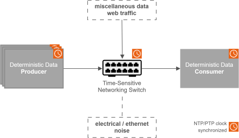

<!--hide_directive

  <a class="icon_github" href="https://github.com/open-edge-platform/edge-ai-suites/tree/main/federal-and-aerospace-ai-suite/deterministic-threat-detection">
     GitHub
  </a>
  <a class="icon_document" href="https://github.com/open-edge-platform/edge-ai-suites/blob/main/federal-and-aerospace-ai-suite/deterministic-threat-detection/README.md">
     Readme
  </a>

hide_directive-->

# Deterministic Threat Detection (Preview)

Welcome to the documentation for the Deterministic Threat Detection project — a Time-Sensitive Networking (TSN) demonstration showing how to deliver deterministic, low-latency AI and sensor workloads in shared networks. This application is currently in preview.

## Overview

| Component                            | Role                                                                                                    |
| ------------------------------------ | ------------------------------------------------------------------------------------------------------- |
| **MOXA TSN Switch (TSN-G5000)**      | PTP Grandmaster clock, VLAN segmentation, IEEE 802.1Qbv time-aware traffic shaping                      |
| **Arrow Lake Host (Intel i226 NIC)** | TSN-capable inference host; clock synchronized to the switch via PTP                                    |
| **Camera(s)**                        | Video source; supports either RTSP cameras (NTP/gPTP) or Basler GigE cameras (IEEE 1588v2 hardware PTP) |
| **Traffic Injector**                 | Runs `iperf3` to generate background congestion and demonstrate TSN protection                          |

This project demonstrates two complementary use cases for industrial edge AI, both using TSN infrastructure to protect latency-sensitive streams from background congestion:

### Use Case 1 — Multi-Camera AI Inference with Deterministic Delivery

RTSP camera streams from AXIS cameras are processed by DL Streamer for person detection. Inference results and simulated sensor telemetry are published over MQTT with PTP timestamps. An MQTT aggregation node measures end-to-end latency in real time, demonstrating how TSN protects critical streams from iperf3 background congestion.

[Get Started — Use Case 1](./get-started.md)

### Use Case 2 — Scenescape Multi-Camera Tracking with TSN and PTP

Basler GigE cameras hardware-timestamp each frame with IEEE 1588v2 PTP. A patched GStreamer pipeline propagates these timestamps through DL Streamer into Scenescape for 3D multi-camera tracking. This use case measures how TSN congestion affects HOTA tracking accuracy and demonstrates that traffic shaping restores accuracy to baseline.

[Get Started — Use Case 2](./get-started-scenescape.md)

## Documentation

- [Get Started — Use Case 1](./get-started.md)
- [Get Started — Use Case 2](./get-started-scenescape.md)
- [How-to Guides](./how-to-guides.md)
- [Release Notes](./release-notes.md)

## Key References

- **MOXA TSN-G5000:** [PTP Grandmaster, VLAN segmentation, IEEE 802.1Qbv shaping](https://www.moxa.com/en/products/industrial-network-infrastructure/ethernet-switches/layer-2-managed-switches/tsn-g5008-series)
- **Intel i226 NIC:** TSN-capable Ethernet controller for Arrow Lake hosts
- **IEEE 802.1Qbv:** Time-Aware Scheduler for traffic isolation
- **Scenescape:** [3D multi-camera object tracking](https://github.com/open-edge-platform/scenescape)
- **DL Streamer:** [Intel's video processing and AI inference pipeline](https://github.com/open-edge-platform/dlstreamer)

<!--hide_directive
:::{toctree}
:hidden:

get-started
get-started-scenescape
how-to-guides
release-notes

:::
hide_directive-->
