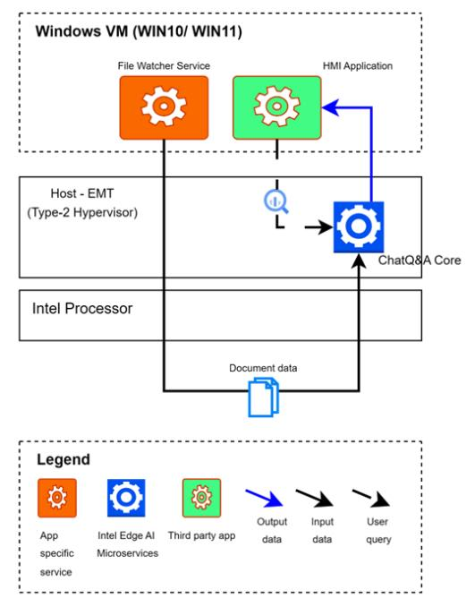
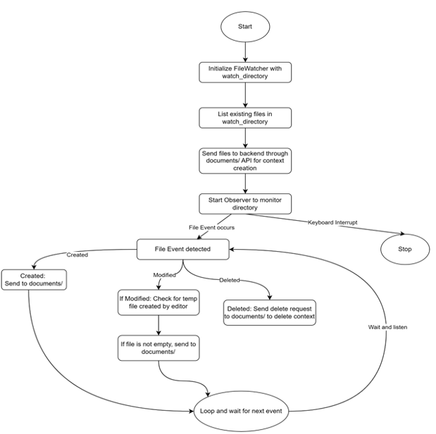

# Overview
The HMI Augmented Worker is a RAG enabled HMI application deployed on Type-2 hypervisors. Deploying RAG-enabled HMI applications in a Type-2 hypervisor setup allows flexible and efficient resource utilization by running multiple operating systems on a single physical machine. 

In this architecture, the HMI application operates within a Windows® virtual machine managed by a Type-2 hypervisor such as [EMT](https://github.com/open-edge-platform/edge-microvisor-toolkit). The Retrieval-Augmented Generation (RAG) pipeline and supporting AI services are deployed natively on a host system, which is EMT in this implementation. [Chat Question-and-Answer Core](https://github.com/open-edge-platform/edge-ai-libraries/tree/main/sample-applications/chat-question-and-answer-core) provides the RAG capability. This separation ensures robust isolation between the HMI and AI components, enabling independent scaling, maintenance, and updates. The setup leverages the strengths of both environments, providing a seamless integration that enhances operator experience while maintaining system reliability and security.

RAG-enabled HMI applications offer a substantial opportunity to enhance the capabilities of manufacturing machine operators, especially those who are less experienced. RAG enabled LLM applications deliver a user-friendly interface for troubleshooting advice, data summarization, and planning, utilizing a knowledge base tailored to specific deployments, including telemetry data, support logs, machine manuals, and production plans. This document details the use cases, architectures, and requirements for implementing RAG LLMs in HMI systems to improve operational efficiency, decision-making, and overall productivity for machine operators. In this sample application, the focus is on providing an RAG pipeline in a Type-2 Hypervisor-based setup. There is no reference HMI used and the user is expected to do the HMI integration using the RAG pipeline APIs provided. 

## How it works
This section highlights the high-level architecture of the sample application.

### High-Level Architecture
The system has a RAG pipeline reusing `Chat Question and Answer Core` application running on the host alongside a typical HMI application which is executing on the Windows® Guest VM (virtual machine). A knowledge base is initialized by using the contents from a pre-configured folder. The folder contains the knowledge base like user manuals, past maintenance or support logs. When an operator detects a problem, either through direct observation or via the HMI application, they can consult the RAG pipeline for troubleshooting advice or explanations. After resolving the issue, the operator records a support log entry detailing the problem, the solution, and any relevant data. This log entry is then added to the knowledge base to aid in future troubleshooting efforts. The File Watcher service provides the required automation to manage the knowledge base and runs independently from the HMI application. The HMI application is responsible for providing the required interface along with associated user experience to enable the operator to access this knowledge base.

### Chat Question-and-Answer Core (ChatQnA Core)

The 'ChatQnA Core' sample application serves as a basic Retrieval Augmented Generation (RAG) pipeline, allowing users to pose questions and obtain answers, even from their private data corpus. This sample application illustrates the construction of RAG pipelines. It is designed for minimal memory usage, being developed as a single, monolithic application with the complete RAG pipeline integrated into one microservice.

The 'ChatQnA Core` application should be setup on the host system. For further details , visit [Chat Question-and-Answer Core Sample Application Overview](https://github.com/open-edge-platform/edge-ai-libraries/blob/main/sample-applications/chat-question-and-answer-core/docs/user-guide/overview.md). The application is used as is without any changes. The configurable parameters like the LLM model, Embedding model, Reranker model, or Retriever model are setup based on the HMI application requirement.

### File Watcher Service

The File Watcher Service runs alongside with HMI application on the Windows environment, consistently observing file system activities like creation, modification, and deletion. When changes are detected, it sends the pertinent file data over the network to the 'ChatQnA Core` service for ingestion and contextual processing, facilitating Retrieval-Augmented Generation (RAG) workflows. The watcher service logic is shown in the following flow diagram:

### Human Machine Interface(HMI) Application

A Human-Machine Interface(HMI) can vary depending on the use case or the creator. While HMIs generally serve as interface connecting users to machines, systems, or devices, their design and functionality can differ significantly based on the particular requirements of an industrial process or the preferences of the developer. In this sample application, no reference HMI application is provided. Instead, the user will reuse the WebUI of `ChatQnA Core` application to interact with the RAG knowledge base. It would be an accurate summary to state that this sample application illustrates how the `ChatQnA Core` RAG pipeline can be executed in a Type-2 Hypervisor setup enabling applications like HMI to benefit from it.

## Supporting Resources

For more comprehensive guidance on beginning, see the [Getting Started Guide](./get-started.md).
