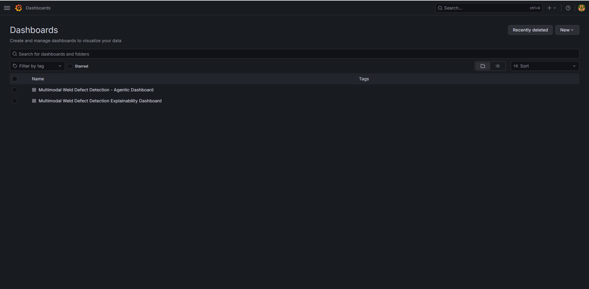
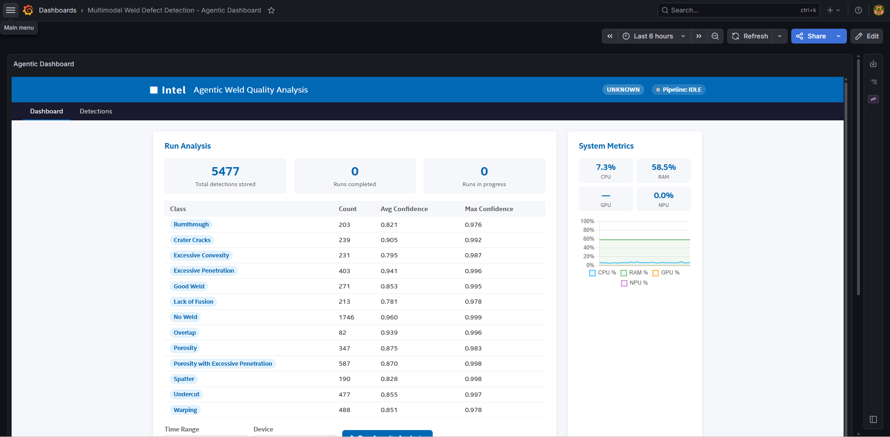
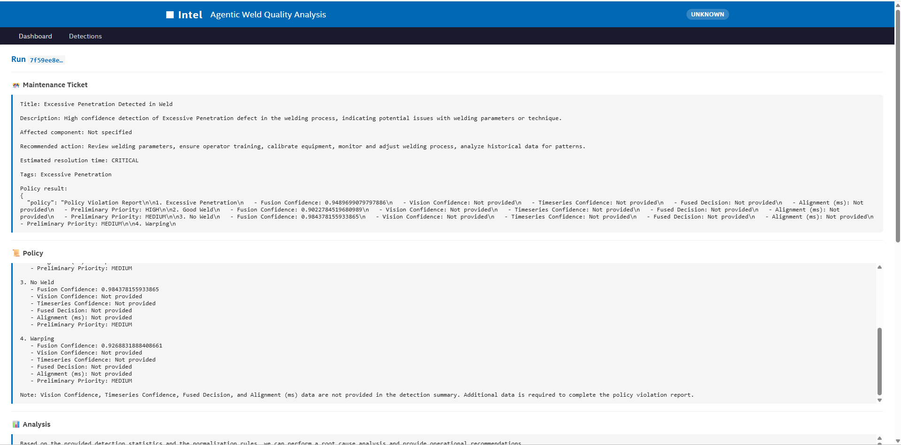

# Deploy the Agentic Workflow for the Multimodal Weld Defect Detection Sample Application

This section shows how to deploy the multimodal sample application with the agentic workflow enabled. The multimodal application produces fusion results, and when new fusion results arrive, the meta-agent in the agentic stack is triggered. The meta-agent, powered by an LLM served through OpenVINO™ model server, produces structured policy decisions, root-cause analysis, evidence audit trails, and maintenance tickets.

## Architecture Overview

The agentic workflow is implemented as a **LangGraph framework-based, sequential multi-agent pipeline**. The `apm-agent`, which is the meta-agent, acts as the orchestrator that triggers the workflow when new fusion results arrive and coordinates the execution of specialized agents, each responsible for a distinct stage of reasoning. Each agent consumes the shared execution context together with outputs from previous stages and produces traceable intermediate artifacts and a final maintenance recommendation.


```text
Vision (DL Streamer Pipeline Server)──┐
                                      ├─► Fusion Analytics ──► MQTT (Trigger batch request)
        Time-Series Analytics       ──┘                           │
                                                                  ▼
                                                          Agent service FIFO queue
                                                                  |
                                                                  | bounded GET /detections
                                                                  | bounded GET /detections/summary
                                                                  v
                                                      Policy -> Analysis -> Evidence -> Ticketing
                                                                  |
                                                                  v
                                                         In-memory run results
                                                                  │
                                                            UI (Dashboard)
```

| Agent | Input | Output |
|--------|-------|--------|
| **Policy Agent** | Fusion results (`fusion_result`) filtered according to the configured analysis thresholds. Uses `fused_decision`, `fusion_confidence`, modality confidence scores, anomaly indicators, and timestamp alignment (`vision_rtsp_ts_diff_ms`). | Structured policy violation report containing the detected defect class, fusion and modality confidence scores, alignment quality, and preliminary priority. Policy decisions are based on `fusion_mode` and configured severity rules. |
| **Analysis Agent** | Policy output as the primary anchor, supplemented by fusion, vision, and time-series classifications for the detection window when available. | Policy-anchored analysis summarizing the policy finding and corroborating it with modality classification data and confidence evidence; falls back to event-level or summary-level analysis when no policy output is available. |
| **Evidence Agent** | Fusion records selected according to the configured evidence criteria (evidence_fields, confidence threshold, and maximum record count). | Formal audit report containing an evidence summary, detailed evidence table, modality agreement status, time synchronization quality, and a deterministic evidence conclusion supporting the final decision. |
| **Ticketing Agent** | Policy evaluation and root-cause analysis results. | Structured maintenance ticket containing the priority, title, description, affected component (if available), recommended action, estimated resolution time, and defect class tags. Ticket priority and escalation follow the configured ticketing rules. |

> **Note:** The `[SYSTEM]` prompt provides shared domain knowledge, including the canonical defect taxonomy, label normalization rules, and available fusion data. It establishes the common reasoning context for all agents and is **not** a separate execution stage.


## System Requirements

| Component | Minimum Requirement |
|-----------|---------------------|
| Operating System | Ubuntu OS version 24.04 LTS or later |
| Hardware | Intel® Core™ Ultra Series 3 processor or newer |


## Prerequisites

1. Ensure the `.env` file is configured with valid values for:

   - `HOST_IP`
   - `INFLUXDB_USERNAME`, `INFLUXDB_PASSWORD`
   - `VISUALIZER_GRAFANA_USER`, `VISUALIZER_GRAFANA_PASSWORD`
   - `MTX_WEBRTCICESERVERS2_0_USERNAME`, `MTX_WEBRTCICESERVERS2_0_PASSWORD`
   - `S3_STORAGE_USERNAME`, `S3_STORAGE_PASSWORD`

2. Download the Vision-Language Model (VLM) model by following the [guide](./how-to-deploy-vllm-service.md#download-models).

## Deploy the Agentic Workflow

Run the full agentic stack (downloads the LLM model first, then starts all containers):

> **Note:** 
> - Model download time varies depending on network speed and hardware.
> - The service is polled every 5 seconds for up to 50 minutes. 
> - Supported devices for Agentic Workflow are : `CPU`, `GPU`


```bash
cd edge-ai-suites/manufacturing-ai-suite/industrial-edge-insights-multimodal
make up_agentic
```

For a fresh build before deployment:

```bash
cd edge-ai-suites/manufacturing-ai-suite/industrial-edge-insights-multimodal
make build
make up_agentic
```

### Running the Agentic Workflow on GPU

By default, the agentic workflow is configured to run on `CPU`.

To trigger the agentic workflow on `GPU`, update `LLM_DEVICE` in .env to `GPU`:

```sh
vi .env
# change LLM_DEVICE to GPU
LLM_DEVICE=GPU
# Deploy Agentic Workflow
make up_agentic
```

## Configure the Agent

### Use-Case Configuration

The agent behavior is controlled by `configs/agentic/agents.yaml`:

| Field | Default | Description |
|-------|---------|-------------|
| `analysis.detection_schema` | `fusion_result` | Instructs the agent to read `fusion_result` records rather than raw bounding-box detections |
| `analysis.min_confidence` | `0.5` | Minimum `fusion_confidence` to include a record in the analysis window |
| `analysis.max_detections_per_run` | `1000` | Maximum number of `fusion_result` records fetched per run |
| `policy.alert_threshold` | `0.75` | `fusion_confidence` threshold to raise a policy violation |
| `policy.fusion_mode` | `OR` | `AND` requires both modalities to be anomalous; `OR` triggers on either |
| `policy.critical_classes` | `Burnthrough, Lack of Fusion, and Crater Cracks` | Classes that produce `CRITICAL` severity regardless of threshold |
| `evidence.source_measurement` | `fusion_result` | InfluxDB database measurement to query for evidence records |
| `evidence.min_fusion_confidence` | `0.6` | Minimum `fusion_confidence` for a record to appear in the evidence table |
| `evidence.max_records_per_evidence` | `100` | The cap on rows included in a single evidence bundle |
| `evidence.evidence_sort` | `time_desc` | Evidence rows are ordered newest-first |
| `ticketing.backend` | `jira` | Ticket destination: `jira`, `servicenow`, or `none` |
| `ticketing.auto_create` | `true` | Submit tickets automatically after each completed run |

#### Defect Class Taxonomy

The policy and ticketing agents operate on the following class hierarchy:

| Priority | Classes |
|----------|---------|
| **CRITICAL** | Burnthrough, Lack of Fusion, and Crater Cracks |
| **HIGH** | Excessive Penetration |
| **MEDIUM** | Porosity, Porosity with Excessive Penetration, Undercut, and Warping |
| **LOW** | Overlap, Spatter, and Excessive Convexity |
| **Non-actionable** | Good Weld, No Weld, and No Label |

### Prompts

Agent reasoning prompts are in `configs/agentic/prompts/weld-quality-monitoring.txt`. Each `[TAG]` block maps directly to an agent stage:

| Section | Controls |
|---------|----------|
| `[SYSTEM]` | Canonical class labels, label normalization rules (`No_Weld` → `No Weld`, `Good_Weld` → `Good Weld`, and `Porosity_w_Excessive_Penetration` → `Porosity with Excessive Penetration`), and available fusion fields |
| `[POLICY]` | How violations are identified: `fusion_confidence` as the primary signal, priority determined by defect class, confidence used only to verify the configured threshold is met, and `fused_decision` reported exactly when present |
| `[ANALYSIS]` | Policy-anchored analysis treating the policy decision as the source of truth; corroborates with fusion and modality data when available; falls back to event-level or summary-level analysis when no policy output exists |
| `[EVIDENCE]` | Three-section output: Summary → Table (one row per actionable event, all 15 schema fields) → Conclusion; summary-only mode when only aggregate statistics are available |
| `[TICKETING]` | Escalation rules tied to defect class and `fusion_confidence` threshold: CRITICAL ≥ 0.80, HIGH ≥ 0.75, MEDIUM ≥ 0.65, LOW ≥ 0.55; ticket generated only when `fused_decision == 1` |

### Fallback Policy

`configs/agentic/policy_fallback.json` defines per-class thresholds and actions used by apm-agent when `LLM_MODE=fallback`. Available actions:

| Action | Description |
|--------|-------------|
| `HALT_LINE` | Stop the production line immediately |
| `REDUCE_HEAT_INPUT` | Reduce welding current or power |
| `SCHEDULE_INSPECTION` | Flag for next-shift inspection |
| `ADJUST_PARAMETERS` | Adjust process parameters |
| `CHECK_FIXTURING` | Check part fixturing and alignment |
| `MONITOR` | Continue monitoring without action |
| `CONTINUE` | No action required |

## Verify the Deployment

1. Check overall stack health:

   ```bash
   cd edge-ai-suites/manufacturing-ai-suite/industrial-edge-insights-multimodal
   make status
   ```

2. Check the output in Grafana dashboard:

   - Use the link `https://localhost:3000` to open Grafana dashboard in a browser, preferably the Chrome browser. For Helm deployment, use the link `https://localhost:30001`.
   
   - Log in to Grafana dashboard using the `VISUALIZER_GRAFANA_USER` and `VISUALIZER_GRAFANA_PASSWORD` values
     from the `.env` file:

     

   - After logging in, click **Dashboards** and then select **Multimodal Weld Defect Detection - Agentic Dashboard**:
     

   - The following pages appear:
     
     

## Stop the Stack

```bash
cd edge-ai-suites/manufacturing-ai-suite/industrial-edge-insights-multimodal
make down
```
