# VLM Fine-Tuning with Unsloth

Standalone process for fine-tuning a vision-language
model (VLM) on your own multimodal (image + text) dataset using
[Unsloth](https://github.com/unslothai/unsloth) + LoRA, and running
inference with the resulting adapter. This document describes the flow
generically — it applies regardless of what domain or dataset you bring.

> **Looking for a concrete, ready-to-run example?** See
> [`weld-process.md`](weld-process.md) for a full worked instance of this
> flow applied to a weld-defect visual inspection dataset (input schema,
> prompt design, and the exact commands used).

This directory is **not integrated** with the rest of
`industrial-edge-insights-multimodal` — it does not wire into the
`docker-compose*.yml` stacks, `configs/`, or the vLLM serving setup in this
repo. It is a self-contained data-prep + fine-tuning + inference workflow you
run independently (e.g. on a dev box or training server) to produce a LoRA
adapter. Once you have an adapter, you can serve it with the existing
[`docker-compose-vllm.yml`](../docker-compose-vllm.yml) in this repo, or with
any OpenAI-compatible VLM server that supports LoRA adapters.

## Table of Contents

- [Overview](#overview)
- [Directory Layout](#directory-layout)
- [Prerequisites](#prerequisites)
- [Setup](#setup)
- [Pipeline Architecture](#pipeline-architecture)
- [Expected Dataset Format](#expected-dataset-format)
- [Step: Fine-Tune the Model](#step-fine-tune-the-model)
- [Step: Run Inference](#step-run-inference)
- [Troubleshooting](#troubleshooting)
- [License](#license)

## Overview

This process is intentionally split into two concerns:

1. **Bring your own dataset**, prepared as a parquet file (or files) in the
   chat-conversation shape described in
   [Expected Dataset Format](#expected-dataset-format). How you produce
   that parquet file is entirely up to your domain/data — see
   [`weld-process.md`](weld-process.md) for one concrete example
   (`prepare_weld_dataset.py`) that fuses weld images + sensor telemetry
   into this shape.
2. **Fine-tune and run inference** on that dataset with the two generic,
   domain-agnostic scripts in this directory:

| Script | Input | Output |
|---|---|---|
| `train_qwen.py` | A parquet dataset (`image` + `conversation_json` columns) | LoRA adapter + tokenizer |
| `infer_qwen.py` | Base model or adapter (from `train_qwen.py`) | Streamed model response, token-by-token |

`common.py` holds small helpers shared by `train_qwen.py` and
`infer_qwen.py` (device detection, chat-message conversion) so the two
scripts stay modular and independently runnable, and so neither one embeds
any domain-specific assumptions about your dataset's content.

## Directory Layout

```
vlm-fine-tuning/
├── README.md                  # this file — generic setup / train / infer
├── weld-process.md            # concrete worked example (weld-defect analysis)
├── requirements.txt           # pinned Python dependencies
├── common.py                  # shared chat-format / device-detection helpers
├── prepare_weld_dataset.py    # weld-specific dataset prep (see weld-process.md)
├── train_qwen.py               # Generic LoRA fine-tuning (Unsloth + TRL)
└── infer_qwen.py               # Generic standalone inference
```

Generated artifacts (not checked in — see `.gitignore` note below) land in
whatever `--output-dir` / `--dataset-path` you pass on the command line,
e.g. `processed_dataset/` and `qwen_3.5_2b_adapter/`.

> If you fork this into your own repo, add `processed_dataset/`,
> `*_adapter/`, `checkpoint-*/`, and any downloaded datasets/images to
> `.gitignore` — none of these generated artifacts should be committed.

## Prerequisites

- Python 3.12
- ~16 GB+ RAM for data preparation (image + tabular processing), if your
  dataset-prep step is similarly memory-bound
- Install the Intel Compute Runtime drivers - https://github.com/intel/compute-runtime/releases
- A GPU/XPU is strongly recommended for fine-tuning and inference:
  - Intel GPU (Arc / integrated) via Intel XPU PyTorch build, or
  - CPU (functional but slow; useful only for smoke-testing the pipeline)
- Ensure your user can access the GPU's DRM render nodes. The `render` group
  provides GPU rendering access without granting broader display-management
  permissions. Check the render-node group and your current group memberships:

  ```bash
  stat -c "%G" /dev/dri/render*
  groups ${USER}
  ```

  If you are not a member of the group used by the DRM render nodes, add your
  user to the `render` group, then update the current shell's group:

  ```bash
  sudo gpasswd -a ${USER} render
  newgrp render
  ```
- A dataset already prepared as parquet, in the shape described in
  [Expected Dataset Format](#expected-dataset-format)

## Setup

```bash
python3 -m venv venv
source venv/bin/activate
pip install --upgrade pip

# Latest unsloth
git clone https://github.com/unslothai/unsloth.git
cd unsloth
pip install .[intel-gpu-torch2110]

```

To validate if XPU setup is done correctly.
```python

import torch
print(f"PyTorch version: {torch.__version__}")
print(f"XPU available: {torch.xpu.is_available()}")
print(f"XPU device count: {torch.xpu.device_count()}")
print(f"XPU device name: {torch.xpu.get_device_name(0)}")
```


Unsloth auto-detects the installed PyTorch backend (XPU/CUDA/CPU) at import
time, and `common.detect_device()` selects `xpu` > `cpu` for
tensor placement during training/inference.

## Pipeline Architecture

At a high level, this is a generic 2-stage flow that sits on top of
any dataset-preparation step you bring:

```mermaid
flowchart LR
    subgraph S0["Your Dataset Prep\n(domain-specific — bring your own,\nsee weld-process.md for an example)"]
        direction TB
        A["Your raw data"] --> B["system/user/assistant\nconversations per sample"]
        B --> C["Parquet export\n(image + conversation_json columns)"]
    end

    subgraph S1["Fine-Tuning\n(generic — train_qwen.py)"]
        direction TB
        E["Load parquet dataset"] --> F["Base VLM + LoRA adapter\n(FastVisionModel)"]
        F --> G["SFTTrainer\n(Unsloth vision collator)"]
        G --> H["LoRA adapter\nsaved to disk"]
    end

    subgraph S2["Inference / Serving\n(generic — infer_qwen.py)"]
        direction TB
        J["Load base model\n+ LoRA adapter"] --> K["Streamed model response"]
    end

    C -->|"train_qwen.py\n--dataset-path"| E
    H -->|"infer_qwen.py\n--model-path, or\nvLLM --enable-lora"| J
```



Each stage is independently runnable and only depends on the previous
stage's on-disk output (parquet dataset → LoRA adapter → served model), so
you can re-run, inspect, or swap out any one stage without touching the
others — including swapping in a completely different dataset-prep script
for a different domain.

## Expected Dataset Format

`train_qwen.py` and `infer_qwen.py` only require a
[HuggingFace `datasets`](https://github.com/huggingface/datasets)-loadable
parquet file (or directory of per-split parquet files) with two columns:

| Column | Type | Description |
|---|---|---|
| `image` | image (bytes, castable via `datasets.Image()`) | The image for this sample |
| `conversation_json` | string (JSON) | A 3-turn chat conversation: `system` (persona/instructions), `user` (text + image reference), `assistant` (the target response the model should learn to produce) |

The `conversation_json` value must parse into a list of chat messages, e.g.:

```json
[
  {"role": "system", "content": [{"type": "text", "text": "..."}]},
  {"role": "user", "content": [{"type": "text", "text": "..."},
                                {"type": "image", "image": "<path>"}]},
  {"role": "assistant", "content": [{"type": "text", "text": "..."}]}
]
```

`common.convert_to_conversation()` parses this per row and swaps in the
loaded `image` column value at train time; `common.build_inference_messages()`
does the analogous thing for a single inference request. Neither function
(nor `train_qwen.py`/`infer_qwen.py`) makes any assumption about what the
system/user/assistant text actually contains — that's entirely up to your
dataset-prep step. Splitting into `train`/`validation`/`test` (e.g. as
separate parquet files, or as named splits in one directory) is expected by
`train_qwen.py` (`train`/`validation`) and `infer_qwen.py` (any split you
pass via `--split`).

For a concrete example of building this format from raw domain data
(images + tabular telemetry), including how many prompt variants to use
and why, see [`weld-process.md`](weld-process.md).

## Step: Fine-Tune the Model

```bash
python train_qwen.py \
  --model-name unsloth/Qwen3.5-2B \
  --dataset-path ./processed_dataset/parquet \
  --output-dir ./qwen_3.5_2b_adapter \
  --learning-rate 2e-4 \
  --num-train-epochs 2
```

Notable flags (all optional, defaults shown):

| Flag | Default | Description |
|---|---|---|
| `--model-name` | `unsloth/Qwen3.5-2B` | Base VLM to fine-tune |
| `--per-device-train-batch-size` | 4 | Per-device train batch size |
| `--per-device-eval-batch-size` | 4 | Per-device eval batch size |
| `--gradient-accumulation-steps` | 4 | Effective batch size = train batch × this |
| `--max-seq-length` | 2048 | Max token sequence length |
| `--lora-r` / `--lora-alpha` | 16 / 16 | LoRA rank / alpha |
| `--preview-only` | off | Load data, print the first converted sample, and exit (no model build/training) |
| `--skip-save` | off | Skip saving the adapter/tokenizer at the end |

### Training details, and why these defaults

- **LoRA applied to all four module groups** — vision layers, language
  layers, attention modules, and MLP modules
  (`FastVisionModel.get_peft_model(finetune_vision_layers=True,
  finetune_language_layers=True, finetune_attention_modules=True,
  finetune_mlp_modules=True, ...)`). Most fine-tuning objectives for a VLM
  require the model to change *both* how it perceives new visual patterns
  (vision layers) *and* how it phrases/structures its response (language
  layers) — tuning only one half would leave the other modality
  un-adapted. If your task only needs one modality adapted (e.g. purely
  stylistic text changes with no new visual concepts), you can disable the
  unused group in `build_model()` to shrink the adapter further.
- **`--lora-r 16` / `--lora-alpha 16`** — rank 16 is a well-established
  middle ground: high enough capacity to learn new behavior on a
  moderately sized dataset, low enough to keep the adapter small and fast
  to train without overfitting to phrasing. Setting `alpha == r` (scaling
  factor `alpha/r = 1`) keeps the effective LoRA update magnitude close to
  Unsloth's tested default, avoiding the extra tuning needed if the ratio
  were pushed higher. Increase `r` mainly if the base model underfits
  (loss plateaus high); decrease it if the adapter overfits a small
  dataset quickly.
- **`load_in_4bit=True` (default on)** — 4-bit quantization of the frozen
  base weights is what makes fine-tuning a multi-billion-parameter VLM
  practical on a single Intel Arc/integrated GPU or a modest CUDA card;
  only the small LoRA adapter is trained in higher precision, so quality
  loss from quantizing the frozen base is minimal.
- **`use_gradient_checkpointing="unsloth"`** — trades recomputation for
  activation memory, which is needed headroom for `--max-seq-length 2048`
  image + text sequences on memory-constrained GPUs.
- **`--max-seq-length 2048`** — sized to comfortably fit a full
  system + user (text + image) + assistant conversation, including image
  tokens, without truncating the response the model needs to learn
  end-to-end. Raise it if your conversations (e.g. longer prompts or
  responses) exceed this; lower it to save memory if you know your
  samples are shorter.
- **`--per-device-train-batch-size 4` + `--gradient-accumulation-steps 4`**
  (effective batch size 16) — a batch size chosen to fit typical single-GPU
  memory budgets for a 4-bit-quantized VLM at `max_seq_length=2048`, with
  accumulation restoring a more stable effective batch size for gradient
  updates. Lower the batch size and raise accumulation steps proportionally
  if you hit out-of-memory errors (see [Troubleshooting](#troubleshooting)).
- **`--learning-rate 2e-4`** — a standard LoRA fine-tuning learning rate.
  Because LoRA only updates a small adapter (not the full model), it
  tolerates a rate roughly 10-20x higher than typical full fine-tuning
  rates (~1e-5–2e-5) without diverging.
- **`--num-train-epochs 2`** — a good starting point when target responses
  follow a fairly consistent structure/template, since the model converges
  on that structure quickly; more epochs beyond that mainly risk
  overfitting to exact phrasing rather than improving generalization.
  Increase if train/eval loss is still trending down after 2 epochs; keep
  it low for small or highly templated datasets.
- **Optimizer** is `adamw_8bit` on CUDA (reduces optimizer-state memory),
  `adamw_torch` otherwise (Intel XPU/CPU, where the 8-bit optimizer isn't
  yet the well-supported path), selected automatically via
  `common.detect_device()`.
- **`seed=3407`** — Unsloth's own commonly used example seed, kept here for
  reproducibility parity with Unsloth's published examples/benchmarks.
- **Eval/checkpoint every 50 steps** (`eval_steps=50`, `save_steps=50`) —
  frequent enough to catch overfitting or divergence early on typical
  dataset sizes for this workflow, without adding significant overhead
  from constant evaluation.
- Trains with `trl.SFTTrainer` + `UnslothVisionDataCollator`.
- On completion, the adapter and tokenizer are saved to `--output-dir`
  (unless `--skip-save` is set).

## Step: Run Inference

Run inference either against samples from your prepared test split, or
against a single arbitrary image.

```bash
# Against the first 5 test-split samples, using the fine-tuned adapter
python infer_qwen.py \
  --model-path ./qwen_3.5_2b_adapter \
  --dataset-path ./processed_dataset/parquet \
  --split test \
  --num-samples 5

# Against a single external image
python infer_qwen.py \
  --model-path ./qwen_3.5_2b_adapter \
  --image /path/to/image.jpg \
  --instruction "Analyze this image and produce a structured report."
```

`--model-path` accepts either a HuggingFace base model id (to sanity-check
the un-tuned base model) or a local directory containing a saved LoRA
adapter from `train_qwen.py`. Output streams token-by-token to stdout via
`TextStreamer`.

## Troubleshooting

- **Out-of-memory during training** — lower
  `--per-device-train-batch-size` and/or raise
  `--gradient-accumulation-steps` to keep the effective batch size
  constant; ensure `--load-in-4bit` is enabled (it is by default).
- **No XPU/CUDA detected** — `common.detect_device()` silently falls back
  to CPU; training/inference will still run but be much slower. Confirm
  your PyTorch build matches your hardware (see [Setup](#setup)).
- **Serving the adapter** — this directory only produces the adapter; to
  serve it with an OpenAI-compatible API, see
  [`docker-compose-vllm.yml`](../docker-compose-vllm.yml) and
  [`vllm.env`](../vllm.env) at the root of this component.
- **Dataset-prep issues** (missing files, split-ratio errors, malformed
  `conversation_json`, etc.) are specific to whichever dataset-prep script
  you use — see [`weld-process.md` — Data-Prep Troubleshooting](weld-process.md#data-prep-troubleshooting)
  for the worked example's troubleshooting notes.

## License

Licensed under the Apache License, Version 2.0. See the repository root
[`LICENSE`](../../../LICENSE) file.

Third-party components used by the scripts in this directory (see
`requirements.txt`), each under their own upstream license:

- [Unsloth](https://github.com/unslothai/unsloth) — Apache-2.0
- [Hugging Face `transformers`](https://github.com/huggingface/transformers) — Apache-2.0
- [Hugging Face `datasets`](https://github.com/huggingface/datasets) — Apache-2.0
- [TRL](https://github.com/huggingface/trl) — Apache-2.0
- [PEFT](https://github.com/huggingface/peft) — Apache-2.0
- [PyTorch](https://github.com/pytorch/pytorch) — BSD-3-Clause

For the license of any dataset used with this toolkit, see the dataset's
own license terms — e.g. for the weld worked example, see
[`weld-process.md` — License / Dataset Attribution](weld-process.md#license--dataset-attribution).
