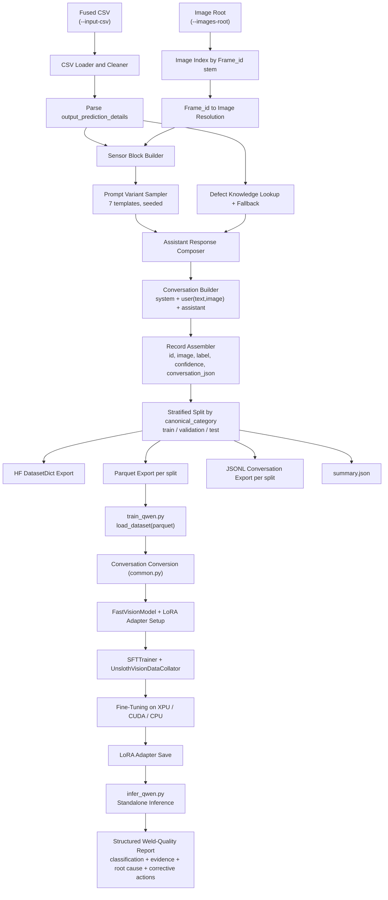

# Weld VLM Fine-Tuning

Standalone, self-contained toolkit to prepare a multimodal (image + sensor
telemetry) weld-defect dataset and fine-tune a Qwen vision-language model
(VLM) on it using [Unsloth](https://github.com/unslothai/unsloth) + LoRA.

This directory is **not integrated** with the rest of
`industrial-edge-insights-multimodal` — it does not wire into the
`docker-compose*.yml` stacks, `configs/`, or the vLLM serving setup in this
repo. It is a self-contained data-prep + fine-tuning + inference workflow you
run independently (e.g. on a dev box or training server) to produce a LoRA
adapter. Once you have an adapter, you can serve it with the existing
[`docker-compose-vllm.yml`](../docker-compose-vllm.yml) in this repo, or with
any OpenAI-compatible VLM server that supports LoRA adapters.

## Table of Contents

- [Overview](#overview)
- [Directory Layout](#directory-layout)
- [Prerequisites](#prerequisites)
- [Setup](#setup)
- [Step 1: Input Data](#step-1-input-data)
- [Step 2: Prepare the Dataset](#step-2-prepare-the-dataset)
- [Step 3: Fine-Tune the Model](#step-3-fine-tune-the-model)
- [Step 4: Run Inference](#step-4-run-inference)
- [Pipeline Architecture](#pipeline-architecture)
- [Troubleshooting](#troubleshooting)
- [License](#license)

## Overview

The pipeline has three independent stages, each its own script:

| Stage | Script | Input | Output |
|---|---|---|---|
| 1. Data preparation | `prepare_weld_dataset.py` | Fused CSV + weld images | HF `DatasetDict`, parquet splits, conversation JSONL, `summary.json` |
| 2. Fine-tuning | `train_qwen.py` | Parquet dataset (from stage 1) | LoRA adapter + tokenizer |
| 3. Inference | `infer_qwen.py` | Base model or adapter (from stage 2) | Streamed structured weld-quality report |

`common.py` holds small helpers shared by `train_qwen.py` and
`infer_qwen.py` (device detection, chat-message conversion) so the two
scripts stay modular and independently runnable.

The fine-tuned model is trained to produce a structured report per weld
image + sensor reading, covering:

- Weld Classification (Good Weld vs. one of 11 defect types)
- Visual Observation
- Sensor Analysis (telemetry vs. expected class profile)
- Model Confidence + Defect Probability
- Severity
- Root Cause
- Corrective Actions

## Directory Layout

```
vlm-fine-tuning/
├── README.md                  # this file
├── requirements.txt           # pinned Python dependencies
├── common.py                  # shared chat-format / device-detection helpers
├── prepare_weld_dataset.py    # Stage 1: dataset preparation
├── train_qwen.py              # Stage 2: LoRA fine-tuning (Unsloth + TRL)
└── infer_qwen.py              # Stage 3: standalone inference
```

Generated artifacts (not checked in — see `.gitignore` note below) land in
whatever `--output-dir` / `--dataset-path` you pass on the command line,
e.g. `processed_dataset/` and `qwen_3.5_2b_adapter/`.

> If you fork this into your own repo, add `processed_dataset/`,
> `*_adapter/`, `checkpoint-*/`, and any downloaded datasets/images to
> `.gitignore` — none of these generated artifacts should be committed.

## Prerequisites

- Python 3.10+
- ~16 GB+ RAM for data preparation (image + CSV processing)
- A GPU/XPU is strongly recommended for fine-tuning and inference:
  - Intel GPU (Arc / integrated) via Intel XPU PyTorch build, or
  - CPU (functional but slow; useful only for smoke-testing the pipeline)
- Access to a fused weld dataset — see [Step 1](#step-1-input-data)

## Setup

```bash
python3 -m venv venv
source venv/bin/activate
pip install --upgrade pip

# 1. Install PyTorch for your target device first (pick ONE):
#    Intel XPU:
pip install torch --index-url https://download.pytorch.org/whl/xpu
#    CPU only:
# pip install torch

# 2. Install the rest of the pipeline dependencies
pip install -r requirements.txt
```

Unsloth auto-detects the installed PyTorch backend (XPU/CUDA/CPU) at import
time, and `common.detect_device()` selects `xpu` > `cpu` for
tensor placement during training/inference.

## Step 1: Input Data

`prepare_weld_dataset.py` consumes two inputs that you must provide:

1. **A fused CSV** (`--input-csv`), one row per labeled weld image/sample,
   with (at minimum) these columns:

   | Column | Type | Description |
   |---|---|---|
   | `Frame_id` | string | Image filename stem used to resolve the image file under `--images-root` |
   | `output_prediction_details` | Python-dict literal (string) | Classifier output — see below |
   | `Category` | string | Canonical weld-session label used for stratified splitting (falls back to the parsed `predicted_category` if absent) |
   | `Primary Weld Current`, `Secondary Weld Voltage`, `Pressure`, `CO2 Weld Flow`, `Feed`, `Wire Consumed` | numeric | Sensor telemetry injected into the prompt |

   `output_prediction_details` must parse (via `ast.literal_eval`) into a
   dict shaped like the output of
   [`classification-training`](../classification-training)'s
   `WeldDefectPredictor` — see its
   [Output Format](../classification-training/README.md#output-format)
   section for the exact shape, e.g.:

   ```python
   {
       "predicted_category": "Excessive Penetration",
       "is_defect": True,
       "defect_probability": 1.0,
       "good_weld_probability": 0.0,
       "confidence": 0.9886,
       "explanation": {
           "reason": "...",
           "top_signal_features": [
               {"feature": "Primary Weld Current", "value": 89.06,
                "predicted_mean": 92.1, "good_weld_mean": 60.4,
                "evidence_score": 0.42},
               ...
           ],
       },
   }
   ```

   In practice, this CSV is produced by fusing:
   - Per-frame classifier predictions (run `classification-training`'s
     inference over your weld image/sensor dataset to get
     `output_prediction_details` per row), with
   - Raw sensor telemetry and image `Frame_id`s, aligned by timestamp.

   This repo does not include a fusion script — build one for your own data
   pipeline, or provide the CSV in the schema above directly.

2. **An image root** (`--images-root`): a directory tree of weld images
   (`.jpg`/`.jpeg`/`.png`/`.bmp`/`.webp`), searched recursively. Each image's
   filename stem (without extension) must match a `Frame_id` value in the
   CSV. Sub-folder structure (e.g. per-class folders) does not matter — only
   the filename stem is used for matching.

The underlying raw images and sensor CSVs for weld defect data can be
sourced from the same public dataset used by `classification-training`:
[IntelLabs/Intel_Robotic_Welding_Multimodal_Dataset](https://huggingface.co/datasets/IntelLabs/Intel_Robotic_Welding_Multimodal_Dataset).

## Step 2: Prepare the Dataset

```bash
python prepare_weld_dataset.py \
  --input-csv /path/to/merged_by_ts_time.csv \
  --images-root /path/to/dataset/images \
  --output-dir ./processed_dataset \
  --train-ratio 0.8 --val-ratio 0.1 --test-ratio 0.1 \
  --seed 42
```

Useful flags:

- `--limit N` — cap the number of rows processed, for a quick dry-run.
- `--skip-missing` — drop rows whose image cannot be resolved instead of
  raising an error (default: strict, raises on the first missing image).

What it does:

1. Loads and cleans the CSV (strips whitespace from headers and string
   fields).
2. Builds an index of `Frame_id → image path` from `--images-root`.
3. Parses `output_prediction_details` per row.
4. Builds a sensor-telemetry text block and picks one of 7 rotating user
   prompt templates (deterministic given `--seed`).
5. Synthesizes a structured assistant response (classification, visual
   observation, sensor analysis, confidence, severity, root cause,
   corrective actions), drawing on a small built-in defect knowledge base
   with a generic fallback for unseen categories.
6. Assembles a 3-turn `system` / `user(text+image)` / `assistant`
   conversation per row.
7. Performs a stratified train/validation/test split by canonical category,
   with guardrails so small classes still get at least one sample per
   split when possible.
8. Writes:
   - `hf_dataset/` — HF `DatasetDict`, image column castable to PIL
   - `parquet/{train,validation,test}.parquet` — used by `train_qwen.py`
   - `conversations/{train,validation,test}.jsonl` — raw messages, useful
     for manual inspection or use with other trainers
   - `summary.json` — row counts, missing-image count, output paths

## Step 3: Fine-Tune the Model

```bash
python train_qwen.py \
  --model-name unsloth/Qwen3.5-2B \
  --dataset-path ./processed_dataset/parquet \
  --output-dir ./qwen_3.5_2b_adapter \
  --learning-rate 2e-4 \
  --num-train-epochs 2
```

Notable flags (all optional, defaults shown):

| Flag | Default | Description |
|---|---|---|
| `--model-name` | `unsloth/Qwen3.5-2B` | Base VLM to fine-tune |
| `--per-device-train-batch-size` | 4 | Per-device train batch size |
| `--per-device-eval-batch-size` | 4 | Per-device eval batch size |
| `--gradient-accumulation-steps` | 4 | Effective batch size = train batch × this |
| `--max-seq-length` | 2048 | Max token sequence length |
| `--lora-r` / `--lora-alpha` | 16 / 16 | LoRA rank / alpha |
| `--preview-only` | off | Load data, print the first converted sample, and exit (no model build/training) |
| `--skip-save` | off | Skip saving the adapter/tokenizer at the end |

Training details:

- LoRA is applied to vision layers, language layers, attention modules, and
  MLP modules (`FastVisionModel.get_peft_model`), with 4-bit quantized base
  weights (`load_in_4bit=True`, default on) and gradient checkpointing.
- Trains with `trl.SFTTrainer` + `UnslothVisionDataCollator`, evaluating and
  checkpointing every 50 steps.
- Optimizer is `adamw_8bit` on CUDA, `adamw_torch` otherwise (Intel
  XPU/CPU), selected automatically via `common.detect_device()`.
- On completion, the adapter and tokenizer are saved to `--output-dir`
  (unless `--skip-save` is set).

## Step 4: Run Inference

Run inference either against samples from your prepared test split, or
against a single arbitrary image.

```bash
# Against the first 5 test-split samples, using the fine-tuned adapter
python infer_qwen.py \
  --model-path ./qwen_3.5_2b_adapter \
  --dataset-path ./processed_dataset/parquet \
  --split test \
  --num-samples 5

# Against a single external image
python infer_qwen.py \
  --model-path ./qwen_3.5_2b_adapter \
  --image /path/to/weld.jpg \
  --instruction "Analyze this weld image for quality and identify any anomalies."
```

`--model-path` accepts either a HuggingFace base model id (to sanity-check
the un-tuned base model) or a local directory containing a saved LoRA
adapter from `train_qwen.py`. Output streams token-by-token to stdout via
`TextStreamer`.

## Pipeline Architecture



## Troubleshooting

- **`FileNotFoundError` / missing image errors during Step 2** — verify
  `--images-root` contains files whose stem exactly matches `Frame_id`
  values in the CSV, or pass `--skip-missing` to drop unmatched rows
  instead of failing.
- **Split ratios error** — `--train-ratio` + `--val-ratio` + `--test-ratio`
  must sum to exactly `1.0`.
- **Out-of-memory during training** — lower
  `--per-device-train-batch-size` and/or raise
  `--gradient-accumulation-steps` to keep the effective batch size
  constant; ensure `--load-in-4bit` is enabled (it is by default).
- **No XPU/CUDA detected** — `common.detect_device()` silently falls back
  to CPU; training/inference will still run but be much slower. Confirm
  your PyTorch build matches your hardware (see [Setup](#setup)).
- **Serving the adapter** — this directory only produces the adapter; to
  serve it with an OpenAI-compatible API, see
  [`docker-compose-vllm.yml`](../docker-compose-vllm.yml) and
  [`vllm.env`](../vllm.env) at the root of this component.

## License

Licensed under the Apache License, Version 2.0. See the repository root
[`LICENSE`](../../../LICENSE) file.

Third-party components used by the scripts in this directory (see
`requirements.txt`), each under their own upstream license:

- [Unsloth](https://github.com/unslothai/unsloth) — Apache-2.0
- [Hugging Face `transformers`](https://github.com/huggingface/transformers) — Apache-2.0
- [Hugging Face `datasets`](https://github.com/huggingface/datasets) — Apache-2.0
- [TRL](https://github.com/huggingface/trl) — Apache-2.0
- [PEFT](https://github.com/huggingface/peft) — Apache-2.0
- [PyTorch](https://github.com/pytorch/pytorch) — BSD-3-Clause

Dataset: sourced from
[IntelLabs/Intel_Robotic_Welding_Multimodal_Dataset](https://huggingface.co/datasets/IntelLabs/Intel_Robotic_Welding_Multimodal_Dataset)
(Apache-2.0), see that dataset's card for its own license terms.
