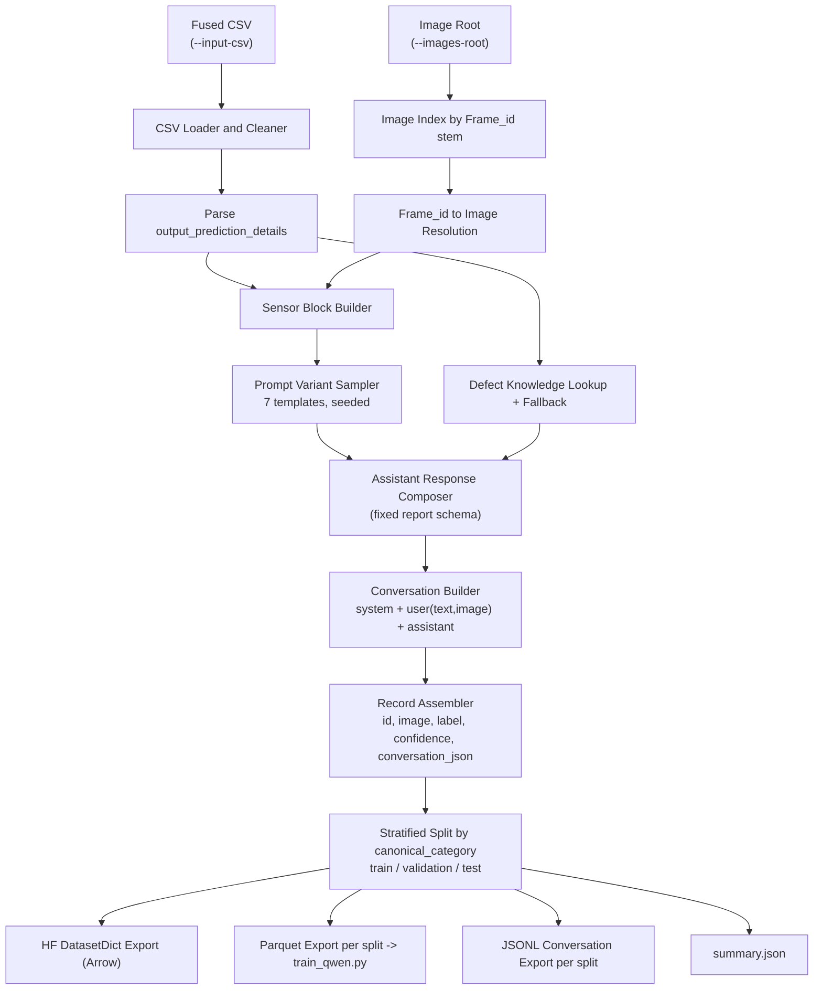

# Weld VLM Fine-Tuning — Worked Example

This document is a concrete, **weld-defect-analysis** instance of the
generic Unsloth VLM fine-tuning flow described in
[`README.md`](README.md). Everything here — the input data schema, the
prompt/response templates, and the actual commands run — is specific to
this weld use case, built on top of the domain-agnostic scripts and
concepts covered in `README.md`.

Read `README.md` first for the generic pipeline, setup, and the
Unsloth/LoRA concepts referenced below; this file only covers how those
generic pieces are instantiated for weld data.

| Generic stage (see `README.md`) | Weld-specific instance (this file) |
|---|---|
| Bring-your-own dataset prep → parquet | `prepare_weld_dataset.py` — [Step 1](#step-1-input-data) & [Step 2](#step-2-prepare-the-dataset) |
| Fine-tune with `train_qwen.py` | Weld-specific invocation — [Step 3](#step-3-fine-tune-the-model-weld-instance) |
| Infer with `infer_qwen.py` | Weld-specific invocation — [Step 4](#step-4-run-inference-weld-instance) |

## Table of Contents

- [Data Preparation Strategy](#data-preparation-strategy)
- [Step 1: Input Data](#step-1-input-data)
- [Step 2: Prepare the Dataset](#step-2-prepare-the-dataset)
- [Step 3: Fine-Tune the Model (Weld Instance)](#step-3-fine-tune-the-model-weld-instance)
- [Step 4: Run Inference (Weld Instance)](#step-4-run-inference-weld-instance)
- [Detailed Data-Prep Flow](#detailed-data-prep-flow)
- [Data-Prep Troubleshooting](#data-prep-troubleshooting)
- [License / Dataset Attribution](#license--dataset-attribution)

## Data Preparation Strategy

### What are we training the model to do? (the training objective)

The fine-tuning objective is **not** "describe this image" — it is:

> Given a weld image **and** its corresponding sensor telemetry, produce a
> structured, multi-section quality report: classification (good weld vs.
> one of 11 defect types), a visual observation grounded in the image,
> a sensor-evidence analysis grounded in the telemetry, a confidence /
> defect-probability estimate, a severity rating, a root cause, and
> corrective actions.

This is a **multimodal, structured-output** objective (image + numeric
telemetry in, a fixed-schema text report out), not free-form captioning or
open-ended chat. That objective directly drives every data-preparation
decision below:

- **Fixed response schema.** Every assistant response follows the same
  section order (`Weld Classification` → `Visual Observation` →
  `Sensor Analysis` → `Confidence`/`Defect Probability` → `Severity` →
  `Root Cause` → `Corrective Actions`). Because the objective is a
  structured report, the model needs to learn *that
  structure* as reliably as it learns the weld domain — a consistent
  schema also makes downstream parsing of model output trivial.
- **Prompt diversity, response consistency.** The *user* turn is
  intentionally varied across 7 rotating phrasings (see
  [Step 2](#step-2-prepare-the-dataset)) so the model generalizes to
  differently-worded operator questions instead of memorizing one exact
  prompt string, while the *assistant* turn's structure stays fixed so the
  output schema is stable regardless of how the question was phrased.
- **Class-balanced splits.** Defect categories are naturally imbalanced
  (far more good welds than, say, burn-through). Because the objective
  includes correctly classifying rare defect types, splitting is
  stratified by category (with guardrails for small classes) instead of
  a plain random split, so validation/test sets still exercise every
  defect type.
- **Multimodal alignment.** Because the model must reason jointly over
  pixels and sensor numbers, sensor readings are rendered into the text
  prompt itself (not passed out-of-band), so the same forward pass that
  attends to the image can also attend to the telemetry text tokens.

In short: the data-prep stage exists to turn an upstream classifier's
tabular predictions + raw sensor CSVs + images into a dataset whose
input/output shape *is* the structured-report objective, so that a
generic instruction-tuned VLM base model can be steered toward it with a
relatively small amount of LoRA fine-tuning.

## Step 1: Input Data

`prepare_weld_dataset.py` consumes two inputs that you must provide:

1. **A fused CSV** (`--input-csv`), one row per labeled weld image/sample,
   with (at minimum) these columns:

   | Column | Type | Description |
   |---|---|---|
   | `Frame_id` | string | Image filename stem used to resolve the image file under `--images-root` |
   | `output_prediction_details` | Python-dict literal (string) | Classifier output — see below |
   | `Category` | string | Canonical weld-session label used for stratified splitting (falls back to the parsed `predicted_category` if absent) |
   | `Primary Weld Current`, `Secondary Weld Voltage`, `Pressure`, `CO2 Weld Flow`, `Feed`, `Wire Consumed` | numeric | Sensor telemetry injected into the prompt |

   `output_prediction_details` must parse (via `ast.literal_eval`) into a
   dict shaped like the output of
   [`classification-training`](../classification-training)'s
   `WeldDefectPredictor` — see its
   [Output Format](../classification-training/README.md#output-format)
   section for the exact shape, e.g.:

   ```python
   {
       "predicted_category": "Excessive Penetration",
       "is_defect": True,
       "defect_probability": 1.0,
       "good_weld_probability": 0.0,
       "confidence": 0.9886,
       "explanation": {
           "reason": "...",
           "top_signal_features": [
               {"feature": "Primary Weld Current", "value": 89.06,
                "predicted_mean": 92.1, "good_weld_mean": 60.4,
                "evidence_score": 0.42},
               ...
           ],
       },
   }
   ```

   In practice, this CSV is produced by fusing:
   - Per-frame classifier predictions (run `classification-training`'s
     inference over your weld image/sensor dataset to get
     `output_prediction_details` per row), with
   - Raw sensor telemetry and image `Frame_id`s, aligned by timestamp.

   This repo does not include a fusion script — build one for your own data
   pipeline, or provide the CSV in the schema above directly.

2. **An image root** (`--images-root`): a directory tree of weld images
   (`.jpg`/`.jpeg`/`.png`), searched recursively. Each image's
   filename stem (without extension) must match a `Frame_id` value in the
   CSV. Sub-folder structure (e.g. per-class folders) does not matter — only
   the filename stem is used for matching.

The underlying raw images and sensor CSVs for weld defect data can be
sourced from the same public dataset used by `classification-training`:
[IntelLabs/Intel_Robotic_Welding_Multimodal_Dataset](https://huggingface.co/datasets/IntelLabs/Intel_Robotic_Welding_Multimodal_Dataset).

## Step 2: Prepare the Dataset

```bash
python prepare_weld_dataset.py \
  --input-csv /path/to/merged_by_ts_time.csv \
  --images-root /path/to/dataset/images \
  --output-dir ./processed_dataset \
  --train-ratio 0.8 --val-ratio 0.1 --test-ratio 0.1 \
  --seed 42
```

Useful flags:

- `--limit N` — cap the number of rows processed, for a quick dry-run.
- `--skip-missing` — drop rows whose image cannot be resolved instead of
  raising an error (default: strict, raises on the first missing image).

### What it does

1. Loads and cleans the CSV (strips whitespace from headers and string
   fields).
2. Builds an index of `Frame_id → image path` from `--images-root`.
3. Parses `output_prediction_details` per row.
4. Builds a sensor-telemetry text block and picks one of 7 rotating user
   prompt templates (deterministic given `--seed`).
5. Synthesizes a structured assistant response (classification, visual
   observation, sensor analysis, confidence, severity, root cause,
   corrective actions), drawing on a small built-in defect knowledge base
   with a generic fallback for unseen categories.
6. Assembles a 3-turn `system` / `user(text+image)` / `assistant`
   conversation per row.
7. Performs a stratified train/validation/test split by canonical category, 
   so small classes still get at least one sample per
   split when possible.
8. Writes:
   - `hf_dataset/` — HF `DatasetDict`, image column castable to PIL
   - `parquet/{train,validation,test}.parquet` — used by `train_qwen.py`
   - `conversations/{train,validation,test}.jsonl` — raw messages, useful
     for manual inspection or use with other trainers
   - `summary.json` — row counts, missing-image count, output paths

### The conversation / prompt template

Every record is a fixed 3-turn chat-format conversation
(`system` → `user` → `assistant`), matching the chat template Qwen-VL /
Unsloth expect at both training and inference time:

| Turn | Content | Purpose |
|---|---|---|
| `system` | A fixed "expert weld quality inspector and metallurgical engineer" persona, referencing AWS D1.1 / ISO 5817 | Anchors the model's domain role and output-structuring behavior consistently across every sample |
| `user` | `{one of 7 rotating instruction templates}` + `{sensor telemetry block}` + `{image}` | The operator's question, phrased differently each time, plus the raw sensor readings inlined as text so the model attends to both modalities together |
| `assistant` | Fixed-schema structured report (see [Data Preparation Strategy](#data-preparation-strategy)) synthesized from the classifier output + a small defect knowledge base | The learning target — what the model should learn to produce |

Why 7 rotating user-prompt templates instead of one fixed prompt? A single
fixed instruction risks the model overfitting to that exact wording (i.e.
it "keys" its structured-report behavior off matching text rather than off
the actual image + sensor content). Rotating through 7 semantically
equivalent but differently worded prompts — deterministically, via
`--seed`, so runs are reproducible — teaches the model that the same
structured analysis is expected regardless of how the user asks.

Why is the sensor block inlined into the user's *text*, rather than passed
as separate structured input? Qwen-VL (like most current VLMs) only has two
native input channels: image tokens and text tokens. Since the objective
explicitly requires reasoning that correlates image content with sensor
readings, the telemetry has to be visible to the same forward pass as the
image, so it is rendered as a small `Sensor Data:` text block in the same
user turn as the image.

### Why parquet / Arrow / JSONL — and which one Unsloth actually uses

`prepare_weld_dataset.py` emits the *same* dataset in three formats,
because they serve different consumers:

| Format | Where | Used by | Why this format |
|---|---|---|---|
| **Arrow** (`hf_dataset/`, via `DatasetDict.save_to_disk`) | On-disk memory-mapped Arrow tables | Ad-hoc exploration with `datasets.load_from_disk`, or as a base to derive further HF-native transforms | Arrow is the `datasets` library's native, memory-mapped columnar format — large image datasets can be inspected/iterated without loading everything into RAM, and it round-trips through `datasets` APIs (filters, `map`, etc.) losslessly |
| **Parquet** (`parquet/{split}.parquet`) | One portable file per split | **`train_qwen.py`**, via `datasets.load_dataset("parquet", ...)` | Parquet is a compact, columnar, self-contained, widely-portable file format. With the `image` column cast to `datasets.Image`, image bytes are embedded directly in the parquet file, so a single file per split carries both the conversation and its image with no separate file tree to keep in sync — the format Unsloth/`datasets`/HF Hub uploads all standardize on for VLM datasets |
| **JSONL** (`conversations/{split}.jsonl`) | One line per record, `{"messages": [...]}` | Manual inspection (`less`, `jq`, diffing) and any other chat-format SFT trainer (e.g. axolotl, LLaMA-Factory) that expects JSONL conversations | Human-readable, diffable, framework-agnostic — no binary/Arrow tooling needed to eyeball a few samples, and it's the lowest-common-denominator format most other SFT trainers already accept |

**`train_qwen.py` loads the parquet split** (`--dataset-path
./processed_dataset/parquet`) because Unsloth's vision fine-tuning path
just needs `datasets.load_dataset` to hand it rows with an `image` column
(auto-decoded to PIL) and a `conversation_json` column it converts via
`common.convert_to_conversation`. Parquet gives it that in one
self-contained, easily-shareable file per split — Arrow/`hf_dataset/` would
work too (same underlying data) but isn't as easy to move around as a
single file, and JSONL alone can't carry the embedded image bytes.

### Motivation summary

The overall motivation for producing three formats instead of one is:
*author once, consume anywhere* — the same 3-turn conversation, sensor
block, and structured response are computed a single time in
`prepare_weld_dataset.py`, then serialized to whichever format each
downstream consumer (trainer, debugger, or another framework) natively
expects, instead of re-deriving the dataset per consumer.

## Step 3: Fine-Tune the Model (Weld Instance)

`train_qwen.py` is the generic Unsloth + LoRA fine-tuning script described
in [`README.md` — Step: Fine-Tune the Model](README.md#step-fine-tune-the-model).
For the weld dataset produced by Step 2 above, it is invoked as:

```bash
python train_qwen.py \
  --model-name unsloth/Qwen3.5-2B \
  --dataset-path ./processed_dataset/parquet \
  --output-dir ./qwen_3.5_2b_weld_adapter \
  --learning-rate 2e-4 \
  --num-train-epochs 2
```

- `--dataset-path` points at the `parquet/` directory produced by
  `prepare_weld_dataset.py` in [Step 2](#step-2-prepare-the-dataset) —
  `train_qwen.py` does not know or care that the data is weld-specific; it
  only needs the generic `image` + `conversation_json` column shape
  described in `README.md`.
- All other flags (`--lora-r`, `--max-seq-length`,
  `--per-device-train-batch-size`, etc.) keep their generic defaults —
  see `README.md` for why each default was chosen. Nothing about this weld
  instance required overriding them: 2048 tokens comfortably fits the
  system + sensor-block user turn + structured assistant report described
  in [Step 2](#step-2-prepare-the-dataset), and a moderately sized weld
  dataset trains well at rank 16 / 2 epochs.
- Output: a LoRA adapter + tokenizer saved to `./qwen_3.5_2b_weld_adapter`,
  specialized to produce the weld-quality report schema from
  [Data Preparation Strategy](#data-preparation-strategy).

## Step 4: Run Inference (Weld Instance)

`infer_qwen.py` is the generic inference script described in
[`README.md` — Step: Run Inference](README.md#step-run-inference). Pointed
at the weld adapter and dataset:

```bash
# Against the first 5 test-split samples, using the fine-tuned weld adapter
python infer_qwen.py \
  --model-path ./qwen_3.5_2b_weld_adapter \
  --dataset-path ./processed_dataset/parquet \
  --split test \
  --num-samples 5

# Against a single external weld image
python infer_qwen.py \
  --model-path ./qwen_3.5_2b_weld_adapter \
  --image /path/to/weld.jpg \
  --instruction "Analyze this weld image for quality and identify any anomalies."
```

The output streamed to stdout is the structured weld-quality report
(classification, visual observation, sensor analysis, confidence, severity,
root cause, corrective actions) described in
[Data Preparation Strategy](#data-preparation-strategy) — this is the
assistant-turn schema the model was fine-tuned to reproduce in Step 3.

## Detailed Data-Prep Flow



## Data-Prep Troubleshooting

- **`FileNotFoundError` / missing image errors during Step 2** — verify
  `--images-root` contains files whose stem exactly matches `Frame_id`
  values in the CSV, or pass `--skip-missing` to drop unmatched rows
  instead of failing.
- **Split ratios error** — `--train-ratio` + `--val-ratio` + `--test-ratio`
  must sum to exactly `1.0`.
- **A rare defect class is missing from validation/test** — check
  `summary.json` for per-split counts; classes with fewer than 3 total
  samples may not get a guaranteed sample in every split. Collect more
  data for that category, or accept train-only coverage for it.

## License / Dataset Attribution

The raw images and sensor CSVs referenced in [Step 1](#step-1-input-data)
can be sourced from
[IntelLabs/Intel_Robotic_Welding_Multimodal_Dataset](https://huggingface.co/datasets/IntelLabs/Intel_Robotic_Welding_Multimodal_Dataset)
(Apache-2.0) — see that dataset's card for its own license terms. The
generic toolkit license and third-party component licenses are listed in
[`README.md` — License](README.md#license).

For fine-tuning and inference on the dataset produced here, see
[`README.md`](README.md).
