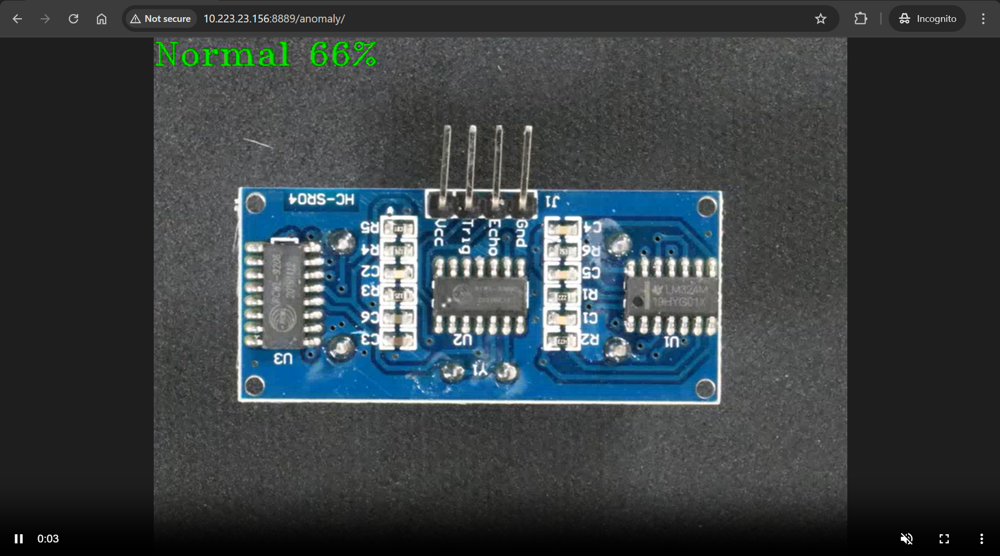

# Run multiple AI pipelines

In a typical deployment, multiple cameras deliver video streams that are connected to AI pipelines to improve the detection and recognition accuracy. 

The DLStreamer Pipeline Server config supports multiple pipelines that you can use to launch pipeline instances. The sample application has been provided with such a config i.e. **pipeline-server-config.json**. We will use the same to demonstrate launching multiple AI pipelines.

## Steps

 The following demonstrates running two AI pipelines and observing telemetry data from Prometheus* UI.
> **Note** We assume that the model and sample video is already available in the application directory under `resources/`.

1. Bring up the containers.
    ```sh
    docker compose up -d
    ```
2. Start the PCB anomaly detection pipeline with the following Client URL (cURL) command by replacing the `<peer-str-id>` with a string id eg: `anomaly1` and `<HOST_IP>` with the system IP. This pipeline is configured to run in a loop forever. This REST/cURL request will return a pipeline instance ID, which can be used as an identifier to query later the pipeline status or stop the pipeline instance. For example, a6d67224eacc11ec9f360242c0a86003.

    ``` sh
    curl http://<HOST_IP>:8080/pipelines/user_defined_pipelines/pcb_anomaly_detection_mlops -X POST -H 'Content-Type: application/json' -d '{
        "destination": {
            "frame": {
                "type": "webrtc",
                "peer-id": "<peer-str-id>"
            }
        },
        "parameters": {
            "detection-properties": {
                "model": "/home/pipeline-server/resources/models/pcb-anomaly-detection/deployment/Anomaly classification/model/model.xml",
                "device": "CPU"
            }
        }
    }'
    ```

3. Start another PCB anomaly detection pipeline with the following Client URL (cURL) command by replacing the `<different-peer-str-id>` with a different string id than the one in above step. eg: `anomaly2` and `<HOST_IP>` with the system IP. This pipeline is not configured to run in a loop forever. This REST/cURL request will return a pipeline instance ID, which can be used as an identifier to query later the pipeline status or stop the pipeline instance. For example, a6d67224eacc11ec9f360242c0a86003.

    ``` sh
    curl http://<HOST_IP>:8080/pipelines/user_defined_pipelines/pcb_anomaly_detection -X POST -H 'Content-Type: application/json' -d '{
        "source": {
            "uri": "file:///home/pipeline-server/resources/videos/anomalib_pcb_test.avi",
            "type": "uri"
        },
        "destination": {
            "frame": {
                "type": "webrtc",
                "peer-id": "<different-peer-str-id>"
            }
        },
        "parameters": {
            "detection-properties": {
                "model": "/home/pipeline-server/resources/models/pcb-anomaly-detection/deployment/Anomaly classification/model/model.xml",
                "device": "CPU"
            }
        }
    }'
    ```
    **Note the instance ID of this pipeline**

4. View the WebRTC streaming on `http://<HOST_IP>:<mediamtx-port>/<peer-str-id>` and `http://<HOST_IP>:<mediamtx-port>/<different-peer-str-id>`. `mediamtx-port` in this case would be 8889 as configured in .env file

   

   Figure 1: WebRTC streaming

   You can see boxes, shipping labels, and defects being detected. You have successfully run the sample application.

5. Stop the 2nd pipeline using the instance ID noted in point #3 above, before proceeding with this documentation.
   ```shell
   curl --location -X DELETE http://<HOST_IP>:8080/pipelines/{instance_id}
   ```
