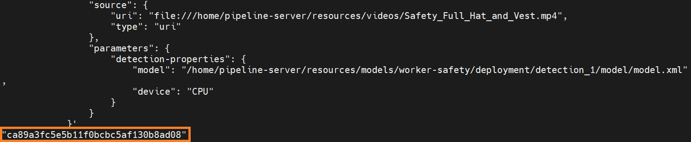

# How To Manage Pipeline

This section describes how to create custom AI pipelines for the sample application and the commands to manage these pipelines.

## Create Pipelines

The AI pipelines are defined by the **pipeline-server-config.json** file present under the configs subdirectory of a particular application directory (for docker compose deployment) and similary inside the helm directory (for helm based deployment. Please also note that the port in the cURL/REST requests needs to be changed from 8080 to 30107 for helm based deployment).

The following is an example of the Worker Safety Gear Detection pipeline, which is included in the **pipeline-server-config.json** file.
```sh
    "pipelines": [
    {
        "name": "worker_safety_gear_detection",
        "source": "gstreamer",
        "queue_maxsize": 50,
        "pipeline": "{auto_source} name=source ! decodebin ! videoconvert ! gvadetect name=detection model-instance-id=inst0 ! gvametaconvert add-empty-results=true name=metaconvert ! queue ! gvafpscounter ! appsink name=destination",
        "parameters": {
            "type": "object",
            "properties": {
                "detection-properties": {
                    "element": {
                        "name": "detection",
                        "format": "element-properties"
                    }
                }
            }
        },
        "auto_start": false,
        "publish_frame": true
    },
```

Customize the pipeline according to your needs. For details, see the following DL Streamer Pipeline Server documentation:
- [Launch configurable pipelines](https://docs.openedgeplatform.intel.com/edge-ai-libraries/dlstreamer-pipeline-server/main/user-guide/how-to-launch-configurable-pipelines.html)
- [Autostart pipelines](https://docs.openedgeplatform.intel.com/edge-ai-libraries/dlstreamer-pipeline-server/main/user-guide/how-to-autostart-pipelines.html)

## Start the Pipeline

Follow this procedure to start the pipeline.

1. In the **pipeline-server-config.json** file, identify the name of the pipeline you want to start.

   The name of the pipeline is defined by the **name** parameter.

        "pipelines": [
            {
                  "name": "pipeline_name",
                  "source": "....",
                  "pipeline": "...."
                  "..."
            }
         ]

2. You use a Client URL (cURL) command to start the pipeline.

      In this example, a pipeline included in this sample application is **worker_safety_gear_detection**. Start this pipeline with the following cURL command.

            curl http://<HOST_IP>:8080/pipelines/user_defined_pipelines/worker_safety_gear_detection -X POST -H 'Content-Type: application/json' -d '{
                "source": {
                    "uri": "file:///home/pipeline-server/resources/videos/Safety_Full_Hat_and_Vest.mp4",
                    "type": "uri"
                },
                "parameters": {
                    "detection-properties": {
                        "model": "/home/pipeline-server/resources/models/worker-safety-gear-detection/deployment/detection_1/model/model.xml",
                        "device": "CPU"
                    }
                }
            }'


2. Take note of the instance ID (without quotes).

   Each pipeline has its **instance ID**. You will need the instance ID to stop the pipeline later.

   

   Figure 1: Example of a pipeline instance ID

## Get Statistics of the Running Pipelines

Request the pipeline statistics with this cURL command.

Replace **HOST_IP** with the IP address of your system.

         curl --location -X GET http://<HOST_IP>:8080/pipelines/status

## Stop the Pipeline

Stop the pipeline with the following cURL command.

Replace **HOST_IP** with the IP address of your system and **instance_id** with the instance ID (without quotes) of the running pipeline.

         curl --location -X DELETE http://<HOST_IP>:8080/pipelines/{instance_id}

> **Note**
> The instance ID is shown in the Terminal when the [pipeline was started](#start-the-pipeline) or when [pipeline statistics were requested](#get-statistics-of-the-running-pipelines).