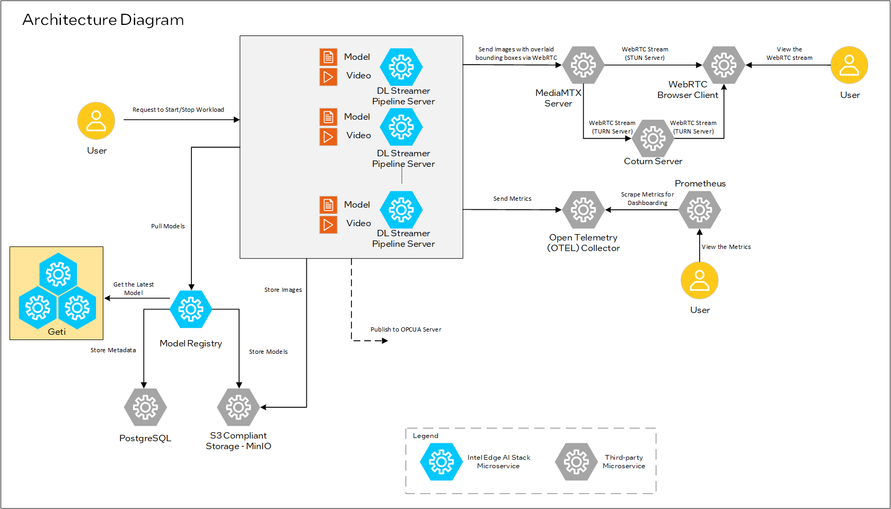

# Overview and Architecture

This Sample Application enables real-time safety gear monitoring of workers by running inference workflows across multiple AI models. It connects multiple video streams from different construction sites cameras to AI-powered pipelines, all operating efficiently on a single industrial PC. This solution enhances logistics efficiency and inventory management by detecting defects before they impact operations.

## Architecture Overview

### High-Level Architecture Diagram

*Figure 1: Architecture Diagram for Worker Safety Gear Detection Reference Impementation.*

## Supporting Resources
* [Get Started Guide](get-started.md)
* [API Reference](api-reference.md)
* [System Requirements](system-requirements.md)