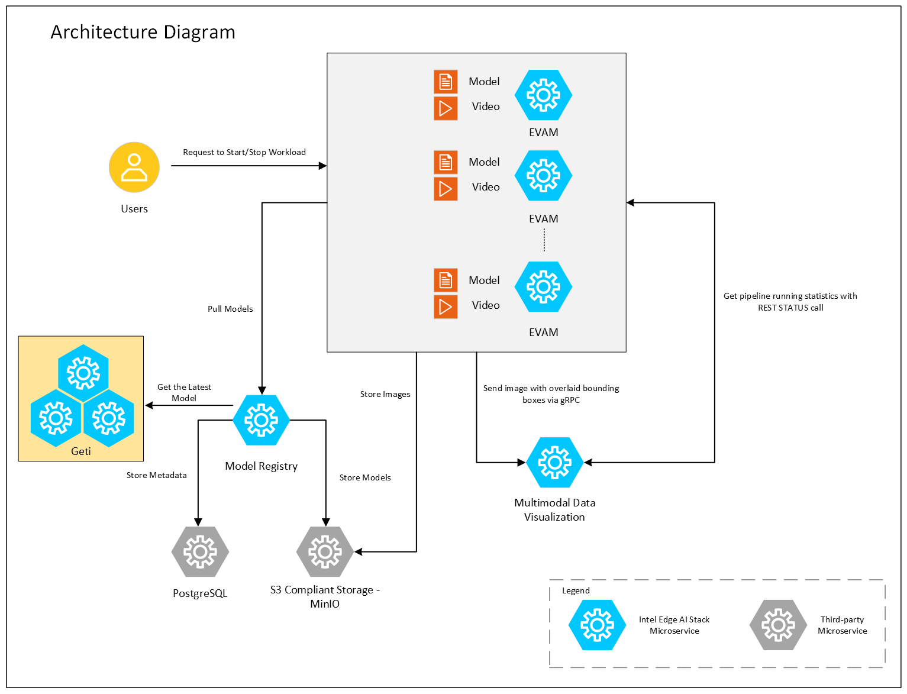
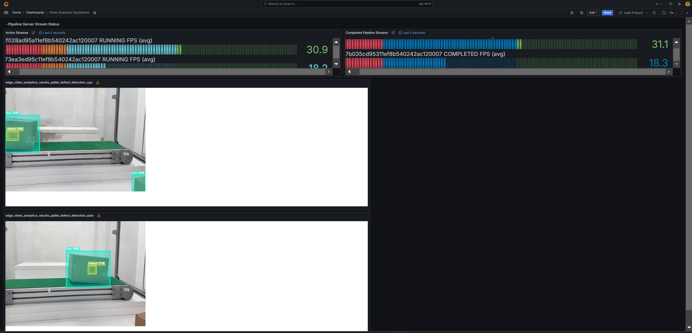
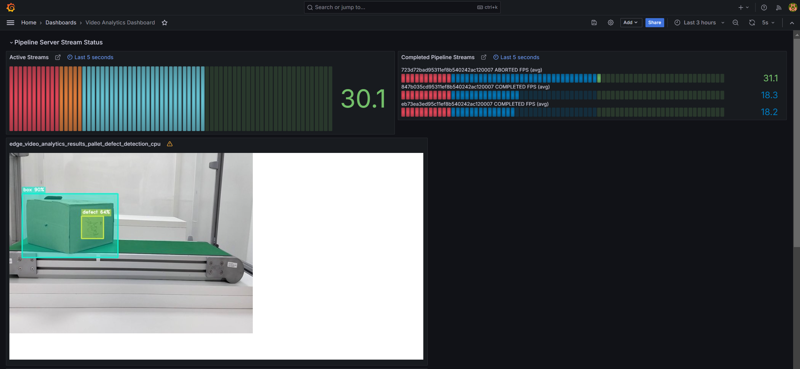
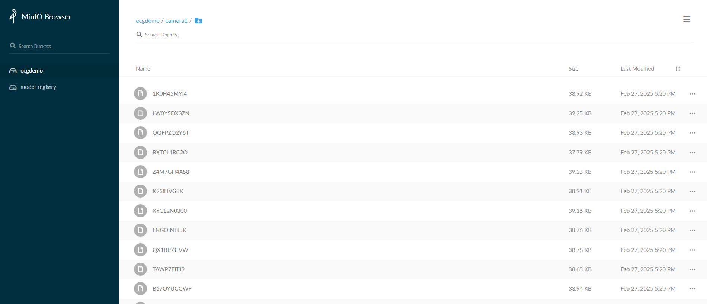

# Pallet Defect Detection Reference Implementation

Connect video streams to multiple AI pipelines on a single industrial PC to detect the condition of pallets in a warehouse.

## Overview

Use this reference implementation to run inference workflows for multiple models and visualize the annotated output. An example use case for this reference implementation is to detect the condition of pallets in a warehouse by connecting multiple video streams from cameras to AI pipelines running on a single industrial PC.

### Features

This reference implementation offers the following features:

-   High-speed data exchange with low-latency compute.
-   AI-assisted defect detection in real-time as pallets are received at the warehouse.
-   On-premise data processing for data privacy and efficient use of bandwidth.
-   Interconnected warehouses deliver analytics for quick and informed tracking and decision making.

## How It Works

This reference implementation consists of three microservices: Edge Video Analytics Microservice (EVAM), Model Registry Microservice(MRaaS) and Multimodal Data Visualization Microservice (MDVM), as shown in Figure 1.

You start the pallet defect detection pipeline with a REST request using Client URL (cURL). The REST request will return a pipeline instance ID. EVAM then sends the images with overlaid bounding boxes via gRPC to MDVM. EVAM also sends the images to S3 compliant storage. To retrieve statistics of the running pipelines, MDVM sends a REST STATUS call and displays the received details. Any desired AI model from the Model Registry Microservice can be pulled into EVAM and used for inference in the reference implementation.



Figure 1: Architecture diagram

This reference implementation is built with these components:

-   <a href="https://docs.edgeplatform.intel.com/edge-video-analytics-microservice/2.3.0/user-guide/Overview.html">**Edge Video Analytics Microservice (EVAM)**</a> is an interoperable containerized microservice based on Python for video ingestion and deep learning inferencing functions.
-   <a href="https://docs.edgeplatform.intel.com/visualization-microservice/user-guide/Overview.html">**Multimodal Data Visualization Microservice**</a> enables the visualization of video streams and time-series data.
-   <a href="https://docs.edgeplatform.intel.com/model-registry-as-a-service/1.0.2/user-guide/Overview.html">**Model Registry Microservice**</a> provides a centralized repository that facilitates the management of AI models

## Get Started

### Note: Refer this [README](./helm/README.md) for helm deployment on k8s. For docker compose based deployment, proceed with this document.

### Step 1: Configure and update the environment variables

1. Update the below fields in [.env](./.env)

    ``` sh
    HOST_IP= # replace localhost with system IP example: HOST_IP=10.100.100.100
    MR_PSQL_PASSWORD= # example: MR_PSQL_PASSWORD=intel1234
    MR_MINIO_ACCESS_KEY= # example: MR_MINIO_ACCESS_KEY=intel1234
    MR_MINIO_SECRET_KEY= # example: MR_MINIO_SECRET_KEY=intel1234
    http_proxy= # example: http_proxy=http://proxy.example.com:891
    https_proxy= # example: http_proxy=http://proxy.example.com:891
    VISUALIZER_GRAFANA_USER= # example: VISUALIZER_GRAFANA_USER=admin
    VISUALIZER_GRAFANA_PASSWORD= # example: VISUALIZER_GRAFANA_PASSWORD=password
    ```

2. Update HOST_IP_where_MRaaS_is_running in [evam_config.json](./evam_config.json)

    ```shell
         "model_registry": {
            "url": "http://<HOST_IP_where_MRaaS_is_running>:32002",
            "request_timeout": 300,
            "saved_models_dir": "./mr_models"
        },
    ```

### Step 2: Run multiple AI pipelines

Follow this procedure to run the reference implementation. In a typical deployment, multiple cameras deliver video streams that are connected to AI pipelines to improve the detection and recognition accuracy. The following demonstrates running two AI pipelines and observing telemetry data from a Grafana* dashboard.

1. Bring up the containers.

         docker compose up -d

2. Start the pallet defect detection pipeline with the following Client URL (cURL) command. This pipeline is configured to run in a loop forever. This REST/cURL request will return a pipeline instance ID, which can be used as an identifier to query later the pipeline status or stop the pipeline instance. For example, a6d67224eacc11ec9f360242c0a86003.

         curl localhost:8080/pipelines/user_defined_pipelines/pallet_defect_detection_mlops -X POST -H 'Content-Type: application/json' -d '{
            "parameters": {
               "detection-properties": {
                     "model": "/home/pipeline-server/resources/models/geti/pallet_defect_detection/deployment/Detection/model/model.xml",
                     "device": "CPU"
               }
            }
         }'

3. Start another pallet defect detection pipeline with the following Client URL (cURL) command. This pipeline is not configured to run in a loop forever. This REST/cURL request will return a pipeline instance ID, which can be used as an identifier to query later the pipeline status or stop the pipeline instance. For example, a6d67224eacc11ec9f360242c0a86003.

         curl localhost:8080/pipelines/user_defined_pipelines/pallet_defect_detection -X POST -H 'Content-Type: application/json' -d '{
            "source": {
                  "uri": "file:///home/pipeline-server/resources/videos/warehouse.avi",
                  "type": "uri"
            },
            "parameters": {
               "detection-properties": {
                     "model": "/home/pipeline-server/resources/models/geti/pallet_defect_detection/deployment/Detection/model/model.xml",
                     "device": "CPU"
               }
            }
         }'

   **Note: Note the instance ID of this pipeline**

4. Go to Grafana dashboard on `http://<HOST_IP>:3000/` and login with credentials provided in `.env` file. Click on `Dashboards -> Video Analytics Dashboard` on the left to see the telemetry data for both pipelines.

   

   Figure 1: Dashboard with telemetry data of two pipelines

   You can see boxes, shipping labels, and defects being detected. You have successfully run the reference implementation.

5. Advanced details: You can also see the topics on which the results are published by going to `http://<HOST_IP>:5003/topics` and then using those topics to see the streams like so: Stream 1 @ `http://<HOST_IP>:5003/<topic_1>` and Stream 2 @ `http://<HOST_IP>:5003/<topic_2>`

6. Stop the 2nd pipeline using the instance ID noted in point #3 above, before proceeding with this documentation.
   ```shell
   curl --location -X DELETE http://<HOST_IP>:8080/pipelines/{instance_id}
   ```


### Step 3: MLOps Flow: At runtime, download a new model from model registry and restart the pipeline with the new model.
```
Note: We have removed "model-instance-id=inst0" from the pallet_defect_detection_mlops pipeline in evam_config.json to ensure the proper loading of the new AI model in the MLOps flow. However, as a general rule, keeping "model-instance-id=inst0" in a pipeline is recommended for better performance if you are running multiple instances of the same pipeline.
```

1. Get all the registered models in the model registry
    ```shell
    curl 'http://<host_system_ip_address>:32002/models'
    ```

2. The following step demonstrates how to create a sample model file from an existing model folder for uploading to the Model Registry. If you already have a model zip file, you can skip this step.
   ```shell
    cd <pdd_repo_workdir>/resources/models/geti/pallet_defect_detection
    zip -r ../pallet_defect_detection.zip .
   ```
   You can utilize the generated `<path>/pallet_defect_detection.zip` as `<model_file_path.zip>` in the next step

3. Upload a model file to Model Registry
    ```shell
   curl -L -X POST "http://<host_system_ip_address>:32002/models" \
   -H 'Content-Type: multipart/form-data' \
   -F 'name="YOLO_Test_Model"' \
   -F 'precision="fp32"' \
   -F 'version="v1"' \
   -F 'origin="Geti"' \
   -F 'file=@<model_file_path.zip>;type=application/zip' \
   -F 'project_name="pallet-defect-detection"' \
   -F 'architecture="YOLO"' \
   -F 'category="Detection"'
    ```

4. Check instance ID of currently running pipeline and use it in the next command
   ```shell
   curl --location -X GET http://<HOST_IP>:8080/pipelines/status
   ```

5. Download the files for a specific model from the model registry microservice and restart the running pipeline with the new model. Essentially, the running instance gets aborted and a new instance gets started.
   ```shell
   curl 'http://<host_system_ip_address>:8080/pipelines/user_defined_pipelines/pallet_defect_detection_mlops/<instance_id_of_currently_running_pipeline>/models' \
   --header 'Content-Type: application/json' \
   --data '{
   "project_name": "pallet-defect-detection",
   "version": "v1",
   "category": "Detection",
   "architecture": "YOLO",
   "precision": "fp32",
   "deploy": true,
   "pipeline_element_name": "detection"
   }'
   ```

    Note: The data above assumes there is a model in the registry that contains these properties. Note: The pipeline name that follows user_defined_pipelines, will affect the `deployment` folder name.


6. View the output in Grafana: `http://<HOST_IP>:3000/`


   

   Figure 2: Dashboard with telemetry data of restarted pipeline instance.

7. You can also stop any running pipeline by using the pipeline instance "id"
   ```shell
   curl --location -X DELETE http://<HOST_IP>:8080/pipelines/{instance_id}
   ```

### Step 4: EVAM S3 frame storage

Follow this procedure to test the EVAM S3 storage using the docker.

1. Install the pip package boto3 once if not installed with the following command
      > pip3 install boto3==1.36.17
2. Create a S3 bucket using the following script.

   ```python
   import boto3
   url = "http://<HOST-IP>:8000"
   user = "<value of MR_MINIO_ACCESS_KEY used in .env>"
   password = "<value of MR_MINIO_SECRET_KEY used in .env>"
   bucket_name = "ecgdemo"

   client= boto3.client(
               "s3",
               endpoint_url=url,
               aws_access_key_id=user,
               aws_secret_access_key=password
   )
   client.create_bucket(Bucket=bucket_name)
   buckets = client.list_buckets()
   print("Buckets:", [b["Name"] for b in buckets.get("Buckets", [])])
   ```

3. Start the pipeline with the following cURL command. Ensure to give the correct path to the model as seen below. This example starts an AI pipeline.

   ```sh
   curl localhost:8080/pipelines/user_defined_pipelines/pallet_defect_detection_s3write -X POST -H 'Content-Type: application/json' -d '{
      "source": {
            "uri": "file:///home/pipeline-server/resources/videos/warehouse.avi",
            "type": "uri"
      },
      "parameters": {
         "detection-properties": {
               "model": "/home/pipeline-server/resources/models/geti/pallet_defect_detection/deployment/Detection/model/model.xml",
               "device": "CPU"
         }
      }
   }'
   ```

4. Go to MinIO console on `http://<HOST_IP>:8000/` and login with `MR_MINIO_ACCESS_KEY` and `MR_MINIO_SECRET_KEY` provided in `.env` file. After logging into console, you can go to `ecgdemo` bucket and check the frames stored.

   


### Step 5: End the demonstration

Follow this procedure to stop the reference implementation and end this demonstration.

1. Stop the reference implementation with the following command.

         docker compose down -v

2. Confirm the containers are no longer running.

         docker ps


## Summary

In this guide, you installed and validated the Pallet Defect Detection Reference Implementation. You also completed a demonstration where multiple pipelines run on a single system with near real-time defect detection.


## Troubleshooting

The following are options to help you resolve issues with the reference implementation.

### Grafana Dashboard
The firewall may prevent you from viewing the video stream and metrics in the Grafana dashboard. Please disable the firewall using this command.

         sudo ufw disable

### Error Logs

View the container logs using this command.

         docker logs -f <CONTAINER_NAME>
