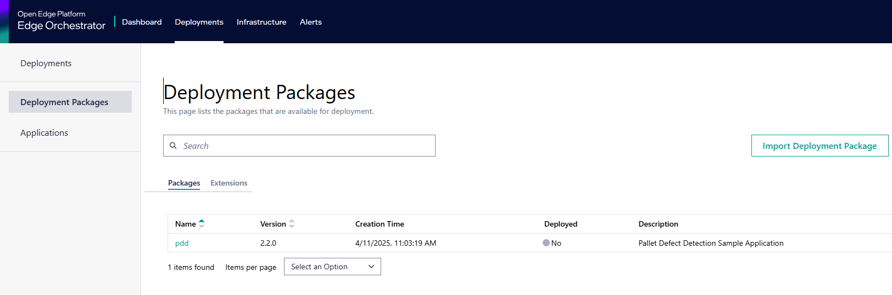

# How to Deploy with the Edge Manageability Framework

Edge Manageability Framework, part of Intel’s Open Edge Software, simplifies edge application deployment and management, making it easier to deploy edge solutions at scale. Edge Manageability Framework provides:

* **Secure Infrastructure Management**: Offers secure and efficient remote onboarding and management of your edge node fleet across sites and geographies. Zero-trust security configuration reduces the time required to secure your edge applications.

* **Deployment Orchestration and Automation**: Lets you roll out and update applications and configure infrastructure nodes across your network from a single pane of glass. Edge Manageability Framework provides automated cluster orchestration and dynamic application deployment.

* **Automated Deployment**: Automates the remote installation and updating of applications at scale.

* **Deep Telemetry**: Gives you policy-based Lifecycle management and centralized visibility into your distributed edge infrastructure and deployments.

* **Flexible Configuration**: From organizing your physical infrastructure to managing the permutations of executing applications in a variety of runtime environments, Edge Manageability Framework gives you flexibility to define the policies, criteria, and hierarchies that make the most sense for your specific business needs.

To deploy the **Pallet Defection Detection** Sample Application on the Edge Management Framework follow the steps described in the document

## Procedure to Deploy on Edge Manageability Framework

### Pre-requisites

1. Access to the web interface of the Edge Manageability Framework with one or more [Edge Nodes Onboarded](<https://docs.openedgeplatform.intel.com/edge-manage-docs/main/user_guide/set_up_edge_infra/edge_node_onboard.html>) to the Edge Manageability Framework.
1. Clusters with [privileged template](<https://docs.openedgeplatform.intel.com/edge-manage-docs/main/user_guide/additional_howtos/set_up_a_cluster_template.html>) have been created on the needed Edge Nodes following the procedures described in [Create Cluster](<https://docs.openedgeplatform.intel.com/edge-manage-docs/main/user_guide/set_up_edge_infra/create_clusters.html#create-clusters>)

### Making available Deployment Package

1. Clone the Repository

    ``` bash
    git clone https://github.com/open-edge-platform/edge-ai-suites -b <version>
    cd edge-ai-suites/manufacturing-ai-suite/pallet-defect-detection
    ```

2. From the web-browser open the URL of the Edge Manageability Framework and Import the Deployment Package present in the folder **deployment-package** following the steps described in [Import Deployment Package](<https://docs.openedgeplatform.intel.com/edge-manage-docs/main/user_guide/package_software/import_deployment.html>)

3. Once the deployment package has been imported into Edge Manageability Framework, you can see it in the list of Web UI as shown here.

****

See [Deployment Packages](<https://docs.openedgeplatform.intel.com/edge-manage-docs/main/user_guide/package_software/deploy_packages.html#deploy-packages>) for more information on deployment packages.

### Deploy the Application onto the Edge Nodes

To set up a deployment:

1. Click the Deployments tab on the top menu to view the Deployments page. In the Deployments page, you can view the list of the deployments that have been created. The status indicator shows a quick view of the status of the deployment that depends on many factors.

1. Select Deployments tab and click Setup a Deployment button. The Setup a Deployment page appears.

1. In the Setup a Deployment page, select the **pdd-app** package for the deployment from list, and click Next. The Select a Profile step appears:

1. In the Select a Profile step, select the deployment profile, and click Next. The Override Profile Values page appears.

1. The Override Profile Values page shows the deployment profile values that are available for overriding. Provide the necessary overriding values, then click Next to proceed to the Select Deployment type step.

1. In the Select Deployment type page, select the type of deployment.

    1. If you select Automatic as the deployment type, enter the deployment name and metadata in key-value format to select the target cluster.

    1. If you select Manual as the deployment type, enter the deployment name and select the clusters from the list of clusters.

1. Click Next to view the Review page.

1. Verify if the deployment details are correct and click Deploy.

After a few minutes, the deployment will start and will take about 5 minutes to complete.

In the Edge Manageability Framework Web UI, you can track the application installation through the [View Deployment Details](<https://docs.openedgeplatform.intel.com/edge-manage-docs/main/user_guide/package_software/deployment_details.html#deployment-details>) view.

**Pallet Defect Detection** Sample Application is fully deployed when the applications become green and the status is shown as _Running_.

You can view the deployment status on the Deployments page.

> Note:  If the deployment fails for any reason, the deployment status will display the “Error” or “Down” status.

For more information on setting up a deployment, See [Set up a Deployment](<https://docs.openedgeplatform.intel.com/edge-manage-docs/main/user_guide/package_software/setup_deploy.html#setup-deploy>)

### Access the **Pallete Defect Detection** Sample Application

1. Download the kubeconfig of the cluster of the Edge Node on which the Application has been deployed. Refer to [Kubeconfig Download](<https://docs.openedgeplatform.intel.com/edge-manage-docs/main/user_guide/set_up_edge_infra/accessing_clusters.html#accessing-clusters>)

2. Follow the steps described in the **Pallet Defect Detection** [Documentation](<how-to-deploy-with-helm.md#run-multiple-ai-pipelines>) on usage of the application.

> Note: Skip the Deploy helm chart step
