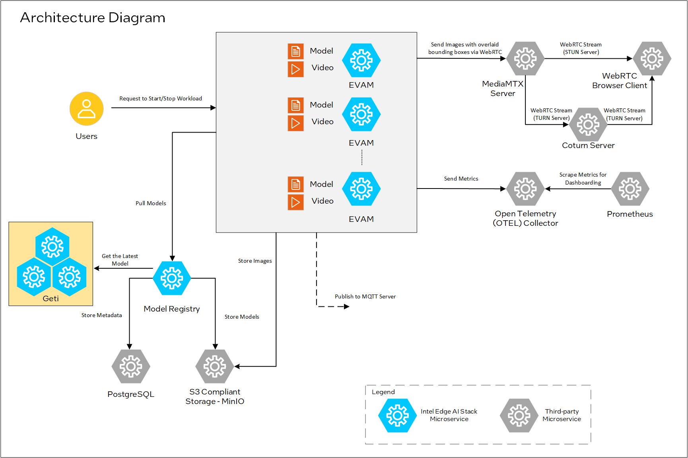

# Contents

- [Contents](#contents) 
  - [Overview](#overview)
  - [Features](#features)
  - [How It Works](#how-it-works)
  - [Prerequisites](#prerequisites)
  - [Deploy Weld Porosity Detection in the Kubernetes Node](#deploy-weld-porosity-sample-application-in-the-kubernetes-node)
  - [Troubleshooting](#troubleshooting)

# Weld Porosity Detection

Prevent defects in real time with AI-powered monitoring.

## Overview

AI and machine vision enable real-time detection of welding defects, ensuring immediate corrective action before issues escalate. By leveraging the right camera and computing hardware, a trained AI model continuously monitors the weld, halting the process the moment a defect is detected. Deep learning AI processes video data at frame rates far beyond human capability, delivering unmatched precision and reliability.

### Features

This sample application offers the following features:

-   High-speed data exchange with low-latency compute.
-   Real-time AI-assisted classification of defects during the welding process.
-   On-premise data processing for data privacy and efficient use of bandwidth.
-   Interconnected welding setups deliver analytics for quick and informed tracking and decision making.

## How It Works

This sample application consists of the following microservices: DL Streamer Pipeline Server, Model Registry Microservice(MRaaS), MediaMTX server, Coturn server, Open Telemetry Collector, Prometheus, Postgres and Minio.

You start the weld porosity classification pipeline with a REST request using Client URL (cURL). The REST request will return a pipeline instance ID. DL Streamer Pipeline Server then sends the images with overlaid bounding boxes through webrtc protocol to webrtc browser client. This is done via the MediaMTX server used for signalling. Coturn server is used to facilitate NAT traversal and ensure that the webrtc stream is accessible on a non-native browser client and helps in cases where firewall is enabled. DL Streamer Pipeline Server also sends the images to S3 compliant storage. The Open Telemetry Data exported by DL Streamer Pipeline Server to Open Telemetry Collector is scraped by Prometheus and can be seen on Prometheus UI. Any desired AI model from the Model Registry Microservice (which can interact with Postgres, Minio and Geti Server for getting the model) can be pulled into DL Streamer Pipeline Server and used for inference in the sample application.



Figure 1: Architecture diagram

This sample application is built with the following Intel Edge AI Stack Microservices:

-   <a href="https://github.com/open-edge-platform/edge-ai-libraries/tree/main/microservices/dlstreamer-pipeline-server">**DL Streamer Pipeline Server**</a> is an interoperable containerized microservice based on Python for video ingestion and deep learning inferencing functions.
-   <a href="https://github.com/open-edge-platform/edge-ai-libraries/tree/main/microservices/model-registry">**Model Registry Microservice**</a> provides a centralized repository that facilitates the management of AI models

It also consists of the below Third-party microservices:

- [MediaMTX Server](https://hub.docker.com/r/bluenviron/mediamtx) is a real-time media server and media proxy that allows to publish webrtc stream.
- [Coturn Server](https://hub.docker.com/r/coturn/coturn) is a media traffic NAT traversal server and gateway.
- [Open telemetry Collector](https://hub.docker.com/r/otel/opentelemetry-collector-contrib) is a set of receivers, exporters, processors, connectors for Open Telemetry.
- [Prometheus](https://hub.docker.com/r/prom/prometheus) is a systems and service monitoring system used for viewing Open Telemetry.
- [Postgres](https://hub.docker.com/_/postgres) is object-relational database system that provides reliability and data integrity.
- [Minio](https://hub.docker.com/r/minio/minio) is high performance object storage that is API compatible with Amazon S3 cloud storage service.

## Prerequisites

- [System Requirements](../docs/user-guide/system-requirements.md)
- K8s installation on single or multi node must be done as pre-requisite to continue the following deployment. Note: The kubernetes cluster is set up with `kubeadm`, `kubectl` and `kubelet` packages on single and multi nodes with `v1.30.2`.
  Refer to tutorials such as <https://adamtheautomator.com/installing-kubernetes-on-ubuntu> and many other
  online tutorials to setup kubernetes cluster on the web with host OS as ubuntu 22.04.
- For helm installation, refer to [helm website](https://helm.sh/docs/intro/install/)

## Deploy Weld Porosity Detection in the Kubernetes Node

### Copy the welding model and video for helm deployment to DL Streamer Pipeline Server

You need to copy your own or existing model into DL Streamer Pipeline Server inorder to run this sample application in kubernates enviornment:

1. The weld porosity classification model is placed as below in the repository under `models`. You can also find the input video file source for inference under `videos`.

- resources/
  - models/
    - weld_porosity/
      - weld_porosity_classification/
        - deployment/
          - Classification/
            - model/
              - model.bin
              - model.xml
  - videos/
    - welding.avi

   > **Note**
   > You can organize the directory structure for models for different use cases.


2. Copy your new AI model (weld porosity classification model used here as an example) and video file to `dlstreamer-pipeline-server` pod.

       POD_NAME=$(kubectl get pods -n apps -o jsonpath='{.items[*].metadata.name}' | tr ' ' '\n' | grep deployment-dlstreamer-pipeline-server | head -n 1)

       kubectl cp <repo_workdir>/resources/videos/welding.avi $POD_NAME:/home/pipeline-server/resources/videos/ -c dlstreamer-pipeline-server -n apps

       kubectl cp <repo_workdir>/resources/models/weld_porosity/ $POD_NAME:/home/pipeline-server/resources/models/ -c dlstreamer-pipeline-server -n apps

   > **Note**
   > You need to run the above commands only after performing the Helm install, and before executing any pipeline.
   > Make sure to replace the 'apps' namespace in the above command with the namespace you are using.

3. Since this is a classification model, ensure to use gvaclassify in the pipeline. For example: See the `weld_porosity_classification` pipeline in `config.json` (present in the repository) where gvaclassify is used.

4. The `config.json` is volume mounted into DL Streamer Pipeline Server in `provision-configmap.yaml` as follows:
    ```sh
    apiVersion: v1
    kind: ConfigMap
    metadata:
      namespace: {{ .Values.namespace }}
      name: dlstreamer-pipeline-server-config-input
    data:
      config.json: |-
    {{ .Files.Get "config.json" | indent 4 }}
    ```

5. Provide the model path and video file path in the REST/curl command for starting an inferencing workload. Example:
    ```sh
    curl http://<HOST_IP>:31107/pipelines/user_defined_pipelines/weld_porosity_classification -X POST -H 'Content-Type: application/json' -d '{
        "source": {
            "uri": "file:///home/pipeline-server/resources/videos/welding.avi",
            "type": "uri"
        },
        "destination": {
            "frame": {
                "type": "webrtc",
                "peer-id": "samplestream"
            }
        },
        "parameters": {
            "classification-properties": {
                    "model": "/home/pipeline-server/resources/models/weld_porosity/weld_porosity_classification/deployment/Classification/model/model.xml",
                    "device": "CPU"
            }
        }
    }'
    ```

### Step 1: Configure and update the environment variables

1. Update the below fields in [values](./values.yaml) 

    ``` sh
    HOST_IP: # replace localhost with system IP example: HOST_IP: 10.100.100.100
    POSTGRES_PASSWORD: # example: POSTGRES_PASSWORD: intel1234
    MINIO_ACCESS_KEY: # example: MINIO_ACCESS_KEY: intel1234
    MINIO_SECRET_KEY: # example: MINIO_SECRET_KEY: intel1234
    http_proxy: # example: http_proxy: http://proxy.example.com:891
    https_proxy: # example: http_proxy: http://proxy.example.com:891
    webrtcturnserver:
        username: # example: username: myuser
        password: # example: password: mypassword
    ```

### Step 2: Run multiple AI pipelines

Follow this procedure to run the sample application. In a typical deployment, multiple cameras deliver video streams that are connected to AI pipelines to improve the classification and recognition accuracy. The following demonstrates running two AI pipelines and observing telemetry data from Prometheus* UI.

1. Deploy helm chart

    ```sh
    helm install weld-deploy . -n apps  --create-namespace
    ```

2. Verify all the pods and services are running:

    ```sh
    kubectl get pods -n apps
    kubectl get svc -n apps
    ```

3. Start the weld porosity classification pipeline with the following Client URL (cURL) command by replacing the `<peer-str-id>` with a string id eg: `weld` and `<HOST_IP>` with the system IP. This pipeline is configured to run in a loop forever. This REST/cURL request will return a pipeline instance ID, which can be used as an identifier to query later the pipeline status or stop the pipeline instance. For example, a6d67224eacc11ec9f360242c0a86003.

    ``` sh
    curl http://<HOST_IP>:31107/pipelines/user_defined_pipelines/weld_porosity_classification_mlops -X POST -H 'Content-Type: application/json' -d '{
        "destination": {
            "frame": {
                "type": "webrtc",
                "peer-id": "<peer-str-id>"
            }
        },
        "parameters": {
            "classification-properties": {
                "model": "/home/pipeline-server/resources/models/weld_porosity/weld_porosity_classification/deployment/Classification/model/model.xml",
                "device": "CPU"
            }
        }
    }'
    ```


4. Start another weld porosity classification pipeline with the following Client URL (cURL) command by replacing the `<different-peer-str-id>` with a different string id than the one in above step. eg: `weldstream` and `<HOST_IP>` with the system IP. This pipeline is not configured to run in a loop forever. This REST/cURL request will return a pipeline instance ID, which can be used as an identifier to query later the pipeline status or stop the pipeline instance. For example, a6d67224eacc11ec9f360242c0a86003.

    ``` sh
    curl http://<HOST_IP>:31107/pipelines/user_defined_pipelines/weld_porosity_classification -X POST -H 'Content-Type: application/json' -d '{
        "source": {
            "uri": "file:///home/pipeline-server/resources/videos/welding.avi",
            "type": "uri"
        },
        "destination": {
            "frame": {
                "type": "webrtc",
                "peer-id": "<different-peer-str-id>"
            }
        },
        "parameters": {
            "classification-properties": {
                "model": "/home/pipeline-server/resources/models/weld_porosity/weld_porosity_classification/deployment/Classification/model/model.xml",
                "device": "CPU"
            }
        }
    }'
    ```
    **Note: Note the instance ID of this pipeline**

5. View the WebRTC streaming on `http://<HOST_IP>:<mediamtx-port>/<peer-str-id>` and `http://<HOST_IP>:<mediamtx-port>/<different-peer-str-id>`. `mediamtx-port` in this case would be 32111 as configured in .env file

   

   Figure 1: WebRTC streaming

   You can view the welding video, where each frame is categorized by the percentage of Good_Weld, Porosity, and No_Weld.

6. Stop the 2nd pipeline using the instance ID noted in point #4 above, before proceeding with this documentation.
   ```shell
   curl --location -X DELETE http://<HOST_IP>:31107/pipelines/{instance_id}
   ```

### Step 3: MLOps Flow: At runtime, download a new model from model registry and restart the pipeline with the new model.
```
Note: We have removed "model-instance-id=inst0" from the weld_porosity_classification_mlops pipeline in config.json to ensure the proper loading of the new AI model in the MLOps flow. However, as a general rule, keeping "model-instance-id=inst0" in a pipeline is recommended for better performance if you are running multiple instances of the same pipeline.
```

1. Get all the registered models in the model registry
    ```shell
    curl -X GET 'http://<HOST_IP>:32102/models'
    ```

2. The following step demonstrates how to create a sample model file from an existing model folder for uploading to the Model Registry. If you already have a model zip file, you can skip this step.
   ```shell
    cd <weld_porosity_sample_application_repo_workdir>/resources/models/weld_porosity/weld_porosity_classification
    zip -r ../weld_porosity_classification.zip .
   ```
   You can utilize the generated `<path>/weld_porosity_classification.zip` as `<model_file_path.zip>` in the next step

3. Upload a model file to Model Registry
   ```shell
   curl -L -X POST "http://<HOST_IP>:32102/models" \
   -H 'Content-Type: multipart/form-data' \
   -F 'name="YOLO_Test_Model"' \
   -F 'precision="fp32"' \
   -F 'version="v1"' \
   -F 'origin="Geti"' \
   -F 'file=@<model_file_path.zip>;type=application/zip' \
   -F 'project_name="weld-porosity-classification"' \
   -F 'architecture="YOLO"' \
   -F 'category="Classification"'
    ```

4. Check instance ID of currently running pipeline and use it in the next command
   ```shell
   curl --location -X GET http://<HOST_IP>:31107/pipelines/status
   ```

5. Download the files for a specific model from the model registry microservice and restart the running pipeline with the new model. Essentially, the running instance gets aborted and a new instance gets started.
   ```shell
   curl 'http://<HOST_IP>:31107/pipelines/user_defined_pipelines/weld_porosity_classification_mlops/<instance_id_of_currently_running_pipeline>/models' \
   --header 'Content-Type: application/json' \
   --data '{
        "project_name": "weld-porosity-classification",
        "version": "v1",
        "category": "Classification",
        "architecture": "YOLO",
        "precision": "fp32",
        "deploy": true,
        "pipeline_element_name": "classification",
        "origin": "Geti",
        "name": "YOLO_Test_Model"
   }'
   ```

    Note: The data above assumes there is a model in the registry that contains these properties. Note: The pipeline name that follows user_defined_pipelines, will affect the `deployment` folder name.


6. View the WebRTC streaming on `http://<HOST_IP>:<mediamtx-port>/<peer-str-id>` by replacing `<peer-str-id>` with the value used in the cURL command to start the pipeline.

   

   Figure 2: WebRTC streaming

7. You can also stop any running pipeline by using the pipeline instance "id"
   ```shell
   curl --location -X DELETE http://<HOST_IP>:31107/pipelines/{instance_id}
   ```

### Step 4: DL Streamer Pipeline Server S3 frame storage

Follow this procedure to test the DL Streamer Pipeline Server S3 storage using the helm.

1. Install the pip package boto3 once if not installed with the following command
      > pip3 install boto3==1.36.17
2. Create a S3 bucket using the following script.

   ```python
   import boto3
   url = "http://<HOST_IP>:31800"
   user = "<value of MINIO_ACCESS_KEY used in .env>"
   password = "<value of MINIO_SECRET_KEY used in .env>"
   bucket_name = "ecgdemo"

   client= boto3.client(
               "s3",
               endpoint_url=url,
               aws_access_key_id=user,
               aws_secret_access_key=password
   )
   client.create_bucket(Bucket=bucket_name)
   buckets = client.list_buckets()
   print("Buckets:", [b["Name"] for b in buckets.get("Buckets", [])])
   ```

3. Start the pipeline with the following cURL command with `<HOST_IP>` set to system IP. Ensure to give the correct path to the model as seen below. This example starts an AI pipeline.

   ```sh
    curl http://<HOST_IP>:31107/pipelines/user_defined_pipelines/weld_porosity_classification_s3write -X POST -H 'Content-Type: application/json' -d '{
        "source": {
            "uri": "file:///home/pipeline-server/resources/videos/welding.avi",
            "type": "uri"
        },
        "destination": {
            "frame": {
                "type": "webrtc",
                "peer-id": "welds3"
            }
        },
        "parameters": {
            "classification-properties": {
                "model": "/home/pipeline-server/resources/models/weld_porosity/weld_porosity_classification/deployment/Classification/model/model.xml",
                "device": "CPU"
            }
        }
    }'
   ```

4. Go to MinIO console on `http://<HOST_IP>:31800/` and login with `MINIO_ACCESS_KEY` and `MINIO_SECRET_KEY` provided in `values.yml` file. After logging into console, you can go to  `ecgdemo` bucket and check the frames stored.

   

### Step 5: View Open Telemetry Data

DL Streamer Pipeline Server supports gathering metrics over Open Telemetry. The supported metrics currently are:
- `cpu_usage_percentage`: Tracks CPU usage percentage of DL Streamer Pipeline Server python process
- `memory_usage_bytes`: Tracks memory usage in bytes of DL Streamer Pipeline Server python process
- `fps_per_pipeline`: Tracks FPS for each active pipeline instance in DL Streamer Pipeline Server

- Open `http://<HOST_IP>:31909` in your browser to view the prometheus console and try out the below queries:
    - `cpu_usage_percentage`
    - `memory_usage_bytes`
    - `fps_per_pipeline{}`
        - If you are starting multiple pipelines, then it can also be queried per pipeline ID. Example: `fps_per_pipeline{pipeline_id="658a5260f37d11ef94fc0242ac160005"}`

    

### Step 6: End the demonstration

Follow this procedure to stop the sample application and end this demonstration.

1. Stop the sample application with the following command that uninstalls the release weld-deploy.

    ```sh
    helm uninstall weld-deploy -n apps
    ```
    

2. Confirm the pods are no longer running.

    ```sh
    kubectl get pods -n apps
    ```


## Summary

In this guide, you installed and validated Weld Porosity Detection. You also completed a demonstration where multiple pipelines run on a single system with near real-time classification.


## Troubleshooting

The following are options to help you resolve issues with the sample application.


### Error Logs

View the container logs using this command.

         kubectl logs -f <pod_name> -n apps

### Resolving Time Sync Issues in Prometheus

If you see the following warning in Prometheus, it indicates a time sync issue.

**Warning: Error fetching server time: Detected xxx.xxx seconds time difference between your browser and the server.**

You can following the below steps to synchronize system time using NTP.
1. **Install systemd-timesyncd** if not already installed:
   ```bash
   sudo apt install systemd-timesyncd
   ```

2. **Check service status**:
   ```bash
   systemctl status systemd-timesyncd
   ```

3. **Configure an NTP server** (if behind a corporate proxy):
   ```bash
   sudo nano /etc/systemd/timesyncd.conf
   ```
   Add:
   ```ini
   [Time]
   NTP=corp.intel.com
   ```
   Replace `corp.intel.com` with a different ntp server that is supported on your network.

4. **Restart the service**:
   ```bash
   sudo systemctl restart systemd-timesyncd
   ```

5. **Verify the status**:
   ```bash
   systemctl status systemd-timesyncd
   ```

This should resolve the time discrepancy in Prometheus.