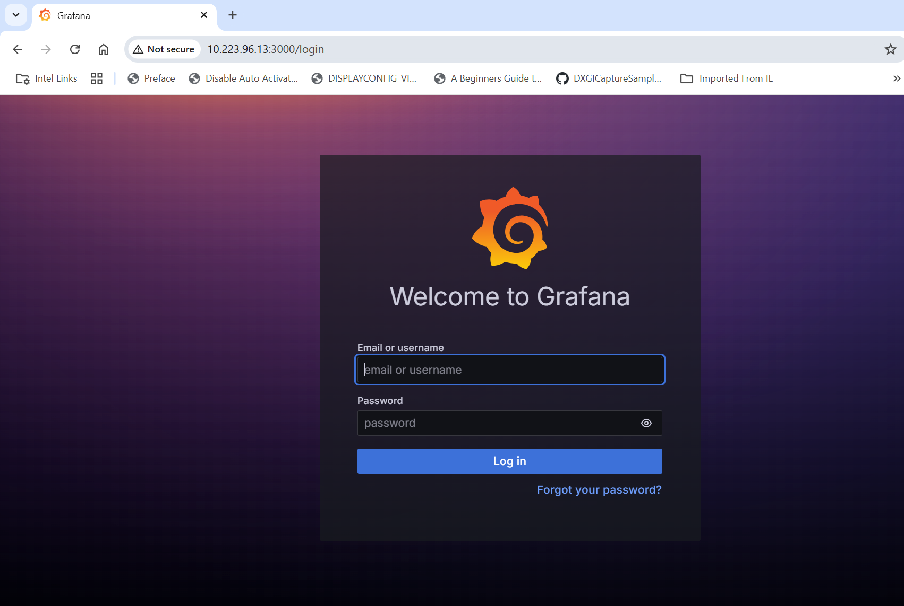
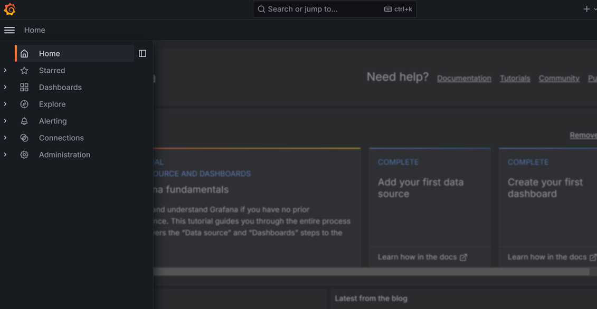
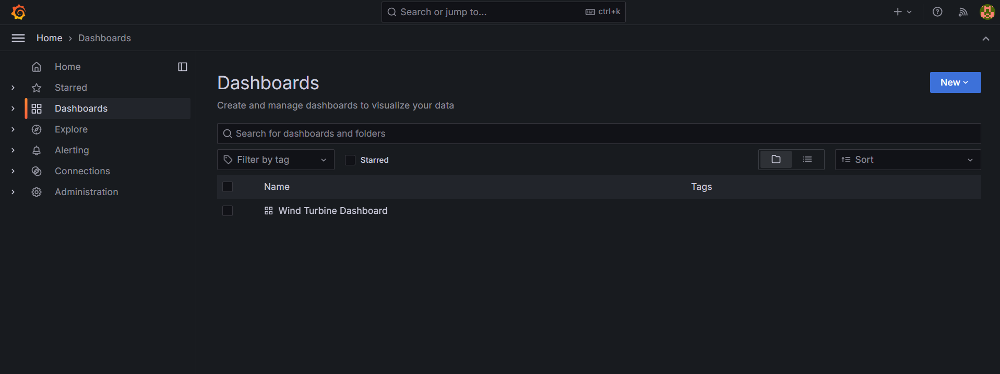
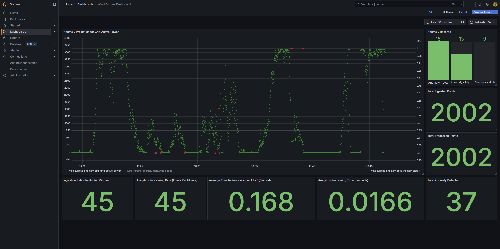

# Get Started

-   **Time to Complete:** 30 minutes
-   **Programming Language:**  Python 3


## Configure Docker

To configure Docker:

1. **Run Docker as Non-Root**: Follow the steps in [Manage Docker as a non-root user](https://docs.docker.com/engine/install/linux-postinstall/#manage-docker-as-a-non-root-user).
2. **Configure Proxy (if required)**:
   - Set up proxy settings for Docker client and containers as described in [Docker Proxy Configuration](https://docs.docker.com/network/proxy/).
   - Example `~/.docker/config.json`:
     ```json
     {
       "proxies": {
         "default": {
           "httpProxy": "http://<proxy_server>:<proxy_port>",
           "httpsProxy": "http://<proxy_server>:<proxy_port>",
           "noProxy": "127.0.0.1,localhost"
         }
       }
     }
     ```
   - Configure the Docker daemon proxy as per [Systemd Unit File](https://docs.docker.com/engine/daemon/proxy/#systemd-unit-file).
3. **Enable Log Rotation**:
   - Add the following configuration to `/etc/docker/daemon.json`:
     ```json
     {
       "log-driver": "json-file",
       "log-opts": {
         "max-size": "10m",
         "max-file": "5"
       }
     }
     ```
   - Reload and restart Docker:
     ```bash
     sudo systemctl daemon-reload
     sudo systemctl restart docker
     ```
## Data flow explanation

The data flow remains same as that explained in the [Overview.md](./Overview.md).
Let's specifically talk about the wind turbine anomaly detection use case here by ingesting the data using the
OPC-UA simulator and publishing the anomaly alerts to MQTT broker.

### **Data Sources**

Using the `edge-ai-suites/manufacturing-ai-suite/wind-turbine-anomaly-detection/simulator/simulation_data/windturbine_data.csv` which is a normalized version of open source data wind turbine dataset (`edge-ai-suites/manufacturing-ai-suite/wind-turbine-anomaly-detection/training/T1.csv`) from <https://www.kaggle.com/datasets/berkerisen/wind-turbine-scada-dataset>.
This data is being ingested into **Telegraf** using the **OPC-UA** protocol using the **OPC-UA** data simulator.
  
### **Data Ingestion**

**Telegraf** through its input plugins (**OPC-UA** OR **MQTT**) gathers the data and sends this input data to both **InfluxDB** and **Time Series Analytics Microservice**.

### **Data Storage**

**InfluxDB** stores the incoming data coming from **Telegraf**.

### **Data Processing**

**Time Series Analytics Microservice** uses the User Defined Function(UDF) deployment package(TICK Scripts, UDFs, Models) which is already built-in to the container image. The UDF deployment package is available
at `edge-ai-suites/manufacturing-ai-suite/wind-turbine-anomaly-detection/time_series_analytics_microservice`. Directory details is as below:
  
#### **`config.json`**:

The `task` section defines the settings for the Kapacitor task and User-Defined Functions (UDFs).

| Key                     | Description                                                                                     | Example Value                          |
|-------------------------|-------------------------------------------------------------------------------------------------|----------------------------------------|
| `model_registry` | Configuration for the Model Registry microservice.       | See below for details.                      |
| `udfs`                  | Configuration for the User-Defined Functions (UDFs).                                           | See below for details.                 |

**Model Registry Configuration**:

| Key                     | Description                                                                                     | Example Value                          |
|-------------------------|-------------------------------------------------------------------------------------------------|----------------------------------------|
| `enable` | Boolean flag to enable fetching UDFs and models from the Model Registry microservice.       | `true` or `false`                      |
| `version`               | Specifies the version of the task or model to use.                                             | `"1.0"`                                |

**UDFs Configuration**:

The `udfs` section specifies the details of the UDFs used in the task.

| Key     | Description                                                                 | Example Value                          |
|---------|-----------------------------------------------------------------------------|----------------------------------------|
| `name`  | The name of the UDF script.                                                 | `"windturbine_anomaly_detector"`       |
| `models`| The name of the model file used by the UDF.                                 | `"windturbine_anomaly_detector.pkl"`   |

---

**Alerts Configuration**:

The `alerts` section defines the settings for alerting mechanisms, such as MQTT protocol.
For OPC-UA configuration, please refer [Publishing OPC-UA alerts](./how-to-configure-alerts.md#publishing-opc-ua-alerts).
Please note to enable only one of the MQTT or OPC-UA alerts.

**MQTT Configuration**:

The `mqtt` section specifies the MQTT broker details for sending alerts.

| Key                 | Description                                                                 | Example Value          |
|---------------------|-----------------------------------------------------------------------------|------------------------|
| `mqtt_broker_host`  | The hostname or IP address of the MQTT broker.                              | `"ia-mqtt-broker"`     |
| `mqtt_broker_port`  | The port number of the MQTT broker.                                         | `1883`                |
| `name`              | The name of the MQTT broker configuration.                                 | `"my_mqtt_broker"`     |


#### **`config/`**:
   - `kapacitor_devmode.conf` would be updated as per the `config.json` at runtime for usage.

#### **`udfs/`**:
   - Contains the python script to process the incoming data.
     Uses Random Forest Regressor and Linear Regression machine learning algos accelerated with Intel® Extension for Scikit-learn*
     to run on CPU to detect the anomalous power generation data points relative to wind speed.

#### **`tick_scripts/`**:
   - The TICKScript `windturbine_anomaly_detector.tick` determines processing of the input data coming in.
     Mainly, has the details on execution of the UDF file, storage of processed data and publishing of alerts. 
     By default, it is configured to publish the alerts to **MQTT**.
   
#### **`models/`**:
   - The `windturbine_anomaly_detector.pkl` is a model built using the RandomForestRegressor Algo.
     More details on how it is built is accessible at `edge-ai-suites/manufacturing-ai-suite/wind-turbine-anomaly-detection/training/windturbine/README.md`

## Clone source code

```bash
git clone https://github.com/open-edge-platform/edge-ai-suites.git
cd edge-ai-suites/manufacturing-ai-suite/wind-turbine-anomaly-detection
```

## Deploy with Docker Compose

1. Update the following fields in `.env`:
   - `INFLUXDB_USERNAME`
   - `INFLUXDB_PASSWORD`
   - `VISUALIZER_GRAFANA_USER`
   - `VISUALIZER_GRAFANA_PASSWORD`
   - `MR_PSQL_PASSWORD`
   - `MR_MINIO_ACCESS_KEY`
   - `MR_MINIO_SECRET_KEY`

2. Deploy the sample app, use only one of the following options:

> **NOTE**:
>  - The below `make up_opcua_ingestion` or `make up_mqtt_ingestion` fails if the above required fields are not populated
>    as per the rules called out in `.env` file.
>  - The sample app is deployed by pulling the pre-built container images of the sample app 
>    from the docker hub OR from the internal container registry (login to the docker registry from cli and configure `DOCKER_REGISTRY`
>    env variable in `.env` file at `edge-ai-suites/manufacturing-ai-suite/wind-turbine-anomaly-detection`)
>  - The `CONTINUOUS_SIMULATOR_INGESTION` variable in the `.env` file (for Docker Compose) and in `helm/values.yaml` (for Helm deployments) 
>    is set to `true` by default, enabling continuous looping of simulator data. To ingest the simulator data only once (without looping), 
>    set this variable to `false`.
>  - If `CONTINUOUS_SIMULATOR_INGESTION` is set to `false`, you may see the `[inputs.opcua] status not OK for node` message in the `telegraf` 
>    logs for OPC-UA ingestion after a single data ingestion loop. This message can be ignored.

   - **Using OPC-UA ingestion**:
     ```bash
     make up_opcua_ingestion
     ```
   - **Using MQTT ingestion**:
     ```bash
     make up_mqtt_ingestion
     ```
   
Use the following command to verify that all containers are active and error-free.

> **Note:** The command `make status` may show errors in containers like ia-grafana when user have not logged in
> for the first login OR due to session timeout. Just login again in Grafana and functionality wise if things are working, then
> ignore `user token not found` errors along with other minor errors which may show up in Grafana logs.


```sh
make status
```

## Verify the Wind Turbine Anomaly Detection Results

1. Get into the InfluxDB* container:

   > **Note**: Use `kubectl exec -it <influxdb-pod-name> -n <namespace> -- /bin/bash` for the helm deployment
   > where for <namespace> replace with namespace name where the application was deployed and
   > for <influxdb-pod-name> replace with InfluxDB pod name.

   ``` bash
    docker exec -it ia-influxdb bash
   ```

2. Run following commands to see the data in InfluxDB*:

    > **NOTE**:
    > Please ignore the error message `There was an error writing history file: open /.influx_history: read-only file system` happening in the InfluxDB shell.
    > This does not affect any functionality while working with the InfluxDB commands

    ``` bash
    # For below command, the INFLUXDB_USERNAME and INFLUXDB_PASSWORD needs to be fetched from `.env` file
    # for docker compose deployment and `values.yml` for helm deployment
    influx -username <username> -password <passwd> 
    use datain # database access
    show measurements
    # Run below query to check and output measurement processed
    # by Time Series Analytics microservice
    select * from wind_turbine_anomaly_data
    ```

2. To check the output in Grafana:

    - Use link `http://<host_ip>:3000` to launch Grafana from browser (preferably, chrome browser)
      
      > **Note**: Use link `http://<host_ip>:30001` to launch Grafana from browser (preferably, chrome browser) for the helm deployment
    
    - Login to the Grafana with values set for `VISUALIZER_GRAFANA_USER` and `VISUALIZER_GRAFANA_PASSWORD`
      in `.env` file and select **Wind Turbine Dashboard**.

      

    - After login, click on Dashboard 
      

    - Select the `Wind Turbine Dashboard`.
      

    - One will see the below output.
  
      

## Bring down the sample app

  ```sh
  make down
  ```

## Check logs - troubleshooting

- Check container logs to catch any failures:

  ```bash
  docker ps
  docker logs -f <container_name>
  docker logs -f <container_name> | grep -i error
  ```

## Other Deployment options

- [How to Deploy with Helm](./how-to-deploy-with-helm.md): Guide for deploying the sample application on a k8s cluster using Helm.
- [How to Deploy with Edge Orchestrator](./how-to-deploy-with-edge-orchestrator.md): Guide for deploying the sample application using Edge Manageability Framework

## Advanced setup

- [How to build from source and deploy](./how-to-build-from-source.md): Guide to build from source and docker compose deployment
- [How to configure OPC-UA/MQTT alerts](./how-to-configure-alerts.md): Guide for configuring the OPC-UA/MQTT alerts in the Time Series Analytics microservice
- [How to configure custom UDF deployment package](./how-to-configure-custom-udf.md): Guide for deploying a customized UDF deployment package (udfs/models/tick scripts)
