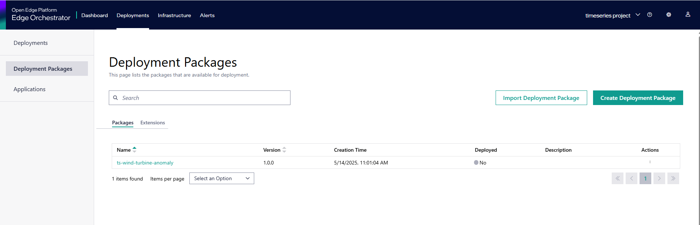

# How to Deploy with the Edge Orchestrator

Edge Orchestrator, part of Intel’s Edge Software, simplifies edge application deployment and management, making it easier to deploy edge solutions at scale. Edge Orchestrator provides:

* **Secure Infrastructure Management**: Offers secure and efficient remote onboarding and management of your edge node fleet across sites and geographies. Zero-trust security configuration reduces the time required to secure your edge applications.

* **Deployment Orchestration and Automation**: Lets you roll out and update applications and configure infrastructure nodes across your network from a single pane of glass. Edge Orchestrator provides automated cluster orchestration and dynamic application deployment.

* **Automated Deployment**: Automates the remote installation and updating of applications at scale.

* **Deep Telemetry**: Gives you policy-based life cycle management and centralized visibility into your distributed edge infrastructure and deployments.

* **Flexible Configuration**: From organizing your physical infrastructure to managing the permutations of executing applications in a variety of runtime environments, Edge Orchestrator gives you the flexibility to define the policies, criteria, and hierarchies that make the most sense for your specific business needs.

To deploy the **Wind Turbine Anomaly Detection** Sample Application with the Edge Orchestrator, follow the steps described in this document.

## Procedure to Deploy with Edge Orchestrator

### Prerequisites

1. Access to the web interface of the Edge Orchestrator with one or more [Edge Nodes Onboarded](<https://docs.openedgeplatform.intel.com/edge-manage-docs/main/user_guide/set_up_edge_infra/edge_node_onboard.html>) to the Edge Orchestrator.

1. Clusters with a [privilege template](<https://docs.openedgeplatform.intel.com/edge-manage-docs/main/user_guide/additional_howtos/set_up_a_cluster_template.html>) have been created on the needed Edge Nodes following the procedures described in [Create Cluster](<https://docs.openedgeplatform.intel.com/edge-manage-docs/main/user_guide/set_up_edge_infra/create_clusters.html#create-cluster>).

### Making the Deployment Package Available

1. Download Deployment Package present in the folder **`edge-ai-suites/manufacturing-ai-suite/wind-turbine-anomaly-detection/deployment-package`**

1. Update the below fields in `timeseries-wind-turbine-values.yaml` in the above deployment package folder

    ```sh
    INFLUXDB_USERNAME:
    INFLUXDB_PASSWORD:
    VISUALIZER_GRAFANA_USER:
    VISUALIZER_GRAFANA_PASSWORD:
    POSTGRES_PASSWORD:
    MINIO_ACCESS_KEY:  
    MINIO_SECRET_KEY: 
    http_proxy: # example: http_proxy: http://proxy.example.com:891
    https_proxy: # example: http_proxy: http://proxy.example.com:891
    ```

1. From the web browser, open the URL of the Edge Orchestrator and import the updated Deployment Package following the steps described in [Import Deployment Package](<https://docs.openedgeplatform.intel.com/edge-manage-docs/main/user_guide/package_software/import_deployment.html#import-deployment-package>).

1. Once the deployment package has been imported into the Edge Orchestrator, you can see it in the list of Web UI as shown here.

****

See [Deployment Packages](<https://docs.openedgeplatform.intel.com/edge-manage-docs/main/user_guide/package_software/deploy_packages.html#view-deployment-packages>) for more information on deployment packages.

### Deploy the Application onto the Edge Nodes

To set up a deployment:

1. Click the **Deployments** tab on the top menu to view the Deployments page. On the Deployments page, you can view the list of deployments that have been created. The status indicator shows a quick view of the status of the deployment, which depends on many factors.

1. Select the **Deployments** tab and click the **Setup a Deployment** button. The Setup a Deployment page appears.

1. On the Setup a Deployment page, select the **ts-wind-turbine-anomaly** package for the deployment from the list, and click **Next**. The Select a Profile step appears.

1. In the Select a Profile step, select the deployment profile, and click **Next**. The Override Profile Values page appears.

1. The Override Profile Values page shows the deployment profile values that are available for overriding. Provide the user credentials for Grafana logging in overriding values, then click **Next** to proceed to the Select Deployment Type step.

1. On the Select Deployment Type page, select the type of deployment, and click **Next**:

    1. If you select **Automatic** as the deployment type, enter the deployment name and metadata in key-value format to select the target cluster.

    1. If you select **Manual** as the deployment type, enter the deployment name and select the clusters from the list of clusters.

1. Click **Next** to view the Review page.

1. Verify if the deployment details are correct and click **Deploy**.

After a few minutes, the deployment will start and will take about 5 minutes to complete.

In the Edge Orchestrator Web UI, you can track the application installation through the [View Deployment Details](<https://docs.openedgeplatform.intel.com/edge-manage-docs/main/user_guide/package_software/deployment_details.html#view-deployment-details>) view.

The **Wind Turbine Anomaly Detection** Sample Application is fully deployed when the applications become green and the status is shown as _Running_.

You can view the deployment status on the Deployments page.

> Note: If the deployment fails for any reason, the deployment status will display the “Error” or “Down” status.

For more information on setting up a deployment, see [Set up a Deployment](<https://docs.openedgeplatform.intel.com/edge-manage-docs/main/user_guide/package_software/setup_deploy.html#set-up-a-deployment>).


### Access the **Wind Turbine Anomaly Detection** Sample Application

1. Copy `Kubeconfig` to `$HOME` path and export it on your device

    ```bash
    export KUBECONFIG=~/kubeconfig.yaml
    ```

1. Copy the udf deployment, please refer [here](how-to-deploy-with-helm.md#copy-the-windturbine_anomaly_detection-udf-package-for-helm-deployment-to-time-series-analytics-microservice)

1. Download the kubeconfig of the cluster of the Edge Node on which the Application has been deployed. Refer [Kubeconfig Download](<https://docs.openedgeplatform.intel.com/edge-manage-docs/main/user_guide/set_up_edge_infra/accessing_clusters.html#organize-cluster-access-with-a-kubeconfig-file>).

1. Follow the below steps for accessing `Grafana Dashboard` in the **Wind Turbine Anomaly Detection** sample application.

    1. Get the `internal-ip` of edge node to access the node using the below command 

        ```bash
            kubectl get node -o wide
        ``` 
    1. To check the results in the Grafana dashboard at port 30001, please follow instructions for helm     
       deployment at [link](get-started.md#verify-the-wind-turbine-anomaly-detection-results)