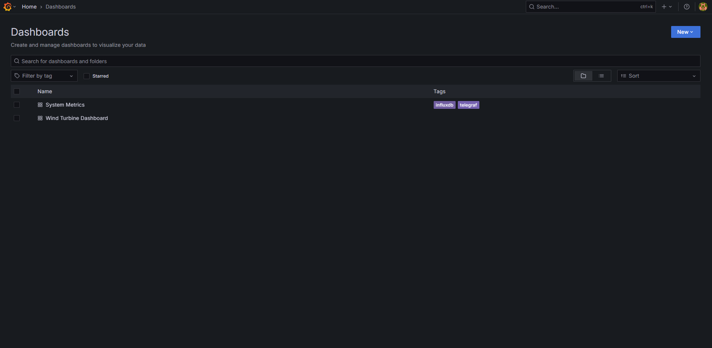
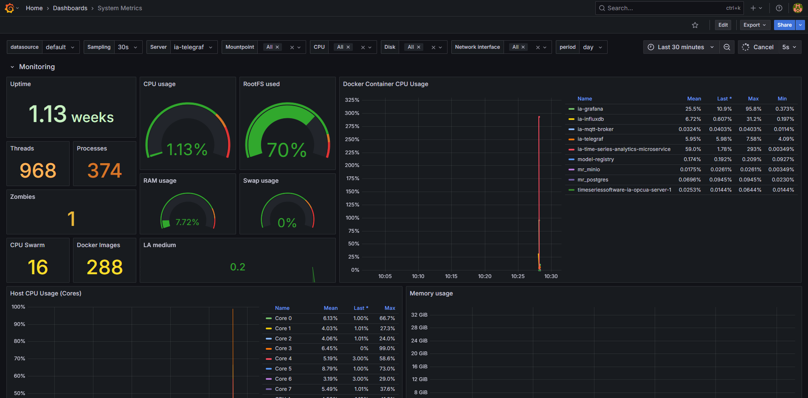

# Enable System Metrics Dashboard

> **Note**: The system metrics dashboard is only supported with docker compose deployments and requires `Telegraf` to run as the `root` user.

Please follow [prerequisites](./get-started.md#prerequisites) and understand [data flow explanation](./get-started.md#data-flow-explanation) as
a prerequisite.

To enable the system metrics dashboard showcasing the host and docker containers CPU, memory, network, disk IO usage, run the following command:

```bash
cd edge-ai-suites/manufacturing-ai-suite/wind-turbine-anomaly-detection/ # path relative to git clone folder
# Try one of the below options:
make up_opcua_ingestion INCLUDE=validation
# OR
make up_mqtt_ingestion INCLUDE=validation
```

##  Viewing System Metrics Dashboard

- Use link `http://<host_ip>:3000` to launch Grafana from browser (preferably, chrome browser)

- Login to the Grafana with values set for `VISUALIZER_GRAFANA_USER` and `VISUALIZER_GRAFANA_PASSWORD`
    in `.env` file and select **System Metrics Dashboard**.

    

- After login, click on Dashboard 

    

- Select the `System Metrics Dashboard`.

    

- One will see the below output.

    