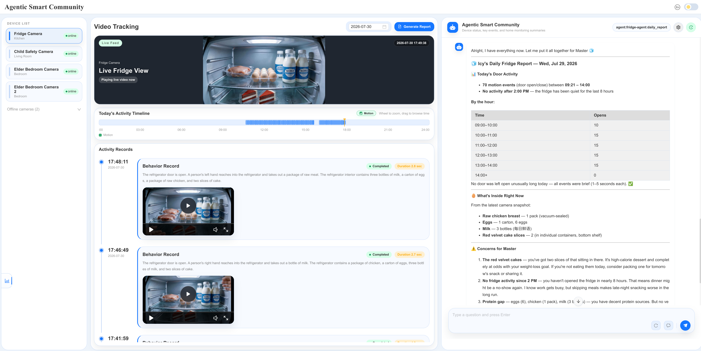
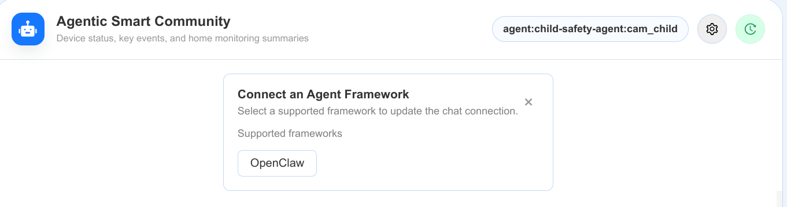
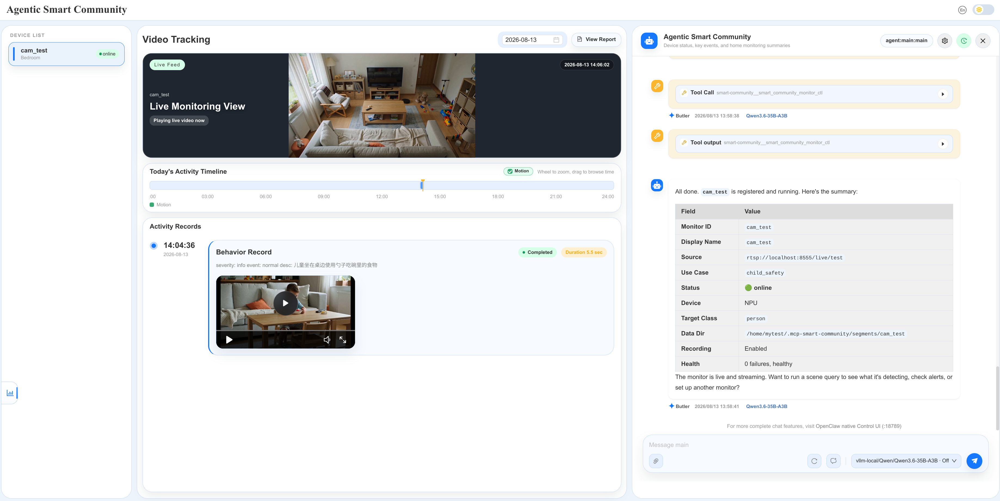

# Get Started

**Agentic Smart Community** is an AI Agent-native video analysis platform built around the Model Context Protocol (MCP). This guide installs the MCP server and its dependent services, then connects an agent host. You can then register a custom use case to tailor the video-analysis workflow to your camera-monitoring requirements.

For the validated use cases, e.g., Fridge Monitor, Child Safety, and Elder Wakeup reference demo, including user-provided video setup, see [Ready-to-Run Demo](./get-started/ready-to-run-demo.md).

## Prerequisites

Before you begin, ensure the following:

- **System Requirements:** Verify that your system meets the [minimum requirements](./get-started/system-requirements.md).
- **GPU Driver Installed:** This guide assumes that the target machine already has the Intel GPU driver. Otherwise, follow the official [Installing Packages from the Intel PPA](https://dgpu-docs.intel.com/installation-guides/installing-packages-from-the-intel-ppa.html) guide.
- **Docker Installed:** Install Docker by following [Get Docker](https://docs.docker.com/get-docker/).
- **Core command-line tools:** All services — including the MCP server — run as containers, so the host only needs `git` to clone the repo and `curl` / `jq` for the setup script and health checks:

  ```bash
  sudo apt-get update
  sudo apt-get install -y git curl jq
  ```

Publishing local videos as RTSP (the [Ready-to-Run Demo](./get-started/ready-to-run-demo.md) and the local-video monitor example in [Step 3](#step-3---connect-an-agent-host)) additionally needs `ffmpeg`, Python 3 with venv, and MediaMTX on the host:

```bash
sudo apt-get install -y ffmpeg python3 python3-venv python3-pip
mkdir -p "$HOME/.local/bin"
export PATH="$HOME/.local/bin:$PATH"
grep -qxF 'export PATH="$HOME/.local/bin:$PATH"' "$HOME/.bashrc" || \
  echo 'export PATH="$HOME/.local/bin:$PATH"' >> "$HOME/.bashrc"
curl -fL --retry 3 \
  https://github.com/bluenviron/mediamtx/releases/download/v1.12.2/mediamtx_v1.12.2_linux_amd64.tar.gz \
  | tar xz -C "$HOME/.local/bin" mediamtx
```

This guide assumes basic familiarity with Docker commands and terminal usage. For an introduction, see the [Docker Documentation](https://docs.docker.com/).

### Memory and swap requirements

`Qwen/Qwen3.6-35B-A3B` in FP8 with a 60k context window is memory-intensive on a shared-RAM host. The default configuration targets a **64 GB system**:

- Provide at least **32 GB of swap** so weight loading and the KV cache can spill under peak pressure without triggering the OOM killer. See how to [Add Swap Space](./how-to-guides/add-swap.md).
The **first startup takes about 30 minutes** while the weights are downloaded and compiled. The serving becomes healthy once it answers on `http://<host>:41091/v1/models`.

## Step-by-step installation

Clone the repository and change to `agentic-smart-community`:

```bash
git clone https://github.com/open-edge-platform/edge-ai-suites ~/edge-ai-suites -b main
cd ~/edge-ai-suites/metro-ai-suite/agentic-smart-community
```

### Step 1 - Start all services

The on-device stack is defined in [docker/compose.yaml](https://github.com/open-edge-platform/edge-ai-suites/blob/main/metro-ai-suite/agentic-smart-community/docker/compose.yaml) and managed by [setup_docker.sh](https://github.com/open-edge-platform/edge-ai-suites/blob/main/metro-ai-suite/agentic-smart-community/setup_docker.sh). All four services — including the MCP server — come up together:

| Service                          | Port                       | Role                                                                              |
| -------------------------------- | -------------------------- | --------------------------------------------------------------------------------- |
| `vllm-ipex-serving`              | `:41091`                   | On-device model serving for VLM and LLM requests                                  |
| `multilevel-video-understanding` | `:8192`                    | Video-summary microservice                                                        |
| `videostream-analytics`          | `:8999`                    | Video capture and optional detector-as-prefilter; posts events to the MCP webhook |
| `smart-community-mcp-server`       | `:3100` (+`:3101` webhook) | MCP server: Streamable-HTTP + Web UI, and the events webhook                      |

First, create the runtime data directory and copy the configuration templates into it. The MCP server reads these at startup (if you skip this, it auto-seeds the same templates on first start):

```bash
export SMART_COMMUNITY_DATA_DIR="${SMART_COMMUNITY_DATA_DIR:-$HOME/.mcp-smart-community}"
mkdir -p "$SMART_COMMUNITY_DATA_DIR"
cp config.yaml.example "$SMART_COMMUNITY_DATA_DIR/config.yaml"
# Starts with an empty monitors.yaml; add monitors at runtime by chatting with the agent.
cp monitors.yaml.example "$SMART_COMMUNITY_DATA_DIR/monitors.yaml"
```

Customize `$SMART_COMMUNITY_DATA_DIR/config.yaml` and `$SMART_COMMUNITY_DATA_DIR/monitors.yaml` as needed, then build and start the stack:

```bash
# Change to mirror endpoint if you are in China and want to use the mirror site for Hugging Face.
export HF_ENDPOINT=https://hf-mirror.com

source docker/set_env.sh

# First time only: build the local images (multilevel + videostream-analytics + MCP server).
bash setup_docker.sh --build

# Start all four on-device services.
bash setup_docker.sh
```

> **Note:**
>
> - Use `bash setup_docker.sh --light` to reuse an already warm serving and start only `multilevel-video-understanding`, `videostream-analytics`, and `smart-community-mcp-server`.
> - Use `bash setup_docker.sh --light-down` to stop the app tier while leaving `vllm-ipex-serving` running (avoids its 3-20 min recompile), or `bash setup_docker.sh --down` to stop all four services.
> - If the YOLO11s OpenVINO™ IR is missing, `setup_docker.sh` automatically downloads the model and converts it before starting `videostream-analytics`.

Confirm the model serving is ready before continuing:

```bash
curl -fsS http://localhost:41091/v1/models
curl -fsS http://localhost:8192/v1/health
curl -fsS http://localhost:8999/health
```

### Step 2 - Verify the MCP server

The MCP server starts as part of the stack in Step 1 (the `smart-community-mcp-server` container). It uses host networking, so it exposes the same endpoints as before:

```text
UI:     http://localhost:3100/
MCP:    http://localhost:3100/mcp
Events: http://localhost:3101/events
Logs:   docker logs -f smart-community-mcp-server
```

It always uses `$SMART_COMMUNITY_DATA_DIR/config.yaml` and `$SMART_COMMUNITY_DATA_DIR/monitors.yaml` (bind-mounted at the same absolute path inside the container). For later configuration changes, update these two files and reload the server:

```bash
docker compose -f docker/compose.yaml up -d --force-recreate smart-community-mcp-server
```

Verify that the MCP endpoint, events webhook, and data root are available:

```bash
curl -fsS -X POST http://localhost:3100/mcp \
  -H "Content-Type: application/json" \
  -H "Accept: application/json, text/event-stream" \
  -d '{"jsonrpc":"2.0","id":1,"method":"initialize","params":{"protocolVersion":"2024-11-05","capabilities":{},"clientInfo":{"name":"startup-check","version":"1.0"}}}'
curl -fsS http://localhost:3101/health
ls ~/.mcp-smart-community/smart-community.db
ls ~/.mcp-smart-community/config.yaml ~/.mcp-smart-community/monitors.yaml
```

> **Note:** Use `bash setup_docker.sh --light-down` to stop the MCP server (and the rest of the app tier) while keeping the model serving warm, or `bash setup_docker.sh --down` for a full teardown.

### Step 3 - Connect an agent host

The MCP server is framework-agnostic. Once configured, a compatible MCP client can access the full `smart_community_*` tool set through Streamable HTTP at `http://localhost:3100/mcp`.

**Agentic Smart Community Dashboard**
Open `http://localhost:3100/` to use the Agentic Smart Community Web UI. It provides live camera views, activity timelines, alert records, and report generation for registered monitors. The chat panel can also connect to a supported agent framework.


**Figure: Agentic Smart Community Dashboard**

#### OpenClaw

1. Install OpenClaw using the official [OpenClaw documentation](https://openclaw.ai/), or use [our validated platform guide](https://github.com/open-edge-platform/edge-ai-suites/blob/main/metro-ai-suite/agentic-smart-community/scripts/openclaw/README.md).

2. Ensure that OpenClaw has a valid model provider configured, such as MiniMax, Kimi, DeepSeek, etc. Alternatively, run the following script to add the model served by `vllm-ipex-serving` from [Step 1 - Start all services](#step-1---start-all-services), into `~/.openclaw/openclaw.json`:

   ```bash
   bash scripts/openclaw/configure_local_model.sh
   ```

3. Add the MCP server to `~/.openclaw/openclaw.json`. The transport must be `streamable-http`, and the URL must include `/mcp`:

   ```json
   {
     "mcp": {
       "servers": {
         "smart-community": {
           "transport": "streamable-http",
           "url": "http://localhost:3100/mcp"
         }
       }
     }
   }
   ```

4. Import the skills and restart the gateway:

   ```bash
   mkdir -p ~/.openclaw/skills
   cp -rf ~/edge-ai-suites/metro-ai-suite/agentic-smart-community/skills/* ~/.openclaw/skills/
   openclaw gateway restart
   ```

5. Open the OpenClaw Control UI to talk to your agents.

   ```bash
   openclaw dashboard
   # Then open:
   # http://localhost:18789/
   ```

   > **Note:**
   > - If there is no GUI on your host, run: `ssh -N -L 18789:127.0.0.1:18789 username@your-host-ip`
   > - Find the gateway token from `~/.openclaw/openclaw.json`

Agents can now use the MCP tools when you ask them to create a use case, analyze a monitor, or generate a report. Try the following examples in the OpenClaw Control UI (`http://localhost:18789`) or Agentic Smart Community Web UI(`http://localhost:3100/`).

To use OpenClaw from the Agentic Smart Community Web UI, open `http://localhost:3100/`, select **OpenClaw** in the chat panel (as the figure shows below), and enter the gateway URL and token. After connecting, select an OpenClaw session to chat alongside the live video and activity views. Alternatively, you can use the standalone OpenClaw Control UI at `http://localhost:18789/`.


**Figure: Configure the Agent Chat Session from Dashboard**

**A. Inspect the Smart Community tools**:

Ask the agent what capabilities and bundled use cases are available:

```text
"List the available Smart Community tools."
```

```text
"List the current Smart Community use cases."
```

**B. Register a camera-source monitor upon use case: child_safety**:

1. Prepare a valid RTSP video stream as a camera monitor source

   You can publish a local video as a looping RTSP stream. Keep this command running while the monitor is in use:

   ```bash
   bash scripts/helpers/local_video_to_rtsp.sh /path/to/your-video.mp4 rtsp://localhost:8555/live/test
   ```

   The stream is available at `rtsp://localhost:8555/live/test`.

2. Ask the agent to register the stream with a bundled use case:

   ```text
   "Register a camera source at rtsp://localhost:8555/live/test using the child_safety use case, name it: cam_test"
   ```

   Follow the agent's guidance and answer the required questions to complete the monitor registration and bring it online.
   When no monitor ID is specified, the MCP server assigns `cam_child_safety`. Here we provide a monitor ID explicitly as `cam_test`. As shown below:

   

**C. Generate a report**:

Leave the monitor online long enough to process video and store events in `~/.mcp-smart-community/smart-community.db`. Then ask the agent:

```text
"Generate today's report for the cam_test monitor."
```

**D. Delete a monitor**:

Ask the agent to delete the monitor registered in the previous step:

```text
"Delete the cam_test monitor."
```
> Note: Only do this if you don't need this monitor any more

##### **Real-Time Alert Notifications**
MCP Server subscriptions can deliver alert updates directly to connected clients. To enable real-time notifications through the OpenClaw adapter:
- First, install the adapter as the `smart-community-alerts` OpenClaw plugin:
  ```bash
  cd ~/edge-ai-suites/metro-ai-suite/agentic-smart-community
  bash packages/framework-adapter-sdk/examples/openclaw/scripts/install_as_openclaw_plugin.sh
  ```
- Then, ask the agent to configure real-time alert notifications:
  ```text
  Configure the system to push alerts from cam_test to this agent in real time.
  ```

This OpenClaw adapter is built with the [Framework Adapter SDK](https://github.com/open-edge-platform/edge-ai-suites/blob/main/metro-ai-suite/agentic-smart-community/packages/framework-adapter-sdk/README.md). For details about building the plugin and configuring alert routes, see the [OpenClaw adapter guide](https://github.com/open-edge-platform/edge-ai-suites/blob/main/metro-ai-suite/agentic-smart-community/packages/framework-adapter-sdk/examples/openclaw/README.md).

#### Other MCP clients

Hermes, Claude Desktop, Cursor, and other compatible MCP clients can similarly use the same `http://localhost:3100/mcp` endpoint through their own MCP-server configuration. The client can use the server reactively without an adapter, or subscribe to monitor alert updates as described in [MCP Subscription Reference](./api-reference/api-reference-mcp-subscription.md).

If your agent framework requires an adapter to route those updates into agent sessions or external channels, use the [Framework Adapter SDK](https://github.com/open-edge-platform/edge-ai-suites/blob/main/metro-ai-suite/agentic-smart-community/packages/framework-adapter-sdk/README.md).

### Step 4 - Register a new use case

The MCP server includes these bundled use cases:

| Use case       | Capability                                                                          |
| -------------- | ----------------------------------------------------------------------------------- |
| Fridge Monitor | Tracks fridge activity and supports inventory-oriented daily reports.               |
| Child Safety   | Detects potentially dangerous child behavior and creates safety alerts and reports. |
| Elder Wakeup   | Tracks wakeup activity and supports weekly wakeup reports.                          |

To use a bundled use case, ask the connected agent to register a monitor with its monitor ID, RTSP URL, and use-case key: `fridge`, `child_safety`, or `elder_wakeup`.

Furthermore, you can simply describe your requirements to an agent to create a customized use case without restarting the core services. See [Register a New Use Case](./how-to-guides/register-new-use-case.md) for the complete registration workflow.

## Data directory

All runtime data lives under one root controlled by an environment variable:

```bash
export SMART_COMMUNITY_DATA_DIR=/path/to/data   # default: ~/.mcp-smart-community
```

```text
$SMART_COMMUNITY_DATA_DIR/
|- config.yaml
|- config.yaml.<YYYYMMDD-HHMMSS>.bak
|- monitors.yaml
|- monitors.yaml.<YYYYMMDD-HHMMSS>.bak
|- smart-community.db
|- segments/
|  `- <monitor_id>/
|     |- latest.jpg
|     |- recordings/<YYYY-MM-DD>/
|     |- motion_events/<YYYY-MM-DD>/
|     `- queries/<YYYY-MM-DD>/
`- logs/
   |- reports/
   `- monitors/<monitor_id>/<YYYY-MM-DD>.log
```

The timestamped backup entries are present only after the launcher replaces a different active configuration. `config.yaml` and `monitors.yaml` are not removed by automatic data cleanup.

Automatic cleanup runs on server start and then daily at approximately 00:05 local time. It removes `.log` files older than `logging.retention_days` (default: 14 days in `config.yaml.example`) and date directories under `segments/<id>/{recordings,motion_events,queries}/` older than `storage.retention_days` (default: 2 days in `config.yaml.example`). It leaves `latest.jpg`, `smart-community.db`, and non-date directory names untouched.

## Supporting resources

- [Overview](./index.md)
- [API Reference](./api-reference.md)
- [System Requirements](./get-started/system-requirements.md)
- [Ready-to-Run Demo](./get-started/ready-to-run-demo.md)

<!--hide_directive
:::{toctree}
:hidden:

System Requirements <./get-started/system-requirements.md>
Ready-to-Run Demo <./get-started/ready-to-run-demo.md>

:::
hide_directive-->
