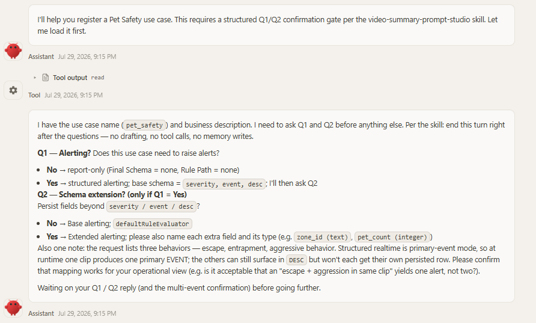
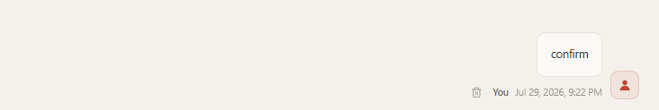
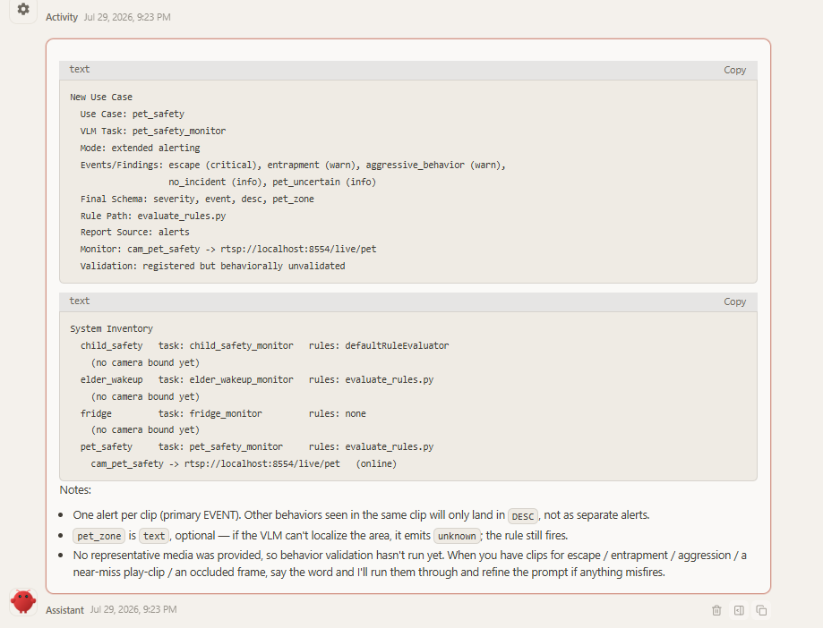
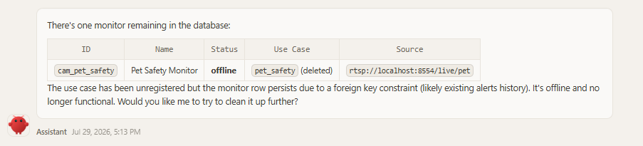
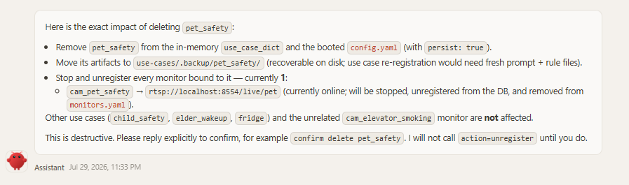
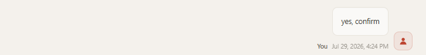
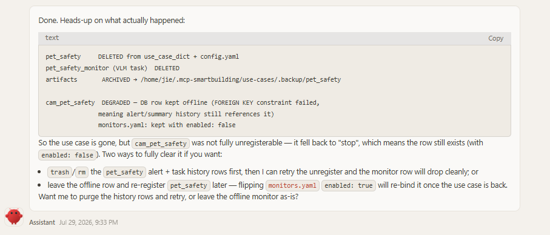

# Register a New Use Case

A *use case* tells the platform what to watch for in a video stream — for example, whether a pet is trying to escape its area, or whether workers on a construction site are wearing safety helmets. This guide shows how to create one **by conversation**: you describe what you need in a chat with a connected agent (for example, OpenClaw), and the [`smartbuilding-use-case-manager`](https://github.com/open-edge-platform/edge-ai-suites/blob/main/metro-ai-suite/agentic-smart-community/skills/smartbuilding-use-case-manager/SKILL.md) skill turns your description into a registered, running use case — no code, no restart.

By the end of this guide you will know how to:

- register a new use case through a conversation, step by step with screenshots;
- verify the detection results stored in the database;
- write a use-case description that produces accurate detection;
- delete a use case, again by conversation.

**Prerequisites:** an agent host is connected (see [Connect an agent host (zero-code)](../get-started.md#step-3---connect-an-agent-host)) and the skills are imported (OpenClaw [Step 3](../get-started.md#openclaw)).

> **Tip — use a capable cloud model for registration.** Registering a use case is the most model-demanding flow on the platform: the agent must infer events and schema, draft a four-section VLM prompt, and pass the server-side consistency gate. We recommend switching the agent to a strong cloud model for this conversation — e.g. in OpenClaw, pick a MiniMax model from the model selector — rather than a small local model. This only affects the **authoring** step; once the use case is registered, day-to-day detection runs on the on-device VLM/LLM stack (for example a local Qwen model), independent of which model the agent used to register it.

## How it works

Registering a use case is a short conversation with the agent, with **two mandatory confirmation gates** — the agent pauses and waits for your explicit reply at each one:

1. **Describe the use case in chat.** Give the agent a name (lowercase snake_case) and a short natural-language description of what to watch for. The RTSP stream is optional at this point — you can include it in the description, e.g. *"Create a use case `pet_safety`: monitor the pet camera for escape, trapped, or aggressive behavior. Stream: `rtsp://localhost:8554/live/pet`."*, or leave it out and supply it after the use case is registered. The agent collects only this intake — it does not draft anything yet.

2. **Gate 1 — answer the Q1/Q2 questions.** The agent asks the two gating questions and then **ends its turn immediately** — no prompt drafting, no tool calls, no registration until you reply. It never infers the answers from your description, even if you mention alerts or fields:
   - **Q1 — Alerting?** *No* → a report-only use case (no alert schema, no rules). *Yes* → alerting on the base schema `severity, event, desc`.
   - **Q2 — Extend the schema?** *(only if Q1 = yes)* *No* → **base alerting**: the schema stays `severity, event, desc` and alerts are decided by the built-in rule evaluator (fires on `severity = warn | critical`), no custom code. *Yes* → **extended alerting**: the extra fields you name (e.g. `pet_zone`, `risk_area`) are added on top of the base schema, and a per-use-case `evaluate_rules.py` is generated to decide alerts from them.

3. **Gate 2 — confirm the resolved design.** From your Q1/Q2 answers the agent resolves everything else with conservative defaults (event names, severity assignments, evidence minimums, priority) and shows the proposed design for approval: the mode (*report-only* / *base alerting* / *extended alerting*), the **Final Schema**, the **Rule Path**, and a compact **Detection Contract** (event values with severity defaults). Again it ends its turn — registration starts only after a later message explicitly approves, e.g. `confirm`.

4. **The agent registers it.** After approval it drafts the four-section VLM prompt (plus `evaluate_rules.py` for every extended schema or custom alert policy), then calls `smartbuilding_use_case_register` in two steps — `action=generate_task` (POSTs the video-summary task to `multilevel-video-understanding` and writes `use-cases/<name>/prompt.md`), followed by `action=register` with `persist=true` (applies the schema, updates `use_case_dict`, and writes `config.yaml`). A built-in consistency gate validates prompt ↔ schema ↔ rules and rejects mismatches before side effects.

5. **Bind a camera (optional, either timing).** If you supplied a stream URL in the description, the agent registers the monitor (`smartbuilding_monitor_ctl register_source`) as part of the registration flow. If you didn't, just provide the RTSP stream later in the same conversation — the agent binds a monitor to that stream for the registered use case then, e.g. *"bind `rtsp://localhost:8554/live/pet` to pet_safety"*. Either way the result is the same: a monitor (default ID `cam_<use_case>`) bound to the use case and streaming.

When registration finishes, the agent reports a **New Use Case** summary — use case, VLM task, mode, events/findings, final schema, rule path, report source, bound monitor, and validation status — followed by a grouped **System Inventory**: each registered use case (from `smartbuilding_use_case_register action=list`, which reads the server's live in-memory `use_case_dict`) with its bound monitors nested underneath (from `smartbuilding_monitor_ctl action=list`), so a use case with no camera yet shows up explicitly as `(no camera bound yet)` instead of disappearing from a monitors-only list — expected when you plan to supply the RTSP stream after registration. The use case is live immediately — alerts start flowing to any client subscribed to `smartbuilding://monitor/<monitor_id>/alerts`.

The inventory is printed automatically only when a use case is created. To check the system's use cases at any other time, just ask in the conversation — e.g. *"list all the usecases"* — and the agent returns the same grouped view (each use case with its task, rule path, and bound monitors) on demand.

> **Tip:** Things to *detect* (escape, trapped, aggressive behavior, …) are event **values**, not schema fields — describe what to watch for, and only name extra schema fields in Q2 when you truly need them persisted and queryable.

## Walkthrough: register a use case with OpenClaw

This section walks through a complete registration conversation in OpenClaw, using a **pet-safety detection** use case as the example. It takes the extended-schema path so you can see how `evaluate_rules.py` is produced.

### Step 0 — Start a new session with a strong model

Run `openclaw dashboard` to open the OpenClaw chat interface (Control UI) in your browser, then click **+ New session** to start a clean conversation for the registration. Before typing, switch the model selector to a capable cloud model (e.g. MiniMax) — registration quality depends heavily on the model's ability to infer events, draft the prompt, and pass the consistency gate. You can switch back to a smaller/local model for everyday chats afterwards; detection itself runs on the on-device stack either way.

### Step 1 — Describe the use case

Tell OpenClaw the use-case name, what to detect, and what an alert should mean. Be as concrete as you can — this description is what the VLM prompt is compiled from (see [Write a good use-case description](#write-a-good-use-case-description)):

> *Register a Pet Safety use case to monitor pets for escape attempts, entrapment incidents, and aggressive behavior. The RTSP stream address is `rtsp://localhost:8554/live/pet`.*


### Step 2 — Answer Q1/Q2 (gate 1)

OpenClaw does not draft anything yet. It reads the `smartbuilding-use-case-manager` skill, then asks the two gating questions and **stops** — the turn ends right after the questions:

- **Q1 — Alerting?** Does this use case need to raise alerts? *No* → report-only (Final Schema = none, Rule Path = none); *Yes* → structured alerting on the base schema `severity, event, desc`.
- **Q2 — Schema extension?** *(only if Q1 = Yes)* Persist fields beyond `severity / event / desc`? *No* → base alerting with `defaultRuleEvaluator`; *Yes* → extended alerting — name each extra field and its type (e.g. `zone_id (text)`, `pet_count (integer)`), and a per-use-case `evaluate_rules.py` will be generated.

OpenClaw also flags the **primary-event** constraint: structured realtime persists one primary `EVENT` per clip, so with several named behaviors only one becomes the persisted event and the others can still surface in `desc`.



Reply explicitly — Q1 and, when Q1 is yes, Q2 — naming any extension fields you need persisted and queryable. Here we add a `pet_zone` field so every alert carries which zone of the room the event happened in:

> *Q1 = yes, Q2 = yes: pet_zone (text, optional)*


### Step 3 — Confirm the proposed design (gate 2)

OpenClaw resolves everything else from your description with conservative defaults — event names, severities, evidence minimums, and realtime execution (`SIMPLE`, `levels=1`, so the LOCAL pass decides the persisted fields and immediate alerts) — and shows the proposed design for approval:

- **Mode:** Extended alerting (single EVENT per clip; other behaviors may surface in `DESC`)
- **Final Schema:** `severity, event, desc, pet_zone`
- **Rule Path:** `evaluate_rules.py` (required because of the schema extension)
- **Report Source:** `alerts`
- **Detection Contract** — event values with severity defaults:

  | EVENT value | Severity | Description |
  |---|---|---|
  | `escape` | critical | Pet crossing a boundary/door/gap with intent to leave the monitored area, not a transient crossing |
  | `entrapment` | warn | Pet confined in/under/inside a hazardous enclosure (drawer, appliance, vehicle, container) with distress or no exit path |
  | `aggressive_behavior` | warn | Pet-directed hostile action toward a person/another pet (bite, sustained attack, raised-threat posture with contact) |

  Plus `info`-level baseline/uncertainty events (`no_incident`, `pet_uncertain`). Extension field: `pet_zone` (text, optional) — the zone where the event was observed, `unknown` when not determinable.

Nothing is written until you approve it — this is the second gate, and the turn ends with the design on screen:

> *confirm*




### Step 4 — Registration and artifacts

Only after your explicit approval does OpenClaw start authoring: it reads the prompt-authoring reference, drafts the four-section VLM prompt and — because the schema is extended — generates `evaluate_rules.py` from the final schema. It then registers the use case in two server-side steps (`generate_task` → `register` with `persist=true`) and binds the stream as monitor `cam_pet_safety`.


Both artifacts are archived under the data directory — `$SMARTBUILDING_DATA_DIR/use-cases/<use_case>/` (default `~/.mcp-smartbuilding`):

```text
~/.mcp-smartbuilding/
└── use-cases/
    └── pet_safety/
        ├── prompt.md           # four-section VLM prompt (GLOBAL / MACRO / LOCAL / T_MINUS_1)
        └── evaluate_rules.py   # custom alert rule — extended schema only
```

- `prompt.md` — the compiled detection contract that the VLM task runs against every clip.
- `evaluate_rules.py` — invoked by the rule engine for every analyzed clip. It receives the parsed fields as JSON and returns an alert outcome (or `null` for no alert). For this example it reads `severity`, `event`, `desc`, and the `pet_zone` extension, and fires on `severity = warn | critical`, attaching the zone to the alert description.

On the **default rule path** (Q2=no) only `prompt.md` is archived — alerts are decided by the built-in evaluator on `severity = warn | critical`. A **report-only** use case (Q1=no) archives `prompt.md` and has no schema and no rule at all.

The final chat report has two parts:

1. **New Use Case** — the use case (`pet_safety`), VLM task (`pet_safety_monitor`), mode (extended alerting), events/findings (`escape` critical, `entrapment` warn, `aggressive_behavior` warn, plus `no_incident` / `pet_uncertain` at info), final schema, rule path, report source, and the bound monitor `cam_pet_safety → rtsp://localhost:8554/live/pet`.
2. **System Inventory** — a grouped view of every registered use case with its monitors nested underneath (here `child_safety`, `elder_wakeup`, `fridge`, and the new `pet_safety`); use cases without a camera are listed explicitly as `(no camera bound yet)`.

Note the **validation status**: *registered but behaviorally unvalidated* — registration only confirms structural alignment of prompt ↔ schema ↔ rules. When you have representative footage, compare the persisted `event / severity / desc / pet_zone` values against ground truth and re-register with `overwrite=true` to refine. From this point the use case is live: pet-safety events start producing alerts on `smartbuilding://monitor/cam_pet_safety/alerts`.




## View detection results in the database

Once the use case is live, all detection result data is stored in the server's SQLite database at `$SMARTBUILDING_DATA_DIR/smartbuilding.db` (default `~/.mcp-smartbuilding/smartbuilding.db`). The tables, in the order they appear in the database:

| Table | What it holds |
|---|---|
| `monitors` | Registered video sources — monitor ID, name, RTSP `source_url`, bound `use_case`, and `status` (`online` / `offline`). |
| `events` | Raw detection events reported by the video-stream analytics (VSA) pipeline — these are what trigger video-summary tasks. |
| `sqlite_sequence` | Internal SQLite bookkeeping for `AUTOINCREMENT` primary keys — no user data, safe to ignore. |
| `recordings` | Recorded video clips associated with events/alerts — file paths, time ranges, duration, and file size, so you can review the footage behind any detection. |
| `video_summary_tasks` | Per-clip video-summary results — the VLM's `summary_text`, the parsed fields (`event`, `severity`, `desc`, plus any extension fields like `pet_zone`), task status, and token/latency stats. |
| `alerts` | Alerts fired by the rule engine (here, by `evaluate_rules.py`) — monitor/task/event/use-case references, a formatted `description`, notification state, and acknowledgement details. To inspect structured fields such as `severity` and `event`, or the source clip path, follow `task_id` / `event_id` to the corresponding `video_summary_tasks` / `events` row. |
| `reports` | Generated periodic reports per monitor (e.g. daily summaries) — `report_text`, event/motion counts, report type, status, and generation stats. |
| `plans` | Per-monitor analysis plans (`plan_json`) — named plan definitions that drive scheduled report/summary generation, with an `active` flag. |

You don't need to open the database by hand — just ask OpenClaw in the same chat. For example:

> *check monitors in smartbuilding.db*



Here the `cam_pet_safety` row is still present but **offline** — the use case has been unregistered, and the row persists only because existing alerts history blocks the delete (see [Delete a use case by conversation](#delete-a-use-case-by-conversation)).

> *check video-summary-tasks in smartbuilding.db*


Here OpenClaw summarizes the detection results: 31 completed tasks in ~5 minutes, 30 classified as `escape_attempt` (critical) — a cat repeatedly trying to climb the balcony railing — all in the same `pet_zone`. This is exactly the place to verify detection quality after registration: if the persisted `event` / `severity` / `pet_zone` values don't match what the camera actually saw, refine the description and re-register with `overwrite=true`.

## Write a good use-case description

Your description in Step 1 is the single biggest factor in detection quality. The agent compiles it directly into the VLM prompt — anything left vague is left to the VLM's guesswork, and the result is missed detections or noisy alerts.

Cover these points when you describe a use case:

- **What to detect** — the concrete events (e.g. *worker without a safety helmet*), not a broad category (*safety issues*).
- **Alert semantics** — when an alert should fire and what severity means (e.g. *warn for a violation; critical if the worker is operating machinery*).
- **Visual evidence** — what must be visible to count (e.g. *helmet clearly worn on the head; carried in hand or replaced by a cap counts as a violation*).
- **Look-alikes to exclude** — common confusables (e.g. *caps, hoods, people outside the fence, posters or mannequins*).
- **Scene context** — camera viewpoint and area of interest (e.g. *entrance camera looking down at the site gate*).

### Example: construction-site helmet detection

Compare two descriptions of the same use case:

| Vague | Detailed |
|---|---|
| *Create a use case `helmet_detection`: watch the construction site for safety problems.* | *Create a use case `helmet_detection`: monitor the construction-site camera. Alert when a worker inside the fenced site area is not wearing a safety helmet. A helmet counts only when clearly worn on the head — carrying it in hand, or wearing just a cap or hood, is a violation. Ignore people outside the fence.* |

With the vague description the agent cannot tell what counts as an event, what evidence is required, or what to exclude — the generated prompt is generic, and the VLM misses bareheaded workers while flagging harmless scenes. The detailed description pins down the event, the evidence rule, and the exclusions, so the compiled prompt detects precisely what you meant.

<!-- TODO(screenshots): add side-by-side detection results —
     - openclaw-uc-desc-vague-result.png: registration/detection outcome from the vague description (generic prompt, missed or false alerts)
     - openclaw-uc-desc-detailed-result.png: outcome from the detailed description (correct helmet-violation alerts) -->

If the first registered version behaves poorly in practice, you do not need to delete it — refine the description and ask OpenClaw to update the use case in place (the skill re-registers it with `overwrite=true`).

## Delete a use case by conversation

Deleting is also a conversation — ask OpenClaw to remove the use case by name:

> *delete pet safety use case*


Because deletion is destructive, OpenClaw does **not** delete on this request. It first fetches the live inventory (`smartbuilding_use_case_register action=list` and `smartbuilding_monitor_ctl action=list`), then shows the exact cascade impact — what will be removed, archived, and stopped, and which other use cases and monitors are *not* affected — and asks for explicit confirmation. The turn ends there; `action=unregister` is never called in the same turn that displays the impact:



Reply with an explicit confirmation (e.g. `yes, confirm` or `confirm delete pet_safety`) in a later message, and OpenClaw calls `smartbuilding_use_case_register` with `action=unregister`, `persist=true`:

> *yes, confirm*



The unregister cascade then runs:

- **Removed:** the `use_case_dict.pet_safety` entry from `config.yaml`, and the VLM task `pet_safety_monitor`.
- **Archived:** the `prompt.md` / `evaluate_rules.py` artifacts are moved from `~/.mcp-smartbuilding/use-cases/pet_safety/` to `use-cases/.backup/pet_safety/`, so they are recoverable on disk (re-registering the use case later needs fresh prompt and rule files).
- **Preserved:** historical alert rows in the `alerts` table and recorded clip/event rows linked to `pet_safety` are kept as audit history and are not part of the unregister cascade.



Check the monitor outcome in the response's `cascaded_monitors`:

- `db_row="deleted"` — the monitor was fully unregistered.
- `db_row="kept_offline"` — the use case was successfully unregistered, but the monitor row could not be deleted because existing alert history still references it. The server stops the monitor, marks it `offline`, and keeps its `monitors.yaml` entry with `enabled: false`. Do not retry the use-case unregister: the use case has already been removed. You can leave the offline row in place to preserve its audit history. To reuse the monitor later, first re-register the use case, then bind the stream again with the same monitor ID; `register_source` updates and restarts the existing row. To permanently delete the monitor, back up `smartbuilding.db`, remove the alert rows that reference it using direct SQLite maintenance (preferably while the MCP server is stopped), then restart the server and call `smartbuilding_monitor_ctl action=unregister` for that monitor. The `smartbuilding_video_db` MCP tool cannot perform this cleanup because it accepts `SELECT` queries only.

---

For the full authoring rules the agent follows (prompt anchors, schema invariants, retry behavior), see the [`smartbuilding-use-case-manager` skill](https://github.com/open-edge-platform/edge-ai-suites/blob/main/metro-ai-suite/agentic-smart-community/skills/smartbuilding-use-case-manager/SKILL.md) and the [`use_case_register` tool guide](./mcp-tools.md#8-smartbuilding_use_case_register).
