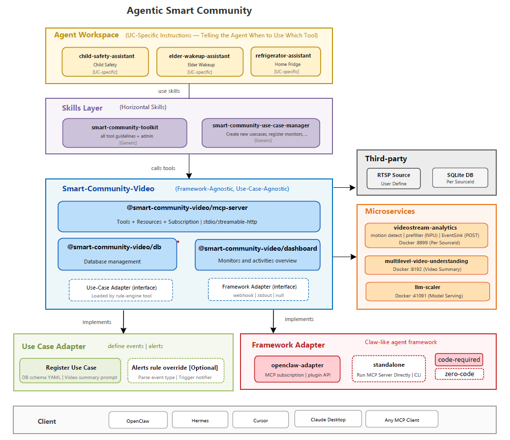
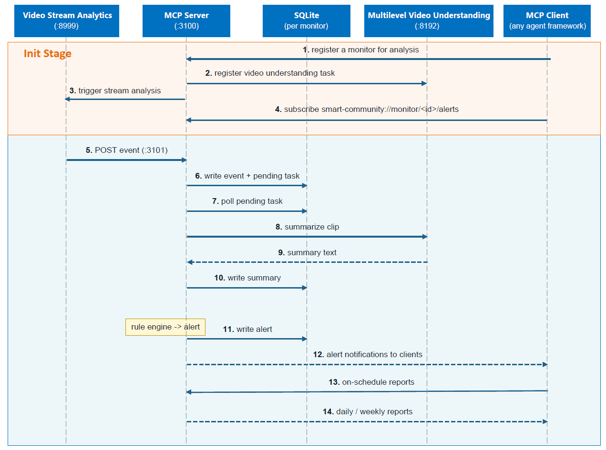

# How It Works

This article explains the overall architecture of the Agentic Smart Community platform, how the MCP server orchestrates video analysis pipelines, and how AI agents interact with the system through standardized tools and skills. It provides a detailed overview of the components involved, their responsibilities, and the data flow within the platform.

## Overall Architecture

The platform is built around MCP, letting AI agents (OpenClaw, Hermes, etc.) orchestrate video analysis pipelines through standardized tool interfaces.

It uses a layered design with clearly separated, decoupled responsibilities — top to bottom: the **Agent Workspace** (personas + skills), the **MCP Server** (tool surface, rule engine, alert resources), the dependent **video services** (stream analytics, video understanding, VLM), and the underlying **client** that feeds and consumes the stream.



**Figure: Smart Community Video Analytics — Overall Architecture**

## How It Works Details

Where the Overall Architecture shows *how the layers stack*, this section shows *what an agent actually works with*. Three pieces make the platform framework-agnostic:

- **MCP Server Workflow** — the runtime that orchestrates the video pipeline and turns rule-engine decisions into subscribable alert resources.
- **MCP Tools** — the standardized tool surface every agent calls to query, report, and manage monitors and use cases.
- **Agent Skills** — the portable know-how that teaches an agent how to use those tools and how to author brand-new use cases.

### MCP Server Workflow

The MCP server sits between AI agents and the dependent external services:

```text
                  agents (OpenClaw / Hermes / Claude Desktop)
                                  │  MCP tools
                                  ▼
        ┌────────────────────────────────────────────────────┐
        │                 MCP Server  :3100                  │ ◀── config.yaml
        └───────┬─────────────────────────────────┬──────────┘      + monitors.yaml
                │  /register_source :8999  ↓      │  /summary :8192
                │  /events :3101           ↑      │
                ▼                                 ▼
        videostream-analytics            multilevel-video-understanding
        (recording + prefilter)          (video summary + report)
```

#### Lifecycle

- **Startup**: load config → init DB → open MCP transport (`:3100/mcp`) + events webhook (`:3101`) → reconcile crash residue → auto-register monitors → start storage cleaner + keepalive heartbeat.
- **Runtime**: the per-monitor data flow below.
- **Shutdown** (SIGINT/SIGTERM): stop cleaner/keepalive → graceful-stop workers → pause analytics sources → close DB.

#### Runtime Data Flow

Per monitor: the video pipeline drives events into the server, the worker summarizes clips, the rule engine decides alerts, and any subscribed MCP client is delivered those alerts through the **standard MCP resource-subscription protocol** — no framework-specific coupling.


**Figure: Smart Community Runtime Data Flow**

- Video analytics sends events to the MCP server, which creates video-summary tasks for the affected monitor.
- The video-summary service analyzes clips, and the rule engine evaluates each resulting summary to create alerts when needed.
- The server stores alerts and generates scheduled reports from the collected monitor data.
- An MCP client (OpenClaw, Hermes, Claude Desktop, …) subscribes to `smart-community://monitor/<id>/alerts` and receives alert notifications.

### MCP Tools

The server exposes a standardized, use-case-agnostic tool surface (every id prefixed `smart_community_`). Agents drive the whole platform through these — no custom code per use case. All tools are keyed on `monitor_id`.

| Group | Tools | What it does |
| ----- | ----- | ------------ |
| **Query & report** | `alert_query` · `scene_query` · `generate_report` · `video_db` | Read/ack alerts, one-shot VLM look at the live frame, build period reports, raw read-only SQL |
| **Monitor lifecycle** | `monitor_ctl` · `monitors_compose` | Register/start/stop a single monitor; docker-compose-style batch over a `monitors.yaml` |
| **Use-case authoring** | `use_case_validate` · `use_case_register` | Validate a use case is wired end-to-end, register/unregister one at runtime |
| **Rules & plans** | `plan_ctl` · `rule_eval` | Per-monitor JSON plans; manual replay of the rule evaluator (alerts normally fire automatically) |

See the full guide — parameters, `action` enums, return shapes, the SQLite data model, and the data directory layout — in **[MCP Tools Guide](./how-to-guides/mcp-tools.md)**.

### Agent Skills

Skills are portable Markdown guides (framework-agnostic; usable by any MCP client) that turn the raw tool surface into repeatable recipes. Two ship today, mirroring the two halves of the platform — *operating* monitors and *creating* use cases.

| Skill | Purpose | Anchored on |
| ----- | ------- | ----------- |
| **[`smart-community-toolkit`](https://github.com/open-edge-platform/edge-ai-suites/blob/release-2026.2.0/metro-ai-suite/agentic-smart-community/skills/smart-community-toolkit/SKILL.md)** | Operate the platform: the full `smart_community_*` tool catalog, the SQLite data model, how to discover which monitor to act on, how reports are generated, how pushed alerts reach a session, and which actions are destructive (two-phase confirm). | the MCP tools + resources |
| **[`smart-community-use-case-manager`](https://github.com/open-edge-platform/edge-ai-suites/blob/release-2026.2.0/metro-ai-suite/agentic-smart-community/skills/smart-community-use-case-manager/SKILL.md)** | Create a new use case conversationally — just chat with the agent to describe it, and the skill infers the events/schema, drafts the prompt, and registers the task for you. | multilevel-video-understanding task registration |

Together they close the loop: `smart-community-use-case-manager` **creates** a use case, then `smart-community-toolkit` **runs** it — no core-component changes in between.
