# Register a New Use Case

A *use case* tells the platform what to watch for in a video stream — for example, whether a pet is trying to escape its area, or whether workers on a construction site are wearing safety helmets. This guide shows how to create one **by conversation**: you describe what you need in a chat with a connected agent (for example, OpenClaw), and the [`smart-community-use-case-manager`](https://github.com/open-edge-platform/edge-ai-suites/blob/release-2026.2.0/metro-ai-suite/agentic-smart-community/skills/smart-community-use-case-manager/SKILL.md) skill turns your description into a registered, running use case — no code, no restart.

By the end of this guide you will know how to:

- register a new use case through a conversation, step by step with screenshots;
- configure the bound monitor's pipeline (object prefilter and ROI focus) through the same conversation;
- verify the detection results stored in the database;
- write a use-case description that produces accurate detection;
- delete a use case, again by conversation.

**Prerequisites:** an agent host is connected (see [Connect an agent host](../get-started.md#step-3---connect-an-agent-host)) and the skills are imported (OpenClaw [Step 3](../get-started.md#openclaw)).

> **Tip — use a capable cloud model for registration.** Registering a use case is the most model-demanding flow on the platform: the agent must infer events and schema, draft a four-section VLM prompt, and pass the server-side consistency gate. We recommend switching the agent to a strong cloud model for this conversation — e.g., in OpenClaw, pick a MiniMax model from the model selector — rather than a small local model. This only affects the **authoring** step; once the use case is registered, day-to-day detection runs on the on-device VLM/LLM stack (for example a local Qwen model), independent of which model the agent used to register it.

## Use case registration flow

Registering a use case is a short conversation with the agent, guarded by **mandatory cross-turn confirmation gates** — two for the use-case design and, whenever a camera stream is bound, two more for the monitor pipeline. The agent pauses and waits for your explicit reply at each gate; it never infers an answer from your description, and never treats its own recommendation as your decision:

1. **Describe the use case in chat.** Give the agent a name (lowercase snake_case) and a short natural-language description of what to watch for. The RTSP stream is optional at this point — you can include it in the description, e.g., *"Create a use case `pet_safety`: monitor the pet camera for escape, trapped, or aggressive behavior. Stream: `rtsp://localhost:8554/live/pet`."*, or leave it out and supply it after the use case is registered. The agent collects only this intake — it does not draft anything yet.

2. **Gate 1 — answer the Q1/Q2 questions.** The agent asks the two gating questions and then **ends its turn immediately** — no prompt drafting, no tool calls, no registration until you reply. It never infers the answers from your description, even if you mention alerts or fields:
   - **Q1 — Alerting?** *No* → a report-only use case (no alert schema, no rules). *Yes* → alerting on the base schema `severity, event, desc`.
   - **Q2 — Extend the schema?** *(only if Q1 = yes)* *No* → **base alerting**: the schema stays `severity, event, desc` and alerts are decided by the built-in rule evaluator (fires on `severity = warn | critical`), no custom code. *Yes* → **extended alerting**: the extra fields you name (e.g., `pet_zone`, `risk_area`) are added on top of the base schema, and a per-use-case `evaluate_rules.py` — your custom alert policy — is generated to decide alerts from them.

3. **Gate 2 — confirm the resolved design.** From your Q1/Q2 answers the agent resolves everything else with conservative defaults (event names, severity assignments, evidence minimums, priority) and shows the proposed design for approval: the mode (*report-only* / *base alerting* / *extended alerting*), the **Final Schema**, the **Rule Path**, and a compact **Detection Contract** (event values with severity defaults). Again it ends its turn — registration starts only after a later message explicitly approves, e.g., `confirm`.

4. **The agent registers the use case.** After approval it drafts the four-section VLM prompt (plus `evaluate_rules.py` for every extended schema or custom alert policy), then calls `smart_community_use_case_register` in two steps — `action=generate_task` (POSTs the video-summary task to `multilevel-video-understanding` and writes `use-cases/<name>/prompt.md`), followed by `action=register` with `persist=true` (applies the schema, updates `use_case_dict`, and writes `config.yaml`). A built-in consistency gate validates prompt ↔ schema ↔ rules and rejects mismatches before side effects. Monitor binding does not start until registration returns `ok:true`.

5. **Gate 3 — decide the monitor pipeline (P1/P2).** The monitor gates run whenever a stream URL is involved — supplied at intake or later in the same conversation — whether the use case is new or pre-existing. The agent asks two pipeline decisions and ends its turn:
   - **P1 — Prefilter?** Enable object-class prefiltering, so motion clips that contain none of the target objects are dropped before they reach the VLM — cutting false positives and VLM cost.
   - **P2 — ROI focus?** Crop/focus a region of interest. ROI is trajectory-driven off prefilter hits (no geometry to draw), and *yes* applies the template defaults `mode=crop, expand=0.25, auto_split_area=0.35` with no further ROI questions.

   Reply exactly `P1=yes|no, P2=yes|no`. If you answer `P1=no, P2=yes`, the agent warns that ROI has no trajectory source without prefilter and asks you to enable prefilter or drop ROI.

6. **Pick the prefilter target classes (P1 = yes only).** The agent fetches the selectable classes from the deployed detection model (`smart_community_monitor_ctl action=prefilter_options`) and presents the returned class names verbatim for you to pick from — it never selects for you, and a name outside the model's list is rejected server-side at registration.

7. **Gate 4 — confirm the exact `pipeline_config`.** The agent assembles the full `pipeline_config` and displays it in full — no hidden or summarized fields — together with a human-readable decision summary (prefilter on/off, target classes, labels source, ROI on/off and its parameters, monitor ID, persistence). Even a deliberate "both off" is displayed as an explicit disabled config (`prefilter.enabled=false`, `roi.enabled=false`), so an intentional "off" stays distinguishable from "never configured". Only after a later message approves that exact config — reply `confirm pipeline_config` — does the agent call `smart_community_monitor_ctl action=register_source` (an upsert; a new monitor gets the default ID `cam_<use_case>`, `persist=true` mirrors it into `monitors.yaml`).

When registration finishes, the agent reports a **New Use Case** summary — use case, VLM task, mode, events/findings, final schema, rule path, report source, bound monitor, and validation status — plus a **Monitor Created** block when a monitor was bound (monitor ID, source URL, prefilter/ROI decisions, and the exact approved `pipeline_config`), followed by a grouped **System Inventory**: each registered use case (from `smart_community_use_case_register action=list`, which reads the server's live in-memory `use_case_dict`) with its bound monitors nested underneath (from `smart_community_monitor_ctl action=list`), so a use case with no camera yet shows up explicitly as `(no camera bound yet)` instead of disappearing from a monitors-only list — expected when you plan to supply the RTSP stream after registration. Once a monitor is bound, the use case is live immediately — alerts start flowing to any client subscribed to `smart-community://monitor/<monitor_id>/alerts`.

If you registered without a stream URL, monitor configuration simply does not start. Provide the RTSP stream later in the same conversation — e.g., *"bind `rtsp://localhost:8554/live/pet` to pet_safety"* — and the agent runs the same P1/P2 and `pipeline_config` gates then, with the same result: a monitor (default ID `cam_<use_case>`) bound to the use case and streaming.

The inventory is printed automatically only when a use case is created. To check the system's use cases at any other time, just ask in the conversation — e.g., *"list all the use cases"* — and the agent returns the same grouped view (each use case with its task, rule path, and bound monitors) on demand.

> **Tip:** Things to *detect* (escape, trapped, aggressive behavior, …) are event **values**, not schema fields — describe what to watch for, and only name extra schema fields in Q2 when you truly need them persisted and queryable.

## Walkthrough: register a use case with OpenClaw

This section walks through a complete registration conversation in OpenClaw, using a **pet-safety detection** use case as the example. It takes the extended-schema path so you can see how `evaluate_rules.py` is produced, and binds the stream with both prefilter and ROI enabled so you can see both monitor-pipeline gates.

### Step 0 — Start a new session with a strong model

Run `openclaw dashboard` to open the OpenClaw chat interface (Control UI) in your browser, then click **+ New session** to start a clean conversation for the registration. Before typing, switch the model selector to a capable cloud model (e.g., MiniMax) — registration quality depends heavily on the model's ability to infer events, draft the prompt, and pass the consistency gate. You can switch back to a smaller/local model for everyday chats afterwards; detection itself runs on the on-device stack either way.

### Step 1 — Describe the use case

Tell OpenClaw the use-case name, what to detect, and — optionally — the RTSP stream to bind. Be as concrete as you can about the detection targets — this description is what the VLM prompt is compiled from (see [Write a good use-case description](#write-a-good-use-case-description)):

> *Register a Pet Safety use case to monitor pets for escape attempts, entrapment incidents, and aggressive behavior. The RTSP stream address is `rtsp://localhost:8554/live/pet`.*

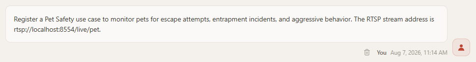

### Step 2 — Answer Q1/Q2 (gate 1)

OpenClaw does not draft anything yet. It loads the `smart-community-use-case-manager` skill, then asks the two gating questions and **stops** — the turn ends right after the questions, with no files changed and no other tool called:

- **Q1 — Alerting?** Does this use case need to raise alerts? *No* → report-only mode: no alert rows, no rules; *Yes* → structured alerts with a primary event per clip, on the base schema `severity, event, desc`.
- **Q2 — Schema extension?** *(only if Q1 = Yes)* Persist fields beyond `severity / event / desc`? *No* → base alerting with `defaultRuleEvaluator`; *Yes* → extended alerting — name each extra field you want persisted (e.g., `pet_type (text)`, `location (text)`), and a per-use-case `evaluate_rules.py` — the custom alert policy — will be generated from the complete final schema.

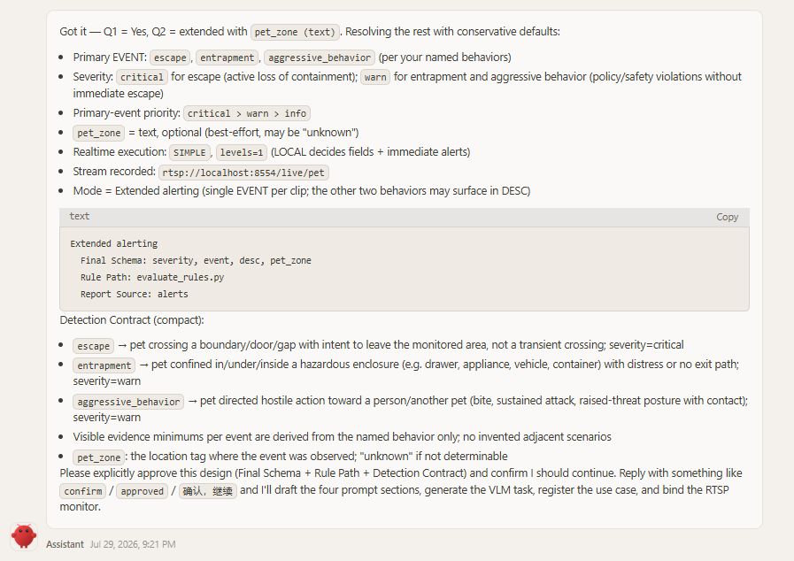

Reply explicitly — Q1 and, when Q1 is yes, Q2 — naming any extension fields you need persisted and queryable. Here we add a `pet_zone` field so every alert carries which zone of the room the event happened in:

> *Q1=yes, Q2=yes add pet_zone*

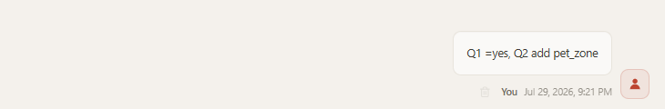

### Step 3 — Confirm the proposed design (gate 2)

OpenClaw notes that the three named behaviors (escape attempts, entrapment incidents, aggressive behavior) are handled as primary detection **events**, not schema fields, then resolves everything else from your description with conservative defaults — event names, severities, evidence minimums, and realtime execution (`SIMPLE`, `levels=1`, so the LOCAL pass decides the persisted fields and immediate alerts) — and shows the proposed design for approval:

- **Use Case:** `pet_safety` · **VLM Task:** `pet_safety_monitor`
- **Mode:** Extended alerting
- **Final Schema:** `severity (text), event (text), desc (text), pet_zone (text)`
- **Rule Path:** `evaluate_rules.py` (built from the complete Final Schema)
- **Report Source:** `alerts` (daily)
- **Realtime execution:** `SIMPLE`, `levels=1`, `process_fps=2`
- **Detection Contract** — event values with severity defaults (primary-event priority `critical > warn > info`):

  | EVENT value | Severity | Description |
  |---|---|---|
  | `escape_attempt` | warn | Pet actively trying to get out: pawing/scratching at a door/gate/crack, squeezing under/through a barrier, repeatedly jumping at an exit |
  | `entrapment` | warn | Pet visibly stuck or unable to free itself: limb/head caught in a gap, leash/door/cage pinning the animal, prolonged distress posture near a hazard |
  | `aggressive_behavior` | warn | Pet visibly aggressive toward another animal or person: bared teeth, raised hackles, lunging, snapping, sustained chase with hostile posture |

  Plus an `info`-level uncertainty event (`uncertain`) for behavior that could not be confidently classified. Extension field: `pet_zone` (text) — the zone where the event was observed. Each event also carries a **minimum visible evidence** bar with common look-alikes excluded (e.g., normal door-pawing for attention does not count as `escape_attempt`), and OpenClaw explicitly lists what it did *not* invent: no escalation policy, no critical-only scenarios, no extra business events, no custom alert behavior beyond `pet_zone`.

Nothing is written until you approve it — this is the second gate, and the turn ends with the design on screen:

> *confirm*

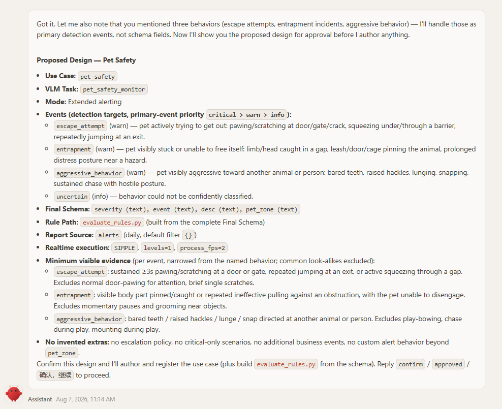

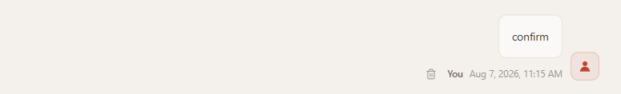

### Step 4 — Registration and artifacts

Only after your explicit approval does OpenClaw start authoring: it reads the prompt-authoring reference, drafts the four VLM prompt sections and — because the schema is extended — builds `evaluate_rules.py` from the complete final schema, runs the semantic lint, then registers the use case in two server-side steps (`generate_task` → `register` with `persist=true`).

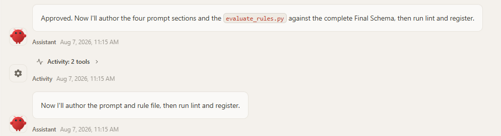

Both artifacts are archived under the data directory — `$SMART_COMMUNITY_DATA_DIR/use-cases/<use_case>/` (default `~/.mcp-smart-community`):

```text
~/.mcp-smart-community/
└── use-cases/
    └── pet_safety/
        ├── prompt.md           # four-section VLM prompt (GLOBAL / MACRO / LOCAL / T_MINUS_1)
        └── evaluate_rules.py   # custom alert rule — extended schema only
```

- `prompt.md` — the compiled detection contract that the VLM task runs against every clip.
- `evaluate_rules.py` — invoked by the rule engine for every analyzed clip. It receives the parsed fields as JSON and returns an alert outcome (or `null` for no alert). For this example it reads `severity`, `event`, `desc`, and the `pet_zone` extension, and fires on `severity = warn | critical`, attaching the zone to the alert description.

On the **default rule path** (Q2=no) only `prompt.md` is archived — alerts are decided by the built-in evaluator on `severity = warn | critical`. A **report-only** use case (Q1=no) archives `prompt.md` and has no schema and no rule at all.

### Step 5 — Answer P1/P2 (monitor decision gate)

Registration returned `ok:true`, and because the intake included a stream URL, OpenClaw now runs the **separate monitor pipeline gates** before binding anything — monitor decisions are never inherited from the use-case answers. It first confirms the preconditions (the `register` call returned `ok:true`, so `pet_safety` exists, and the source URL is known), then asks the two pipeline questions and ends its turn:

- **P1 — Prefilter:** enable object-class prefiltering (drop motion clips without pets before the VLM)?
- **P2 — ROI focus:** crop/focus a region of interest?

Reply exactly `P1=yes|no, P2=yes|no`. OpenClaw also spells out the consequences up front: P1=yes means you will pick target classes from the deployed model's class list next; P2=yes applies the ROI template defaults (`mode=crop`, `expand=0.25`, `auto_split_area=0.35`) automatically, with no further ROI questions; and `P1=no` together with `P2=yes` draws a warning, because the ROI crop is trajectory-driven off prefilter hits and has no trajectory source without prefilter.

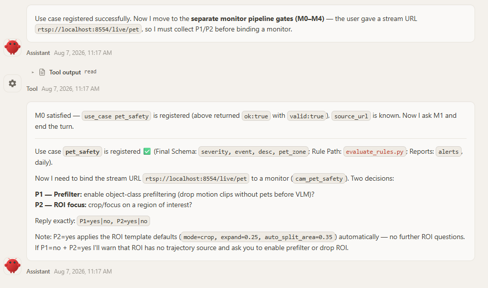

Here we enable both — prefilter keeps non-pet motion away from the VLM, and ROI zooms into the pet's trajectory region:

> *P1=yes P2=yes*

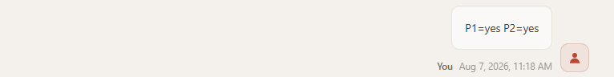

The same two monitor gates apply whenever a monitor is created, rebound, or updated — including binding a camera to a use case that was registered earlier.

### Step 6 — Pick the prefilter target classes (P1 = yes)

Because P1=yes, OpenClaw fetches the selectable classes from the deployed detection model (`smart_community_monitor_ctl action=prefilter_options`) and presents them verbatim. The `labels_source: embedded` flag means the list is authoritative — it came from the model itself, and a class outside the list is rejected server-side at registration. For a home pet camera the relevant animal classes are `cat` and `dog` (the model's COCO-80 label set has no general "pet" class); OpenClaw suggests the safe pick for a typical pet household, but never chooses for you:

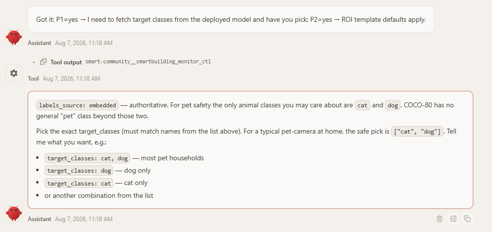

> *target_classes: cat, dog*

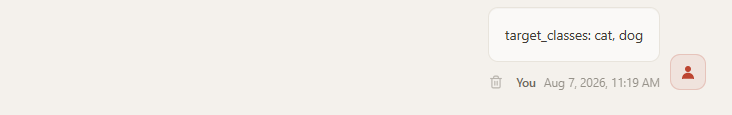

P2=yes needs no further input: the ROI template defaults apply verbatim. There is no geometry to draw — the ROI crop is **trajectory-driven**: the prefilter's detection hits accumulate a union box per segment, and the crop is that trajectory region expanded by 25%, with an early segment split when the region grows beyond 35% of the frame.

### Step 7 — Confirm the exact pipeline_config (monitor approval gate)

With every decision collected, OpenClaw assembles the exact `pipeline_config` that will be passed verbatim to `register_source`, and displays it in full — no hidden fields — together with a human-readable decision summary:

```yaml
pipeline_config:
  prefilter:
    enabled: true
    target_classes: [cat, dog]
  roi:
    enabled: true
    mode: crop
    expand: 0.25
    auto_split_area: 0.35
```

- **Prefilter:** enabled · **Target Classes:** `cat`, `dog` · **Labels Source:** embedded (from the deployed YOLO model)
- **ROI Focus:** enabled · **ROI Parameters:** defaults (`mode=crop`, `expand=0.25`, `auto_split_area=0.35`)
- **Monitor ID (default):** `cam_pet_safety` · **Persistence:** enabled (mirrors to `monitors.yaml`)

Nothing is written until you approve this exact config — reply with the exact phrase `confirm pipeline_config`. A general acknowledgement (`ok`, `looks good`, `continue`) does not satisfy this gate, and changing any field after approval voids it — the agent must redisplay the config and ask again.

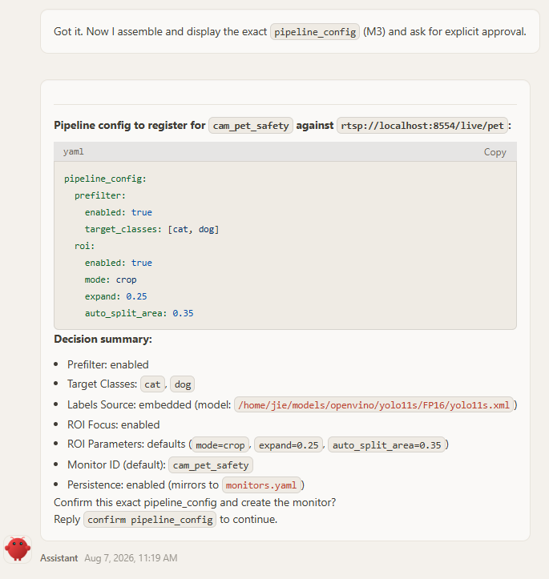

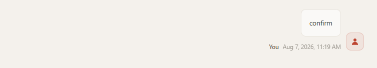

### Step 8 — Monitor binding and final report

Only after that approval does OpenClaw call `smart_community_monitor_ctl action=register_source` with the approved config. `register_source` is an **upsert** — with no `monitor_id` supplied, the new monitor gets the default ID `cam_pet_safety` — and `persist: true` mirrors it into `~/.mcp-smart-community/monitors.yaml`.

The final chat report has three parts:

1. **New Use Case** — the use case (`pet_safety`), VLM task (`pet_safety_monitor`), mode (extended alerting), events/findings (`escape_attempt` / `entrapment` / `aggressive_behavior` at warn, plus `pet_uncertain` / `no_safety_incident` at info), final schema (`severity, event, desc, pet_zone`), rule path (`evaluate_rules.py`), report source (`alerts`, daily), the bound monitor `cam_pet_safety → rtsp://localhost:8554/live/pet` (online, analytics online), and the validation status.
2. **Monitor Created** — monitor ID `cam_pet_safety`, use case, source URL, prefilter enabled (`cat`, `dog`), ROI focus enabled (template defaults), the exact approved `pipeline_config`, and persistence (mirrored to `monitors.yaml` and `config.yaml`).
3. **System Inventory** — a grouped view of every registered use case with its monitors nested underneath (here `fridge`, `child_safety`, `elder_wakeup`, and the new `pet_safety`); use cases without a camera are listed explicitly as `(no camera bound yet)`.

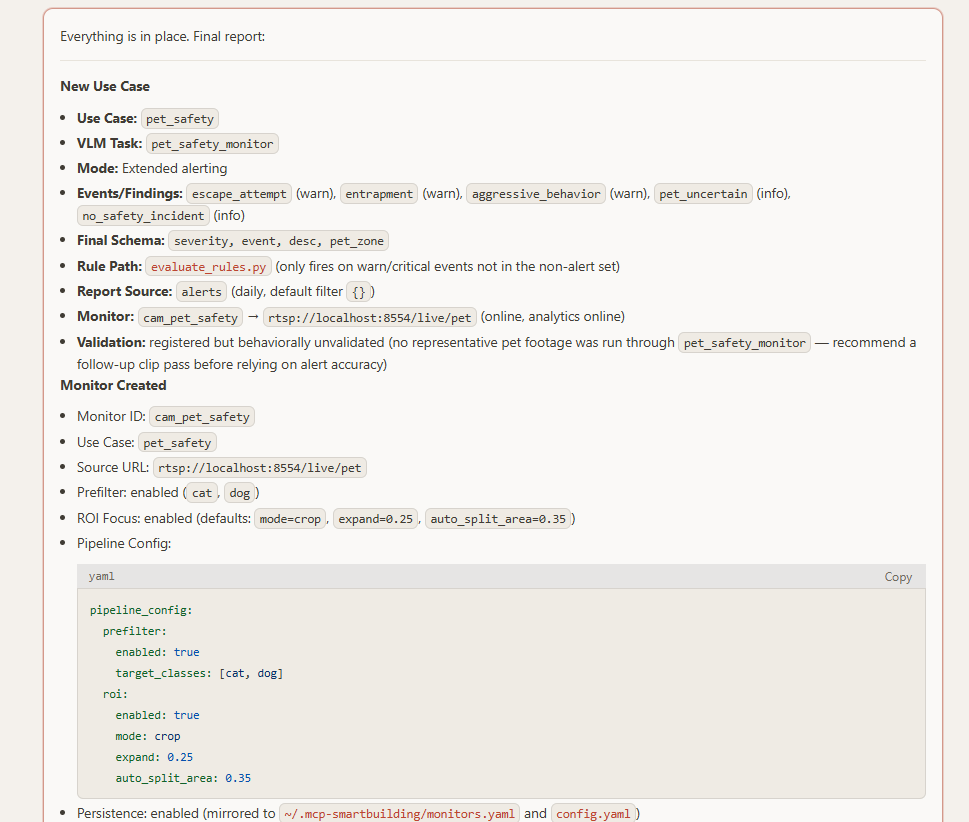

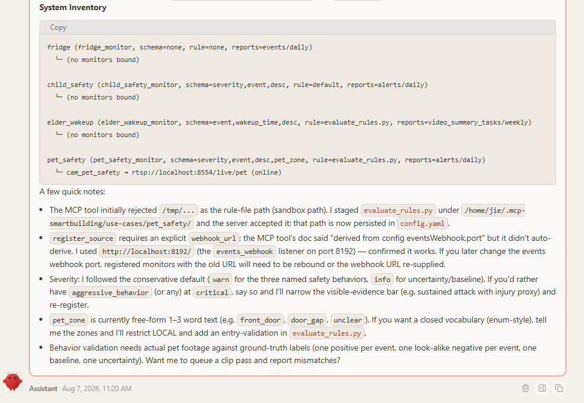

Note the **validation status**: *registered but behaviorally unvalidated* — registration only confirms structural alignment of prompt ↔ schema ↔ rules. When you have representative footage, compare the persisted `event / severity / desc / pet_zone` values against ground truth and re-register with `overwrite=true` to refine. From this point the use case is live: pet-safety events start producing alerts on `smart-community://monitor/cam_pet_safety/alerts`.

### Step 9 — (Optional) Real-Time Alert Configuration
MCP Server subscriptions can deliver alert updates directly to connected clients. Whether an MCP client receives these notifications in real time depends on its configuration. To configure real-time alert delivery:
- First, make sure you have installed the OpenClaw adapter by following [Connect an agent host — OpenClaw](../get-started.md#realtime-alerts-notifications).
- Then, from any OpenClaw chat session, ask OpenClaw to create a dedicated agent and configure alert notifications. For example, ask it to:
  ```text
  Create an OpenClaw agent dedicated to monitoring the cam_pet_safety camera. 
  Place it in the `~/.openclaw/agents` directory and register it in `openclaw.json`.
  Then configure the system to push pet camera alerts to this agent in real time.
  ```

  The following screenshot shows an example configuration:
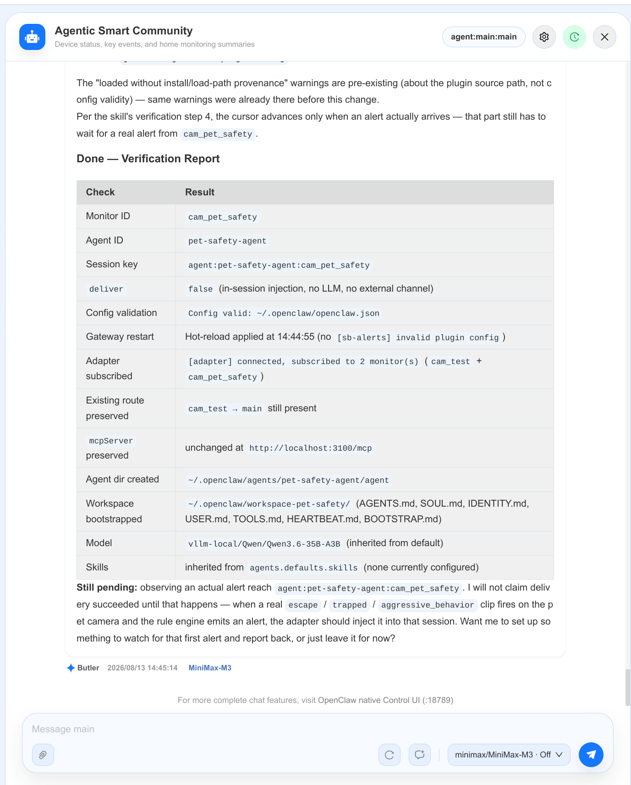

- After configuration, real-time alerts appear in the dedicated agent session, as shown in the following screenshot:

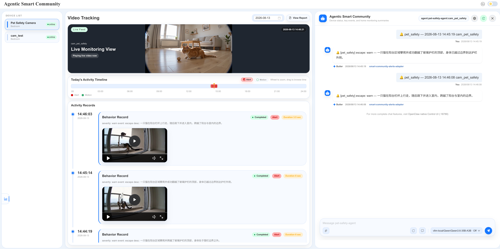

## View detection results in the database

Once the use case is live, all detection result data is stored in the server's SQLite database at `$SMART_COMMUNITY_DATA_DIR/smart-community.db` (default `~/.mcp-smart-community/smart-community.db`). The tables, in the order they appear in the database:

| Table | What it holds |
|---|---|
| `monitors` | Registered video sources — monitor ID, name, RTSP `source_url`, bound `use_case`, and `status` (`online` / `offline`). The approved `pipeline_config` is **not** a column here — it lives in the `monitors.yaml` mirror. |
| `events` | Raw detection events reported by the video-stream analytics (VSA) pipeline — these are what trigger video-summary tasks. |
| `sqlite_sequence` | Internal SQLite bookkeeping for `AUTOINCREMENT` primary keys — no user data, safe to ignore. |
| `recordings` | Recorded video clips associated with events/alerts — file paths, time ranges, duration, and file size, so you can review the footage behind any detection. |
| `video_summary_tasks` | Per-clip video-summary results — the VLM's `summary_text`, the parsed fields (`event`, `severity`, `desc`, plus any extension fields like `pet_zone`), task status, and token/latency stats. Extension columns from every use case sit on this one shared table. |
| `alerts` | Alerts fired by the rule engine (here, by `evaluate_rules.py`) — monitor/task/event/use-case references, a formatted `description`, notification state, and acknowledgement details. To inspect structured fields such as `severity` and `event`, or the source clip path, follow `task_id` / `event_id` to the corresponding `video_summary_tasks` / `events` row. |
| `reports` | Generated periodic reports per monitor (e.g., daily summaries) — `report_text`, event/motion counts, report type, status, and generation stats. |
| `plans` | Per-monitor analysis plans (`plan_json`) — named plan definitions that drive scheduled report/summary generation, with an `active` flag. |

You don't need to open the database by hand — just ask OpenClaw in the same chat. For example:

> *check monitors in smart-community.db*

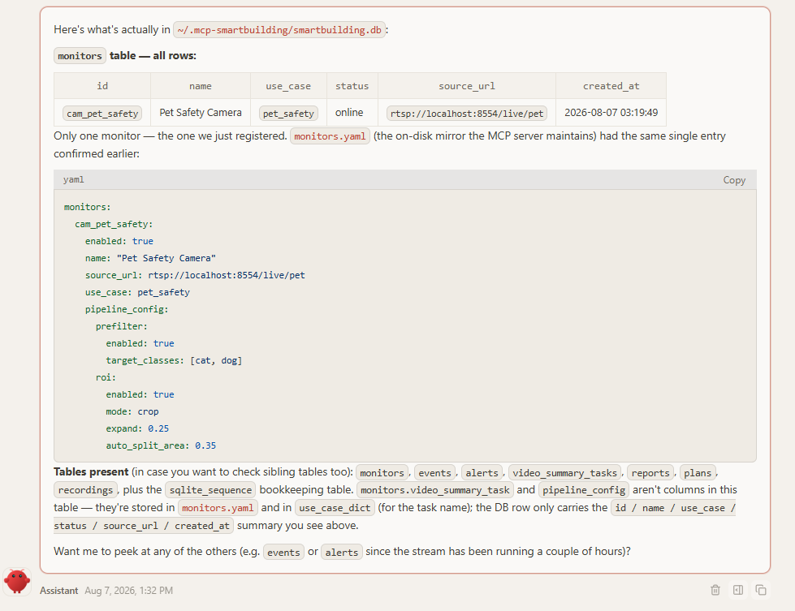

The freshly registered `cam_pet_safety` row is there and **online**. OpenClaw also shows the `monitors.yaml` mirror next to it, because that is where the approved `pipeline_config` (prefilter `cat`/`dog`, ROI crop defaults) is persisted — the DB row itself carries only `id` / `name` / `use_case` / `status` / `source_url` / `created_at`, and the VLM task name lives in the server's `use_case_dict`, not in this table.

> *check video-summary-tasks in smart-community.db*

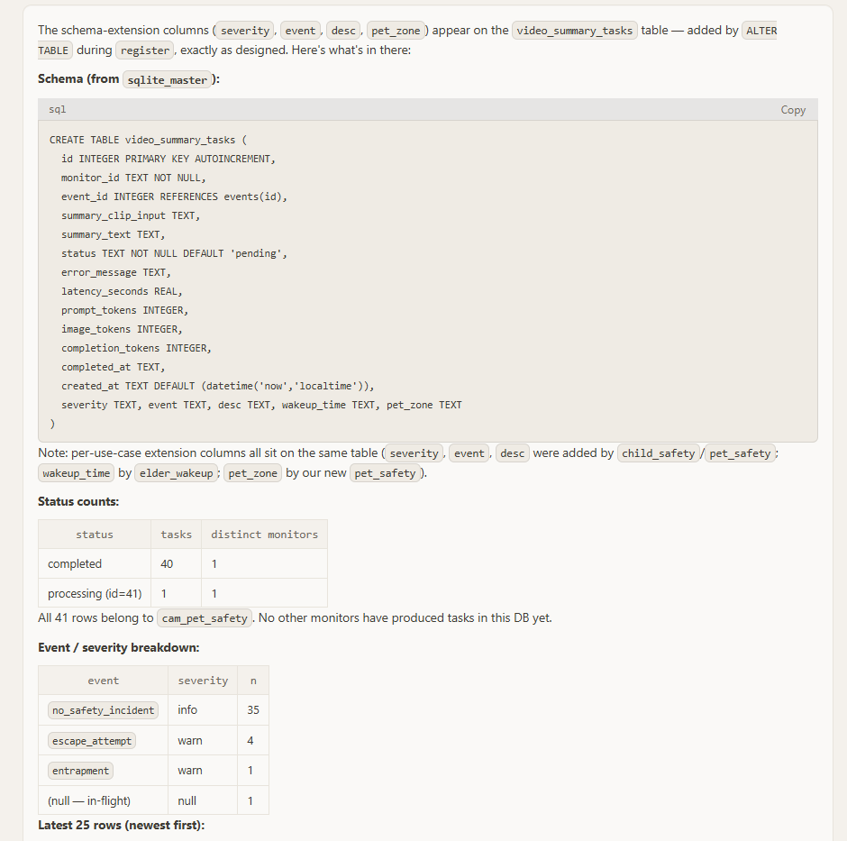

Here OpenClaw shows the schema extension applied at register time: the `severity`, `event`, `desc`, and `pet_zone` columns were added to the shared `video_summary_tasks` table via `ALTER TABLE` — the same table also carries `wakeup_time` from the `elder_wakeup` use case, since per-use-case extension columns all land on this one table. The detection summary: 41 tasks so far, all from `cam_pet_safety` (40 completed, one in flight) — mostly `no_safety_incident` (info), with a handful of `escape_attempt` and `entrapment` warnings. This is exactly the place to verify detection quality after registration: if the persisted `event` / `severity` / `pet_zone` values don't match what the camera actually saw, refine the description and re-register with `overwrite=true`.

## Write a good use-case description

Your description in Step 1 is the single biggest factor in detection quality. The agent compiles it directly into the VLM prompt — anything left vague is left to the VLM's guesswork, and the result is missed detections or noisy alerts.

Cover these points when you describe a use case:

- **What to detect** — the concrete events (e.g., *worker without a safety helmet*), not a broad category (*safety issues*).
- **Alert semantics** — when an alert should fire and what severity means (e.g., *warn for a violation; critical if the worker is operating machinery*).
- **Visual evidence** — what must be visible to count (e.g., *helmet clearly worn on the head; carried in hand or replaced by a cap counts as a violation*).
- **Look-alikes to exclude** — common confusables (e.g., *caps, hoods, people outside the fence, posters or mannequins*).
- **Scene context** — camera viewpoint and area of interest (e.g., *entrance camera looking down at the site gate*).

### Example: construction-site helmet detection

Compare two descriptions of the same use case:

| Vague | Detailed |
|---|---|
| *Create a use case `helmet_detection`: watch the construction site for safety problems.* | *Create a use case `helmet_detection`: monitor the construction-site camera. Alert when a worker inside the fenced site area is not wearing a safety helmet. A helmet counts only when clearly worn on the head — carrying it in hand, or wearing just a cap or hood, is a violation. Ignore people outside the fence.* |

With the vague description the agent cannot tell what counts as an event, what evidence is required, or what to exclude — the generated prompt is generic, and the VLM misses bareheaded workers while flagging harmless scenes. The detailed description pins down the event, the evidence rule, and the exclusions, so the compiled prompt detects precisely what you meant.

<!-- TODO(screenshots): add side-by-side detection results —
     - openclaw-uc-desc-vague-result.png: registration/detection outcome from the vague description (generic prompt, missed or false alerts)
     - openclaw-uc-desc-detailed-result.png: outcome from the detailed description (correct helmet-violation alerts) -->

If the first registered version behaves poorly in practice, you do not need to delete it — refine the description and ask OpenClaw to update the use case in place (the skill re-registers it with `overwrite=true`).

## Delete a use case by conversation

Deleting is also a conversation — ask OpenClaw to remove the use case by name:

> *delete pet safety use case*

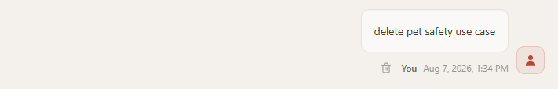

Because deletion is destructive, OpenClaw does **not** delete on this request. It first fetches the live inventory (`smart_community_use_case_register action=list` and `smart_community_monitor_ctl action=list`), then shows the exact cascade impact — what will be removed, archived, and stopped, and what is kept:

- **Will be removed:** the `pet_safety` entry from the in-memory `use_case_dict` and from `~/.mcp-smart-community/config.yaml`; the bound monitor `cam_pet_safety` (stopped and unregistered, its `monitors.yaml` entry stripped); the VLM task `pet_safety_monitor`; and the artifacts under `use-cases/pet_safety/` (`prompt.md`, `evaluate_rules.py`) — **moved to** `use-cases/.backup/pet_safety/`, so they are recoverable.
- **Will be kept:** the database is not cascaded — the historical `video_summary_tasks` rows produced by `cam_pet_safety` and the `alerts` rows for `pet_safety` remain as audit history, and the shared schema columns (`severity`, `event`, `desc`, `pet_zone`, …) stay on the table because other use cases share them.

The turn ends there; `action=unregister` is never called in the same turn that displays the impact. OpenClaw also tells you the exact confirmation phrase it needs — anything else (`yes`, `delete it`, `好的`) will not satisfy the gate and it will ask again:

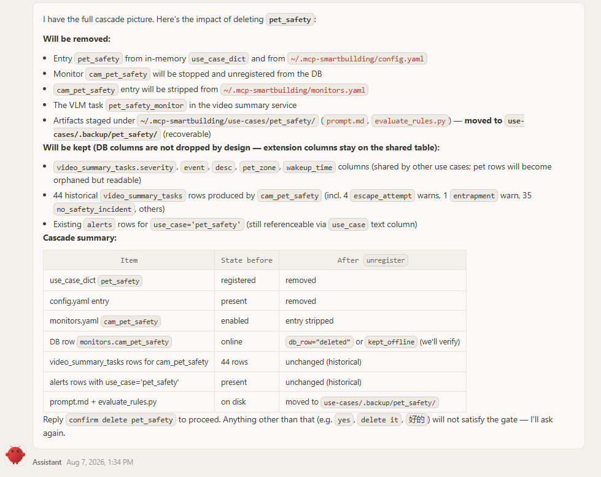

Reply with that explicit confirmation in a later message, and OpenClaw calls `smart_community_use_case_register` with `action=unregister`, `persist=true`:

> *confirm delete pet_safety*

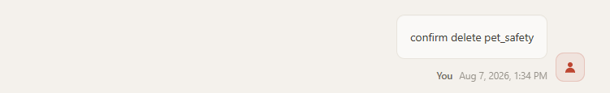

The unregister cascade then runs, and OpenClaw reports the final state:

- **Removed:** the `use_case_dict.pet_safety` entry from `config.yaml`, and the VLM task `pet_safety_monitor` from the video-summary service.
- **Archived:** the `prompt.md` / `evaluate_rules.py` artifacts are moved from `~/.mcp-smart-community/use-cases/pet_safety/` to `use-cases/.backup/pet_safety/`, so they are recoverable on disk (re-registering the use case later needs fresh prompt and rule files).
- **Preserved:** historical `video_summary_tasks` and `alerts` rows linked to `pet_safety` are kept as audit history (the task rows are now orphaned — their `monitor_id` still resolves, but the use case is gone), and the shared extension columns stay on the table for the remaining use cases.

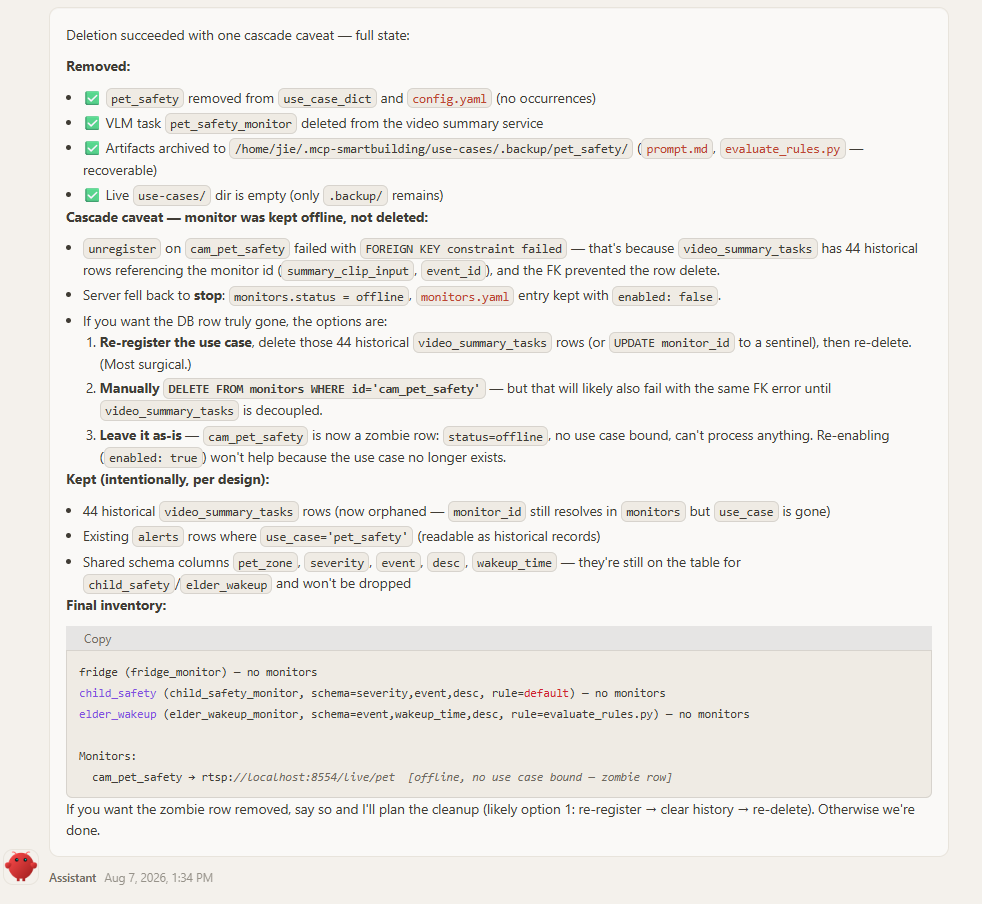

Check the monitor outcome in the response's `cascaded_monitors`:

- `db_row="deleted"` — the monitor was fully unregistered.
- `db_row="kept_offline"` — the use case was successfully unregistered, but the monitor row could not be deleted because historical detection rows still reference it (here, the `video_summary_tasks` history produced by `cam_pet_safety`; the foreign-key constraint blocked the row delete). The server falls back to stop: the monitor is marked `offline` and its `monitors.yaml` entry is kept with `enabled: false` — a "zombie" row that cannot process anything, and re-enabling it alone does not help because the use case no longer exists. Do not retry the use-case unregister: the use case has already been removed. You can leave the offline row in place to preserve its audit history. To reuse the monitor later, first re-register the use case, then bind the stream again with the same monitor ID; `register_source` updates and restarts the existing row. To permanently delete the monitor, back up `smart-community.db`, remove the rows that reference it (in `video_summary_tasks` / `alerts`) using direct SQLite maintenance (preferably while the MCP server is stopped), then restart the server and call `smart_community_monitor_ctl action=unregister` for that monitor. The `smart_community_video_db` MCP tool cannot perform this cleanup because it accepts `SELECT` queries only.

---

For the full authoring rules the agent follows (prompt anchors, schema invariants, pipeline gates, retry behavior), see the [`smart-community-use-case-manager` skill](https://github.com/open-edge-platform/edge-ai-suites/blob/release-2026.2.0/metro-ai-suite/agentic-smart-community/skills/smart-community-use-case-manager/SKILL.md) and the [`use_case_register`](./mcp-tools.md#8-smart_community_use_case_register) / [`monitor_ctl`](./mcp-tools.md#5-smart_community_monitor_ctl) tool guides.
