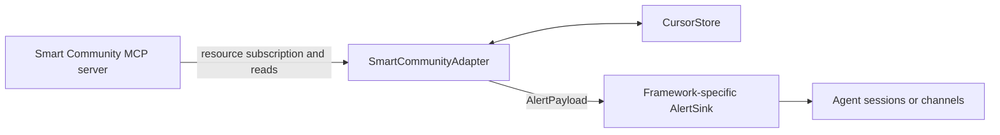

# Smart Community Framework Adapter SDK

The Framework Adapter SDK connects the Smart Community MCP server's proactive resource notifications to an agent framework or MCP client host. It keeps framework-specific session, channel, and message-delivery behavior outside the MCP server.

Ordinary MCP clients do not need an adapter to call `smart_community_*` tools or read resources. Build an adapter when the host must react to server-side events without waiting for a user request, especially when it must route alerts into framework-owned sessions or external channels.

## Architecture



The SDK owns the MCP-facing lifecycle:

- Connect over Streamable HTTP or stdio.
- Subscribe to `smart-community://monitor/<monitor_id>/alerts`.
- Read alerts after resource-update notifications.
- Serialize delivery per monitor and preserve ascending alert-ID order.
- Reconnect with exponential backoff and resubscribe automatically.
- Persist per-monitor delivery cursors when a `CursorStore` is provided.
- Optionally poll as a safety net for a lost notification.

The framework adapter owns the host-facing lifecycle:

- Map a monitor to one or more agents, sessions, users, or channels.
- Format the alert for the destination.
- Authenticate to the host framework.
- Deliver idempotently and apply host-specific retry or authorization policy.
- Start and stop `SmartCommunityAdapter` with the host process or plugin lifecycle.

The MCP server remains unaware of agent IDs, session keys, channel providers, and framework credentials.

## Delivery semantics

- Delivery is **at least once**. A failed batch or restart before cursor advancement can replay an alert.
- A sink must deduplicate with the pair `monitorId` and `alert.id`.
- Alerts are ordered within one monitor. Ordering across monitors is intentionally unspecified.
- A new cursor starts at the current latest alert and does not replay existing history.
- A persistent cursor resumes from the last completed alert after restart.

## Public interfaces

### `SmartCommunityAdapter`

```ts
const adapter = new SmartCommunityAdapter(config, sink);
await adapter.start();
await adapter.stop();
```

`start()` connects, subscribes, synchronizes cursors, and starts optional fallback polling. `stop()` cancels polling and reconnect work, unsubscribes, and closes the MCP transport.

### `AdapterConfig`

| Field | Description |
|---|---|
| `transport` | `{ kind: "http", url, headers? }` or `{ kind: "stdio", command, args? }`. |
| `monitorIds` | Monitor IDs whose alert resources are subscribed. |
| `cursorStore` | Optional cursor persistence. Defaults to `MemoryCursorStore`. |
| `reconnect` | Optional `initialMs`, `maxMs`, and `factor` backoff settings. |
| `pollFallbackMs` | Optional safety-net polling interval. `0` disables polling. |
| `logger` | Optional logger implementing `debug`, `info`, `warn`, and `error`. |

### `AlertSink`

This is the only interface a framework integration must implement:

```ts
interface AlertSink {
	push(payload: AlertPayload): Promise<void>;
}

interface AlertPayload {
	monitorId: string;
	alert: Alert;
}
```

Resolve `push()` only after delivery is complete. Rejecting it leaves the cursor unchanged so the alert batch can be retried.

### Cursor stores

- `MemoryCursorStore` is suitable for tests and ephemeral processes. A restart seeds at the current latest alert.
- `FileCursorStore` atomically persists a JSON map of monitor IDs to alert IDs and supports recovery across restarts.
- A custom `CursorStore` can use a framework database or durable key-value service.

## Minimal adapter

```ts
import {
	FileCursorStore,
	SmartCommunityAdapter,
	type AlertSink,
} from "@smart-community-video/framework-adapter-sdk";

const sink: AlertSink = {
	async push({ monitorId, alert }) {
		const idempotencyKey = `smart-community:${monitorId}:${alert.id}`;
		await host.sendAlert({ idempotencyKey, monitorId, alert });
	},
};

const adapter = new SmartCommunityAdapter(
	{
		transport: { kind: "http", url: "http://localhost:3100/mcp" },
		monitorIds: ["cam_loading_dock"],
		cursorStore: new FileCursorStore("./data/alert-cursors.json"),
		pollFallbackMs: 60000,
	},
	sink,
);

await adapter.start();
```

Keep authentication values outside source control. For HTTP transport, resolve secrets through the host's secret-management mechanism and pass only the resulting headers at runtime.

## When to develop an adapter

Develop an adapter when the MCP client or agent framework needs one or more of these behaviors:

- Proactive alert delivery from MCP resource notifications.
- Routing by monitor to framework-owned agents or sessions.
- Delivery to an external channel managed by the framework.
- Durable cursors and recovery across host restarts.
- Framework-specific formatting, authorization, observability, or lifecycle integration.

Do not develop an adapter solely for interactive tool calls, one-time resource reads, or clients that already support MCP resource subscriptions and expose the required notification routing natively.

## Reference implementation

The [OpenClaw example](examples/openclaw/README.md) implements `AlertSink` as a pure OpenClaw plugin. It demonstrates plugin lifecycle integration, configuration validation, session routing, cursor persistence, and optional external-channel delivery.
