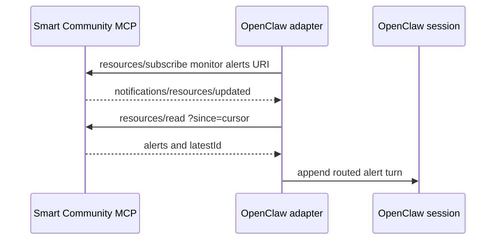

# Smart Community MCP OpenClaw Adapter

This directory is a framework-adapter example implemented as a pure OpenClaw plugin. It subscribes to configured Smart Community MCP monitor-alert resources and routes new alerts to OpenClaw sessions or their external delivery channels.

The example contains no demo agents, personas, monitor definitions, model setup, or scheduled jobs. Supply monitor and agent IDs from your own deployment.

## How it works

- The adapter uses the SDK's long-lived MCP client to subscribe, deduplicate by cursor, preserve per-monitor ordering, and reconnect.
- Its configuration owns the route table: `monitor_id -> OpenClaw session[]`.
- `deliver: false` injects an alert directly into the target session without an LLM. `deliver: true` additionally relays it through the configured external channel.



## Prerequisites

- A clean MCP server is running and reachable at `http://localhost:3100/mcp`, or at the URL that you configure.
- OpenClaw is installed and initialized.
- At least one monitor exists on the MCP server.
- The target OpenClaw agent and session already exist.
- Node.js and npm are available.

## Install with the script

`scripts/install_as_openclaw_plugin.sh` performs the whole plugin-only install: it builds the SDK, installs the plugin dependencies, registers a minimal `plugins.entries.smart-community-alerts` entry if none exists, links the plugin into `~/.openclaw/extensions/`, validates the configuration, and restarts the gateway. It installs nothing else — no agents, personas, skills, monitor routes, models, or scheduled jobs.

```bash
bash packages/framework-adapter-sdk/examples/openclaw/scripts/install_as_openclaw_plugin.sh
```

Useful overrides: `--mcp-url URL`, `--openclaw-home DIR`, `--skip-build`, `--skip-restart`.

The script registers an empty `monitors` map, which routes nothing. If you want to write your own routes (or agents and skills) as part of the same install, run the two halves and do your own configuration work in between, while the plugin is still unlinked and `openclaw.json` is therefore patchable:

```bash
bash scripts/install_as_openclaw_plugin.sh prepare
# write plugins.entries.smart-community-alerts.config, agents, skills ...
bash scripts/install_as_openclaw_plugin.sh finalize
```

`demo/openclaw-adapter/install.sh` in this repository is exactly that pattern: it delegates both halves to this script and only adds its own demo runtime in the middle.

The remaining sections describe the same steps manually.

## Build the plugin

From the `agentic-smart-community` component root, build the SDK and install the plugin dependencies:

```bash
npm -w @smart-community-video/framework-adapter-sdk run build
npm --prefix packages/framework-adapter-sdk/examples/openclaw install
```

OpenClaw loads `index.ts` as declared by `package.json` under `openclaw.bundle.extensions`. The plugin imports the compiled SDK from `../../dist`, so build the SDK before starting the gateway.

## Configure OpenClaw

Add the plugin entry to `~/.openclaw/openclaw.json` before linking the plugin. Its schema requires `mcpServer` and `monitors`; linking an unconfigured plugin can make OpenClaw configuration validation fail.

The following example assumes monitor `cam_loading_dock`, agent `operations-agent`, and an existing target session:

```json
{
  "plugins": {
    "entries": {
      "smart-community-alerts": {
        "enabled": true,
        "config": {
          "mcpServer": {
            "url": "http://localhost:3100/mcp"
          },
          "monitors": {
            "cam_loading_dock": {
              "alerts": [
                {
                  "agentId": "operations-agent",
                  "sessionKey": "agent:operations-agent:main",
                  "deliver": false
                }
              ]
            }
          }
        }
      }
    }
  }
}
```

Do not commit credentials in `mcpServer.headers`. Resolve them through OpenClaw's supported environment or secret configuration.

## Link and load the plugin

From the plugin directory, link it into the OpenClaw extension directory, validate the complete configuration, and restart the gateway:

```bash
cd packages/framework-adapter-sdk/examples/openclaw
mkdir -p ~/.openclaw/extensions
ln -sfn "$(pwd)" ~/.openclaw/extensions/smart-community-alerts
openclaw config validate
openclaw gateway restart
```

The extension ID in the destination path and `plugins.entries` must match `smart-community-alerts`, the ID declared in `openclaw.plugin.json`.

## Configuration reference

| Field | Meaning |
|---|---|
| `mcpServer.url` | Smart Community MCP Streamable HTTP endpoint. |
| `mcpServer.headers` | Optional HTTP headers sent on every MCP request. Keep credentials in OpenClaw's supported secret configuration, not in this repository. |
| `monitors.<id>.alerts[]` | The target routes for `smart-community://monitor/<id>/alerts`. |
| `agentId` | The OpenClaw agent that owns the target session. |
| `sessionKey` | Target session key, such as `agent:operations-agent:main`. |
| `deliver` | `false` injects the alert turn only; `true` additionally requests external-channel delivery. |
| `cursorFile` | Optional persistent delivery-cursor path. Defaults to `<OPENCLAW_HOME>/smart-community-alerts-cursor.json`. |
| `pollFallbackMs` | Optional safety-net poll interval in milliseconds. `0` disables polling. |

Add another `monitors.<id>` entry to route an additional MCP monitor. One monitor can contain multiple alert targets.

With `deliver: false`, the adapter injects the alert into the configured session without an LLM call. With `deliver: true`, the adapter invokes OpenClaw's subagent runtime to relay the alert to the session's configured external channel and record the turn.

## Subscription behavior

1. The adapter opens a stateful MCP session and subscribes to every configured alert URI.
2. When an alert changes a resource, MCP sends `notifications/resources/updated` containing the URI.
3. The adapter reads the resource with `?since=<cursor>`, advances the cursor after successful delivery, and appends the alert into each configured session.

The cursor makes delivery at least once: after a restart, an alert can be retried if its previous delivery did not complete. The plugin supplies a stable idempotency key based on monitor ID and alert ID.

## Verify the adapter

After the gateway restarts:

1. Confirm the plugin starts without `[sb-alerts] invalid plugin config` in the OpenClaw gateway log.
2. Create an alert for the configured MCP monitor.
3. Confirm the alert appears in the target OpenClaw session or external channel.
4. Check `<OPENCLAW_HOME>/smart-community-alerts-cursor.json` to confirm the monitor cursor advances.