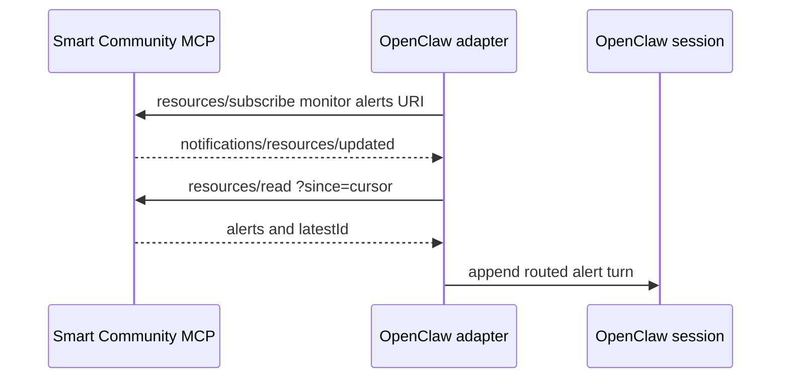

# Smart Community MCP x OpenClaw Adapter

This OpenClaw plugin is a reference framework adapter for a clean **Smart Community MCP server**. It subscribes to configured monitor alert resources and injects new alerts into routed OpenClaw session(s).

The MCP server remains host-agnostic: it does not know about OpenClaw, Feishu, agents, or session routing. This plugin supplies that boundary without adding rules or persona logic to the server.

For the preconfigured Fridge, Child Safety, and Elder Wakeup demo agents, routes, and scheduled reports, follow [Ready-to-Run Demo](../../../../docs/user-guide/get-started/ready-to-run-demo.md).

## How it works

- The adapter uses the SDK's long-lived MCP client to subscribe, deduplicate by cursor, preserve per-monitor ordering, and reconnect.
- Its configuration owns the route table: `monitor_id -> OpenClaw session[]`.
- `deliver: false` injects an alert directly into the target session without an LLM. `deliver: true` additionally relays it through the configured external channel.



## Prerequisites

- A clean MCP server is running and reachable at `http://localhost:3100/mcp`, or at the URL that you configure.
- OpenClaw is installed and initialized.
- At least one monitor exists on the MCP server and an OpenClaw agent/session is available to receive its alerts.
- Node.js and npm are available to build the SDK and install the plugin dependencies.

Register the MCP server, import skills, and create use cases/monitors by following [Get Started](../../../../docs/user-guide/get-started.md).

## Install the adapter

From this directory, build the SDK and install the plugin dependencies:

```bash
npm --prefix ../.. run build
npm install
```

Before linking the plugin into OpenClaw, add its configuration to `~/.openclaw/openclaw.json`. The plugin schema requires both `mcpServer` and `monitors`; configuring it first avoids OpenClaw rejecting an already-discovered but incomplete plugin.

Use your own monitor ID, agent ID, and session key:

```json
{
  "plugins": {
    "entries": {
      "smartbuilding-alerts": {
        "enabled": true,
        "config": {
          "mcpServer": {
            "url": "http://localhost:3100/mcp"
          },
          "monitors": {
            "cam_loading_dock": {
              "alerts": [
                {
                  "agentId": "operations-agent",
                  "sessionKey": "agent:operations-agent:main",
                  "deliver": false
                }
              ]
            }
          }
        }
      }
    }
  }
}
```

Apply that configuration using your normal OpenClaw configuration workflow, then link the plugin and restart the gateway:

```bash
mkdir -p ~/.openclaw/extensions
ln -sfn "$(pwd)" ~/.openclaw/extensions/smartbuilding-alerts
openclaw config validate
openclaw gateway restart
```

## Configuration reference

| Field | Meaning |
|---|---|
| `mcpServer.url` | Smart Community MCP Streamable HTTP endpoint. |
| `mcpServer.headers` | Optional HTTP headers sent on every MCP request. Keep credentials in OpenClaw's supported secret configuration, not in this repository. |
| `monitors.<id>.alerts[]` | The target routes for `smartbuilding://monitor/<id>/alerts`. |
| `agentId` | The OpenClaw agent that owns the target session. |
| `sessionKey` | Target session key, such as `agent:operations-agent:main`. |
| `deliver` | `false` injects the alert turn only; `true` additionally requests external-channel delivery. |
| `cursorFile` | Optional persistent delivery-cursor path. Defaults to `<OPENCLAW_HOME>/smartbuilding-alerts-cursor.json`. |
| `pollFallbackMs` | Optional safety-net poll interval in milliseconds. `0` disables polling. |

Add another `monitors.<id>` entry to route an additional MCP monitor. No server code change is required.

## Subscription behavior

1. The adapter opens a stateful MCP session and subscribes to every configured alert URI.
2. When an alert changes a resource, MCP sends `notifications/resources/updated` containing the URI.
3. The adapter reads the resource with `?since=<cursor>`, advances the cursor after successful delivery, and appends the alert into each configured session.

The cursor makes delivery at-least-once: after a restart, an already delivered alert can be retried if the previous delivery did not complete.