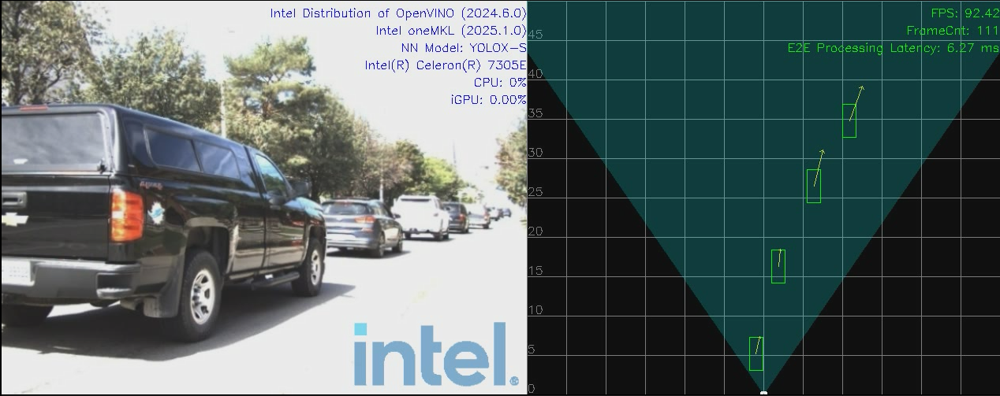
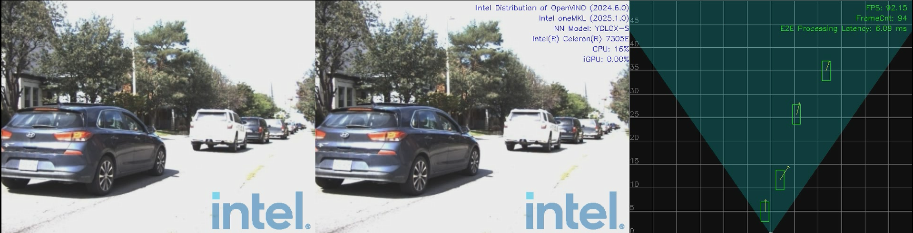
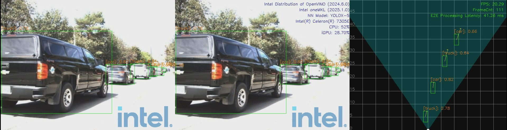

# Intel® Metro AI Suite Sensor Fusion for Traffic Management

Get Started Guide for running on bare metal.

**OS: ubuntu 22.04.1**

**Note: Must install this specific ubuntu version 22.04.1.**

## 1. Overview
### 1.1 Prerequisites
- OpenVINO™ Toolkit
  - Version Type: 2024.6
- Raddet Dataset
  - https://github.com/ZhangAoCanada/RADDet#Dataset
- Platform
  - Intel® Celeron® Processor 7305E (1C+1R/2C+1R usecase)
  - Intel® Core™ Ultra 7 Processor 165H (4C+4R usecase)
  - 13th Gen Intel(R) Core(TM) i7-13700 (16C+4R usecase)
### 1.2 Modules
- AI Inference Service:
  - Media Processing (Camera)
  - Radar Processing (mmWave Radar)
  - Sensor Fusion
- Demo Application

#### 1.2.1 AI Inference Service

AI Inference Service expose both RESTful API or gRPC API to clients, so as pipelines defined by clients could be requested to run within service.

```bash
vim $PROJ_DIR/ai_inference/source/low_latency_server/AiInference.config

...
[HTTP]
address=0.0.0.0
RESTfulPort=50051
gRPCPort=50052
```

- RESTful API: listen on port 50051
- gRPC API: listen on port 50052

> NOTE: 
> - For more details about API description, please refer to file: [InferenceServiceAPIDesign.md](./ai_inference/InferenceServiceAPIDesign.md)
> - For how to run tests through RESTful API and gRPC API, please refer to [sec 5. Run Sensor Fusion Application](#5-run-sensor-fusion-application)

#### 1.2.2 Demo Application
The media processing and sensor fusion results will be displayed. Here's an example for your reference:

[](ai_inference/test/demo/1C1R-Display-type-media-fusion.png)

For more details about the display mode, please refer to [sec 5.3 Run Entry Program](#53-run-entry-program)


## 2. Install Dependencies
Before starting the installation, please configure your proxy.
```bash
 export http_proxy=<Your-Proxy>
 export https_proxy=<Your-Proxy>
```

### [1] BIOS setting

##### MTL

| Setting                                          | Step                                                         |
| ------------------------------------------------ | ------------------------------------------------------------ |
| Enable the Hidden BIOS Setting in Seavo Platform | "Right Shift+F7" Then Change Enabled Debug Setup Menu from [Enabled] to [Disable] |
| Disable VT-d in BIOS                             | Intel Advanced Menu → System Agent (SA) Configuration → VT-d setup menu → VT-d<Disabled>    <br>Note: If VT-d can’t be disabled, please disable Intel Advanced Menu → CPU Configuration → X2APIC |
| Disable SAGV in BIOS                             | Intel Advanced Menu → [System Agent (SA) Configuration]  →  Memory configuration →  SAGV <Disabled> |
| Enable NPU Device                                | Intel Advanced Menu → CPU Configuration → Active SOC-North Efficient-cores <ALL>   <br>Intel Advanced Menu → System Agent (SA) Configuration → NPU Device <Enabled> |
| TDP Configuration                                | SOC TDP configuration is very important for performance. Suggestion: TDP = 45W. For extreme heavy workload, TDP = 64W <br>---TDP = 45W settings: Intel Advanced → Power & Performance → CPU - Power Management Control → Config TDP Configurations → Power Limit 1 <45000> <br>---TDP = 64W settings: Intel Advanced → Power & Performance → CPU - Power Management Control → Config TDP Configurations →  Configurable TDP Boot Mode [Level2] |


##### RPL-S+A770

| Setting                  | Step                                                         |
| ------------------------ | ------------------------------------------------------------ |
| Enable ResizeBar in BIOS | Intel Advanced Menu -> System Agent (SA) Configuration -> PCI Express Configuration -> PCIE Resizable BAR Support <Enabled> |

### [2] install driver related libs

Update kernel, install GPU and NPU(MTL only) driver.

```bash
bash install_driver_related_libs.sh
```

Note that this step may restart the machine 2 or 3 times. Please rerun this script after each restart until you see the output of `All driver libs installed successfully`.

### [3] install project related libs

Install Boost, Spdlog, Thrift, MKL, OpenVINO, GRPC, Level Zero, oneVPL etc.

```bash
bash install_project_related_libs.sh
```


## 3. Build Project
- clone project
  ```bash
  git clone https://github.com/intel-innersource/applications.iot.video-edge-device.holographic-sensor-fusion.git
  ```
- prepare global radar configs in folder: /opt/datasets
    ```bash
    sudo ln -s $PROJ_DIR/ai_inference/deployment/datasets /opt/datasets
    ```

- prepare models in folder: /opt/models
    ```bash
    sudo ln -s $PROJ_DIR/ai_inference/deployment/models /opt/models
    ```
- prepare offline radar results for 4C4R:
    ```bash
    sudo cp $PROJ_DIR/ai_inference/deployment/datasets/radarResults.csv /opt
    ```
- build project
    ``` bash
    bash -x build.sh
    ```

## 4. Dowload and Convert Dataset
For how to get Raddet dataset, please refer to this guide: [how_to_get_RADDet_datasets.md](./how_to_get_RADDet_datasets.md)

Upon success, bin files will be extracted, save to $DATASET_ROOT/bin_files_{VERSION}:
> NOTE: latest converted dataset version should be: v1.0

## 5. Run Sensor Fusion Application

In this section, we describe how to run Intel® Metro AI Suite Sensor Fusion for Traffic Management application.

Intel® Metro AI Suite Sensor Fusion for Traffic Management application can support different pipeline using topology JSON files to describe the pipeline topology. The defined pipeline topology can be found at [sec 5.1 Resources Summary](#51-resources-summary)

There are two steps required for running the sensor fusion application:
- Start AI Inference service, more details can be found at [sec 5.2 Start Service](#52-start-service)
- Run the application entry program, more details can be found at [sec 5.3 Run Entry Program](#53-run-entry-program)

Besides, users can test each component (without display) following the guides at [sec 5.3.2 1C1R Unit Tests](#532-1c+1r-unit-tests), [sec 5.3.4 4C4R Unit Tests](#534-4c+4r-unit-tests), [sec 5.3.6 2C1R Unit Tests](#536-2c+1r-unit-tests), [sec 5.3.8 16C4R Unit Tests](#538-16c+4r-unit-tests)


### 5.1 Resources Summary
- Local File Pipeline for Media pipeline
  - Json File: [localMediaPipeline.json](./ai_inference/test/configs/raddet/1C1R/localMediaPipeline.json)
  - Pipeline Description: 
    ```
    input -> decode -> detection -> tracking -> output
    ```

- Local File Pipeline for mmWave Radar pipeline
  - Json File: [localRadarPipeline.json](./ai_inference/test/configs/raddet/1C1R/localRadarPipeline.json)
  - Pipeline Description: 

    ```
    input -> preprocess -> radar_detection -> clustering -> tracking -> output
    ```

- Local File Pipeline for `Camera + Radar(1C+1R)` Sensor fusion pipeline

  - Json File: [localFusionPipeline.json](./ai_inference/test/configs/raddet/1C1R/localFusionPipeline.json)
  - Pipeline Description: 
    ```
    input  | -> decode     -> detector         -> tracker                  -> |
           | -> preprocess -> radar_detection  -> clustering   -> tracking -> | -> coordinate_transform->fusion -> output
    ```
- Local File Pipeline for `Camera + Radar(4C+4R)` Sensor fusion pipeline

  - Json File: [localFusionPipeline.json](./ai_inference/test/configs/raddet/4C4R/localFusionPipeline.json)
  - Pipeline Description: 
    ```
    input  | -> decode     -> detector         -> tracker                  -> |
           |              -> radarOfflineResults ->                           | -> coordinate_transform->fusion -> |
    input  | -> decode     -> detector         -> tracker                  -> |                                    |
           |              -> radarOfflineResults ->                           | -> coordinate_transform->fusion -> | -> output
    input  | -> decode     -> detector         -> tracker                  -> |                                    |
           |              -> radarOfflineResults ->                           | -> coordinate_transform->fusion -> |
    input  | -> decode     -> detector         -> tracker                  -> |                                    |
           |              -> radarOfflineResults ->                           | -> coordinate_transform->fusion -> |
    ```

- Local File Pipeline for `Camera + Radar(2C+1R)` Sensor fusion pipeline

    - Json File: [localFusionPipeline.json](./ai_inference/test/configs/raddet/2C1R/localFusionPipeline.json)

    - Pipeline Description: 

        ```
               | -> decode     -> detector         -> tracker                  -> |                                    |
        input  | -> decode     -> detector         -> tracker                  -> | ->  Camera2CFusion ->  fusion   -> | -> output
               | -> preprocess -> radar_detection  -> clustering   -> tracking -> |                                    |
        ```

- Local File Pipeline for `Camera + Radar(16C+4R)` Sensor fusion pipeline

    - Json File: [localFusionPipeline.json](./ai_inference/test/configs/raddet/16C4R/localFusionPipeline.json)

    - Pipeline Description: 

        ```
               | -> decode     -> detector         -> tracker                  -> |                                    |
               | -> decode     -> detector         -> tracker                  -> |                                    |
        input  | -> decode     -> detector         -> tracker                  -> |->  Camera4CFusion ->  fusion   ->  |
               | -> decode     -> detector         -> tracker                  -> |                                    |
               |              -> radarOfflineResults ->                           |                                    |
               | -> decode     -> detector         -> tracker                  -> |                                    |
               | -> decode     -> detector         -> tracker                  -> |                                    |
        input  | -> decode     -> detector         -> tracker                  -> |->  Camera4CFusion ->  fusion   ->  |
               | -> decode     -> detector         -> tracker                  -> |                                    |
               |              -> radarOfflineResults ->                           |                                    | -> output
               | -> decode     -> detector         -> tracker                  -> |                                    |
               | -> decode     -> detector         -> tracker                  -> |                                    |
        input  | -> decode     -> detector         -> tracker                  -> |->  Camera4CFusion ->  fusion   ->  |
               | -> decode     -> detector         -> tracker                  -> |                                    |
               |              -> radarOfflineResults ->                           |                                    |
               | -> decode     -> detector         -> tracker                  -> |                                    |
               | -> decode     -> detector         -> tracker                  -> |                                    |
        input  | -> decode     -> detector         -> tracker                  -> |->  Camera4CFusion ->  fusion   ->  |
               | -> decode     -> detector         -> tracker                  -> |                                    |
               |              -> radarOfflineResults ->                           |                                    |
        ```


### 5.2 Start Service

Open a terminal, run the following commands:

```Shell.bash
cd $PROJ_DIR
sudo bash -x run_service_bare.sh

# Output logs:
    [2023-06-26 14:34:42.970] [DualSinks] [info] MaxConcurrentWorkload sets to 1
    [2023-06-26 14:34:42.970] [DualSinks] [info] MaxPipelineLifeTime sets to 300s
    [2023-06-26 14:34:42.970] [DualSinks] [info] Pipeline Manager pool size sets to 1
    [2023-06-26 14:34:42.970] [DualSinks] [trace] [HTTP]: uv loop inited
    [2023-06-26 14:34:42.970] [DualSinks] [trace] [HTTP]: Init completed
    [2023-06-26 14:34:42.971] [DualSinks] [trace] [HTTP]: http server at 0.0.0.0:50051
    [2023-06-26 14:34:42.971] [DualSinks] [trace] [HTTP]: running starts
    [2023-06-26 14:34:42.971] [DualSinks] [info] Server set to listen on 0.0.0.0:50052
    [2023-06-26 14:34:42.972] [DualSinks] [info] Server starts 1 listener. Listening starts
    [2023-06-26 14:34:42.972] [DualSinks] [trace] Connection handle with uid 0 created
    [2023-06-26 14:34:42.972] [DualSinks] [trace] Add connection with uid 0 into the conn pool

```
> NOTE-1 : workload (default as 1) can be configured in file: $PROJ_DIR/ai_inference/source/low_latency_server/AiInference.config
```
...
[Pipeline]
maxConcurrentWorkload=1
```

> NOTE-2 : to stop service, run the following commands:
```bash
sudo pkill Hce
```


### 5.3 Run Entry Program
#### 5.3.1 1C+1R

All executable files are located at: $PROJ_DIR/build/bin

Usage:
```
Usage: CRSensorFusionDisplay <host> <port> <json_file> <total_stream_num> <repeats> <data_path> <display_type> [<save_flag: 0 | 1>] [<pipeline_repeats>] [<fps_window: unsigned>] [<cross_stream_num>] [<warmup_flag: 0 | 1>]  [<logo_flag: 0 | 1>]
--------------------------------------------------------------------------------
Environment requirement:
   unset http_proxy;unset https_proxy;unset HTTP_PROXY;unset HTTPS_PROXY
```
* **host**: use `127.0.0.1` to call from localhost.
* **port**: configured as `50052`, can be changed by modifying file: `$PROJ_DIR/ai_inference/source/low_latency_server/AiInference.config` before starting the service.
* **json_file**: ai pipeline topology file.
* **total_stream_num**: to control the input streams.
* **repeats**: to run tests multiple times, so that we can get more accurate performance.
* **data_path**: multi-sensor binary files folder for input.
* **display_type**: support for `media`, `radar`, `media_radar`, `media_fusion` currently.
  * `media`: only show image results in frontview. Example:
  [](ai_inference/test/demo/1C1R-Display-type-media.png)
  * `radar`: only show radar results in birdview. Example:
  [](ai_inference/test/demo/1C1R-Display-type-radar.png)
  * `media_radar`: show image results in frontview and radar results in birdview separately. Example:
  [](ai_inference/test/demo/1C1R-Display-type-media-radar.png)
  * `media_fusion`: show both for image results in frontview and fusion results in birdview. Example:
  [](ai_inference/test/demo/1C1R-Display-type-media-fusion.png)
* **save_flag**: whether to save display results into video.
* **pipeline_repeats**: pipeline repeats number.
* **fps_window**: The number of frames processed in the past is used to calculate the fps. 0 means all frames processed are used to calculate the fps.
* **cross_stream_num**: the stream number that run in a single pipeline.
* **warmup_flag**: warmup flag before pipeline start.
* **logo_flag**: whether to add intel logo in display.

More specifically, open another terminal, run the following commands:

```bash
# multi-sensor inputs test-case
sudo -E ./build/bin/CRSensorFusionDisplay 127.0.0.1 50052 ai_inference/test/configs/raddet/1C1R/libradar/localFusionPipeline_libradar.json 1 1 /path-to-dataset media_fusion
```
> Note: Run with `root` if users want to get the GPU utilization profiling.

#### 5.3.2 1C+1R Unit Tests
In this section, the unit tests of four major components will be described: media processing, radar processing, fusion pipeline without display and other tools for intermediate results.

Usage:
```
Usage: testGRPCLocalPipeline <host> <port> <json_file> <total_stream_num> <repeats> <data_path> <media_type> [<pipeline_repeats>] [<cross_stream_num>] [<warmup_flag: 0 | 1>]
--------------------------------------------------------------------------------
Environment requirement:
   unset http_proxy;unset https_proxy;unset HTTP_PROXY;unset HTTPS_PROXY
```
* **host**: use `127.0.0.1` to call from localhost.

* **port**: configured as `50052`, can be changed by modifying file: `$PROJ_DIR/ai_inference/source/low_latency_server/AiInference.config` before starting the service.
* **json_file**: ai pipeline topology file.
* **total_stream_num**: to control the input video streams.
* **repeats**: to run tests multiple times, so that we can get more accurate performance.
* **abs_data_path**: input data, remember to use absolute data path, or it may cause error.
* **media_type**: support for `image`, `video`, `multisensor` currently.
* **pipeline_repeats**: the pipeline repeats number.
* **cross_stream_num**: the stream number that run in a single pipeline.

##### 5.3.2.1 Unit Test: Media Processing
Open another terminal, run the following commands:
```bash
# media test-case
./build/bin/testGRPCLocalPipeline 127.0.0.1 50052 ai_inference/test/configs/raddet/1C1R/localMediaPipeline.json 1 1 /path-to-dataset multisensor
```

##### 5.3.2.2 Unit Test: Radar Processing

Open another terminal, run the following commands:
```bash
# radar test-case
./build/bin/testGRPCLocalPipeline 127.0.0.1 50052 ai_inference/test/configs/raddet/1C1R/libradar/localRadarPipeline_libradar.json 1 1 /path-to-dataset multisensor
```

##### 5.3.2.3 Unit Test: Fusion pipeline without display
Open another terminal, run the following commands:
```bash
# fusion test-case
./build/bin/testGRPCLocalPipeline 127.0.0.1 50052 ai_inference/test/configs/raddet/1C1R/libradar/localFusionPipeline_libradar.json 1 1 /path-to-dataset multisensor
```
##### 5.3.2.4 GPU VPLDecode test
```bash
./build/bin/testGRPCLocalPipeline 127.0.0.1 50052 ai_inference/test/configs/gpuLocalVPLDecodeImagePipeline.json 1 1000 $PROJ_DIR/ai_inference/test/demo/images image
```
##### 5.3.2.5 Media model inference visualization
```bash
./build/bin/MediaDisplay 127.0.0.1 50052 ai_inference/test/configs/raddet/1C1R/localMediaPipeline.json 1 1 /path-to-dataset multisensor
```
##### 5.3.2.6 Radar pipeline with radar pcl as output
```bash
./build/bin/testGRPCLocalPipeline 127.0.0.1 50052 ai_inference/test/configs/raddet/1C1R/libradar/localRadarPipeline_pcl_libradar.json 1 1 /path-to-dataset multisensor
```
##### 5.3.2.7 Save radar pipeline tracking results
```bash
./build/bin/testGRPCLocalPipeline 127.0.0.1 50052 ai_inference/test/configs/raddet/1C1R/libradar/localRadarPipeline_saveResult_libradar.json 1 1 /path-to-dataset multisensor
```
##### 5.3.2.8 Save radar pipeline pcl results
```bash
./build/bin/testGRPCLocalPipeline 127.0.0.1 50052 ai_inference/test/configs/raddet/1C1R/libradar/localRadarPipeline_savepcl_libradar.json 1 1 /path-to-dataset multisensor
```
##### 5.3.2.9 Save radar pipeline clustering results
```bash
./build/bin/testGRPCLocalPipeline 127.0.0.1 50052 ai_inference/test/configs/raddet/1C1R/libradar/localRadarPipeline_saveClustering_libradar.json 1 1 /path-to-dataset multisensor
```
##### 5.3.2.10 Test radar pipeline performance
```bash
## no need to run the service
export HVA_NODE_DIR=$PWD/build/lib
source /opt/intel/openvino_2024/setupvars.sh
source /opt/intel/oneapi/setvars.sh
./build/bin/testRadarPerformance ai_inference/test/configs/raddet/1C1R/libradar/localRadarPipeline_libradar.json /path-to-dataset 1
```
##### 5.3.2.11 Radar pcl results visualization
```bash
./build/bin/CRSensorFusionRadarDisplay 127.0.0.1 50052 ai_inference/test/configs/raddet/1C1R/libradar/localRadarPipeline_savepcl_libradar.json 1 1 /path-to-dataset pcl
```
##### 5.3.2.12 Radar clustering results visualization
```bash
./build/bin/CRSensorFusionRadarDisplay 127.0.0.1 50052 ai_inference/test/configs/raddet/1C1R/libradar/localRadarPipeline_saveClustering_libradar.json 1 1 /path-to-dataset clustering
```
##### 5.3.2.13 Radar tracking results visualization
```bash
./build/bin/CRSensorFusionRadarDisplay 127.0.0.1 50052 ai_inference/test/configs/raddet/1C1R/libradar/localRadarPipeline_libradar.json 1 1 /path-to-dataset tracking
```

#### 5.3.3 4C+4R

All executable files are located at: $PROJ_DIR/build/bin

Usage:
```
Usage: CRSensorFusion4C4RDisplay <host> <port> <json_file> <additional_json_file> <total_stream_num> <repeats> <data_path> <display_type> [<save_flag: 0 | 1>] [<pipeline_repeats>] [<cross_stream_num>] [<warmup_flag: 0 | 1>] [<logo_flag: 0 | 1>]
--------------------------------------------------------------------------------
Environment requirement:
   unset http_proxy;unset https_proxy;unset HTTP_PROXY;unset HTTPS_PROXY
```
* **host**: use `127.0.0.1` to call from localhost.
* **port**: configured as `50052`, can be changed by modifying file: `$PROJ_DIR/ai_inference/source/low_latency_server/AiInference.config` before starting the service.
* **json_file**: ai pipeline topology file.
* **additional_json_file**: ai pipeline additional topology file.
* **total_stream_num**: to control the input streams.
* **repeats**: to run tests multiple times, so that we can get more accurate performance.
* **data_path**: multi-sensor binary files folder for input.
* **display_type**: support for `media`, `radar`, `media_radar`, `media_fusion` currently.
  * `media`: only show image results in frontview. Example:
  [](ai_inference/test/demo/4C4R-Display-type-media.png)
  * `radar`: only show radar results in birdview. Example:
  [](ai_inference/test/demo/4C4R-Display-type-radar.png)
  * `media_radar`: show image results in frontview and radar results in birdview separately. Example:
  [](ai_inference/test/demo/4C4R-Display-type-media-radar.png)
  * `media_fusion`: show both for image results in frontview and fusion results in birdview. Example:
  [](ai_inference/test/demo/4C4R-Display-type-media-fusion.png)
* **save_flag**: whether to save display results into video.
* **pipeline_repeats**: pipeline repeats number.
* **cross_stream_num**: the stream number that run in a single pipeline.
* **warmup_flag**: warmup flag before pipeline start.
* **logo_flag**: whether to add intel logo in display.

More specifically, open another terminal, run the following commands:

```bash
# multi-sensor inputs test-case
sudo -E ./build/bin/CRSensorFusion4C4RDisplay 127.0.0.1 50052 ai_inference/test/configs/raddet/4C4R/localFusionPipeline.json ai_inference/test/configs/raddet/4C4R/localFusionPipeline_npu.json 4 1 /path-to-dataset media_fusion
```
> Note: Run with `root` if users want to get the GPU utilization profiling.

To run 4C+4R with cross-stream support, for example, process 3 streams on GPU with 1 thread and the other 1 stream on NPU in another thread, run the following command:
```bash
# multi-sensor inputs test-case
sudo -E ./build/bin/CRSensorFusion4C4RDisplayCrossStream 127.0.0.1 50052 ai_inference/test/configs/raddet/4C4R/cross-stream/localFusionPipeline.json ai_inference/test/configs/raddet/4C4R/cross-stream/localFusionPipeline_npu.json 4 1 /path-to-dataset media_fusion save_flag 1 3
```

For the command above, if you encounter problems with opencv due to remote connection, you can try running the following command which sets the save flag to 2 meaning that the video will be saved locally without needing to show on the screen:
```bash
# multi-sensor inputs test-case
sudo -E ./build/bin/CRSensorFusion4C4RDisplayCrossStream 127.0.0.1 50052 ai_inference/test/configs/raddet/4C4R/cross-stream/localFusionPipeline.json ai_inference/test/configs/raddet/4C4R/cross-stream/localFusionPipeline_npu.json 4 1 /path-to-dataset media_fusion 2 1 3
```

#### 5.3.4 4C+4R Unit Tests
In this section, the unit tests of two major components will be described: fusion pipeline without display and media processing.

Usage:
```
Usage: testGRPC4C4RPipeline <host> <port> <json_file> <additional_json_file> <total_stream_num> <repeats> <data_path> [<pipeline_repeats>] [<cross_stream_num>] [<warmup_flag: 0 | 1>]
--------------------------------------------------------------------------------
Environment requirement:
   unset http_proxy;unset https_proxy;unset HTTP_PROXY;unset HTTPS_PROXY
```
* **host**: use `127.0.0.1` to call from localhost.
* **port**: configured as `50052`, can be changed by modifying file: `$PROJ_DIR/ai_inference/source/low_latency_server/AiInference.config` before starting the service.
* **json_file**: ai pipeline topology file.
* **additional_json_file**: ai pipeline additional topology file.
* **total_stream_num**: to control the input video streams.
* **repeats**: to run tests multiple times, so that we can get more accurate performance.
* **data_path**: input data, remember to use absolute data path, or it may cause error.
* **pipeline_repeats**: pipeline repeats number.
* **cross_stream_num**: the stream number that run in a single pipeline.
* **warmup_flag**: warmup flag before pipeline start.

**Set offline radar CSV file path**
First, set the offline radar CSV file path in both [localFusionPipeline.json](./ai_inference/test/configs/raddet/4C4R/localFusionPipeline.json) and [localFusionPipeline_npu.json](./ai_inference/test/configs/raddet/4C4R/localFusionPipeline_npu.json) with "Configure String": "RadarDataFilePath=(STRING)/opt/radarResults.csv" like below:
```bash
{
  "Node Class Name": "RadarResultReadFileNode",
  ......
  "Configure String": "......;RadarDataFilePath=(STRING)/opt/radarResults.csv"
},
```
The method for generating offline radar files is described in [5.3.2.7 Save radar pipeline tracking results](#5327-save-radar-pipeline-tracking-results). Or you can use a pre-prepared data with the command below:
```bash
sudo cp $PROJ_DIR/ai_inference/deployment/datasets/radarResults.csv /opt
```
##### 5.3.4.1 Unit Test: Fusion Pipeline without display
Open another terminal, run the following commands:
```bash
# fusion test-case
sudo -E ./build/bin/testGRPC4C4RPipeline 127.0.0.1 50052 ai_inference/test/configs/raddet/4C4R/localFusionPipeline.json ai_inference/test/configs/raddet/4C4R/localFusionPipeline_npu.json 4 1 /path-to-dataset
```

##### 5.3.4.2 Unit Test: Fusion Pipeline with cross-stream without display
Open another terminal, run the following commands:
```bash
# fusion test-case
sudo -E ./build/bin/testGRPC4C4RPipelineCrossStream 127.0.0.1 50052 ai_inference/test/configs/raddet/4C4R/cross-stream/localFusionPipeline.json ai_inference/test/configs/raddet/4C4R/cross-stream/localFusionPipeline_npu.json 4 1 /path-to-dataset 1 3 
```

##### 5.3.4.3 Unit Test: Media Processing
Open another terminal, run the following commands:
```bash
# media test-case
sudo -E ./build/bin/testGRPC4C4RPipeline 127.0.0.1 50052 ai_inference/test/configs/raddet/4C4R/localMediaPipeline.json ai_inference/test/configs/raddet/4C4R/localMediaPipeline_npu.json 4 1 /path-to-dataset
```

```bash
# cpu detection test-case
sudo -E ./build/bin/testGRPCLocalPipeline 127.0.0.1 50052 ai_inference/test/configs/raddet/UTCPUDetection-yoloxs.json 1 1 /path-to-dataset multisensor
```
```bash
# gpu detection test-case
sudo -E ./build/bin/testGRPCLocalPipeline 127.0.0.1 50052 ai_inference/test/configs/raddet/UTGPUDetection-yoloxs.json 1 1 /path-to-dataset multisensor
```
```bash
# npu detection test-case
sudo -E ./build/bin/testGRPCLocalPipeline 127.0.0.1 50052 ai_inference/test/configs/raddet/UTNPUDetection-yoloxs.json 1 1 /path-to-dataset multisensor
```


#### 5.3.5 2C+1R

All executable files are located at: $PROJ_DIR/build/bin

Usage:

```bash
Usage: CRSensorFusion2C1RDisplay <host> <port> <json_file> <total_stream_num> <repeats> <data_path> <display_type> [<save_flag: 0 | 1>] [<pipeline_repeats>] [<fps_window: unsigned>] [<cross_stream_num>] [<warmup_flag: 0 | 1>]  [<logo_flag: 0 | 1>]
--------------------------------------------------------------------------------
Environment requirement:
   unset http_proxy;unset https_proxy;unset HTTP_PROXY;unset HTTPS_PROXY
```

* **host**: use `127.0.0.1` to call from localhost.
* **port**: configured as `50052`, can be changed by modifying file: `$PROJ_DIR/ai_inference/source/low_latency_server/AiInference.config` before starting the service.
* **json_file**: ai pipeline topology file.
* **total_stream_num**: to control the input streams.
* **repeats**: to run tests multiple times, so that we can get more accurate performance.
* **data_path**: multi-sensor binary files folder for input.
* **display_type**: support for `media`, `radar`, `media_radar`, `media_fusion` currently.
    * `media`: only show image results in frontview. Example:
        [](ai_inference/test/demo/2C1R-Display-type-media.png)
    * `radar`: only show radar results in birdview. Example:
        [](ai_inference/test/demo/2C1R-Display-type-radar.png)
    * `media_radar`: show image results in frontview and radar results in birdview separately. Example:
        [](ai_inference/test/demo/2C1R-Display-type-media-radar.png)
    * `media_fusion`: show both for image results in frontview and fusion results in birdview. Example:
        [](ai_inference/test/demo/2C1R-Display-type-media-fusion.png)
* **save_flag**: whether to save display results into video.
* **pipeline_repeats**: pipeline repeats number.
* **fps_window**: The number of frames processed in the past is used to calculate the fps. 0 means all frames processed are used to calculate the fps.
* **cross_stream_num**: the stream number that run in a single pipeline.
* **warmup_flag**: warmup flag before pipeline start.
* **logo_flag**: whether to add intel logo in display.

More specifically, open another terminal, run the following commands:

```bash
# multi-sensor inputs test-case
sudo -E ./build/bin/CRSensorFusion2C1RDisplay 127.0.0.1 50052 ai_inference/test/configs/raddet/2C1R/localFusionPipeline_libradar.json 1 1 /path-to-dataset media_fusion
```

> Note: Run with `root` if users want to get the GPU utilization profiling.

#### 5.3.6 2C+1R Unit Tests

In this section, the unit tests of three major components will be described: media processing, radar processing, fusion pipeline without display.

Usage:

```
Usage: testGRPC2C1RPipeline <host> <port> <json_file> <total_stream_num> <repeats> <data_path> <media_type> [<pipeline_repeats>] [<cross_stream_num>] [<warmup_flag: 0 | 1>]
--------------------------------------------------------------------------------
Environment requirement:
   unset http_proxy;unset https_proxy;unset HTTP_PROXY;unset HTTPS_PROXY
```

* **host**: use `127.0.0.1` to call from localhost.

* **port**: configured as `50052`, can be changed by modifying file: `$PROJ_DIR/ai_inference/source/low_latency_server/AiInference.config` before starting the service.
* **json_file**: ai pipeline topology file.
* **total_stream_num**: to control the input video streams.
* **repeats**: to run tests multiple times, so that we can get more accurate performance.
* **abs_data_path**: input data, remember to use absolute data path, or it may cause error.
* **media_type**: support for `image`, `video`, `multisensor` currently.
* **pipeline_repeats**: the pipeline repeats number.
* **cross_stream_num**: the stream number that run in a single pipeline.


##### 5.3.6.1 Unit Test: Media Processing

Open another terminal, run the following commands:

```bash
# media test-case
./build/bin/testGRPC2C1RPipeline 127.0.0.1 50052 ./ai_inference/test/configs/raddet/2C1R/localMediaPipeline.json 1 1 /path-to-dataset multisensor
```

##### 5.3.6.2 Unit Test: Radar Processing

Open another terminal, run the following commands:

```bash
# radar test-case
./build/bin/testGRPC2C1RPipeline 127.0.0.1 50052 ./ai_inference/test/configs/raddet/2C1R/localRadarPipeline_libradar.json 1 1 /path-to-dataset multisensor
```

##### 5.3.6.3 Unit Test: Fusion pipeline without display

Open another terminal, run the following commands:

```bash
# fusion test-case
./build/bin/testGRPC2C1RPipeline 127.0.0.1 50052 ./ai_inference/test/configs/raddet/2C1R/localFusionPipeline_libradar.json 1 1 /path-to-dataset multisensor
```

#### 5.3.7 16C+4R

All executable files are located at: $PROJ_DIR/build/bin

Usage:

```
Usage: CRSensorFusion16C4RDisplay <host> <port> <json_file> <total_stream_num> <repeats> <data_path> <display_type> [<save_flag: 0 | 1>] [<pipeline_repeats>] [<cross_stream_num>] [<warmup_flag: 0 | 1>] [<logo_flag: 0 | 1>]
--------------------------------------------------------------------------------
Environment requirement:
   unset http_proxy;unset https_proxy;unset HTTP_PROXY;unset HTTPS_PROXY
```

* **host**: use `127.0.0.1` to call from localhost.
* **port**: configured as `50052`, can be changed by modifying file: `$PROJ_DIR/ai_inference/source/low_latency_server/AiInference.config` before starting the service.
* **json_file**: ai pipeline topology file.
* **total_stream_num**: to control the input streams.
* **repeats**: to run tests multiple times, so that we can get more accurate performance.
* **data_path**: multi-sensor binary files folder for input.
* **display_type**: support for `media`, `radar`, `media_radar`, `media_fusion` currently.
    * `media`: only show image results in frontview. Example:
        [](ai_inference/test/demo/16C4R-Display-type-media.png)
    * `radar`: only show radar results in birdview. Example:
        [](ai_inference/test/demo/16C4R-Display-type-radar.png)
    * `media_radar`: show image results in frontview and radar results in birdview separately. Example:
        [](ai_inference/test/demo/16C4R-Display-type-media-radar.png)
    * `media_fusion`: show both for image results in frontview and fusion results in birdview. Example:
        [](ai_inference/test/demo/16C4R-Display-type-media-fusion.png)
* **save_flag**: whether to save display results into video.
* **pipeline_repeats**: pipeline repeats number.
* **cross_stream_num**: the stream number that run in a single pipeline.
* **warmup_flag**: warmup flag before pipeline start.
* **logo_flag**: whether to add intel logo in display.

More specifically, open another terminal, run the following commands:

```bash
# multi-sensor inputs test-case
sudo -E ./build/bin/CRSensorFusion16C4RDisplay 127.0.0.1 50052 ./ai_inference/test/configs/raddet/16C4R/localFusionPipeline.json 4 1 /path-to-dataset media_fusion
```

> Note: Run with `root` if users want to get the GPU utilization profiling.

#### 5.3.8 16C+4R Unit Tests

In this section, the unit tests of two major components will be described: fusion pipeline without display and media processing.

Usage:

```
Usage: testGRPC16C4RPipeline <host> <port> <json_file> <total_stream_num> <repeats> <data_path> [<pipeline_repeats>] [<cross_stream_num>] [<warmup_flag: 0 | 1>]
--------------------------------------------------------------------------------
Environment requirement:
   unset http_proxy;unset https_proxy;unset HTTP_PROXY;unset HTTPS_PROXY
```

* **host**: use `127.0.0.1` to call from localhost.
* **port**: configured as `50052`, can be changed by modifying file: `$PROJ_DIR/ai_inference/source/low_latency_server/AiInference.config` before starting the service.
* **json_file**: ai pipeline topology file.
* **total_stream_num**: to control the input video streams.
* **repeats**: to run tests multiple times, so that we can get more accurate performance.
* **data_path**: input data, remember to use absolute data path, or it may cause error.
* **pipeline_repeats**: pipeline repeats number.
* **cross_stream_num**: the stream number that run in a single pipeline.
* **warmup_flag**: warmup flag before pipeline start.

**Set offline radar CSV file path**
First, set the offline radar CSV file path in both [localFusionPipeline.json](./ai_inference/test/configs/raddet/16C4R/localFusionPipeline.json) with "Configure String": "RadarDataFilePath=(STRING)/opt/radarResults.csv" like below:

```bash
{
  "Node Class Name": "RadarResultReadFileNode",
  ......
  "Configure String": "......;RadarDataFilePath=(STRING)/opt/radarResults.csv"
},
```

The method for generating offline radar files is described in [5.3.2.7 Save radar pipeline tracking results](#5327-save-radar-pipeline-tracking-results). Or you can use a pre-prepared data with the command below:

```bash
sudo cp $PROJ_DIR/ai_inference/deployment/datasets/radarResults.csv /opt
```

##### 5.3.8.1 Unit Test: Fusion Pipeline without display

Open another terminal, run the following commands:

```bash
# fusion test-case
sudo -E ./build/bin/testGRPC16C4RPipeline 127.0.0.1 50052 ai_inference/test/configs/raddet/16C4R/localFusionPipeline.json 4 1 /path-to-dataset
```

##### 5.3.8.2 Unit Test: Media Processing

Open another terminal, run the following commands:

```bash
# media test-case
sudo -E ./build/bin/testGRPC16C4RPipeline 127.0.0.1 50052 ai_inference/test/configs/raddet/16C4R/localMediaPipeline.json 4 1 /path-to-dataset
```


### 5.4 KPI test

#### 5.4.1 1C+1R
```bash
# Run service with the following command:
sudo bash run_service_bare_log.sh
# Open another terminal, run the command below:
sudo -E ./build/bin/testGRPCLocalPipeline 127.0.0.1 50052 ai_inference/test/configs/raddet/1C1R/libradar/localFusionPipeline_libradar.json 1 10 /path-to-dataset multisensor
```
Fps and average latency will be calculated.
#### 5.4.2 4C+4R
```bash
# Run service with the following command:
sudo bash run_service_bare_log.sh
# Open another terminal, run the command below:
sudo -E ./build/bin/testGRPC4C4RPipeline 127.0.0.1 50052 ai_inference/test/configs/raddet/4C4R/localFusionPipeline.json ai_inference/test/configs/raddet/4C4R/localFusionPipeline_npu.json 4 10 /path-to-dataset
```
Fps and average latency will be calculated.

#### 5.4.3 2C+1R

```bash
# Run service with the following command:
sudo bash run_service_bare_log.sh
# Open another terminal, run the command below:
sudo -E ./build/bin/testGRPC2C1RPipeline 127.0.0.1 50052 ./ai_inference/test/configs/raddet/2C1R/localFusionPipeline_libradar.json 1 10 /path-to-dataset multisensor
```

Fps and average latency will be calculated.

#### 5.4.4 16C+4R

```bash
# Run service with the following command:
sudo bash run_service_bare_log.sh
# Open another terminal, run the command below:
sudo -E ./build/bin/testGRPC16C4RPipeline 127.0.0.1 50052 ai_inference/test/configs/raddet/16C4R/localFusionPipeline.json 4 10 /path-to-dataset
```

Fps and average latency will be calculated.

### 5.5 Stability test

#### 5.5.1 1C+1R stability test


> NOTE : change workload configuration to 1 in file: $PROJ_DIR/ai_inference/source/low_latency_server/AiInference.config
```
...
[Pipeline]
maxConcurrentWorkload=1
```
Run the service first, and open another terminal, run the command below:
```bash
# 1C1R without display
sudo -E ./build/bin/testGRPCLocalPipeline 127.0.0.1 50052 ai_inference/test/configs/raddet/1C1R/libradar/localFusionPipeline_libradar.json 1 100 /path-to-dataset multisensor 100
```
#### 5.5.2 4C+4R stability test


> NOTE : change workload configuration to 4 in file: $PROJ_DIR/ai_inference/source/low_latency_server/AiInference.config
```
...
[Pipeline]
maxConcurrentWorkload=4
```
Run the service first, and open another terminal, run the command below:
```bash
# 4C4R without display
sudo -E ./build/bin/testGRPC4C4RPipeline 127.0.0.1 50052 ai_inference/test/configs/raddet/4C4R/localFusionPipeline.json ai_inference/test/configs/raddet/4C4R/localFusionPipeline_npu.json 4 100 /path-to-dataset 100
```

#### 5.5.3 2C+1R stability test


> NOTE : change workload configuration to 1 in file: $PROJ_DIR/ai_inference/source/low_latency_server/AiInference.config

```
...
[Pipeline]
maxConcurrentWorkload=1
```

Run the service first, and open another terminal, run the command below:

```bash
# 2C1R without display
sudo -E ./build/bin/testGRPC2C1RPipeline 127.0.0.1 50052 ./ai_inference/test/configs/raddet/2C1R/localFusionPipeline_libradar.json 1 100 /path-to-dataset multisensor 100
```

#### 5.5.4 16C+4R stability test


> NOTE : change workload configuration to 4 in file: $PROJ_DIR/ai_inference/source/low_latency_server/AiInference.config

```
...
[Pipeline]
maxConcurrentWorkload=4
```

Run the service first, and open another terminal, run the command below:

```bash
# 16C4R without display
sudo -E ./build/bin/testGRPC16C4RPipeline 127.0.0.1 50052 ai_inference/test/configs/raddet/16C4R/localFusionPipeline.json 4 100 /path-to-dataset 100
```


## 6. Build Docker image

### Install Docker Engine and Docker Compose on Ubuntu

Install [Docker Engine](https://docs.docker.com/engine/install/ubuntu/) and [Docker Compose](https://docs.docker.com/compose/) according to the guide on the official website.

Before you install Docker Engine for the first time on a new host machine, you need to set up the Docker `apt` repository. Afterward, you can install and update Docker from the repository.

1. Set up Docker's `apt` repository.

```bash
# Add Docker's official GPG key:
sudo -E apt-get update
sudo -E apt-get install ca-certificates curl
sudo -E install -m 0755 -d /etc/apt/keyrings
sudo -E curl -fsSL https://download.docker.com/linux/ubuntu/gpg -o /etc/apt/keyrings/docker.asc
sudo chmod a+r /etc/apt/keyrings/docker.asc

# Add the repository to Apt sources:
echo \
  "deb [arch=$(dpkg --print-architecture) signed-by=/etc/apt/keyrings/docker.asc] https://download.docker.com/linux/ubuntu \
  $(. /etc/os-release && echo "${UBUNTU_CODENAME:-$VERSION_CODENAME}") stable" | \
  sudo tee /etc/apt/sources.list.d/docker.list > /dev/null
sudo -E apt-get update
```

2. Install the Docker packages.

To install the latest version, run:

```bash
sudo -E apt-get install docker-ce docker-ce-cli containerd.io docker-buildx-plugin docker-compose-plugin
```


3. Verify that the installation is successful by running the `hello-world` image:

```bash
sudo docker run hello-world
```

This command downloads a test image and runs it in a container. When the container runs, it prints a confirmation message and exits.

4. Add user to group

```bash
sudo usermod -aG docker $USER
newgrp docker
```


5. Then pull base image

```bash
docker pull ubuntu:22.04
```


### Install the corresponding driver on the host

```bash
bash install_driver_related_libs.sh
```


**Note that above driver is the BKC(best known configuration) version, which can get the best performance but with many restrictions when installing the driver and building the docker image.**

**If BKC is not needed and other versions of the driver are already installed on the machine, you don't need to do this step.**


### Build and run docker image through scripts

> **Note that the default username is `openvino` and password is `intel` in docker image.**

##### Build and run docker image

```bash
bash build_docker.sh <IMAGE_TAG, default tfcc:latest> <DOCKERFILE, default Dockerfile_TFCC.dockerfile>  <BASE, default ubuntu> <BASE_VERSION, default 22.04> 
```

```
bash run_docker.sh <DOCKER_IMAGE, default tfcc:latest> <NPU_ON, default true>
```


```bash
cd $PROJ_DIR/docker
bash build_docker.sh tfcc:latest Dockerfile_TFCC.dockerfile
bash run_docker.sh tfcc:latest false
# After the run is complete, the container ID will be output, or you can view it through docker ps 
```

##### Enter docker

```bash
docker exec -it <container id> /bin/bash
```


##### Copy dataset

```
docker cp /path/to/dataset <container id>:/path/to/dataset
```


### Build and run docker image through docker compose

> **Note that the default username is `openvino` and password is `intel` in docker image.**

Modify `proxy`, `VIDEO_GROUP_ID` and `RENDER_GROUP_ID` in tfcc.env.

```bash
# proxy settings
https_proxy=
http_proxy=
# base image settings
BASE=ubuntu
BASE_VERSION=22.04
# group IDs for various services
VIDEO_GROUP_ID=44
RENDER_GROUP_ID=110
# display settings
DISPLAY=$DISPLAY
```

You can get  `VIDEO_GROUP_ID` and `RENDER_GROUP_ID`  with the following command:

```bash
# VIDEO_GROUP_ID
echo $(getent group video | awk -F: '{printf "%s\n", $3}')
# RENDER_GROUP_ID
echo $(getent group render | awk -F: '{printf "%s\n", $3}')
```


##### Build and run docker image

```bash
cd $PROJ_DIR/docker
docker compose up tfcc -d
```

##### Enter docker

```bash
docker compose exec tfcc /bin/bash
```

##### Copy dataset

Find the container name or ID:

```bash
docker compose ps
```

Sample output:

```bash
NAME                IMAGE      COMMAND       SERVICE    CREATED         STATUS         PORTS
docker-tfcc-1    tfcc:latest   "/bin/bash"     tfcc   4 minutes ago   Up 9 seconds
```

copy dataset

```bash
docker cp /path/to/dataset docker-tfcc-1:/path/to/dataset
```


### Running inside docker

Enter the project directory `/home/openvino/metro-2.0` then run `bash -x build.sh` to build the project. Then following the guides [sec 5. Run Sensor Fusion Application](#5-run-sensor-fusion-application) to run sensor fusion application.


## 7. Code Reference

Some of the code is referenced from the following projects:
- [IGT GPU Tools](https://gitlab.freedesktop.org/drm/igt-gpu-tools) (MIT License)
- [Intel DL Streamer](https://github.com/dlstreamer/dlstreamer) (MIT License)
- [Open Model Zoo](https://github.com/openvinotoolkit/open_model_zoo) (Apache-2.0 License)
