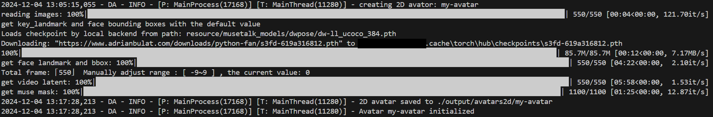
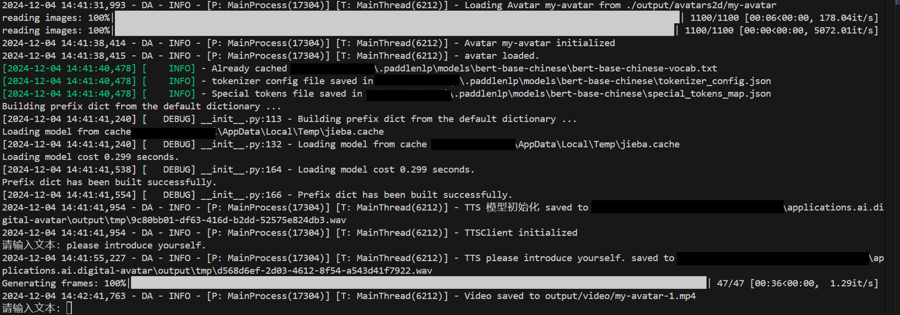
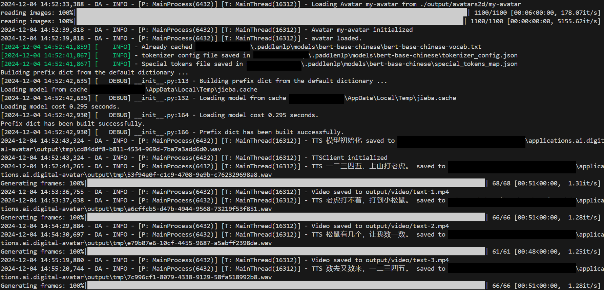
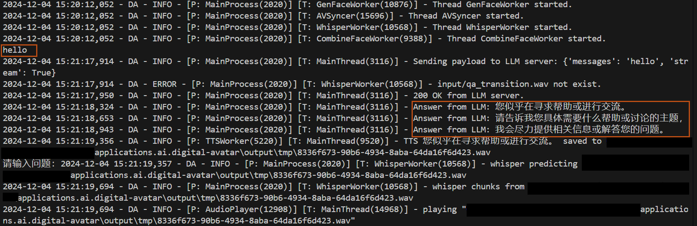
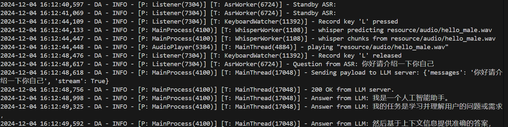

# Usage Guide

## 2D Avatar

### 1. Prepare Avatar Character

To generate a 2d avatar character from a template video:

```bash
python prepare_2d_avatar.py -v input/video.mp4 -ai my-avatar
```

The terminal will show the completion progress, it may takes a few minutes.


The avatar will be saved to dir `output/avatars2d/my-avatar`.

If the client has multiple GPUs and you want the avatar to run on a specific GPU, please modify the `device` of the `ov` in the /resource/config.yaml. For example, if you have an integrated GPU (named GPU 0 in the system) and an A770 (named GPU 1 in the system) in the client, and you want to use the A770, please change the variable from `GPU` to `GPU.1`.

### 2. Generate Offline Video

#### 2.1 From keyboard input

To convert text to 2d avatar video by exist avatar character:

```bash
python text_to_2d_avatar.py -ai my-avatar
```
The terminal will show the completion progress. When run for the first time, it will display additional information about the material downloading.


Input the text content in the console, the output video will be saved to dir `output/video`.

Input `exit` to exit program.

#### 2.2 From input file

To convert a text file to 2d avatar video by exist avatar character:

```bash
python file_to_2d_avatar.py -ai my-avatar -i input/text.txt
```

The terminal will show the information of the progress. When run for the first time, it will display additional information about the material downloading.


The content from input text file will be converted to 2d avatar video line by line.
The output video will be saved to dir `output/video`.

### 3.Display Online Video

In this part, the process will send messages to RAG to get answer, so please make sure that the RAG is ready. In addition, the corresponding `base_url` in the /resource/config.yaml should be changed to the right one.

#### 3.1 Text Chat with Avatar

Chat with exist 2d avatar character via keyboard input.

```bash
python avatar2d_chat_online_text.py -ai my-avatar
```

The terminal will show the information of the progress, including the input from keyboard and the answer from RAG.


Meanwhile, avatar character will display on screen.

Input `exit` to exit program.

#### 3.2 Voice Chat with Avatar

Chat with exist 2d avatar character via voice.

```bash
python avatar2d_chat_online_voice.py -ai my-avatar
```

The terminal will show the information of the progress, including the output of ASR (voice input) and the answer from RAG.



Meanwhile, avatar character will display on screen. There are two ways to chat with avatar character:

- Press `L` key on the keyboard and speak out the question, then release the `L` key after you end the question.
- Speak out the wake words defined in `da/config/wake/wake_words.py`. Speak out the questions after you see the
  `Wake by word` in the console log.

Press `ctrl+c` to exit program.

## 3D Avatar

Please start the render to show the character of 3D avatar.

### 1. Run socket server

```bash
python -m da.avatar3d.socketio_server
```

### 2. Start avatar

In this part, the process will send messages to RAG and SAiD, so please make sure that the RAG and SAiD are ready. In addition, the corresponding `base_url` and `said_addr` in the /resource/config.yaml should be changed to the right one.

Please open a new terminal for the following operations.
If the avatar starts correctly, the terminal of socker server will show information like this:


Similar to the 2D avatar, the terminal will show the information of the progress, including the input from keyboard/ASR and the answer from RAG.

#### 2.1 Text Chat with Avatar

Chat with 3d avatar character via keyboard input.

```bash
python avatar3d_chat_online_text.py
```

Input `exit` to exit program.

#### 3.2 Voice Chat with Avatar

Chat with 3d avatar character via voice.

```bash
python avatar3d_chat_online_voice.py
```
