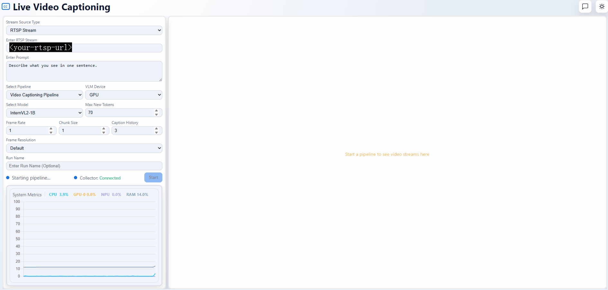

# Live Video Captioning RAG Sample Application

The Live Video Captioning RAG sample application uses the Retrieval-Augmented Generation technique, which creates caption-text embeddings and stores them in a vector database with video frames and metadata. The sample application works with the [Live Video Captioning](../live-video-captioning/) sample application to process Real-Time Streaming Protocol (RTSP) streams and generate live captions using a Vision-Language Model. The application uses an LLM optimized through the OpenVINO™ toolkit to power chatbots that answer questions based on the generated captions.

## Get Started

See the system requirements and other installation guides:

- [System Requirements](./docs/user-guide/get-started/system-requirements.md): Check the hardware and software requirements for deploying the application.
- [Get Started](./docs/user-guide/get-started.md): Follow the step-by-step instructions to set up the application.

## How It Works

The sample application integrates caption ingestion, vector search, and response generation that is based on LLM optimized through the OpenVINO™ toolkit. The sample application works with the Live Video Captioning sample application to process frame-level captions and metadata from RTSP streams, building a knowledge base for answering user questions through vector-based retrieval.

For more information, see [How It Works](./docs/user-guide/how-it-works.md).

## Learn More

- [Overview](./docs/user-guide/index.md)
- [System Requirements](./docs/user-guide/get-started/system-requirements.md)
- [Get Started](./docs/user-guide/get-started.md)
- [API Reference](./docs/user-guide/api-reference.md)
- [Build from Source](./docs/user-guide/get-started/build-from-source.md)
- [Known Issues](./docs/user-guide/known-issues.md)
- [Release Notes](./docs/user-guide/release-notes.md)
