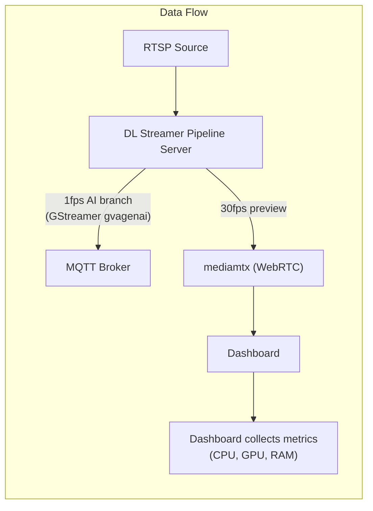

# How it Works

The stack ingests an RTSP stream, runs a DL Streamer pipeline that samples frames for VLM inference, and sends results to the dashboard.

## Data Flow

## System Components

- **dlstreamer-pipeline-server**: Intel DL Streamer Pipeline Server processing RTSP sources with GStreamer pipelines and `gvagenai` for VLM inference
- **mediamtx**: WebRTC/WHIP signaling server for video streaming
- **coturn**: TURN server for NAT traversal in WebRTC connections
- **app**: Python FastAPI backend serving REST APIs, SSE metadata streams, and WebSocket caption streams
- **metrics-manager**: Bundled system metrics microservice (`intel/metrics-manager`, Telegraf collector + HTTP/SSE API) reporting CPU, GPU, NPU, memory, and power

## Learn More

- [System Requirements](./get-started/system-requirements.md)
- [Get Started](./get-started.md)
- [API Reference](./api-reference.md)
- [Known Issues](./known-issues.md)
- [Release Notes](./release-notes.md)
