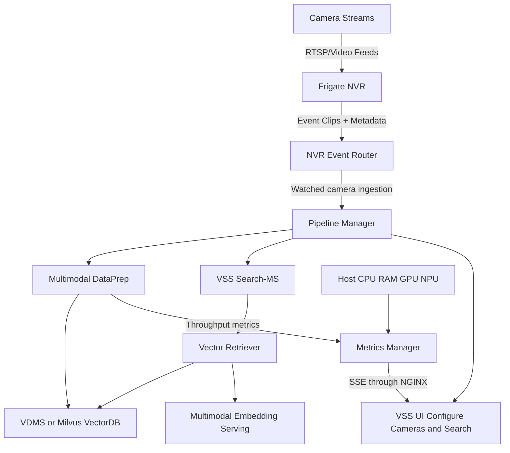

# Live Video Search

**Live Video Search** is a Metro AI Suite sample that adapts the VSS pipeline for semantic search on live Frigate streams. It ingests live camera streams, indexes video segments with embeddings and timestamped camera metadata, and lets users select cameras, time ranges, and free‑text queries to retrieve ranked, playable clips with confidence scores while surfacing live system metrics.

## Get Started

To see the system requirements and other installations, see the following guides:

  - [Get Started](./docs/user-guide/get-started.md): Step‑by‑step setup.
  - [System Requirements](./docs/user-guide/get-started/system-requirements.md): Hardware and software requirements.

## How It Works

The diagram shows how video moves from cameras to searchable results and live monitoring. It highlights the main components involved in capturing events, processing clips, and presenting results to users. Each step builds on the previous one to keep video searchable, observable, and easy to use.

## Learn More

  - [Architecture](./docs/user-guide/how-it-works.md): End‑to‑end architecture.
  - [System Requirements](./docs/user-guide/get-started/system-requirements.md): Hardware and software requirements.
  - [Build from Source](./docs/user-guide/get-started/build-from-source.md): Build images for the stack.
  - [API Reference](./docs/user-guide/api-reference.md): Key endpoints and references.
  - [Release Notes](./docs/user-guide/release-notes.md): Updates and fixes.

## Notes

- Metrics Manager is **enabled by default** and streams live system and DataPrep throughput metrics to the VSS UI.
- Use VSS UI **Configure Cameras** to enable camera feeds for search ingestion.
- Use `source setup.sh --start-usb-camera` to run Frigate with a USB camera input.
- Set `VECTORDB_BACKEND=milvus` before startup to use Milvus instead of the default VDMS backend.
