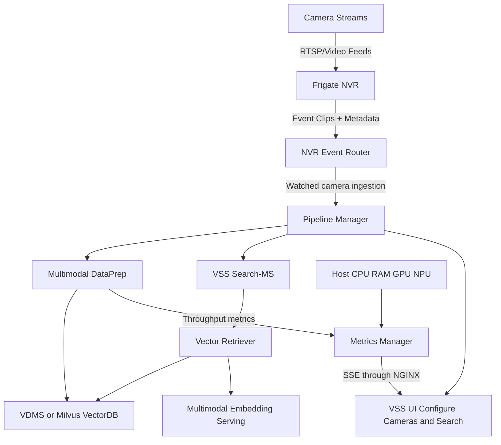

# How It Works

This document describes the end‑to‑end architecture of Live Video Search and how NVR Event Router and VSS Search integrate.

## High‑Level Architecture

## Data Flow

1. **Ingestion**: Cameras stream into Frigate, which records clips and publishes events via MQTT.
2. **Event Routing**: NVR Event Router receives events and associates clips with camera metadata.
3. **Indexing**: VSS camera configuration enables watcher-based clip ingestion to Pipeline Manager, which forwards clips to Multimodal DataPrep. DataPrep creates embeddings in-process and stores them in the selected VDMS or Milvus backend.
4. **Querying**: Users query VSS UI with optional time‑range filters. Search‑MS sends vector similarity queries to Vector Retriever, which embeds the query through Multimodal Embedding Serving and reads the selected vector database. Search‑MS then aggregates and ranks the matching clips.
5. **Visualization**: Results are shown directly in VSS UI.
6. **Metrics**: Metrics Manager collects host metrics, receives DataPrep throughput metrics directly, and streams both to the UI through NGINX.

## Integration Points

- **Watcher-based ingestion path** ties enabled camera clips directly to VSS Search input.
- **Pipeline Manager endpoints** unify search configuration and retrieval.
- **Backend-neutral retrieval** keeps Search‑MS independent of VDMS and Milvus through the Vector Retriever API.
- **Metrics Manager SSE** provides live system and application metrics through the same NGINX origin as the UI.

## Related Architecture References

- [Smart NVR How It Works](https://docs.openedgeplatform.intel.com/2026.2/edge-ai-suites/smart-nvr/index.html#how-it-works)
- [Vector Retriever How It Works](https://docs.openedgeplatform.intel.com/2026.2/edge-ai-libraries/vector-retriever/how-it-works.html)
- [Video Search and Summarization Architecture](https://docs.openedgeplatform.intel.com/2026.2/edge-ai-libraries/video-search-and-summarization/how-it-works/video-search-and-summarization.html)
