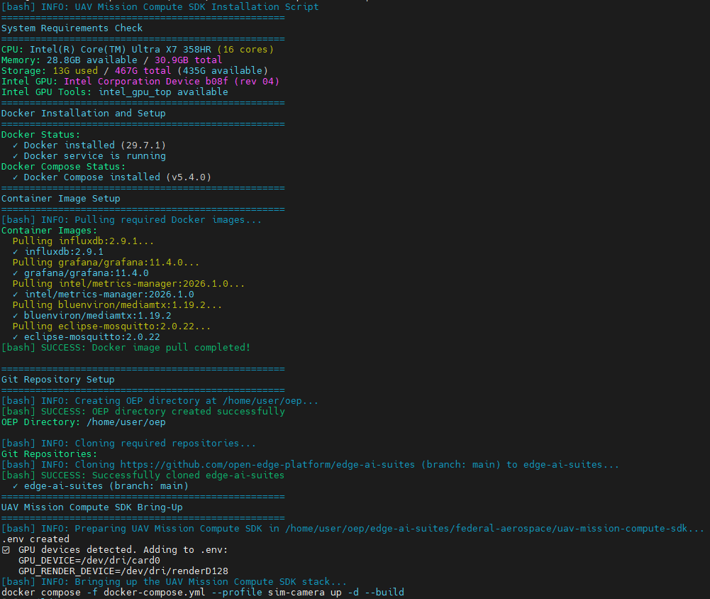
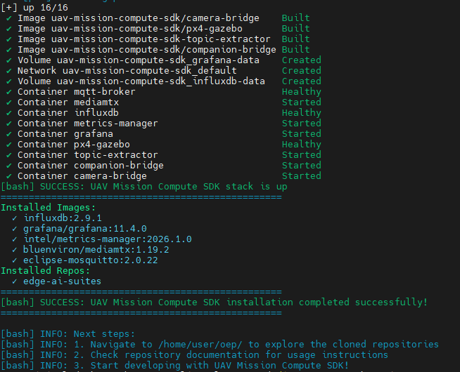

# Getting Started Guide - UAV Mission Compute SDK

## Overview

The UAV Mission Compute SDK provides a comprehensive development environment for UAV (Uncrewed Aerial Vehicle) applications using Intel's optimized compute tools and frameworks. It packages a PX4 + Gazebo simulation with multi-camera support, OpenVINO-based vision processing on Intel GPU, MQTT telemetry, RTSP streaming, and an interactive Edge AI dashboard — all orchestrated via Docker Compose.

## Learning Objectives

Upon completion of this guide, you will be able to:

- Install and configure the UAV Mission Compute SDK
- Launch the PX4 simulation stack with simulated cameras
- Start the AI vision processing and Edge AI dashboard
- Access the real-time dashboard for UAV telemetry and detection overlays
- View live RTSP camera streams with Intel Edge AI inference

## System Requirements

Verify that your development environment meets the following specifications:

- Operating System: Ubuntu 24.04 LTS (provisioned using [Edge-Node Infrastructure Blueprint](https://docs.openedgeplatform.intel.com/dev/edge-ai-suites/ai-suite-federal-and-aerospace/edge-node-infrastructure-blueprint/index.html))
- Memory: Minimum 16GB RAM (32GB recommended)
- Storage: 100GB available disk space
- Network: Active internet connection for package downloads
- Hardware: Intel Core Ultra Series 3 (Panther Lake) processor with integrated GPU recommended

## Installation Process

Execute the automated installation script to configure the complete development environment:

```bash
curl -fsS https://raw.githubusercontent.com/open-edge-platform/edge-ai-suites/refs/heads/release-2026.2.0/metro-ai-suite/metro-sdk-manager/scripts/uav-mission-compute-sdk.sh | bash
```



The installation process configures the following components:

- Docker containerization platform
- PX4 autopilot simulation with Gazebo Harmonic
- Multi-camera bridge (nadir, forward, rear at 416×416 @20fps)
- Companion telemetry bridge (MAVLink → MQTT)
- MQTT broker and MediaMTX RTSP server
- InfluxDB time-series storage and Grafana dashboards
- Metrics manager for host platform monitoring
- OpenVINO-based vision processor (YOLOv2 on Intel GPU)
- Edge AI Showcase dashboard

Once the script completes, the full stack is built and running:



## UAV Mission Compute SDK Application Setup

This section describes how to verify and interact with the running application.

### Step 1: Wait for PX4 to Be Healthy

The installation script starts the simulation stack automatically. Wait for PX4 to become healthy (~60–90 seconds on first boot):

```bash
cd ~/oep/edge-ai-suites/federal-aerospace/uav-mission-compute-sdk
docker compose ps px4
```

### Step 2: Start AI Helpers and Sample Apps

Vision processing and the web dashboard depend on PX4 being healthy:

```bash
make apps
```

### Step 3: Access the Edge AI Dashboard

Open a browser and navigate to **http://localhost:5002**

The dashboard displays:

- **Camera tiles**: 3 live video feeds (nadir, forward, rear) with real-time vehicle detections
- **Telemetry panel**: position, altitude, battery, velocity
- **ARM/DISARM button**: activates camera inference
- **Demo mission button**: executes a pre-programmed waypoint sequence

### Step 4: Arm the UAV (Activate Cameras)

Cameras only stream when the UAV is armed. Arm it from the dashboard or via the REST API:

```bash
curl -X POST http://localhost:8080/action/arm
```

### Step 5: View RTSP Streams Directly (Optional)

View any camera feed using an RTSP player:

```bash
ffplay rtsp://localhost:8554/uav-1/nadir
```

### Step 6: Stop the Application

To stop the sample apps and AI helpers:

```bash
make apps-down
```

To stop the entire infrastructure stack:

```bash
make down
```

## Technology Framework Overview

### UAV Mission Compute SDK Components

The UAV Mission Compute SDK integrates multiple technologies:

- **PX4 + Gazebo Harmonic**: Flight controller simulation with multi-camera world
- **Companion Bridge**: MAVLink ↔ MQTT telemetry bridge
- **Camera Bridge**: Gazebo frames → H264 → RTSP via MediaMTX
- **OpenVINO Vision Processor**: Real-time YOLOv2 vehicle detection on Intel GPU
- **MQTT Broker (Mosquitto)**: Lightweight messaging for telemetry and detections
- **InfluxDB + Grafana**: Time-series storage and dashboards for flight and platform metrics
- **Edge AI Showcase Dashboard**: Web UI at port 5002

## Next Steps

After installation completes:

1. Navigate to `$HOME/oep/edge-ai-suites/federal-aerospace/uav-mission-compute-sdk/` to explore the SDK
2. Review [GETTING_STARTED.md](https://github.com/open-edge-platform/edge-ai-suites/blob/main/federal-aerospace/uav-mission-compute-sdk/GETTING_STARTED.md) for USB camera setup and advanced configuration
3. Access Grafana dashboards at **http://localhost:3000** (admin/admin)
4. Explore the REST API at **http://localhost:8080** for flight control commands

## Additional Resources

### Technical Documentation

- [OpenVINO](https://docs.openvino.ai/2026/get-started.html)
  \- Intel's cross-platform inference optimization toolkit
- [Edge AI Libraries](https://docs.openedgeplatform.intel.com/dev/ai-libraries.html)
  \- Comprehensive development toolkit documentation and API references
- [Edge AI Suites](https://docs.openedgeplatform.intel.com/dev/ai-suite-metro.html)
  \- Complete application suite documentation with implementation examples

### Support Channels

- [GitHub Issues](https://github.com/open-edge-platform/edge-ai-suites/issues)
  \- Technical issue tracking and community support
