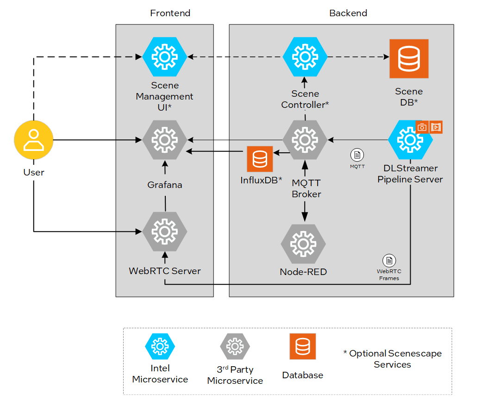

# Metro Vision AI App Recipe

## Overview

The Metro Vision AI App Recipe suite provides an integrated AI-powered solution for modern urban traffic management and monitoring. This comprehensive platform combines multiple transportation-focused applications built on a unified architecture, enabling cities and organizations to deploy intelligent transportation systems efficiently.

**Available Applications:**
- **Smart Intersection Management** (includes optional Scenescape components) - AI-driven traffic flow optimization and intersection monitoring
- **Loitering Detection** - Real-time detection of loitering behavior in transportation hubs
- **Smart Parking** - Automated parking space monitoring and management
- **Smart Tolling** - Intelligent toll collection and vehicle classification

### Key Features

- **Real-time Video Analytics**: Process live video streams from traffic cameras with low latency
- **Edge AI Processing**: Run inference locally to reduce bandwidth and improve response times
- **Scalable Architecture**: Easily scale from single intersections to city-wide deployments
- **Configurable Pipelines**: Customize detection parameters and object types for specific use cases
- **MQTT Integration**: Seamless communication between components for event-driven responses
- **Dashboard Monitoring**: Real-time visualization of traffic metrics and system performance
- **Flexible Deployment**: Support for various camera types and video sources
- **No-Code Configuration**: Set up complex rules and workflows through intuitive interfaces

## How It Works

The Metro Vision AI App Recipe architecture is designed to facilitate seamless integration and operation of various components involved in AI-driven video analytics for transportation and safety & security scenarios. The system processes real-time video feeds from traffic cameras, applies deep learning models for object detection and classification, and generates actionable insights for traffic management.

### Core Workflow

1. **Video Ingestion**: Live camera feeds or video files are ingested into the DL Streamer Pipeline Server
2. **AI Processing**: Deep learning models perform real-time inference for vehicle detection, pedestrian tracking, and behavior analysis
3. **Metadata Extraction**: Rich metadata including object coordinates, classifications, and tracking information is generated
4. **Event Processing**: Node-RED processes the metadata and triggers appropriate responses based on configured rules
5. **Data Distribution**: Results are distributed via MQTT to dashboards, alerts, and external systems
6. **Visualization**: Real-time video streams with overlaid analytics are displayed through WebRTC viewers

### Components

- **DL Streamer Pipeline Server (VA Pipeline):** The core video analytics engine that processes video frames, performs AI inference using optimized deep learning models, and extracts rich metadata including vehicle classifications, pedestrian detection, and traffic flow metrics.

- **Mosquitto MQTT Broker:** A lightweight message broker that facilitates real-time communication between all system components, enabling event-driven responses and seamless data flow throughout the smart city monitoring ecosystem.

- **Node-RED:** A visual programming platform that allows users to create custom traffic management rules, automated responses to traffic events, and integration workflows without requiring extensive coding knowledge.

- **WebRTC Stream Viewer:** Provides real-time visualization of processed video streams with AI-generated overlays, including bounding boxes around detected vehicles, pedestrians, and other objects of interest.

- **Grafana Dashboard:** An advanced monitoring and analytics platform that displays real-time traffic metrics, system performance data, historical trends, and customizable alerts for operator.

- **Inputs (Video Sources):** Supports various input types including IP cameras, RTSP streams, and video files, providing flexibility for different deployment scenarios and existing infrastructure integration.

#### Optional Components

- **Scenescape Management UI:** A web-based user interface for advanced scene configuration, camera calibration, and visual rule setup. Provides intuitive tools for defining detection zones, traffic lanes, and monitoring areas through a graphical interface.

- **Scenescape Controller:** The backend service that manages scene configurations, processes spatial analytics, and coordinates between the Management UI and the video analytics pipeline. Handles complex scene understanding and geometric transformations.

- **Scenescape Database (PostgreSQL):** A robust relational database that stores scene configurations, camera metadata, calibration parameters, and historical analytics data. Ensures data persistence and enables complex queries for reporting and analysis.

- **InfluxDB:** A time-series database optimized for storing and querying high-frequency transportation metrics such as vehicle counts, traffic flow rates, speed measurements, and system performance data. Enables efficient historical analysis and trend monitoring.

### Transportation-Specific Features

- **Vehicle Detection & Classification:** Accurately identifies and classifies different vehicle types
- **Pedestrian Tracking:** Real-time tracking of pedestrians afor safety monitoring
- **Incident Detection:** Automatic detection of accidents, stopped vehicles, or unusual traffic patterns
- **Zone-Based Monitoring:** Configurable regions of interest for specific area monitoring
- **Multi-Lane Support:** Simultaneous monitoring of multiple traffic lanes and directions

The DL Streamer Pipeline Server serves as the cornerstone of the solution, specifically optimized for transportation and traffic management scenarios. It leverages Intel-optimized deep learning models including pedestrian and vehicle detectors, traffic flow analyzers, and behavior recognition models to perform real-time inference on video streams.

The system is designed with professionals in mind, offering pre-configured pipelines for common traffic monitoring scenarios while maintaining the flexibility to customize detection parameters, tracking algorithms, and alert thresholds. This approach enables rapid deployment of AI-powered traffic management solutions without requiring deep learning expertise from traffic engineers and city planners.

Key advantages include edge-based processing that reduces latency for time-critical traffic decisions, support for multiple video sources to cover complex intersections, and integration capabilities with existing traffic management systems through standard protocols and APIs.

**Advanced Capabilities with Optional Components:**
When deployed with the optional Scenescape components, the system provides enhanced spatial analytics capabilities including precise vehicle trajectory tracking, accurate speed measurement, and advanced zone-based analytics. The InfluxDB integration enables long-term trend analysis, capacity planning, and performance optimization based on historical traffic patterns.

## Use Cases

### Smart Intersection Management
- Real-time traffic light optimization based on vehicle and pedestrian counts
- Emergency vehicle detection and priority signal control
- Pedestrian safety monitoring at crosswalks
- Traffic violation detection and automated enforcement

### Loitering Detection
- Security monitoring at transit stations and stops
- Identification of suspicious behavior in hubs
- Crowd management in high-traffic areas
- Automated alerts for security personnel

### Smart Parking
- Real-time parking space availability tracking
- Automated payment and access control
- Parking violation detection
- Optimization of parking space utilization

### Smart Tolling
- Automated vehicle classification for toll calculation
- License plate recognition for electronic toll collection
- Traffic flow optimization at toll plazas
- Integration with existing tolling infrastructure

## To Get Started
- [Smart Intersection](smart-intersection/docs/user-guide/Overview.md)
- [Smart Tolling](smart-intersection/docs/user-guide/Overview.md)
- [Smart Parking](smart-parking/docs/user-guide/Overview.md)
- [Loitering Detection](loitering-detection/docs/user-guide/Overview.md)
