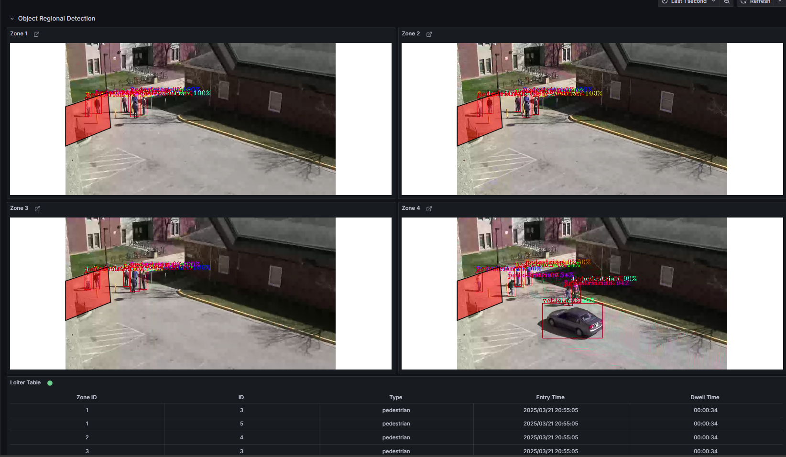

# Get Started

Loitering Detection leverages advanced AI algorithms to monitor and analyze real-time video feeds, identifying individuals lingering in designated areas. It provides a modular architecture that integrates seamlessly with various input sources and leverages AI models to deliver accurate and actionable insights.

By following this guide, you will learn how to:
- **Set up the sample application**: Use Docker Compose to quickly deploy the application in your environment.
- **Run a predefined pipeline**: Execute a pipeline to see loitering detection in action.
- **Access the application's features and user interfaces**: Explore the Grafana dashboard, Node-RED interface, and DL Streamer Pipeline Server to monitor, analyze and customize workflows.

## Prerequisites
- Verify that your system meets the [minimum requirements](./system-requirements.md).
- Install Docker: [Installation Guide](https://docs.docker.com/get-docker/).
Enable running docker without "sudo": [Post Install](https://docs.docker.com/engine/install/linux-postinstall/)
- Install Git: [Installing Git](https://git-scm.com/book/en/v2/Getting-Started-Installing-Git)


<!--
**Setup and First Use**: Include installation instructions, basic operation, and initial validation.
-->
## Set up and first use

<!--
**User Story 1**: Setting Up the Application  
- **As a developer**, I want to set up the application in my environment, so that I can start exploring its functionality.

**Acceptance Criteria**:
1. Step-by-step instructions for downloading and installing the application.
2. Verification steps to ensure successful setup.
3. Troubleshooting tips for common installation issues.
-->

1. **Clone the Repository**:
   - Run:
     ```bash
     git clone https://github.com/open-edge-platform/edge-ai-suites.git
     cd edge-ai-suites/metro-ai-suite/metro-vision-ai-app-recipe/
     ```

2. **Setup Application and Download Assets**:
   - Use the installation script to configure the application and download required models:
     ```bash
     ./install.sh loitering-detection
     ```

## Run the application

1. **Start the Application**:
   - Download container images with Application microservices and run with Docker Compose:
     ```bash
     docker compose up -d
     ```
     
     <details>
     <summary>
     Check Status of Microservices
     </summary>
     
     - The application starts the following microservices.
     - To check if all microservices are in Running state:
       ```bash
       docker ps
       ```
       
     **Expected Services:**
     - Grafana Dashboard
     - DL Streamer Pipeline Server  
     - MQTT Broker
     - Node-RED (for applications without Scenescape)
     - Scenescape services (for Smart Intersection only)
     
     </details>

2. **Run Predefined Pipelines**:

   - Start video streams to run video inference pipelines:
     ```bash
     ./sample_start.sh
     ```
     
     <details>
     <summary>
     Check Status and Stop pipelines
     </summary>
     
     - To check the status:
       ```bash
       ./sample_status.sh
       ```
     
     - To stop the pipelines without waiting for video streams to finish replay:
       ```bash
       ./sample_stop.sh
       ```
     </details>
   
3. **View the Application Output**:
   - Open a browser and go to `http://localhost:3000` to access the Grafana dashboard.
     - Change the localhost to your host IP if you are accessing it remotely.
   - Log in with the following credentials:
     - **Username**: `admin`
     - **Password**: `admin`
   - Check under the Dashboards section for the application-specific preloaded dashboard.
   - **Expected Results**: The dashboard displays real-time video streams with AI overlays and detection metrics.


## **Access the Application and Components** ##

### **Grafana UI** ###
- **URL**: [http://localhost:3000](http://localhost:3000)
- **Log in with credentials**:
    - **Username**: `admin`
    - **Password**: `admin` (You will be prompted to change it on first login.)
- In Grafana UI, the dashboard displays detected people and cars
      

### **NodeRED UI** ###
- **URL**: [http://localhost:1880](http://localhost:1880)

### **DL Streamer Pipeline Server** ###
- **REST API**: [http://localhost:8080](http://localhost:8080)
  - **Check Pipeline Status**:
    ```bash
    curl http://localhost:8080/pipelines
    ```
- **WebRTC**: [http://localhost:8889](http://localhost:8889)

## **Stop the Application**:

- To stop the application microservices, use the following command:
  ```bash
  docker compose down
  ```

## Other Deployment Option

Choose one of the following methods to deploy the Loitering Detection Sample Application:

- **[Deploy Using Helm](./how-to-deploy-with-helm.md)**: Use Helm to deploy the application to a Kubernetes cluster for scalable and production-ready deployments.

## Supporting Resources
- [Troubleshooting Guide](./support.md): Find detailed steps to resolve common issues during deployments.
- [DL Streamer Pipeline Server](https://docs.edgeplatform.intel.com/dlstreamer-pipeline-server/3.0.0/user-guide/Overview.html)


## Next Steps
- [How to Customize the Application](how-to-customize-application.md)

## Troubleshooting

1. **Changing the Host IP Address**

    - If you need to use a specific Host IP address instead of the one automatically detected during installation, you can explicitly provide it using the following command. Replace `<HOST_IP>` with your desired IP address:

      ```bash
      ./install.sh <HOST_IP>
      ```

2. **Containers Not Starting**:
   - Check the Docker logs for errors:
     ```bash
     docker compose logs
     ```

3. **No Video Streaming on Grafana Dashboard**
    - Go to the Grafana "Video Analytics Dashboard".
    - Click on the Edit option (located on the right side) under the WebRTC Stream panel. 
    - Update the URL from `http://localhost:8083` to `http://host-ip:8083`.

4. **Failed Grafana Deployment** 
    - If unable to deploy grafana container successfully due to fail to GET "https://grafana.com/api/plugins/yesoreyeram-infinity-datasource/versions": context deadline exceeded, please ensure the proxy is configured in the ~/.docker/config.json as shown below:

      ```bash
              "proxies": {
                      "default": {
                              "httpProxy": "<Enter http proxy>",
                              "httpsProxy": "<Enter https proxy>",
                              "noProxy": "<Enter no proxy>"
                      }
              }
      ```

    - After editing the file, remember to reload and restart docker before deploying the microservice again.

      ```bash
      systemctl daemon-reload
      systemctl restart docker
      ```

## Supporting Resources
- [Docker Compose Documentation](https://docs.docker.com/compose/)
- [DL Streamer Pipeline Server](https://docs.edgeplatform.intel.com/dlstreamer-pipeline-server/3.0.0/user-guide/Overview.html)
