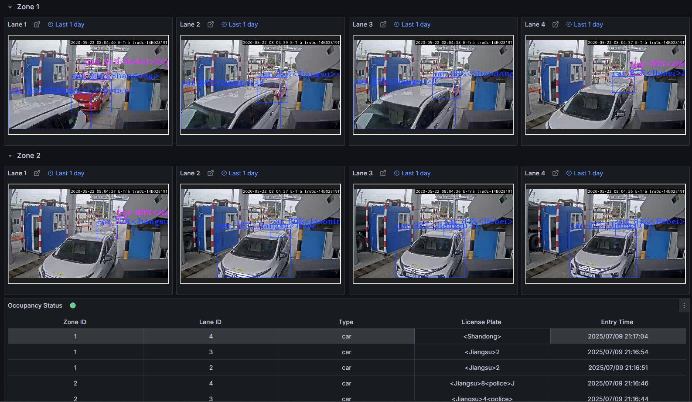

# How to Use the Application

Once deployed (via Docker Compose or Helm) this guide will help you:
- Verify that the application is running correctly.
- Access the application's features and user interfaces.
- Understand how to interact with the various components of the Smart Tolling Application.

## **Access the Application and Components** ##

### **Grafana UI** ###
- **URL**: [http://localhost:3000](http://localhost:3000)
- **Log in with credentials**:
    - **Username**: `admin`
    - **Password**: `admin` (You will be prompted to change it on first login.)

### **NodeRED UI** ###
- **URL**: [http://localhost:1880](http://localhost:1880)

### **DL Streamer Pipeline Server** ###
- **REST API**: [http://localhost:8080](http://localhost:8080)
- **WebRTC**: [http://localhost:8889](http://localhost:8889)

## Verify the Application

- **Grafana Dashboard**: In Grafana UI, the dashboard displays detected vehicles and license plates across multiple tolling lanes
      
