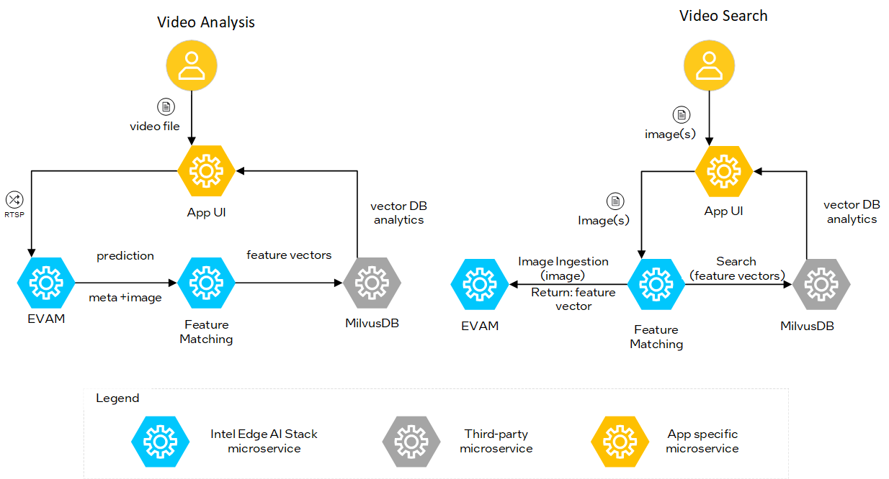

# Search Image by Image

The **Search Image by Image** application is a reference application that demonstrates how developers can leverage edge AI technologies to solve real-world challenges. It enables efficient processing and searching of video data to identify objects of interest, providing actionable insights in real-time.

This reference application showcases searching through video data generated by cameras around a city to find the closest match to the user-provided image.

### Example Use Cases

- **Use Case 1: Traffic Stream Search**
  - Example: If you see a car or pedestrian in the traffic stream, you can search for them in the live or recorded footage, retrieving results with camera locations and timestamps.
- **Use Case 2: Tool Tracking in Assembly Line**
  - Example: If a specific tool, such as a wrench or drill, is misplaced or left behind on the assembly line, you can search for it in live or recorded footage, retrieving results with camera locations and timestamps to prevent delays and ensure operational efficiency.

### Key Benefits

- **Real-Time Video Processing**: Enables rapid extraction and analysis of visual data from live video streams.
- **Scalable Search Capabilities**: Efficiently handles large-scale video datasets using Vector DB for fast and accurate retrieval.
- **Enhanced Object Recognition**: Uses AI-powered feature extraction to identify and match objects with high precision.
- **Seamless Integration**: Works with third-party microservices like MediaMTX, EVAM, and MilvusDB for robust performance.
- **Improved Urban Management**: Provides actionable insights for traffic monitoring and security applications.
- **Custom Model Integration**: Allows users to integrate their own developed models for feature extraction and object recognition, providing flexibility and customization to meet specific requirements.

## How it Works

This section provides a high-level view of how the application works. 

*Figure 1: High-Level System Diagram for the Search Image by Image Application.*

### Inputs

- Video files or live camera streams (simulated or real-time)
- User-provided images or images captured from video for search

The sample application includes a demonstration video for users to experiment with. This video is a static loop, simulated to function as a live stream. It becomes visible in the user interface as soon as the application is launched.

### Processing

- **Video Analysis**: Media streams are processed via MediaMTX, and predictions are made using EVAM. Video analysis is triggered by the "Analyze Stream" button. The EVAM pipeline is activated to analyze the video and extract images from each frame.
- **Feature Extraction**: Predictions (including metadata and images) are sent via MQTT to Feature Matching, which generates feature vectors. If the predictions exceed a pre-determined threshold, the detected objects are stored as vector embeddings in MilvusDB, while the frames are saved in the docker file system. 
- **Storage & Retrieval**: Feature vectors are stored in MilvusDB and analyzed via MilvusUI.
- **Video Search**: To initiate a video search, the video first needs to be analyzed by the EVAM pipeline by clicking the "Analyze Stream" button. Users can then either upload their own images using the "Upload Image" button or capture an object by clicking "Capture Frame." When the frame is captured, it is also possible to readjust the frame to border a specific object. User images are ingested via ImageIngestor, processed by EVAM , and matched against stored feature vectors in MilvusDB. 

### Outputs

- Matched search results, including metadata, timestamps, distance to show the confidence rate of the prediction and frames

### Key Features

- **MediaMTX**: This third-party microservice simulates remote video cameras placed in various geographical locations. The service can replay videos from recorded files and publish them as live video streams in different formats. The RTSP stream is sent to EVAM microservice for extraction of feature vectors. The WebRTC stream is useful for displaying live video streams in this web application.
- **EVAM**: This microservice operates either in streaming mode (video analysis) or image ingestion mode (video search). During the video analysis phase, it consumes RTSP streams from simulated remote cameras and performs object detection and feature extraction tasks. The resulting predictions are published as metadata to an MQTT Broker. During the video search phase, the microservice returns feature vectors for submitted images.
- **Feature Matching**: This microservice interacts with EVAM and Vector DB. During the video analysis phase, it inserts feature vectors (image embeddings) generated by EVAM into Vector DB. Additionally, it stores frames that are useful for displaying in search results when a user searches for an object. During the video search phase, the microservice queries EVAM to get feature vectors for the user-provided image and then queries Vector DB to find the matching frame(s) from video streams processed in the analysis phase.
- **MQTT**: This third-party microservice transfers a stream of metadata between EVAM and Feature Matching during the video analysis phase.
- **MilvusDB**: This third-party microservice stores feature vectors in a Vector DB and provides a vector search to find the closest match between a user-provided image and previously processed video frames.