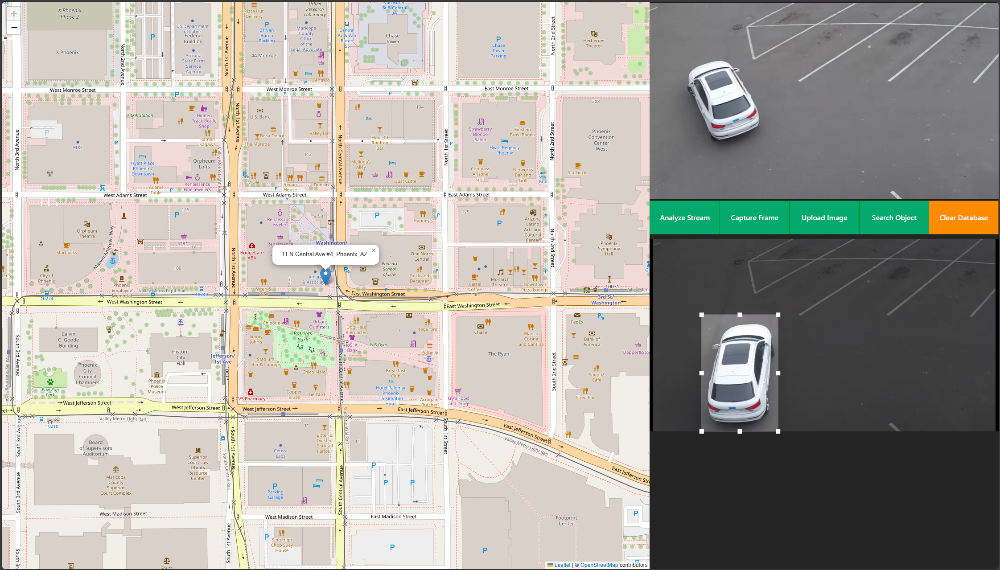
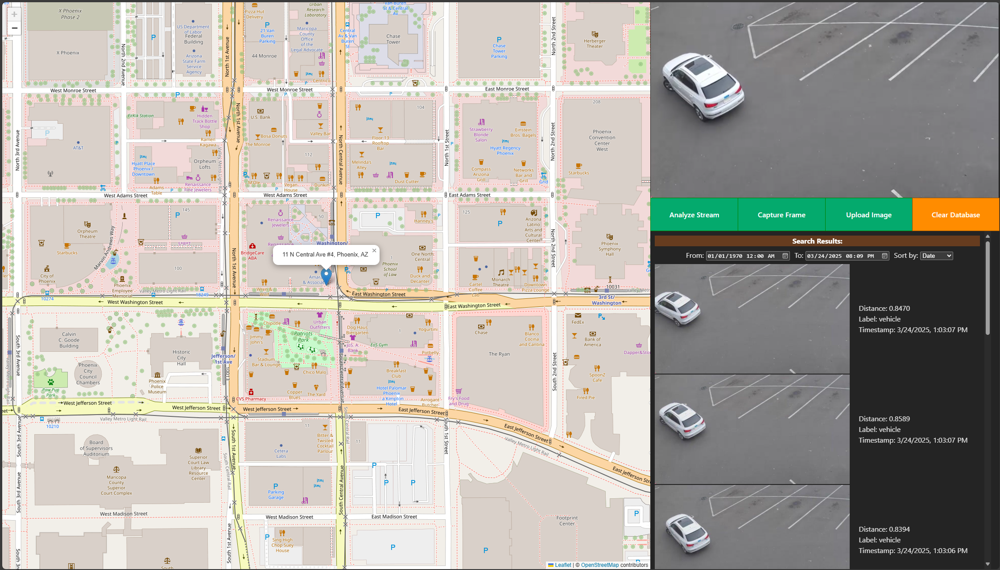

# Get Started

<!--
**Sample Description**: Provide a brief overview of the application and its purpose.
-->
The **Search Image by Image**  is a sample application that demonstrates how developers can leverage edge AI technologies to solve real-world challenges. It enables efficient processing and searching of video data to identify objects of interest, providing actionable insights in real-time.

This application showcases searching through video data generated by cameras around a city to find the closest match to the user-provided image.

<!--
**What You Can Do**: Highlight the developer workflows supported by the guide.
-->
By following this guide, you will learn how to:
- **Set up the sample application**: Use Docker Compose to quickly deploy the application in your environment.
- **Run a predefined pipeline**: Execute a sample pipeline to see real-time traffic monitoring and object detection in action.
- **Modify application parameters**: Customize settings like input sources and detection thresholds to adapt the application to your specific requirements.


## Prerequisites
- Verify that your system meets the [minimum requirements](./system-requirements.md).
- Install Docker: [Installation Guide](https://docs.docker.com/get-docker/).


## Set up and First Use

1. **Download the Compose File**:
    - Create and navigate to directory:
      ```bash
        mkdir search-image-by-image
        cd search-image-by-image
      ```
    - Download the Docker Compose file:
      ```bash
        curl -L -o compose.yml "https://raw.githubusercontent.com/open-edge-platform/edge-ai-suites/refs/heads/main/metro-ai-suite/search-image-by-image/compose/compose-linux-v1.0.0/compose-linux-v1.0.0.yml"
      ```
<!--
a pre-step to prepare models may be needed
-->

2. **Download the Models**:
    - Download the models
      <details open>
      <summary>
      Linux Instructions
      </summary>

      ```sh
      # Define a generic directory for storing models
      MODELS_PATH="$(pwd)/models"

      # Create the directory if it doesn't exist
      mkdir -p "$MODELS_PATH"

      # Download and convert the ResNet-50 model
      docker run --rm \
          -v "$MODELS_PATH:/output" \
          openvino/ubuntu22_dev:2024.6.0 bash -c \
          "omz_downloader --name resnet-50-pytorch --output_dir models && \
          omz_converter --name resnet-50-pytorch --download_dir models --output_dir models && \
          cp -r ./models/public/resnet-50-pytorch /output"

      # Download and convert the Person-Vehicle-Bike Detection model
      docker run --rm \
          -v "$MODELS_PATH:/output" \
          openvino/ubuntu22_dev:2024.6.0 bash -c \
          "omz_downloader --name person-vehicle-bike-detection-2004 --output_dir models && \
          omz_converter --name person-vehicle-bike-detection-2004 --download_dir models --output_dir models && \
          cp -r ./models/intel/person-vehicle-bike-detection-2004 /output"
      ```

      </details>

      <details>
      <summary>
      Windows Instructions
      </summary>

      ```ps1
      docker pull openvino/ubuntu22_dev:2024.6.0
      $MODELS_PATH="$PWD\models"
 
      docker run --rm `
          -v ${MODELS_PATH}:/output `
          openvino/ubuntu22_dev:2024.6.0 bash -c `
          "omz_downloader --name resnet-50-pytorch --output_dir models && `
          omz_converter --name resnet-50-pytorch --download_dir models --output_dir models && `
          cp -r ./models/public/resnet-50-pytorch /output"
      
      docker run --rm `
          -v ${MODELS_PATH}:/output `
          openvino/ubuntu22_dev:2024.6.0 bash -c `
          "omz_downloader --name person-vehicle-bike-detection-2004 --output_dir models && `
          omz_converter --name person-vehicle-bike-detection-2004 --download_dir models --output_dir models && `
          cp -r ./models/intel/person-vehicle-bike-detection-2004 /output"
            ```

      </details>

3. **Download the Artifacts**:
    - Download the artifacts:
      ```bash
        curl -L -o embedEtcd.yaml "https://raw.githubusercontent.com/open-edge-platform/edge-ai-suites/refs/heads/main/metro-ai-suite/search-image-by-image/src/milvus-db/embedEtcd.yaml"
        curl -L -o user.yaml "https://raw.githubusercontent.com/open-edge-platform/edge-ai-suites/refs/heads/main/metro-ai-suite/search-image-by-image/src/milvus-db/user.yaml"
        curl -L -o config.json "https://raw.githubusercontent.com/open-edge-platform/edge-ai-suites/refs/heads/main/metro-ai-suite/search-image-by-image/src/dlstreamer-pipeline-server/configs/filter-pipeline/config.json"
        curl -L -o mosquitto.conf "https://raw.githubusercontent.com/open-edge-platform/edge-ai-suites/refs/heads/main/metro-ai-suite/search-image-by-image/src/broker/mosquitto.conf"
        curl -L -o ./models/person-vehicle-bike-detection-2004/person-vehicle-bike-detection-2004.json "https://raw.githubusercontent.com/open-edge-platform/edge-ai-suites/refs/heads/main/metro-ai-suite/search-image-by-image/src/dlstreamer-pipeline-server/models/person-vehicle-bike-detection-2004/person-vehicle-bike-detection-2004.json"
      ```

4. **Start the Application**:
    - Run the application using Docker Compose:
      ```bash
      docker compose up -d
      ```

5. **Verify the Application**:
    - Check that the application is running:
      ```bash
      docker compose ps
      ```

6. **Access the Application**:
    - Open a browser and go to the following endpoints to access the application:
      - Stream UI: `http://localhost:8889/stream`
      - App UI: `http://localhost:3000`
      - Search UI: `http://localhost:9000/docs`
      - MilvusDB UI: `http://localhost:8000/`


7. **Run the Application**:

    - **Analyze Stream**: Use the predefined video and click **Analyze Stream** to start processing the video stream.
    - **Video Search**: Click the **Upload Image** button to upload your own images for search or click the **Capture Frame** button to capture and adjust frames from the video stream. Click the **Search Object** button.

    - **Expected Results**:
      - Matched search results, including metadata, timestamps, distance to show the confidence rate of the prediction, and frames that include detected objects (e.g., vehicles, pedestrians, bikes).
    
   |  |  |
    |--------------------------------|--------------------------------|


<!--

**Modify Basic Parameters**: Explain configurable options and their impacts.

## Modify Application Parameters
<!--**User Story 4**: Modifying Basic Configurations  
- **As a developer**, I want to adjust simple configurations (e.g., sensor inputs or thresholds), so that I can explore the application’s flexibility.

**Acceptance Criteria**:
1. A list of configurable parameters and their descriptions.
2. Examples of modifying key settings.
3. Steps to verify and test modified configurations.


### Basic Parameters
<!--
1. Begin with a table listing key parameters, their purpose, and acceptable values.
2. Include concise explanations for why a developer might modify each parameter.


| **Parameter**          | **Objective**                                                | **Expected Values/Range**          |
|-------------------------|-------------------------------------------------------------|-------------------------------------|
| `input_source`          | Change the input device (e.g., local camera, network feed). | `/dev/video0`, `rtsp://<camera-ip>` |
| `detection_threshold`   | Adjust detection sensitivity.                               | `0.3` to `0.8`                      |
| `repeat_count`          | Control pipeline iterations for performance testing.        | Integer values (e.g., `1`, `5`)     |

---

### Modify Parameters
1. **Find the Configuration File**:
   - Navigate to the configuration directory:
     ```bash
     cd /path/to/configuration
     ```

2. **Edit Parameters**:
   - Open the configuration file:
     ```json
     {
         "pipeline": {
             "input_source": "/dev/video0",
             "detection_threshold": 0.5,
             "repeat_count": 1
         }
     }
     ```

3. **Modify Key Parameters**:
   - Change the `input_source` to a network camera:
     ```json
     "input_source": "rtsp://<camera-ip>"
     ```
   - Adjust the `detection_threshold` to reduce false positives:
     ```json
     "detection_threshold": 0.7
     ```
--> 
## Make Changes

1. **Change Object Detection and Object Classification Models**

    - To use your own models instead of the default models, follow these steps:

      - Open the `config.json` file.

      - Change the paths in the `pipeline` section to point to your own models. Replace the paths for `gvadetect` and `gvaclassify` with the paths to your models:
        ```json
        {
            "config": {
                "logging": {
                    "C_LOG_LEVEL": "INFO",
                    "PY_LOG_LEVEL": "INFO"
                },
                "pipelines": [
                    {
                        "name": "filter-pipeline",
                        "source": "gstreamer",
                        "queue_maxsize": 50,
                        "pipeline": "{auto_source} name=source ! decodebin ! video/x-raw ! videoconvert ! gvadetect model=/models/your-detection-model/FP32/your-detection-model.xml model-proc=/models/your-detection-model/your-detection-model.json inference-interval=3 threshold=0.4 model-instance-id=detect1 device=CPU ! queue ! gvainference model=/models/your-classification-model/FP32/your-classification-model.xml inference-region=1 name=classification model-instance-id=infer1 device=CPU ! queue ! videoconvertscale ! gvametaconvert add-tensor-data=true name=metaconvert ! jpegenc ! appsink name=destination",
                        "auto_start": false,
                        "mqtt_publisher": {
                            "publish_frame": true,
                            "topic": "edge_video_analytics_results"
                        }
                    },
                    {
                        "name": "search_image",
                        "source": "image_ingestor",
                        "queue_maxsize": 50,
                        "pipeline": "appsrc name=source  ! decodebin ! videoconvert ! gvainference model=/models/your-classification-model/FP32/your-classification-model.xml model-instance-id=infer2 device=CPU ! gvametaconvert add-tensor-data=true ! appsink name=destination"
                    }
                ]
            }
        }
        ```

2. **Change Input Video**:

    - To use your own video instead of the default sample video, follow these steps:

      - Open the `compose.yml` file and locate the `streaming-pipeline` service.
      - Change the URL in the `command` section to point to your own video file. Replace `https://github.com/intel-iot-devkit/sample-videos/raw/master/person-bicycle-car-detection.mp4` with the URL of your video file:
        ```yaml
        services:
          streaming-pipeline:
            ...
            command: >
              bash -c "
                wget -O file.mp4 <your-video-url> && \
                gst-launch-1.0 filesrc location=file.mp4 ! qtdemux name=mdemux ! h264parse ! video/x-h264,stream-format=byte-stream ! mpegtsmux name=mux ! filesink location=file.ts && \
                gst-launch-1.0 multifilesrc location=file.ts loop=true ! tsdemux ! h264parse ! rtspclientsink protocols=tcp location=rtsp://rtsp-server:8554/stream
              "
            ...
        ```

3. **Adjust Feature Matching Confidence**:
   - Open the compose.yml file and locate the `feature-matching` service.
   - Change the `CONFIDENCE_THRESHOLD` to adjust the confidence level for feature matching:
     ```yaml
     services:
       feature-matching:
         ...
         environment:
           ...
           CONFIDENCE_THRESHOLD: 0.7
         ...
     ```
   - **Effect**: Increasing the `CONFIDENCE_THRESHOLD` will make the feature matching more stringent, reducing false positives but potentially missing some true positives. Decreasing it will make the matching more lenient, increasing the chances of detecting true positives but also increasing false positives.

4. **Save Changes and Restart**:
   - Save the file and restart the application:
     ```bash
     docker compose restart
     ```

5. **Verify Updates**:
   - **Expected Results**:
     - The application processes data from the updated input source.
     - Detection results align with the changed models
   - Confirm changes through:
     - Logs:
       ```bash
       docker compose logs
       ```


## Troubleshooting

1. **Containers Not Starting**:
   - Check the Docker logs for errors:
     ```bash
     docker compose logs
     ```
2. **Port Conflicts**:
   - Update the `ports` section in the Compose file to resolve conflicts.


## Supporting Resources
- [Docker Compose Documentation](https://docs.docker.com/compose/)

<!-- - [Community Forum](https://community.example.com) -->
