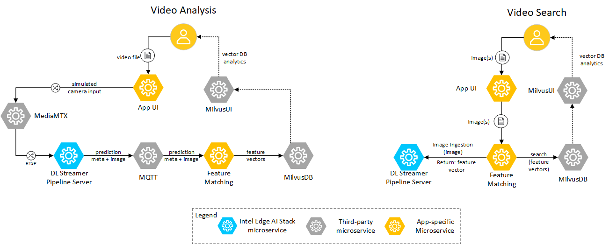

# Architecture Overview

The Image-Based Video Search Application is a modular reference implementation designed to help developers create vision-based search systems utilizing Vision AI and third-party microservices. This page provides a technical overview of the application’s architecture, components, and extensibility.

## Purpose

The Image-Based Video Search Application is designed to:

- Demonstrate how Vision AI and vector databases enable real-time image search in live video streams.
- Serve as a blueprint for building scalable, modular search systems.
- Showcase optimization techniques for Intel® hardware and software tools.

## Architecture

### Technical Architecture Diagram

*Figure 1: Detailed Architecture of the Image-Based Video Search Application.*

### Data Flow

1. **Input Sources**:
   - **Video File**: A video file as simulated camera input is fed into the system.
   - **User-provided images for search**: Allows users to upload images or for searching within the video streams.

2. **Video Analysis Pipeline**:
   - **Deep Learning Streamer Pipeline Server**:
     - Consumes RTSP streams for object detection and feature extraction.
     - Publishes metadata to an MQTT Broker.
   - **Feature Matching Microservice**:
     - Inserts extracted feature vectors (image embeddings) into MilvusDB (Vector DB).
     - Stores frames for display in search results.

3. **Video Search Pipeline**:
   - **Feature Matching Microservice**:
     - Queries DL Streamer Pipeline Server for feature vectors of user-provided images.
     - Searches MilvusDB to find matching frames.

4. **Output Generation**:
   - Displays matched frames and metadata in the web application.

## Key Components and Their Roles

1. **MediaMTX (Third-Party Microservice)**
   - **What it is**: A service that simulates remote video cameras.
   - **How it’s used**: Replays videos as RTSP/WebRTC streams for processing and display.
   - **Benefits**: Allows testing of video search features without physical cameras.

2. **DL Streamer Pipeline Server (Microservice for Feature Extraction)**
   - **What it is**: A microservice that processes video streams for object detection and feature extraction.
   - **How it’s used**: Converts RTSP streams into feature vectors and publishes metadata.
   - **Benefits**: Enables efficient AI-powered video analysis.

3. **Feature Matching Microservice**
   - **What it is**: A service that stores and retrieves feature vectors.
   - **How it's used**: Stores extracted embeddings in MilvusDB and retrieves matches during search.
   - **Benefits**: Supports real-time video search by matching image embeddings.

4. **MQTT Broker (Third-Party Microservice)**
   - **What it is**: A message broker for streaming metadata between services.
   - **How it’s used**: Transfers feature metadata between DL Streamer Pipeline Server and Feature Matching.
   - **Benefits**: Ensures smooth, real-time metadata communication.

5. **MilvusDB (Vector Database)**
   - **What it is**: A high-performance vector database.
   - **How it's used**: Stores feature vectors and provides a vector search interface.
   - **Benefits**: Enables fast and scalable image similarity search.

## Extensibility

The Image-Based Video Search Application is designed with modularity in mind, allowing developers to:

1. **Add Input Sources**:
   - Example: Integrate real IP cameras for live video feeds.

2. **Enhance AI Pipelines**:
   - Example: Replace object detection models with custom AI models.

3. **Expand Database Capabilities**:
   - Example: Use alternative vector databases like FAISS or Pinecone.

4. **Scale Deployments**:
   - Example: Deploy on cloud infrastructure to support larger-scale searches.

