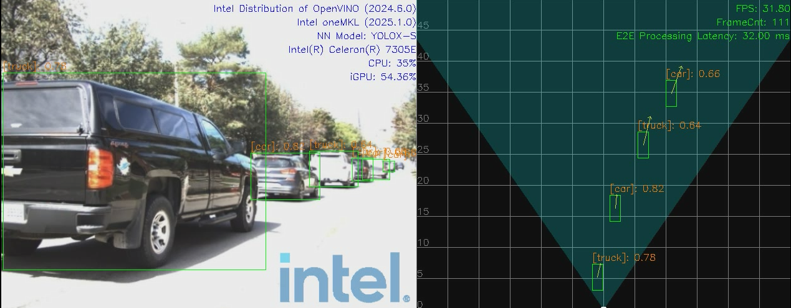
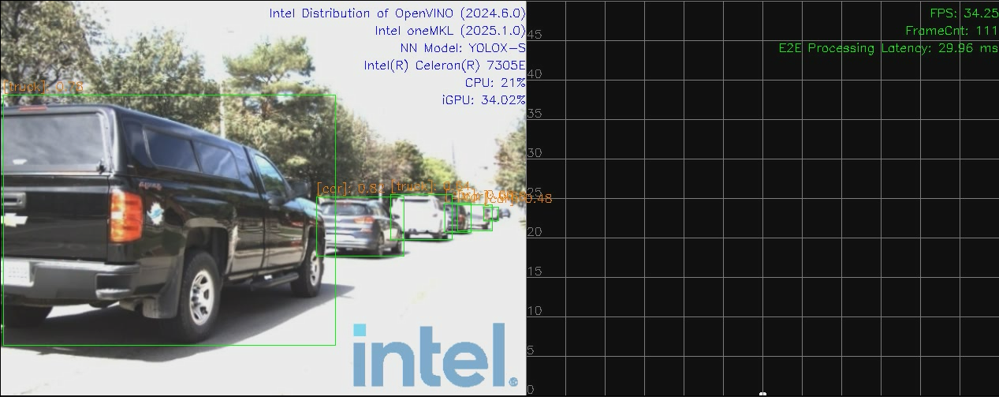
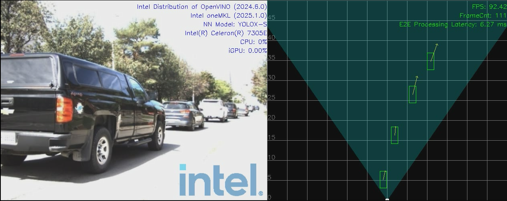
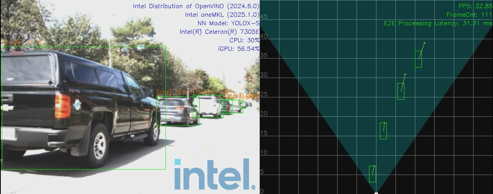
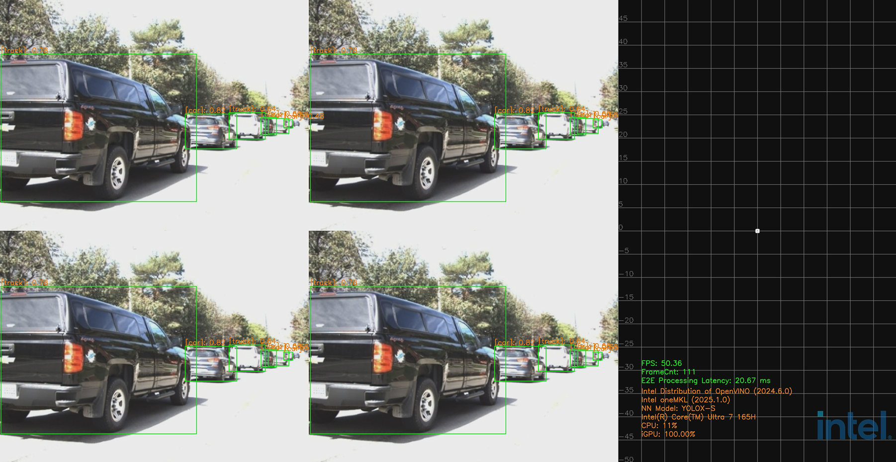
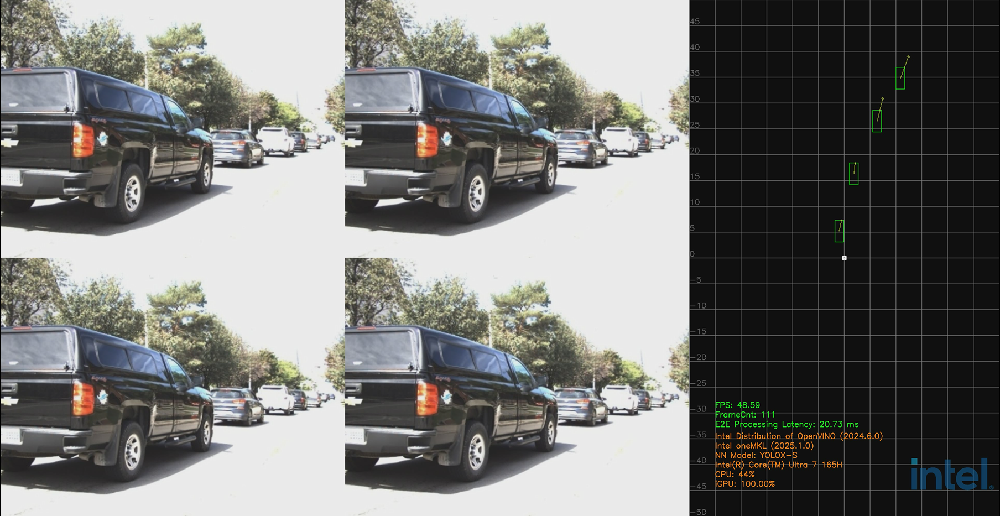
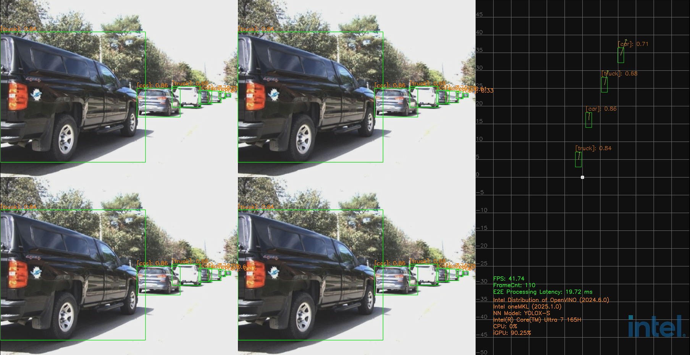
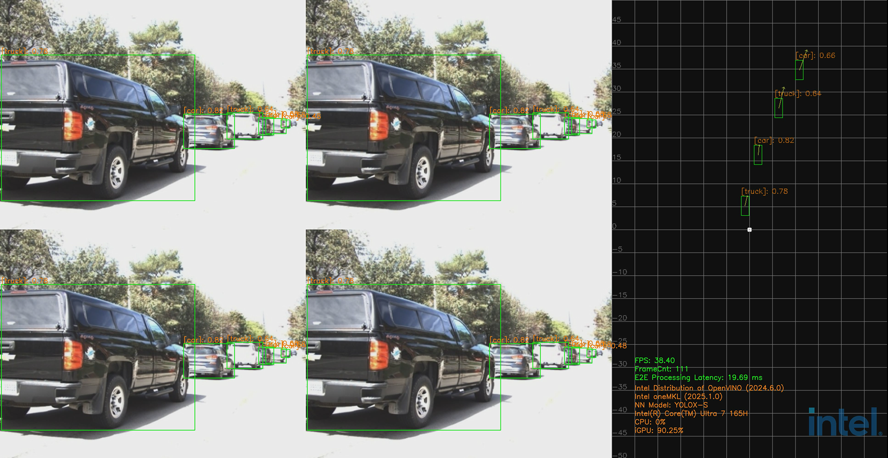

# Intel® Metro AI Suite Sensor Fusion for Traffic Management

Get Started Guide for running on bare metal. For running on EEF base platform, please refer to the file: [Get-Started-Guide.md](./docs/user-guide/Get-Started-Guide.md)

OS: ubuntu 24.04

## 1. Overview
### 1.1 Prerequisites
- OpenVINO™ Toolkit
  - Version Type: 2024.5
- Raddet Dataset
  - https://github.com/ZhangAoCanada/RADDet#Dataset
- Platform
  - Intel® Celeron® Processor 7305E (1C+1R usecase)
  - Intel® Core™ Ultra 7 Processor 165H (4C+4R usecase)
### 1.2 Modules
- AI Inference Service:
  - Media Processing (Camera)
  - Radar Processing (mmWave Radar)
  - Sensor Fusion
- Demo Application

#### 1.2.1 AI Inference Service

AI Inference Service expose both RESTful API or gRPC API to clients, so as pipelines defined by clients could be requested to run within service.

```
vim $PROJ_DIR/ai_inference/source/low_latency_server/AiInference.config

...
[HTTP]
address=0.0.0.0
RESTfulPort=50051
gRPCPort=50052
```

- RESTful API: listen on port 50051
- gRPC API: listen on port 50052

> NOTE: 
> - For more details about API description, please refer to file: [InferenceServiceAPIDesign.md](./ai_inference/InferenceServiceAPIDesign.md)
> - For how to run tests through RESTful API and gRPC API, please refer to [sec 5. Run Sensor Fusion Application](#5-run-sensor-fusion-application)

#### 1.2.2 Demo Application
The media processing and sensor fusion results will be displayed. Here's an example for your reference:

[](ai_inference/test/demo/1C1R-Display-type-media-fusion.png)

For more details about the display mode, please refer to [sec 5.3 Run Entry Program](#53-run-entry-program)


## 2. Install Dependencies
Before starting the installation, please configure your proxy.
```
 export http_proxy=<Your-Proxy>
 export https_proxy=<Your-Proxy>
```

### [1] base libs
```Shell.bash
sudo apt-get update -y
sudo apt-get install -y automake libtool build-essential bison zlib1g-dev git pkg-config flex curl libavcodec-dev libavformat-dev libjpeg-dev libswscale-dev libuv1-dev libssl-dev libeigen3-dev git-lfs libfmt-dev libgstreamer1.0-dev libgstreamer-plugins-base1.0-dev intel-gpu-tools libva-dev
```

### [2] install cmake 3.21.2
```Shell.bash
curl -k -o cmake-3.21.2.tar.gz https://github.com/Kitware/CMake/releases/download/v3.21.2/cmake-3.21.2.tar.gz -L
tar -zxf cmake-3.21.2.tar.gz && cd cmake-3.21.2
./bootstrap --prefix=/usr && make -j8 && sudo make install
```

### [3] install boost 1.83.0
```Shell.bash
curl -k -o boost_1_83_0.tar.gz https://boostorg.jfrog.io/artifactory/main/release/1.83.0/source/boost_1_83_0.tar.gz -L
tar -zxf boost_1_83_0.tar.gz && cd boost_1_83_0
./bootstrap.sh --with-libraries=all --with-toolset=gcc
./b2 toolset=gcc && sudo ./b2 install && sudo ldconfig
```

### [4] install spdlog 1.8.2
```Shell.bash
curl -k -o v1.8.2.tar.gz https://github.com/gabime/spdlog/archive/refs/tags/v1.8.2.tar.gz -L
tar -zxf v1.8.2.tar.gz && cd spdlog-1.8.2
sudo mv include/spdlog /usr/local/include
```

### [5] install thrift 0.18.1
```Shell.bash
curl -k -o thrift_v0.18.1.tar.gz https://github.com/apache/thrift/archive/refs/tags/v0.18.1.tar.gz -L
tar -zxf thrift_v0.18.1.tar.gz && cd thrift-0.18.1
./bootstrap.sh && ./configure --with-qt4=no --with-qt5=no --with-python=no
make -j8 && sudo make install
```

### [6] install openvino
- Install openvino, run the following commands:
```Shell.bash
wget https://storage.openvinotoolkit.org/repositories/openvino/packages/2024.5/linux/l_openvino_toolkit_ubuntu24_2024.5.0.17288.7975fa5da0c_x86_64.tgz
tar -xvf l_openvino_toolkit_ubuntu24_2024.5.0.17288.7975fa5da0c_x86_64.tgz
sudo mkdir -p /opt/intel/openvino_2024
sudo mv l_openvino_toolkit_ubuntu24_2024.5.0.17288.7975fa5da0c_x86_64/* /opt/intel/openvino_2024

sudo apt-get install libgdal-dev libpugixml-dev libopencv-dev
```
* check the existence for path: /opt/intel/openvino_2024
- **Computing Runtime Support:** Install NEO OpenCL [Release/24.39.31294.12](https://github.com/intel/compute-runtime/releases/tag/24.39.31294.12)

```Shell.bash
mkdir neo
cd neo
wget https://github.com/intel/intel-graphics-compiler/releases/download/igc-1.0.17791.9/intel-igc-core_1.0.17791.9_amd64.deb
wget https://github.com/intel/intel-graphics-compiler/releases/download/igc-1.0.17791.9/intel-igc-opencl_1.0.17791.9_amd64.deb
wget https://github.com/intel/compute-runtime/releases/download/24.39.31294.12/intel-level-zero-gpu-dbgsym_1.6.31294.12_amd64.ddeb
wget https://github.com/intel/compute-runtime/releases/download/24.39.31294.12/intel-level-zero-gpu_1.6.31294.12_amd64.deb
wget https://github.com/intel/compute-runtime/releases/download/24.39.31294.12/intel-opencl-icd-dbgsym_24.39.31294.12_amd64.ddeb
wget https://github.com/intel/compute-runtime/releases/download/24.39.31294.12/intel-opencl-icd_24.39.31294.12_amd64.deb
wget https://github.com/intel/compute-runtime/releases/download/24.39.31294.12/libigdgmm12_22.5.2_amd64.deb

# Verify sha256 sums for packages
wget https://github.com/intel/compute-runtime/releases/download/24.39.31294.12/ww39.sum
sha256sum -c ww39.sum

# Install all packages as root
sudo dpkg -i *deb

# Install header files to allow compilation of new code
sudo apt install ocl-icd-libopencl1
```
### [7] install oneapi-mkl
```Shell.bash
curl -k -o GPG-PUB-KEY-INTEL-SW-PRODUCTS.PUB https://apt.repos.intel.com/intel-gpg-keys/GPG-PUB-KEY-INTEL-SW-PRODUCTS.PUB -L
sudo apt-key add GPG-PUB-KEY-INTEL-SW-PRODUCTS.PUB && rm GPG-PUB-KEY-INTEL-SW-PRODUCTS.PUB

echo "deb https://apt.repos.intel.com/oneapi all main" | sudo tee /etc/apt/sources.list.d/oneAPI.list
sudo apt-get update -y
sudo apt-get install -y intel-oneapi-mkl-devel
sudo apt-get -y install lsb-release
```

**Note:** If there is a problem with certificate verification and `intel-oneapi-mkl-devel` cannot be installed, you can install it offline:

```bash
wget https://registrationcenter-download.intel.com/akdlm/IRC_NAS/79153e0f-74d7-45af-b8c2-258941adf58a/intel-onemkl-2025.0.0.940_offline.sh

sudo sh ./intel-onemkl-2025.0.0.940_offline.sh
sudo apt-get -y install lsb-release
```

### [8] install gRPC 1.58.1 (manually upgrade zlib to v1.3.1: fix CVSS2.1 vulnerability for CVE-2004-0797)
```Shell.bash
git clone --recurse-submodules -b v1.58.1 --depth 1 --shallow-submodules https://github.com/grpc/grpc grpc-v1.58.1
cd grpc-v1.58.1/third_party && rm -rf zlib
git clone -b v1.3.1 https://github.com/madler/zlib.git zlib
cd zlib
sed -i 's/PUBLIC ${CMAKE_CURRENT_BINARY_DIR} ${CMAKE_CURRENT_SOURCE_DIR}/PUBLIC $<BUILD_INTERFACE:${CMAKE_CURRENT_BINARY_DIR}> $<BUILD_INTERFACE:${CMAKE_CURRENT_SOURCE_DIR}>/g' CMakeLists.txt
cd ../..
mkdir -p cmake/build
cd cmake/build
cmake -DgRPC_INSTALL=ON -DgRPC_BUILD_TESTS=OFF -DCMAKE_INSTALL_PREFIX=/opt/grpc ../..
make -j8
sudo make install
```
If encounter error like RPC failed; curl 92 HTTP/2 stream 5 was not closed cleanly: CANCEL (err 8), please set config like below:
```Shell.bash
git config --global http.postBuffer 524288000
```

### [9] install Intel® oneAPI Level Zero 
If gpu metrics are used, please install level-zero.
The objective of the Intel® oneAPI Level Zero (Level Zero) Application Programming Interface (API) is to provide direct-to-metal interfaces to offload accelerator devices. 

```Shell.bash
git clone https://github.com/oneapi-src/level-zero.git
cd level-zero
git checkout v1.17.19
mkdir build
cd build
cmake .. -DCMAKE_INSTALL_PREFIX=/opt/intel/level-zero
sudo cmake --build . --config Release --target install
```
### [10] install oneVPL 2024.3.4
```Shell.bash
mkdir -p onevpl_dependencies
MFX_HOME="/opt/intel/media"
LIBVA_INSTALL_PATH="/opt/intel/media/lib64"
LIBVA_DRIVERS_PATH="/opt/intel/media/lib64"
LIBVA_DRIVER_NAME="iHD"
LIBVA_INSTALL_PREFIX="/opt/intel/media"
export LIBRARY_PATH=${LIBVA_INSTALL_PATH}:${LIBRARY_PATH}
export C_INCLUDE_PATH=${LIBVA_INSTALL_PREFIX}/include:${C_INCLUDE_PATH}
export CPLUS_INCLUDE_PATH=${LIBVA_INSTALL_PREFIX}/include:${CPLUS_INCLUDE_PATH}
export PKG_CONFIG_PATH=${LIBVA_INSTALL_PATH}/pkgconfig:${PKG_CONFIG_PATH}

sudo mkdir -p $MFX_HOME
sudo mkdir -p $LIBVA_INSTALL_PATH
sudo mkdir -p $LIBVA_DRIVERS_PATH

sudo apt-get install libdrm-dev libegl1-mesa-dev libgl1-mesa-dev libx11-dev libx11-xcb-dev libxcb-dri3-dev libxext-dev libxfixes-dev libwayland-dev

# Install libva

cd onevpl_dependencies
curl -k -o libva-2.22.0.tar.gz https://github.com/intel/libva/archive/refs/tags/2.22.0.tar.gz -L
tar -xvf libva-2.22.0.tar.gz
cd libva-2.22.0
./autogen.sh --prefix=${LIBVA_INSTALL_PREFIX} --libdir=${LIBVA_INSTALL_PATH} --enable-x11
make -j8
sudo make install

# Install libva-utils

cd onevpl_dependencies
curl -k -o libva-utils-2.22.0.tar.gz https://github.com/intel/libva-utils/archive/refs/tags/2.22.0.tar.gz -L
tar -xvf libva-utils-2.22.0.tar.gz
cd libva-utils-2.22.0
./autogen.sh --prefix=${LIBVA_INSTALL_PREFIX} --libdir=${LIBVA_INSTALL_PATH}
make -j8
sudo make install

# Install gmmlib

cd onevpl_dependencies
curl -k -o gmmlib-22.5.3.tar.gz https://github.com/intel/gmmlib/archive/refs/tags/intel-gmmlib-22.5.3.tar.gz -L
tar -xvf gmmlib-22.5.3.tar.gz
cd gmmlib-intel-gmmlib-22.5.3
mkdir -p build && cd build
cmake .. -DCMAKE_INSTALL_PREFIX=${LIBVA_INSTALL_PREFIX} -DCMAKE_INSTALL_LIBDIR=${LIBVA_INSTALL_PATH} -DCMAKE_BUILD_TYPE=Release
make -j8
sudo make install

# Install media-driver

cd onevpl_dependencies
curl -k -o intel-media-24.3.4.tar.gz https://github.com/intel/media-driver/archive/refs/tags/intel-media-24.3.4.tar.gz -L
tar -xvf intel-media-24.3.4.tar.gz
mkdir -p build_media && cd build_media
cmake ../media-driver-intel-media-24.3.4 -DCMAKE_INSTALL_PREFIX=${LIBVA_INSTALL_PREFIX} -DLIBVA_INSTALL_PATH=${LIBVA_INSTALL_PATH} -DCMAKE_INSTALL_LIBDIR=${LIBVA_INSTALL_PATH} -DCMAKE_BUILD_TYPE=Release -DENABLE_PRODUCTION_KMD=ON
make -j8
sudo make install
env LD_LIBRARY_PATH=${LIBVA_INSTALL_PATH}:${LD_LIBRARY_PATH} LIBRARY_PATH=${LIBVA_INSTALL_PATH}:${LIBRARY_PATH} 
sudo make install
sudo mv /opt/intel/media/lib64/dri/* /opt/intel/media/lib64/
sudo rm -rf /opt/intel/media/lib64/dri

# Install oneVPL-intel-gpu

cd onevpl_dependencies
curl -k -o intel-onevpl-24.3.4.tar.gz https://github.com/oneapi-src/oneVPL-intel-gpu/archive/refs/tags/intel-onevpl-24.3.4.tar.gz -L
tar -xvf intel-onevpl-24.3.4.tar.gz
cd vpl-gpu-rt-intel-onevpl-24.3.4
mkdir -p build && cd build
cmake .. -DCMAKE_INSTALL_PREFIX=${LIBVA_INSTALL_PREFIX} -DCMAKE_INSTALL_LIBDIR=${LIBVA_INSTALL_PATH} -DCMAKE_BUILD_TYPE=Release
make -j8
sudo make install

# Install oneVPL-dispatcher

cd onevpl_dependencies
curl -k -o oneVPL_v2.13.0.tar.gz https://github.com/intel/libvpl/archive/refs/tags/v2.13.0.tar.gz -L
tar -xvf oneVPL_v2.13.0.tar.gz
cd libvpl-2.13.0
mkdir -p build && cd build
cmake .. -DCMAKE_INSTALL_PREFIX=${LIBVA_INSTALL_PREFIX} -DCMAKE_INSTALL_LIBDIR=${LIBVA_INSTALL_PATH} -DCMAKE_BUILD_TYPE=Release -DENABLE_X11=ON
cmake --build . --config Release
sudo cmake --build . --config Release --target install
```

### [11] Installing GPU packages
[Client GPU Installation](https://dgpu-docs.intel.com/driver/client/overview.html)
#### Configure your system to install client packages.
```Shell.bash
# Install the Intel graphics GPG public key
wget -qO - https://repositories.intel.com/gpu/intel-graphics.key | \
  sudo gpg --yes --dearmor --output /usr/share/keyrings/intel-graphics.gpg

# Configure the repositories.intel.com package repository
echo "deb [arch=amd64,i386 signed-by=/usr/share/keyrings/intel-graphics.gpg] https://repositories.intel.com/gpu/ubuntu noble client" | \
  sudo tee /etc/apt/sources.list.d/intel-gpu-noble.list

# Update the package repository meta-data
sudo apt update
```

If you experience problems with repository signatures during a system update, as opposed to the initial installation, use the following GPG public key to sign the package repositories:
```Shell.bash
wget -qO - https://repositories.intel.com/gpu/intel-graphics.key | \
  sudo gpg --yes --dearmor --output /usr/share/keyrings/intel-graphics.gpg
```

Install Compute Runtime, Media, and Mesa packages.
```Shell.bash
sudo apt install -y \
  intel-opencl-icd intel-level-zero-gpu \
  intel-media-va-driver-non-free libmfx1 libvpl2 \
  libegl-mesa0 libegl1-mesa-dev libgbm1 libgl1-mesa-dev libgl1-mesa-dri \
  libglapi-mesa libgles2-mesa-dev libglx-mesa0 libigdgmm12 libxatracker2 mesa-va-drivers \
  mesa-vdpau-drivers mesa-vulkan-drivers va-driver-all vainfo hwinfo clinfo
```

If you need header files or pkg-config support, install development packages.
```Shell.bash
sudo apt install -y libigc-dev libigdfcl-dev libigfxcmrt-dev
```

### [12] Linux NPU Driver Installation(MTL only)
#### Upgrade the Kernel
```Shell.bash
wget https://kernel.ubuntu.com/mainline/v6.8.1/amd64/linux-image-unsigned-6.8.1-060801-generic_6.8.1-060801.202403151937_amd64.deb
wget https://kernel.ubuntu.com/mainline/v6.8.1/amd64/linux-modules-6.8.1-060801-generic_6.8.1-060801.202403151937_amd64.deb
sudo dpkg -i *.deb
```

#### Installation procedure on Ubuntu24.04
1. Download all *.deb packages
``` Shell.bash
wget https://github.com/intel/linux-npu-driver/releases/download/v1.8.0/intel-driver-compiler-npu_1.8.0.20240916-10885588273_ubuntu24.04_amd64.deb
wget https://github.com/intel/linux-npu-driver/releases/download/v1.8.0/intel-fw-npu_1.8.0.20240916-10885588273_ubuntu24.04_amd64.deb
wget https://github.com/intel/linux-npu-driver/releases/download/v1.8.0/intel-level-zero-npu_1.8.0.20240916-10885588273_ubuntu24.04_amd64.deb
```
2. Install libtbb12 which is a dependency for intel-driver-compiler-npu
``` Shell.bash
sudo apt update
sudo apt install libtbb12
```
3. Install all packages
``` Shell.bash
sudo dpkg -i *.deb
```
4. Install Level Zero if it is not in the system
``` Shell.bash
# check if Level Zero is installed
dpkg -l level-zero

# download and install package if Level Zero is missing
wget https://github.com/oneapi-src/level-zero/releases/download/v1.17.19/level-zero_1.17.19+u22.04_amd64.deb
dpkg -i level-zero*.deb
```
5. Reboot
``` Shell.bash
reboot
# if everything works, we should see /dev/accel/accel0 device
ls /dev/accel/accel0
# /dev/accel/accel0
# to receive intel_vpu state
dmesg
```
6. User access to the device

As a root user, this step can be skipped.
The new device /dev/accel/accel0 requires manual setting of permissions access.
The accel devices should be in the "render" group in Ubuntu:
``` Shell.bash
# set the render group for accel device
sudo chown root:render /dev/accel/accel0
sudo chmod g+rw /dev/accel/accel0
# add user to the render group
sudo usermod -a -G render <user-name>
# user needs to restart the session to use the new group (log out and log in)
```
The above steps must be repeated each time module is reloaded or on every reboot.
To avoid manual setup of the group for accel device, the udev rules can be used:
``` Shell.bash
sudo bash -c "echo 'SUBSYSTEM==\"accel\", KERNEL==\"accel*\", GROUP=\"render\", MODE=\"0660\"' > /etc/udev/rules.d/10-intel-vpu.rules"
sudo udevadm control --reload-rules
sudo udevadm trigger --subsystem-match=accel
```
In case of NPU is not visible, always check the access to the device with following command:
``` Shell.bash
$ ls -lah /dev/accel/accel0
crw-rw---- 1 root render 261, 0 Mar 22 13:22 /dev/accel/accel0
```
If `render` is missing, or `crw-rw----` is not set, please repeat the steps to set the access to the device.

## 3. Build Project
- clone project
  ```Shell.bash
  git clone https://github.com/intel-innersource/applications.iot.video-edge-device.holographic-sensor-fusion.git
  ```
- prepare global radar configs in folder: /opt/datasets
    ```Shell.bash
    sudo ln -s $PROJ_DIR/ai_inference/deployment/datasets /opt/datasets
    ```

- prepare models in folder: /opt/models
    ```Shell.bash
    sudo ln -s $PROJ_DIR/ai_inference/deployment/models /opt/models
    ```
- prepare offline radar results for 4C4R:
    ```Shell.bash
    sudo mv $PROJ_DIR/ai_inference/deployment/datasets/radarResults.csv /opt
    ```
- build project
    ``` Shell.bash
    bash -x build.sh
    ```

## 4. Dowload and Convert Dataset
For how to get Raddet dataset, please refer to this guide: [how_to_get_RADDet_datasets.md](./how_to_get_RADDet_datasets.md)

Upon success, bin files will be extracted, save to $DATASET_ROOT/bin_files_{VERSION}:
> NOTE: latest converted dataset version should be: v1.0

## 5. Run Sensor Fusion Application

In this section, we describe how to run Intel® Metro AI Suite Sensor Fusion for Traffic Management application.

Intel® Metro AI Suite Sensor Fusion for Traffic Management application can support different pipeline using topology JSON files to describe the pipeline topology. The defined pipeline topology can be found at [sec 5.1 Resources Summary](#51-resources-summary)

There are two steps required for running the sensor fusion application:
- Start AI Inference service, more details can be found at [sec 5.2 Start Service](#52-start-service)
- Run the application entry program, more details can be found at [sec 5.3 Run Entry Program](#53-run-entry-program)

Besides, users can test each component (without display) following the guides at [sec 5.4 Run Unit Tests](#54-run-unit-tests)


### 5.1 Resources Summary
- Local File Pipeline for Media pipeline
  - Json File: [localMediaPipeline.json](./ai_inference/test/configs/raddet/1C1R/localMediaPipeline.json)
  - Pipeline Description: 
    ```
    input -> decode -> detection -> tracking -> output
    ```

- Local File Pipeline for mmWave Radar pipeline
  - Json File: [localRadarPipeline.json](./ai_inference/test/configs/raddet/1C1R/localRadarPipeline.json)
  - Pipeline Description: 

    ```
    input -> preprocess -> radar_detection -> clustering -> tracking -> output
    ```

- Local File Pipeline for `Camera + Radar(1C+1R)` Sensor fusion pipeline

  - Json File: [localFusionPipeline.json](./ai_inference/test/configs/raddet/1C1R/localFusionPipeline.json)
  - Pipeline Description: 
    ```
    input  | -> decode     -> detector         -> tracker                  -> |
           | -> preprocess -> radar_detection  -> clustering   -> tracking -> | -> coordinate_transform->fusion -> output
    ```
- Local File Pipeline for `Camera + Radar(4C+4R)` Sensor fusion pipeline

  - Json File: [localFusionPipeline.json](./ai_inference/test/configs/raddet/4C4R/localFusionPipeline.json)
  - Pipeline Description: 
    ```
    input  | -> decode     -> detector         -> tracker                  -> |
           |              -> radarOfflineResults ->                           | -> coordinate_transform->fusion -> |
    input  | -> decode     -> detector         -> tracker                  -> |                                    |
           |              -> radarOfflineResults ->                           | -> coordinate_transform->fusion -> | -> output
    input  | -> decode     -> detector         -> tracker                  -> |                                    |
           |              -> radarOfflineResults ->                           | -> coordinate_transform->fusion -> |
    input  | -> decode     -> detector         -> tracker                  -> |                                    |
           |              -> radarOfflineResults ->                           | -> coordinate_transform->fusion -> |
    ```

### 5.2 Start Service
Open a terminal, run the following commands:

```Shell.bash
cd $PROJ_DIR
sudo bash -x run_service_bare.sh

# Output logs:
    [2023-06-26 14:34:42.970] [DualSinks] [info] MaxConcurrentWorkload sets to 1
    [2023-06-26 14:34:42.970] [DualSinks] [info] MaxPipelineLifeTime sets to 300s
    [2023-06-26 14:34:42.970] [DualSinks] [info] Pipeline Manager pool size sets to 1
    [2023-06-26 14:34:42.970] [DualSinks] [trace] [HTTP]: uv loop inited
    [2023-06-26 14:34:42.970] [DualSinks] [trace] [HTTP]: Init completed
    [2023-06-26 14:34:42.971] [DualSinks] [trace] [HTTP]: http server at 0.0.0.0:50051
    [2023-06-26 14:34:42.971] [DualSinks] [trace] [HTTP]: running starts
    [2023-06-26 14:34:42.971] [DualSinks] [info] Server set to listen on 0.0.0.0:50052
    [2023-06-26 14:34:42.972] [DualSinks] [info] Server starts 1 listener. Listening starts
    [2023-06-26 14:34:42.972] [DualSinks] [trace] Connection handle with uid 0 created
    [2023-06-26 14:34:42.972] [DualSinks] [trace] Add connection with uid 0 into the conn pool

```
> NOTE-1 : workload (default as 1) can be configured in file: $PROJ_DIR/ai_inference/source/low_latency_server/AiInference.config
```
...
[Pipeline]
maxConcurrentWorkload=1
```

> NOTE-2 : to stop service, run the following commands:
```Shell.bash
sudo pkill Hce
```


### 5.3 Run Entry Program
#### 5.3.1 1C+1R

All executable files are located at: $PROJ_DIR/build/bin

Usage:
```
Usage: CRSensorFusionDisplay <host> <port> <json_file> <total_stream_num> <repeats> <data_path> <display_type> [<save_flag: 0 | 1>] [<pipeline_repeats>] [<fps_window: unsigned>] [<cross_stream_num>] [<warmup_flag: 0 | 1>]  [<logo_flag: 0 | 1>]
--------------------------------------------------------------------------------
Environment requirement:
   unset http_proxy;unset https_proxy;unset HTTP_PROXY;unset HTTPS_PROXY
```
* **host**: use `127.0.0.1` to call from localhost.
* **port**: configured as `50052`, can be changed by modifying file: `$PROJ_DIR/ai_inference/source/low_latency_server/AiInference.config` before starting the service.
* **json_file**: ai pipeline topology file.
* **total_stream_num**: to control the input streams.
* **repeats**: to run tests multiple times, so that we can get more accurate performance.
* **data_path**: multi-sensor binary files folder for input.
* **display_type**: support for `media`, `radar`, `media_radar`, `media_fusion` currently.
  * `media`: only show image results in frontview. Example:
  [](ai_inference/test/demo/1C1R-Display-type-media.png)
  * `radar`: only show radar results in birdview. Example:
  [](ai_inference/test/demo/1C1R-Display-type-radar.png)
  * `media_radar`: show image results in frontview and radar results in birdview separately. Example:
  [](ai_inference/test/demo/1C1R-Display-type-media-radar.png)
  * `media_fusion`: show both for image results in frontview and fusion results in birdview. Example:
  [](ai_inference/test/demo/1C1R-Display-type-media-fusion.png)
* **save_flag**: whether to save display results into video.
* **pipeline_repeats**: pipeline repeats number.
* **fps_window**: The number of frames processed in the past is used to calculate the fps. 0 means all frames processed are used to calculate the fps.
* **cross_stream_num**: the stream number that run in a single pipeline.
* **warmup_flag**: warmup flag before pipeline start.
* **logo_flag**: whether to add intel logo in display.

More specifically, open another terminal, run the following commands:

```Shell.bash
# multi-sensor inputs test-case
sudo -E ./build/bin/CRSensorFusionDisplay 127.0.0.1 50052 ai_inference/test/configs/raddet/1C1R/libradar/localFusionPipeline_libradar.json 1 1 /path-to-dataset media_fusion
```
> Note: Run with `root` if users want to get the GPU utilization profiling.

### 5.3.2 1C+1R Unit Tests
In this section, the unit tests of four major components will be described: media processing, radar processing, fusion pipeline without display and other tools for intermediate results.

Usage:
```
Usage: testGRPCLocalPipeline <host> <port> <json_file> <total_stream_num> <repeats> <data_path> <media_type> [<pipeline_repeats>] [<cross_stream_num>] [<warmup_flag: 0 | 1>]
--------------------------------------------------------------------------------
Environment requirement:
   unset http_proxy;unset https_proxy;unset HTTP_PROXY;unset HTTPS_PROXY
```
* **host**: use `127.0.0.1` to call from localhost.

* **port**: configured as `50052`, can be changed by modifying file: `$PROJ_DIR/ai_inference/source/low_latency_server/AiInference.config` before starting the service.
* **json_file**: ai pipeline topology file.
* **total_stream_num**: to control the input video streams.
* **repeats**: to run tests multiple times, so that we can get more accurate performance.
* **abs_data_path**: input data, remember to use absolute data path, or it may cause error.
* **media_type**: support for `image`, `video`, `multisensor` currently.
* **pipeline_repeats**: the pipeline repeats number.
* **cross_stream_num**: the stream number that run in a single pipeline.

##### 5.3.2.1 Unit Test: Media Processing
Open another terminal, run the following commands:
```Shell.bash
# media test-case
./build/bin/testGRPCLocalPipeline 127.0.0.1 50052 ai_inference/test/configs/raddet/1C1R/localMediaPipeline.json 1 1 /path-to-dataset multisensor
```

##### 5.3.2.2 Unit Test: Radar Processing
Open another terminal, run the following commands:
```Shell.bash
# radar test-case
./build/bin/testGRPCLocalPipeline 127.0.0.1 50052 ai_inference/test/configs/raddet/1C1R/libradar/localRadarPipeline_libradar.json 1 1 /path-to-dataset multisensor
```

##### 5.3.2.3 Unit Test: Fusion pipeline without display
Open another terminal, run the following commands:
```Shell.bash
# fusion test-case
./build/bin/testGRPCLocalPipeline 127.0.0.1 50052 ai_inference/test/configs/raddet/1C1R/libradar/localFusionPipeline_libradar.json 1 1 /path-to-dataset multisensor
```
##### 5.3.2.4 GPU VPLDecode test
```Shell.bash
./build/bin/testGRPCLocalPipeline 127.0.0.1 50052 ai_inference/test/configs/gpuLocalVPLDecodeImagePipeline.json 1 1000 $PROJ_DIR/ai_inference/test/demo/images image
```
##### 5.3.2.5 Media model inference visualization
```
./build/bin/MediaDisplay 127.0.0.1 50052 ai_inference/test/configs/raddet/1C1R/localMediaPipeline.json 1 1 /path-to-dataset multisensor
```
##### 5.3.2.6 Radar pipeline with radar pcl as output
```
./build/bin/testGRPCLocalPipeline 127.0.0.1 50052 ai_inference/test/configs/raddet/1C1R/libradar/localRadarPipeline_pcl_libradar.json 1 1 /path-to-dataset multisensor
```
##### 5.3.2.7 Save radar pipeline tracking results
```
./build/bin/testGRPCLocalPipeline 127.0.0.1 50052 ai_inference/test/configs/raddet/1C1R/libradar/localRadarPipeline_saveResult_libradar.json 1 1 /path-to-dataset multisensor
```
##### 5.3.2.8 Save radar pipeline pcl results
```
./build/bin/testGRPCLocalPipeline 127.0.0.1 50052 ai_inference/test/configs/raddet/1C1R/libradar/localRadarPipeline_savepcl_libradar.json 1 1 /path-to-dataset multisensor
```
##### 5.3.2.9 Save radar pipeline clustering results
```
./build/bin/testGRPCLocalPipeline 127.0.0.1 50052 ai_inference/test/configs/raddet/1C1R/libradar/localRadarPipeline_saveClustering_libradar.json 1 1 /path-to-dataset multisensor
```
##### 5.3.2.10 Test radar pipeline performance
```
## no need to run the service
export HVA_NODE_DIR=$PWD/build/lib
source /opt/intel/openvino_2024/setupvars.sh
source /opt/intel/oneapi/setvars.sh
./build/bin/testRadarPerformance ai_inference/test/configs/raddet/1C1R/libradar/localRadarPipeline_libradar.json /path-to-dataset 1
```
##### 5.3.2.11 Radar pcl results visualization
```
./build/bin/CRSensorFusionRadarDisplay 127.0.0.1 50052 ai_inference/test/configs/raddet/1C1R/libradar/localRadarPipeline_savepcl_libradar.json 1 1 /path-to-dataset pcl
```
##### 5.3.2.12 Radar clustering results visualization
```
./build/bin/CRSensorFusionRadarDisplay 127.0.0.1 50052 ai_inference/test/configs/raddet/1C1R/libradar/localRadarPipeline_saveClustering_libradar.json 1 1 /path-to-dataset clustering
```
##### 5.3.2.13 Radar tracking results visualization
```
./build/bin/CRSensorFusionRadarDisplay 127.0.0.1 50052 ai_inference/test/configs/raddet/1C1R/libradar/localRadarPipeline_libradar.json 1 1 /path-to-dataset tracking
```

#### 5.3.3 4C+4R

All executable files are located at: $PROJ_DIR/build/bin

Usage:
```
Usage: CRSensorFusion4C4RDisplay <host> <port> <json_file> <additional_json_file> <total_stream_num> <repeats> <data_path> <display_type> [<save_flag: 0 | 1>] [<pipeline_repeats>] [<cross_stream_num>] [<warmup_flag: 0 | 1>] [<logo_flag: 0 | 1>]
--------------------------------------------------------------------------------
Environment requirement:
   unset http_proxy;unset https_proxy;unset HTTP_PROXY;unset HTTPS_PROXY
```
* **host**: use `127.0.0.1` to call from localhost.
* **port**: configured as `50052`, can be changed by modifying file: `$PROJ_DIR/ai_inference/source/low_latency_server/AiInference.config` before starting the service.
* **json_file**: ai pipeline topology file.
* **additional_json_file**: ai pipeline additional topology file.
* **total_stream_num**: to control the input streams.
* **repeats**: to run tests multiple times, so that we can get more accurate performance.
* **data_path**: multi-sensor binary files folder for input.
* **display_type**: support for `media`, `radar`, `media_radar`, `media_fusion` currently.
  * `media`: only show image results in frontview. Example:
  [](ai_inference/test/demo/4C4R-Display-type-media.png)
  * `radar`: only show radar results in birdview. Example:
  [](ai_inference/test/demo/4C4R-Display-type-radar.png)
  * `media_radar`: show image results in frontview and radar results in birdview separately. Example:
  [](ai_inference/test/demo/4C4R-Display-type-media-radar.png)
  * `media_fusion`: show both for image results in frontview and fusion results in birdview. Example:
  [](ai_inference/test/demo/4C4R-Display-type-media-fusion.png)
* **save_flag**: whether to save display results into video.
* **pipeline_repeats**: pipeline repeats number.
* **cross_stream_num**: the stream number that run in a single pipeline.
* **warmup_flag**: warmup flag before pipeline start.
* **logo_flag**: whether to add intel logo in display.

More specifically, open another terminal, run the following commands:

```Shell.bash
# multi-sensor inputs test-case
sudo -E ./build/bin/CRSensorFusion4C4RDisplay 127.0.0.1 50052 ai_inference/test/configs/raddet/4C4R/localFusionPipeline.json ai_inference/test/configs/raddet/4C4R/localFusionPipeline_npu.json 4 1 /path-to-dataset media_fusion
```
> Note: Run with `root` if users want to get the GPU utilization profiling.

To run 4C+4R with cross-stream support, for example, process 3 streams on GPU with 1 thread and the other 1 stream on NPU in another thread, run the following command:
```Shell.bash
# multi-sensor inputs test-case
sudo -E ./build/bin/CRSensorFusion4C4RDisplayCrossStream 127.0.0.1 50052 ai_inference/test/configs/raddet/4C4R/cross-stream/localFusionPipeline.json ai_inference/test/configs/raddet/4C4R/cross-stream/localFusionPipeline_npu.json 4 1 /path-to-dataset media_fusion save_flag 1 3
```

For the command above, if you encounter problems with opencv due to remote connection, you can try running the following command which sets the save flag to 2 meaning that the video will be saved locally without needing to show on the screen:
```Shell.bash
# multi-sensor inputs test-case
sudo -E ./build/bin/CRSensorFusion4C4RDisplayCrossStream 127.0.0.1 50052 ai_inference/test/configs/raddet/4C4R/cross-stream/localFusionPipeline.json ai_inference/test/configs/raddet/4C4R/cross-stream/localFusionPipeline_npu.json 4 1 /path-to-dataset media_fusion 2 1 3
```

### 5.3.4 4C+4R Unit Tests
In this section, the unit tests of two major components will be described: fusion pipeline without display and media processing.

Usage:
```
Usage: testGRPC4C4RPipeline <host> <port> <json_file> <additional_json_file> <total_stream_num> <repeats> <data_path> [<cross_stream_num>] [<warmup_flag: 0 | 1>]
--------------------------------------------------------------------------------
Environment requirement:
   unset http_proxy;unset https_proxy;unset HTTP_PROXY;unset HTTPS_PROXY
```
* **host**: use `127.0.0.1` to call from localhost.
* **port**: configured as `50052`, can be changed by modifying file: `$PROJ_DIR/ai_inference/source/low_latency_server/AiInference.config` before starting the service.
* **json_file**: ai pipeline topology file.
* **additional_json_file**: ai pipeline additional topology file.
* **total_stream_num**: to control the input video streams.
* **repeats**: to run tests multiple times, so that we can get more accurate performance.
* **data_path**: input data, remember to use absolute data path, or it may cause error.
* **cross_stream_num**: the stream number that run in a single pipeline.
* **warmup_flag**: warmup flag before pipeline start.

**Set offline radar CSV file path**
First, set the offline radar CSV file path in both [localFusionPipeline.json](./ai_inference/test/configs/raddet/4C4R/localFusionPipeline.json) and [localFusionPipeline_npu.json](./ai_inference/test/configs/raddet/4C4R/localFusionPipeline_npu.json) with "Configure String": "RadarDataFilePath=(STRING)/opt/radarResults.csv" like below:
```
{
  "Node Class Name": "RadarResultReadFileNode",
  ......
  "Configure String": "......;RadarDataFilePath=(STRING)/opt/radarResults.csv"
},
```
The method for generating offline radar files is described in [5.3.2.7 Save radar pipeline tracking results](#5327-save-radar-pipeline-tracking-results). Or you can use a pre-prepared data with the command below:
```Shell.bash
sudo mv $PROJ_DIR/ai_inference/deployment/datasets/radarResults.csv /opt
```
#### 5.3.4.1 Unit Test: Fusion Pipeline without display
Open another terminal, run the following commands:
```Shell.bash
# fusion test-case
sudo -E ./build/bin/testGRPC4C4RPipeline 127.0.0.1 50052 ai_inference/test/configs/raddet/4C4R/localFusionPipeline.json ai_inference/test/configs/raddet/4C4R/localFusionPipeline_npu.json 4 1 /path-to-dataset
```

#### 5.3.4.2 Unit Test: Fusion Pipeline with cross-stream without display
Open another terminal, run the following commands:
```Shell.bash
# fusion test-case
sudo -E ./build/bin/testGRPC4C4RPipelineCrossStream 127.0.0.1 50052 ai_inference/test/configs/raddet/4C4R/cross-stream/localFusionPipeline.json ai_inference/test/configs/raddet/4C4R/cross-stream/localFusionPipeline_npu.json 4 1 /path-to-dataset 1 3 
```

#### 5.3.4.3 Unit Test: Media Processing
Open another terminal, run the following commands:
```Shell.bash
# media test-case
sudo -E ./build/bin/testGRPC4C4RPipeline 127.0.0.1 50052 ai_inference/test/configs/raddet/4C4R/localMediaPipeline.json ai_inference/test/configs/raddet/4C4R/localMediaPipeline_npu.json 4 1 /path-to-dataset
```

```Shell.bash
# cpu detection test-case
sudo -E ./build/bin/testGRPCLocalPipeline 127.0.0.1 50052 ai_inference/test/configs/raddet/UTCPUDetection-yoloxs.json 1 1 /path-to-dataset multisensor
```
```Shell.bash
# gpu detection test-case
sudo -E ./build/bin/testGRPCLocalPipeline 127.0.0.1 50052 ai_inference/test/configs/raddet/UTGPUDetection-yoloxs.json 1 1 /path-to-dataset multisensor
```
```Shell.bash
# npu detection test-case
sudo -E ./build/bin/testGRPCLocalPipeline 127.0.0.1 50052 ai_inference/test/configs/raddet/UTNPUDetection-yoloxs.json 1 1 /path-to-dataset multisensor
```
### 5.4 KPI test

#### 5.4.1 1C+1R
```Shell.bash
# Run service with the following command:
sudo bash run_service_bare_log.sh
# Open another terminal, run the command below:
sudo -E ./build/bin/testGRPCLocalPipeline 127.0.0.1 50052 ai_inference/test/configs/raddet/1C1R/libradar/localFusionPipeline_libradar.json 1 10 /path-to-dataset multisensor
```
Fps and average latency will be calculated.
#### 5.4.2 4C+4R
```Shell.bash
# Run service with the following command:
sudo bash run_service_bare_log.sh
# Open another terminal, run the command below:
sudo -E ./build/bin/testGRPC4C4RPipeline 127.0.0.1 50052 ai_inference/test/configs/raddet/4C4R/localFusionPipeline.json ai_inference/test/configs/raddet/4C4R/localFusionPipeline_npu.json 4 10 /path-to-dataset
```
Fps and average latency will be calculated.
### 5.5 Stability test

#### 5.5.1 1C+1R stability test


> NOTE : change workload configuration to 1 in file: $PROJ_DIR/ai_inference/source/low_latency_server/AiInference.config
```
...
[Pipeline]
maxConcurrentWorkload=1
```
Run the service first, and open another terminal, run the command below:
```Shell.bash
# 1C1R without display
sudo -E ./build/bin/testGRPCLocalPipeline 127.0.0.1 50052 ai_inference/test/configs/raddet/1C1R/libradar/localFusionPipeline_libradar.json 1 100 /path-to-dataset multisensor 100
```
#### 5.5.2 4C+4R stability test


> NOTE : change workload configuration to 4 in file: $PROJ_DIR/ai_inference/source/low_latency_server/AiInference.config
```
...
[Pipeline]
maxConcurrentWorkload=4
```
Run the service first, and open another terminal, run the command below:
```Shell.bash
# 4C4R without display
sudo -E ./build/bin/testGRPC4C4RPipeline 127.0.0.1 50052 ai_inference/test/configs/raddet/4C4R/localFusionPipeline.json ai_inference/test/configs/raddet/4C4R/localFusionPipeline_npu.json 4 100 /path-to-dataset 100
```


## 6. Code Reference

Some of the code is referenced from the following projects:
- [IGT GPU Tools](https://gitlab.freedesktop.org/drm/igt-gpu-tools) (MIT License)
- [Intel DL Streamer](https://github.com/dlstreamer/dlstreamer) (MIT License)
- [Open Model Zoo](https://github.com/openvinotoolkit/open_model_zoo) (Apache-2.0 License)

[(https://github.com/intel/compute-runtime/releases/tag/24.39.31294.12)]: 