# Get Started Guide

## 1. Overview
### 1.1 Prerequisites
- Operating System: Ubuntu* 22.04.1 Desktop LTS (fresh installation) on target system
- Platform
  - Intel® Celeron® Processor 7305E (1C+1R/2C+1R usecase)
  - Intel® Core™ Ultra 7 Processor 165H (4C+4R usecase)
  - 13th Gen Intel(R) Core(TM) i7-13700 (16C+4R usecase)
- Intel® OpenVINO™ Toolkit
  - Version Type: 2024.6
- RADDet Dataset
  - https://github.com/ZhangAoCanada/RADDet#Dataset
- Ensure that proxy settings are configured if target system is within proxy environment
  ```bash
  export http_proxy=<Your-Proxy>
  export https_proxy=<Your-Proxy>
  ```
  ```bash
  sudo vim /etc/environment
  # set proxy in /etc/environment
  # http_proxy=<Your-Proxy>
  # https_proxy=<Your-Proxy>
  ```

### 1.2 Modules
- AI Inference Service:
  - Media Processing (Camera)
  - Radar Processing (mmWave Radar)
  - Sensor Fusion
- Demo Application

#### 1.2.1 AI Inference Service

AI Inference Service expose both RESTful API or gRPC API to clients, so as pipelines defined by clients could be requested to run within service.

```bash
vim $PROJ_DIR/ai_inference/source/low_latency_server/AiInference.config

...
[HTTP]
address=0.0.0.0
RESTfulPort=50051
gRPCPort=50052
```
 
- RESTful API: listen on port 50051
- gRPC API: listen on port 50052

> NOTE: 
> - For more details about API description, please refer to file to [APIs Section](./APIs.md)
>
> - For how to run tests through RESTful API and gRPC API, please refer to [section 4. Run Sensor Fusion Application](#4-run-sensor-fusion-application)

#### 1.2.2 Demo Application
The media processing and sensor fusion results will be displayed. Here's an example for reference:

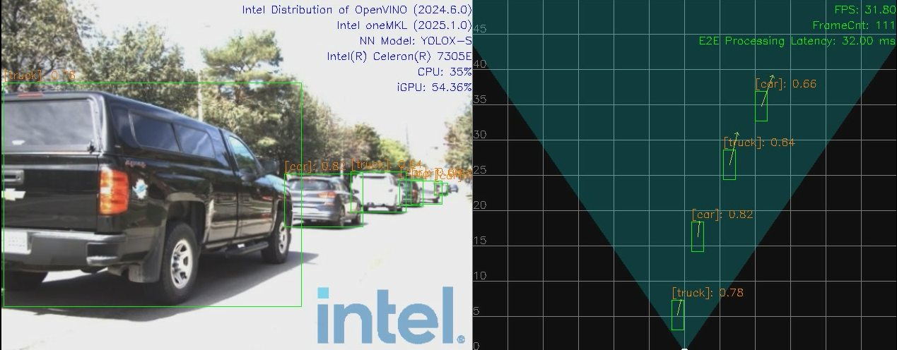
<center>Figure 1. 1C+1R Demo running on Intel® Celeron® Processor 7305E  </center>

For more details about the display mode, please refer to [section 4.3 Run Entry Program](#43-run-entry-program)

## 2. Install Dependencies and Build Project

### 2.1 BIOS setting

#### 2.1.1 MTL

| Setting                                          | Step                                                         |
| ------------------------------------------------ | ------------------------------------------------------------ |
| Enable the Hidden BIOS Setting in Seavo Platform | "Right Shift+F7" Then Change Enabled Debug Setup Menu from [Enabled] to [Disable] |
| Disable VT-d in BIOS                             | Intel Advanced Menu → System Agent (SA) Configuration → VT-d setup menu → VT-d<Disabled>    <br>Note: If VT-d can’t be disabled, please disable Intel Advanced Menu → CPU Configuration → X2APIC |
| Disable SAGV in BIOS                             | Intel Advanced Menu → [System Agent (SA) Configuration]  →  Memory configuration →  SAGV <Disabled> |
| Enable NPU Device                                | Intel Advanced Menu → CPU Configuration → Active SOC-North Efficient-cores <ALL>   <br>Intel Advanced Menu → System Agent (SA) Configuration → NPU Device <Enabled> |
| TDP Configuration                                | SOC TDP configuration is very important for performance. Suggestion: TDP = 45W. For extreme heavy workload, TDP = 64W <br>---TDP = 45W settings: Intel Advanced → Power & Performance → CPU - Power Management Control → Config TDP Configurations → Power Limit 1 <45000> <br>---TDP = 64W settings: Intel Advanced → Power & Performance → CPU - Power Management Control → Config TDP Configurations →  Configurable TDP Boot Mode [Level2] |


#### 2.1.2 RPL-S+A770

| Setting                  | Step                                                         |
| ------------------------ | ------------------------------------------------------------ |
| Enable ResizeBar in BIOS | Intel Advanced Menu -> System Agent (SA) Configuration -> PCI Express Configuration -> PCIE Resizable BAR Support <Enabled> |

### 2.2 Install Dependencies

* install driver related libs

  Update kernel, install GPU and NPU(MTL only) driver.

  ```bash
  bash install_driver_related_libs.sh
  ```

  Note that this step may restart the machine several times. Please rerun this script after each restart until you see the output of `All driver libs installed successfully`.

* install project related libs

  Install Boost, Spdlog, Thrift, MKL, OpenVINO, GRPC, Level Zero, oneVPL etc.

  ```bash
  bash install_project_related_libs.sh
  ```

- set $PROJ_DIR
  ```bash
  cd Metro_AI_Suite_Sensor_Fusion_for_Traffic_Management_1.0/sensor_fusion_service
  export PROJ_DIR=$PWD
  ```
- prepare global radar configs in folder: /opt/datasets
    ```bash
    sudo ln -s $PROJ_DIR/ai_inference/deployment/datasets /opt/datasets
    ```

- prepare models in folder: /opt/models
    ```bash
    sudo ln -s $PROJ_DIR/ai_inference/deployment/models /opt/models
    ```
- prepare offline radar results for 4C4R/16C4R:
    ```bash
    sudo cp $PROJ_DIR/ai_inference/deployment/datasets/radarResults.csv /opt
    ```
- build project
    ```bash
    bash -x build.sh
    ```

## 3. Download and Convert Dataset
For how to get RADDet dataset, please refer to this guide: [how_to_get_RADDet_datasets.md](How-To-Get-RADDET-Dataset.md)

Upon success, bin files will be extracted, save to $RADDET_DATASET_ROOT/bin_files_{VERSION}:
> NOTE: latest converted dataset version should be: v1.0

## 4. Run Sensor Fusion Application

In this section, we describe how to run Metro AI Suite Sensor Fusion for Traffic Management application.

Metro AI Suite Sensor Fusion for Traffic Management application can support different pipeline using topology JSON files to describe the pipeline topology. The defined pipeline topology can be found at [section 4.1 Resources Summary](#41-resources-summary)

There are two steps required for running the sensor fusion application:
- Start AI Inference service, more details can be found at [section 4.2 Start Service](#42-start-service)
- Run the application entry program, more details can be found at [section 4.3 Run Entry Program](#43-run-entry-program)

Besides, users can test each component (without display) following the guides at [Advanced-User-Guide.md](./Advanced-User-Guide.md#532-1c+1r-unit-tests)

### 4.1 Resources Summary
- Local File Pipeline for Media pipeline
  - Json File: localMediaPipeline.json 
    > File location: `$PROJ_DIR/ai_inference/test/configs/raddet/1C1R/localMediaPipeline.json`
  - Pipeline Description: 
    ```
    input -> decode -> detection -> tracking -> output
    ```

- Local File Pipeline for mmWave Radar pipeline
  - Json File: localRadarPipeline.json
    > File location: `$PROJ_DIR/ai_inference/test/configs/raddet/1C1R/localRadarPipeline.json`
  - Pipeline Description: 

    ```
    input -> preprocess -> radar_detection -> clustering -> tracking -> output
    ```

- Local File Pipeline for `Camera + Radar(1C+1R)` Sensor fusion pipeline

  - Json File: localFusionPipeline.json
    > File location: `$PROJ_DIR/ai_inference/test/configs/raddet/1C1R/localFusionPipeline.json`
  - Pipeline Description: 
    ```
    input  | -> decode     -> detector         -> tracker                  -> |
           | -> preprocess -> radar_detection  -> clustering   -> tracking -> | -> coordinate_transform->fusion -> output
    ```
- Local File Pipeline for `Camera + Radar(4C+4R)` Sensor fusion pipeline

  - Json File: localFusionPipeline.json
    > File location: `$PROJ_DIR/ai_inference/test/configs/raddet/4C4R/localFusionPipeline.json`
  - Pipeline Description: 
    ```
    input  | -> decode     -> detector         -> tracker                  -> |
           |              -> radarOfflineResults ->                           | -> coordinate_transform->fusion -> |
    input  | -> decode     -> detector         -> tracker                  -> |                                    |
           |              -> radarOfflineResults ->                           | -> coordinate_transform->fusion -> | -> output
    input  | -> decode     -> detector         -> tracker                  -> |                                    |
           |              -> radarOfflineResults ->                           | -> coordinate_transform->fusion -> |
    input  | -> decode     -> detector         -> tracker                  -> |                                    |
           |              -> radarOfflineResults ->                           | -> coordinate_transform->fusion -> |
    ```

- Local File Pipeline for `Camera + Radar(2C+1R)` Sensor fusion pipeline

    - Json File: localFusionPipeline.json
      `File location: ai_inference/test/configs/raddet/2C1R/localFusionPipeline.json`

    - Pipeline Description: 

        ```
               | -> decode     -> detector         -> tracker                  -> |                                    |
        input  | -> decode     -> detector         -> tracker                  -> | ->  Camera2CFusion ->  fusion   -> | -> output
               | -> preprocess -> radar_detection  -> clustering   -> tracking -> |                                    |
        ```

- Local File Pipeline for `Camera + Radar(16C+4R)` Sensor fusion pipeline

    - Json File: localFusionPipeline.json
      `File location: ai_inference/test/configs/raddet/16C4R/localFusionPipeline.json`

    - Pipeline Description: 

        ```
               | -> decode     -> detector         -> tracker                  -> |                                    |
               | -> decode     -> detector         -> tracker                  -> |                                    |
        input  | -> decode     -> detector         -> tracker                  -> |->  Camera4CFusion ->  fusion   ->  |
               | -> decode     -> detector         -> tracker                  -> |                                    |
               |              -> radarOfflineResults ->                           |                                    |
               | -> decode     -> detector         -> tracker                  -> |                                    |
               | -> decode     -> detector         -> tracker                  -> |                                    |
        input  | -> decode     -> detector         -> tracker                  -> |->  Camera4CFusion ->  fusion   ->  |
               | -> decode     -> detector         -> tracker                  -> |                                    |
               |              -> radarOfflineResults ->                           |                                    | -> output
               | -> decode     -> detector         -> tracker                  -> |                                    |
               | -> decode     -> detector         -> tracker                  -> |                                    |
        input  | -> decode     -> detector         -> tracker                  -> |->  Camera4CFusion ->  fusion   ->  |
               | -> decode     -> detector         -> tracker                  -> |                                    |
               |              -> radarOfflineResults ->                           |                                    |
               | -> decode     -> detector         -> tracker                  -> |                                    |
               | -> decode     -> detector         -> tracker                  -> |                                    |
        input  | -> decode     -> detector         -> tracker                  -> |->  Camera4CFusion ->  fusion   ->  |
               | -> decode     -> detector         -> tracker                  -> |                                    |
               |              -> radarOfflineResults ->                           |                                    |
        ```

### 4.2 Start Service
Open a terminal, run the following commands:

```bash
cd $PROJ_DIR
sudo bash -x run_service_bare.sh

# Output logs:
    [2023-06-26 14:34:42.970] [DualSinks] [info] MaxConcurrentWorkload sets to 1
    [2023-06-26 14:34:42.970] [DualSinks] [info] MaxPipelineLifeTime sets to 300s
    [2023-06-26 14:34:42.970] [DualSinks] [info] Pipeline Manager pool size sets to 1
    [2023-06-26 14:34:42.970] [DualSinks] [trace] [HTTP]: uv loop inited
    [2023-06-26 14:34:42.970] [DualSinks] [trace] [HTTP]: Init completed
    [2023-06-26 14:34:42.971] [DualSinks] [trace] [HTTP]: http server at 0.0.0.0:50051
    [2023-06-26 14:34:42.971] [DualSinks] [trace] [HTTP]: running starts
    [2023-06-26 14:34:42.971] [DualSinks] [info] Server set to listen on 0.0.0.0:50052
    [2023-06-26 14:34:42.972] [DualSinks] [info] Server starts 1 listener. Listening starts
    [2023-06-26 14:34:42.972] [DualSinks] [trace] Connection handle with uid 0 created
    [2023-06-26 14:34:42.972] [DualSinks] [trace] Add connection with uid 0 into the conn pool

```
> NOTE-1 : workload (default as 1) can be configured in file: `$PROJ_DIR/ai_inference/source/low_latency_server/AiInference.config`
```
...
[Pipeline]
maxConcurrentWorkload=1
```

> NOTE-2 : to stop service, run the following commands:
```bash
sudo pkill Hce
```


### 4.3 Run Entry Program
#### 4.3.1 1C+1R

All executable files are located at: $PROJ_DIR/build/bin

Usage:
```
Usage: CRSensorFusionDisplay <host> <port> <json_file> <total_stream_num> <repeats> <data_path> <display_type> [<save_flag: 0 | 1>] [<pipeline_repeats>] [<fps_window: unsigned>] [<cross_stream_num>] [<warmup_flag: 0 | 1>]  [<logo_flag: 0 | 1>]
--------------------------------------------------------------------------------
Environment requirement:
   unset http_proxy;unset https_proxy;unset HTTP_PROXY;unset HTTPS_PROXY
```
* **host**: use `127.0.0.1` to call from localhost.
* **port**: configured as `50052`, can be changed by modifying file: `$PROJ_DIR/ai_inference/source/low_latency_server/AiInference.config` before starting the service.
* **json_file**: AI pipeline topology file.
* **total_stream_num**: to control the input streams.
* **repeats**: to run tests multiple times, so that we can get more accurate performance.
* **data_path**: multi-sensor binary files folder for input.
* **display_type**: support for `media`, `radar`, `media_radar`, `media_fusion` currently.
  * `media`: only show image results in frontview. Example:
  [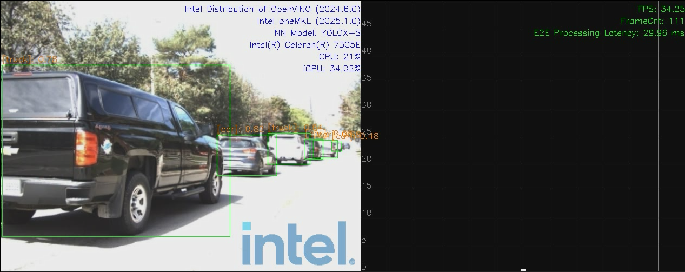](_images/1C1R-Display-type-media.png)
  * `radar`: only show radar results in birdview. Example:
  [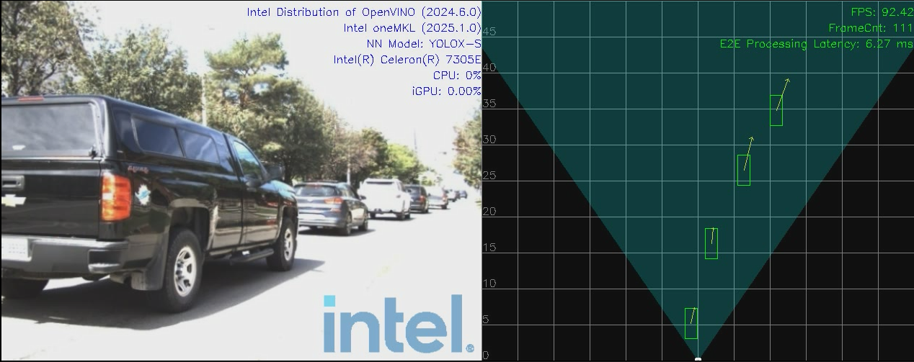](_images/1C1R-Display-type-radar.png)
  * `media_radar`: show image results in frontview and radar results in birdview separately. Example:
  [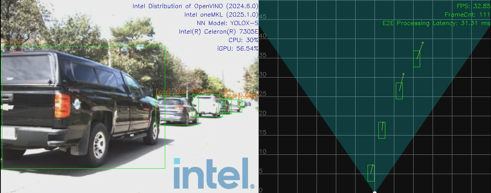](_images/1C1R-Display-type-media-radar.png)
  * `media_fusion`: show both for image results in frontview and fusion results in birdview. Example:
  [](_images/1C1R-Display-type-media-fusion.png)
* **save_flag**: whether to save display results into video.
* **pipeline_repeats**: pipeline repeats number.
* **fps_window**: The number of frames processed in the past is used to calculate the fps. 0 means all frames processed are used to calculate the fps.
* **cross_stream_num**: the stream number that run in a single pipeline.
* **warmup_flag**: warm up flag before pipeline start.
* **logo_flag**: whether to add intel logo in display.

More specifically, open another terminal, run the following commands:

```bash
# multi-sensor inputs test-case
sudo -E ./build/bin/CRSensorFusionDisplay 127.0.0.1 50052 ai_inference/test/configs/raddet/1C1R/libradar/localFusionPipeline_libradar.json 1 1 /path-to-dataset media_fusion
```
> Note: Run with `root` if users want to get the GPU utilization profiling.

#### 4.3.2 4C+4R

All executable files are located at: $PROJ_DIR/build/bin

Usage:
```
Usage: CRSensorFusion4C4RDisplay <host> <port> <json_file> <additional_json_file> <total_stream_num> <repeats> <data_path> <display_type> [<save_flag: 0 | 1>] [<pipeline_repeats>] [<cross_stream_num>] [<warmup_flag: 0 | 1>] [<logo_flag: 0 | 1>]
--------------------------------------------------------------------------------
Environment requirement:
   unset http_proxy;unset https_proxy;unset HTTP_PROXY;unset HTTPS_PROXY
```
* **host**: use `127.0.0.1` to call from localhost.
* **port**: configured as `50052`, can be changed by modifying file: `$PROJ_DIR/ai_inference/source/low_latency_server/AiInference.config` before starting the service.
* **json_file**: AI pipeline topology file.
* **additional_json_file**: AI pipeline additional topology file.
* **total_stream_num**: to control the input streams.
* **repeats**: to run tests multiple times, so that we can get more accurate performance.
* **data_path**: multi-sensor binary files folder for input.
* **display_type**: support for `media`, `radar`, `media_radar`, `media_fusion` currently.
  * `media`: only show image results in frontview. Example:
  [](_images/4C4R-Display-type-media.png)
  * `radar`: only show radar results in birdview. Example:
  [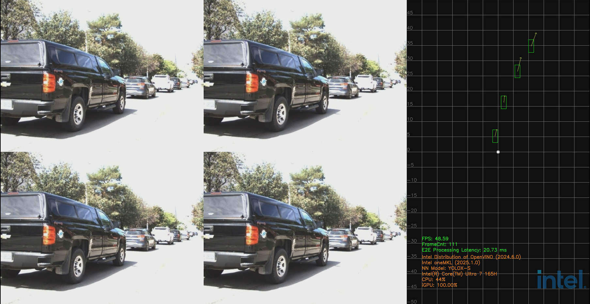](_images/4C4R-Display-type-radar.png)
  * `media_radar`: show image results in frontview and radar results in birdview separately. Example:
  [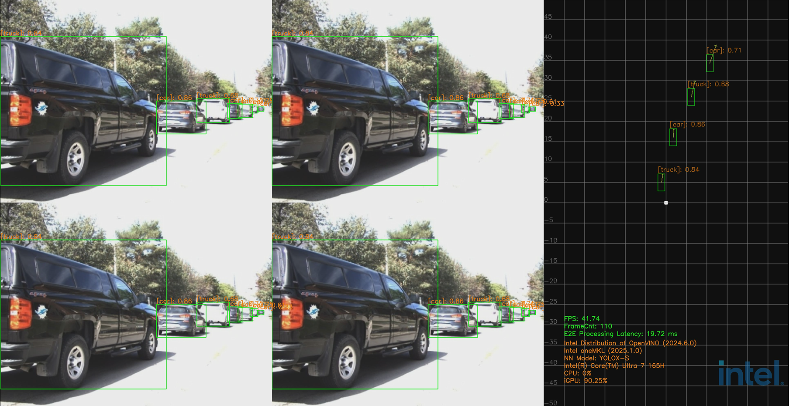](_images/4C4R-Display-type-media-radar.png)
  * `media_fusion`: show both for image results in frontview and fusion results in birdview. Example:
  [](_images/4C4R-Display-type-media-fusion.png)
* **save_flag**: whether to save display results into video.
* **pipeline_repeats**: pipeline repeats number.
* **cross_stream_num**: the stream number that run in a single pipeline.
* **warmup_flag**: warm up flag before pipeline start.
* **logo_flag**: whether to add intel logo in display.

More specifically, open another terminal, run the following commands:

```bash
# multi-sensor inputs test-case
sudo -E ./build/bin/CRSensorFusion4C4RDisplay 127.0.0.1 50052 ai_inference/test/configs/raddet/4C4R/localFusionPipeline.json ai_inference/test/configs/raddet/4C4R/localFusionPipeline_npu.json 4 1 /path-to-dataset media_fusion
```
> Note: Run with `root` if users want to get the GPU utilization profiling.

#### 4.3.3 2C+1R

All executable files are located at: $PROJ_DIR/build/bin

Usage:

```bash
Usage: CRSensorFusion2C1RDisplay <host> <port> <json_file> <total_stream_num> <repeats> <data_path> <display_type> [<save_flag: 0 | 1>] [<pipeline_repeats>] [<fps_window: unsigned>] [<cross_stream_num>] [<warmup_flag: 0 | 1>]  [<logo_flag: 0 | 1>]
--------------------------------------------------------------------------------
Environment requirement:
   unset http_proxy;unset https_proxy;unset HTTP_PROXY;unset HTTPS_PROXY
```

* **host**: use `127.0.0.1` to call from localhost.
* **port**: configured as `50052`, can be changed by modifying file: `$PROJ_DIR/ai_inference/source/low_latency_server/AiInference.config` before starting the service.
* **json_file**: AI pipeline topology file.
* **total_stream_num**: to control the input streams.
* **repeats**: to run tests multiple times, so that we can get more accurate performance.
* **data_path**: multi-sensor binary files folder for input.
* **display_type**: support for `media`, `radar`, `media_radar`, `media_fusion` currently.
    * `media`: only show image results in frontview. Example:
        [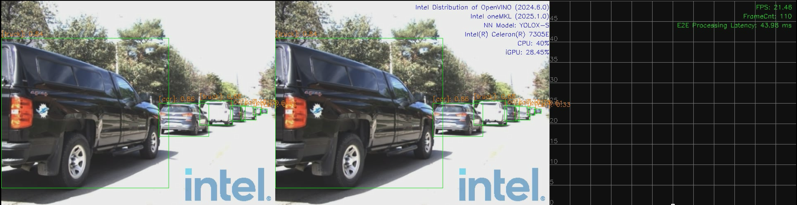](_images/2C1R-Display-type-media.png)
    * `radar`: only show radar results in birdview. Example:
        [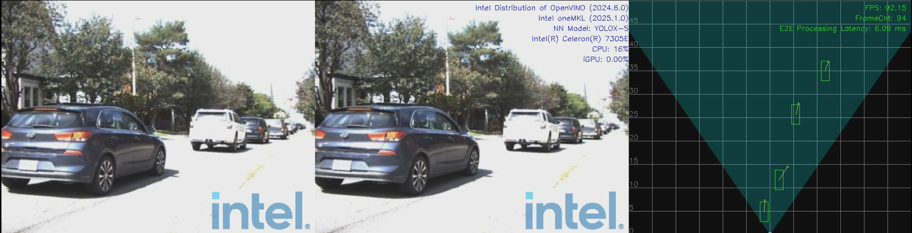](_images/2C1R-Display-type-radar.png)
    * `media_radar`: show image results in frontview and radar results in birdview separately. Example:
        [](_images/2C1R-Display-type-media-radar.png)
    * `media_fusion`: show both for image results in frontview and fusion results in birdview. Example:
        [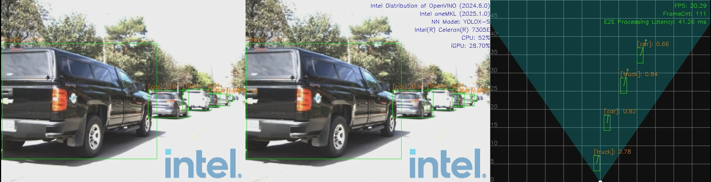](_images/2C1R-Display-type-media-fusion.png)
* **save_flag**: whether to save display results into video.
* **pipeline_repeats**: pipeline repeats number.
* **fps_window**: The number of frames processed in the past is used to calculate the fps. 0 means all frames processed are used to calculate the fps.
* **cross_stream_num**: the stream number that run in a single pipeline.
* **warmup_flag**: warm up flag before pipeline start.
* **logo_flag**: whether to add intel logo in display.

More specifically, open another terminal, run the following commands:

```bash
# multi-sensor inputs test-case
sudo -E ./build/bin/CRSensorFusion2C1RDisplay 127.0.0.1 50052 ai_inference/test/configs/raddet/2C1R/localFusionPipeline_libradar.json 1 1 /path-to-dataset media_fusion
```

> Note: Run with `root` if users want to get the GPU utilization profiling.


#### 4.3.4 16C+4R

All executable files are located at: $PROJ_DIR/build/bin

Usage:

```
Usage: CRSensorFusion16C4RDisplay <host> <port> <json_file> <total_stream_num> <repeats> <data_path> <display_type> [<save_flag: 0 | 1>] [<pipeline_repeats>] [<cross_stream_num>] [<warmup_flag: 0 | 1>] [<logo_flag: 0 | 1>]
--------------------------------------------------------------------------------
Environment requirement:
   unset http_proxy;unset https_proxy;unset HTTP_PROXY;unset HTTPS_PROXY
```

* **host**: use `127.0.0.1` to call from localhost.
* **port**: configured as `50052`, can be changed by modifying file: `$PROJ_DIR/ai_inference/source/low_latency_server/AiInference.config` before starting the service.
* **json_file**: AI pipeline topology file.
* **total_stream_num**: to control the input streams.
* **repeats**: to run tests multiple times, so that we can get more accurate performance.
* **data_path**: multi-sensor binary files folder for input.
* **display_type**: support for `media`, `radar`, `media_radar`, `media_fusion` currently.
    * `media`: only show image results in frontview. Example:
        [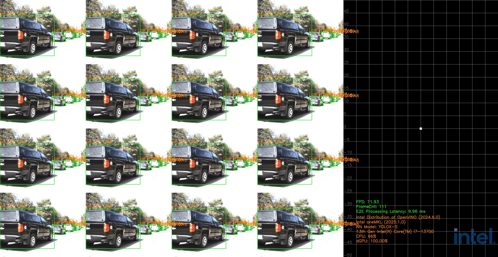](_images/16C4R-Display-type-media.png)
    * `radar`: only show radar results in birdview. Example:
        [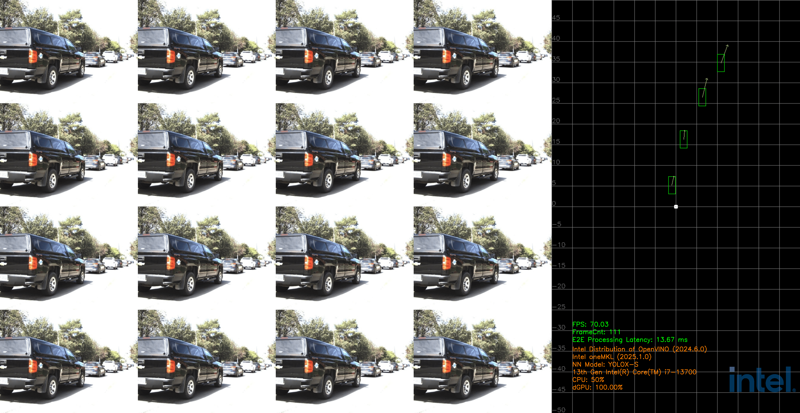](_images/16C4R-Display-type-radar.png)
    * `media_radar`: show image results in frontview and radar results in birdview separately. Example:
        [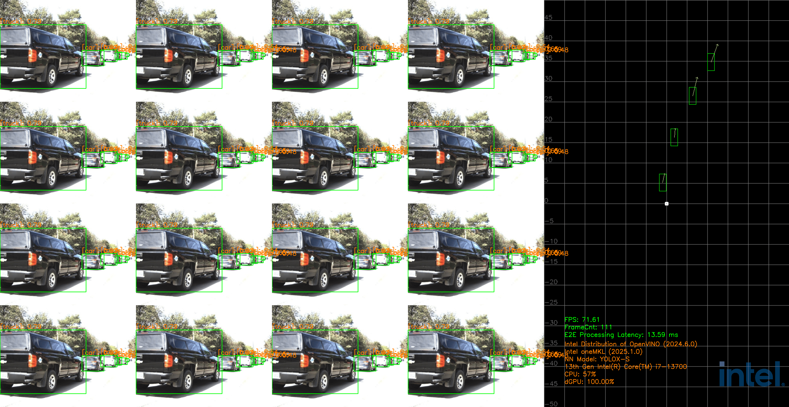](_images/16C4R-Display-type-media-radar.png)
    * `media_fusion`: show both for image results in frontview and fusion results in birdview. Example:
        [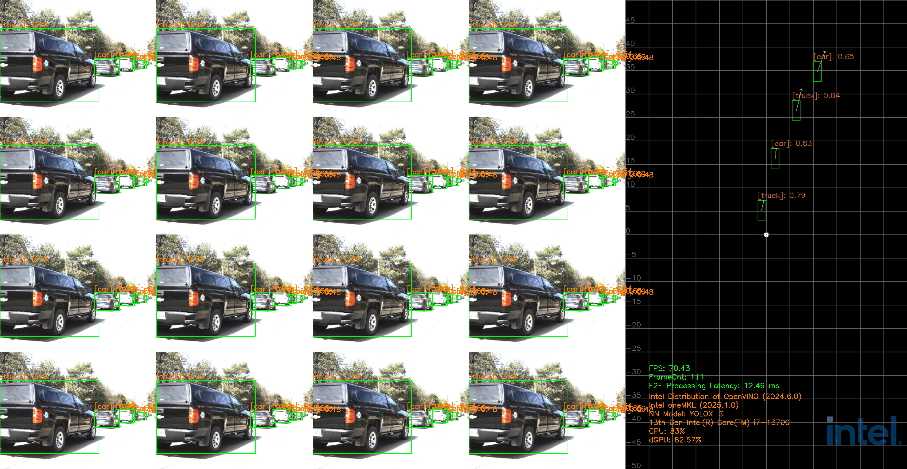](_images/16C4R-Display-type-media-fusion.png)
* **save_flag**: whether to save display results into video.
* **pipeline_repeats**: pipeline repeats number.
* **cross_stream_num**: the stream number that run in a single pipeline.
* **warmup_flag**: warm up flag before pipeline start.
* **logo_flag**: whether to add intel logo in display.

More specifically, open another terminal, run the following commands:

```bash
# multi-sensor inputs test-case
sudo -E ./build/bin/CRSensorFusion16C4RDisplay 127.0.0.1 50052 ./ai_inference/test/configs/raddet/16C4R/localFusionPipeline.json 4 1 /path-to-dataset media_fusion
```

> Note: Run with `root` if users want to get the GPU utilization profiling.


## 5. Code Reference

Some of the code is referenced from the following projects:
- [IGT GPU Tools](https://gitlab.freedesktop.org/drm/igt-gpu-tools) (MIT License)
- [Intel DL Streamer](https://github.com/dlstreamer/dlstreamer) (MIT License)
- [Open Model Zoo](https://github.com/openvinotoolkit/open_model_zoo) (Apache-2.0 License)

## Troubleshooting
1. If you run different pipelines in a short period of time, you may encounter the following error:
    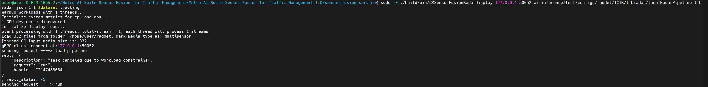
    <center>Figure 2: Workload constraints error</center>

    This is because the maxConcurrentWorkload limitation in `AiInference.config` file. If the workloads hit the maximum, task will be canceled due to workload constrains. To solve this problem, you can kill the service with the commands below, and re-execute the command.

    ```bash
    sudo pkill Hce
    ```

3. If you encounter the following error during code compilation, it is because mkl is not installed successfully:
    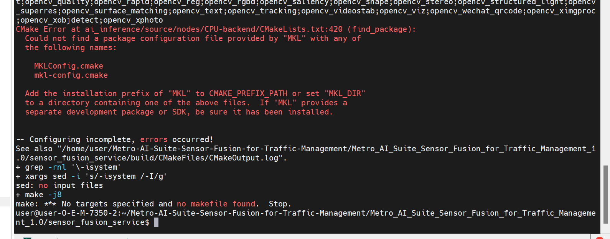
    <center>Figure 3: Build failed due to mkl error</center>

    Run `ls /opt/intel` to check if there is a OneAPI directory in the output. If not, it means that mkl was not installed successfully. You need to reinstall mkl by following the steps below:

    ```bash
    curl -k -o GPG-PUB-KEY-INTEL-SW-PRODUCTS.PUB https://apt.repos.intel.com/intel-gpg-keys/GPG-PUB-KEY-INTEL-SW-PRODUCTS.PUB -L
    sudo -E apt-key add GPG-PUB-KEY-INTEL-SW-PRODUCTS.PUB && sudo rm GPG-PUB-KEY-INTEL-SW-PRODUCTS.PUB
    echo "deb https://apt.repos.intel.com/oneapi all main" | sudo tee /etc/apt/sources.list.d/oneAPI.list
    sudo -E apt-get update -y
    sudo -E apt-get install -y intel-oneapi-mkl-devel lsb-release
    ```

    If the system time is incorrect, you may encounter the following errors during installation:
    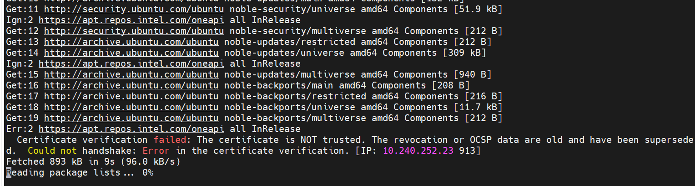
    <center>Figure 4: System Time Error</center>

    You need to set the correct system time, for example:

    ```bash
    sudo timedatectl set-ntp true
    ```

    Then re-run the above installation command.

    ```bash
    sudo apt-get remove --purge intel-oneapi-mkl-devel
    sudo apt-get autoremove -y
    sudo apt-get install -y intel-oneapi-mkl-devel
    ```

## Release Notes
Current Version: 1.0
- Enhanced radar signal processing pipeline and added radar library.
- Supported multiple CFAR algorithms including CACFAR and OSCFAR.
- Supported multiple AoA estimation algorithms including FFT, DBF, CAPON and MUSIC.
- Enhanced media processing pipeline with input control.
- Added accuracy benchmark test for deep learning model and radar detection results.
- Added cross-stream batching support for 4C+4R pipeline.
- Added profiling tools for modular latency analysis.
- Added ESC package support.
- Updated OpenVINO to 2024.5.
- Updated oneMKL to 2025.0.0.

