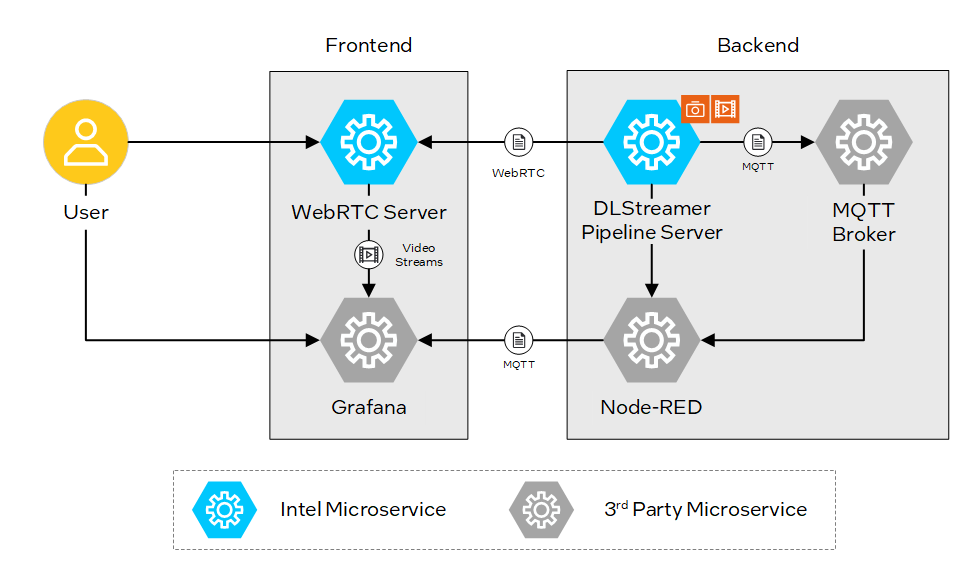

# Smart Parking
Effortlessly manage parking spaces with AI-driven video analytics for real-time insights and enhanced efficiency.

## Overview

The Smart Parking application uses AI-driven video analytics to optimize parking management. It identifies and counts available parking spaces in real-time, ensuring accurate detection of empty slots. By continuously monitoring parking areas, it tracks changes in occupancy and provides up-to-date information on parking availability.

This solution also records the status of occupied parking spaces, enabling efficient utilization and reporting. Designed to enhance parking efficiency, the application improves user experience by delivering real-time insights into parking operations.

By leveraging cutting-edge technologies and pre-trained deep learning models, this application enables real-time processing and analysis of video streams, making it an ideal solution. Built on a modular architecture and integration capabilities ensure that users can easily customize and extend its functionalities to meet their specific needs.

### Key Features

- **Vision Analytics Pipeline:** Detect and classify objects using pre-configured AI models. Customize parameters such as thresholds and object types without requiring additional coding.
- **Integration with MQTT, Node-RED, and Grafana:** Facilitates efficient message handling, real-time monitoring, and insightful data visualization.
- **User-Friendly:** Simplifies configuration and operation through prebuilt scripts and configuration files.

## How It Works

The architecture is designed to facilitate seamless integration and operation of various components involved in AI-driven video analytics.

### Components

- **DL Streamer Pipeline Server (VA Pipeline):** Processes video frames, extracts metadata, and integrates AI inference results.
- **Mosquitto MQTT Broker:** Facilitates message communication between components like Node-RED and DL Streamer Pipeline Server using the MQTT protocol.
- **Node-RED:** A low-code platform for setting up application-specific rules and triggering MQTT-based events.
- **WebRTC Stream Viewer:** Displays real-time video streams processed by the pipeline for end-user visualization.
- **Grafana Dashboard:** A monitoring and visualization tool for analyzing pipeline metrics, logs, and other performance data.
- **Inputs (Video Files and Cameras):** Provide raw video streams or files as input data for processing in the pipeline.

The DL Streamer Pipeline Server is a core component, designed to handle video analytics at the edge. It leverages pre-trained deep learning models to perform tasks such as object detection, classification, and tracking in real-time. The DL Streamer Pipeline Server is highly configurable, allowing users to adjust parameters like detection thresholds and object types to suit specific use cases. This flexibility ensures that users can deploy AI-driven video analytics solutions quickly and efficiently, without the need for extensive coding or deep learning expertise.

It integrates various components such as MQTT, Node-RED, and Grafana to provide a robust and flexible solution for real-time video inference pipelines. The tool is built to be user-friendly, allowing customization without the need for extensive coding knowledge. Validate your ideas by developing an end-to-end solution faster.

## Learn More
- [System Requirements](docs/user-guide/system-requirements.md)
- [Get Started](docs/user-guide/get-started.md)
- [How to customize application](docs/user-guide/how-to-customize-application.md)
- [Release Notes](docs/user-guide/release-notes.md)