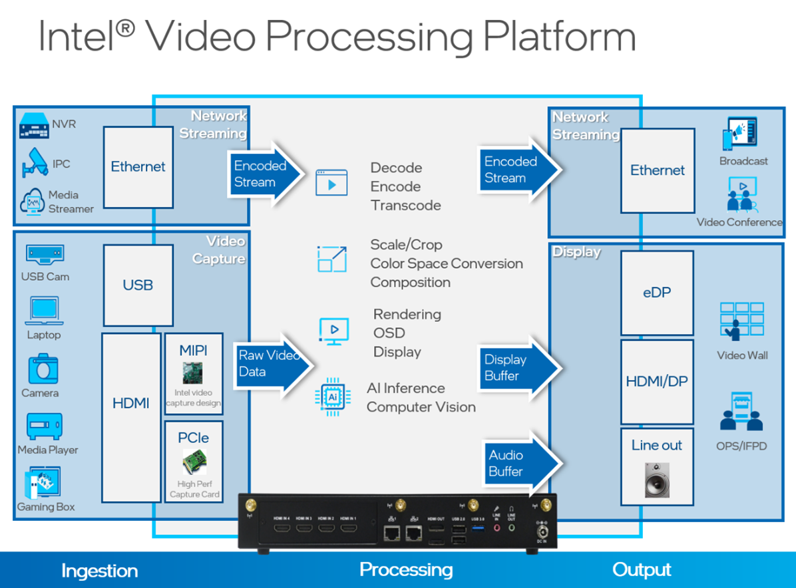
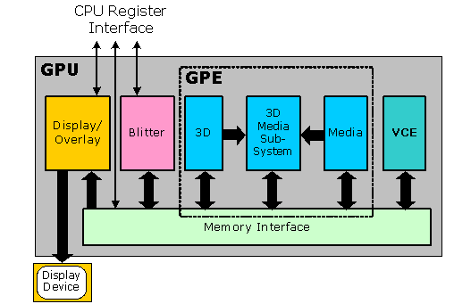
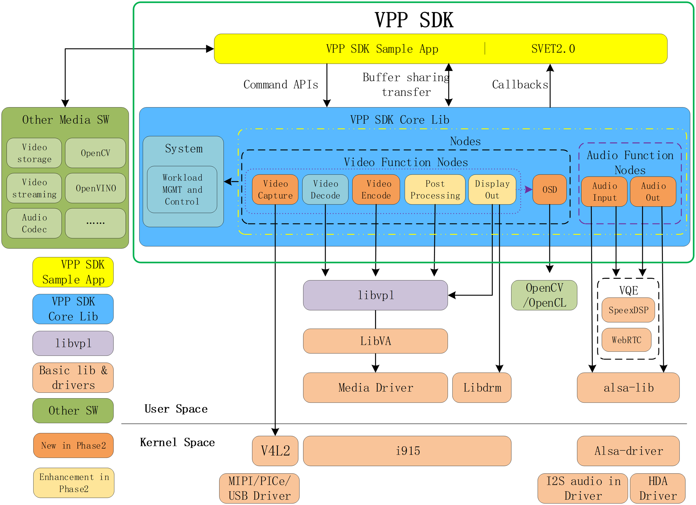
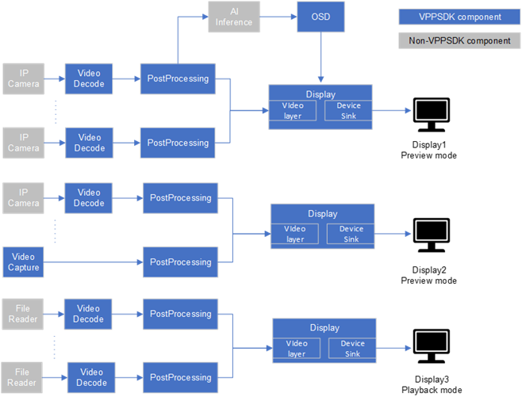

# Video Processing Platform SDK

Video Processing Platform (VPP) software development kit (SDK)

## 

## Overview

Video Processing Platform (VPP) software development kit (SDK) provides the developer with an ARM ecosystem-friendly video processing acceleration API to implement their video-centric workloads, such as Network Video Recorder (NVR), Video Conference Terminal, Video Matrix, etc. on the Linux platform. 

## 

## How It Works

**VPP (Video Processing Platform)**

Figure 1: Video Processing Platform

Video Processing Platform is a collection of video-processing functions in the following areas:
- Media (Decode, Encode)
- Post-processing (Scale, Crop, Composition)
- Display
- AI/CV
- Audio

These functions are critical to Video Processing related applications including:
- Network Video Recorder
- Video Capture System
- Video Matrix
- Etc.

Video processing workloads consume a huge amount of computing resources, especially when customers continuously seek higher resolution and channel density solutions. Consequently, these computations are usually offloaded to accelerators like GPUs.

**Intel GPU**

Figure 2: GPU

Intel integrated GPU is part of the Intel Core/Celeron CPU. It has outstanding capability for graphics and parallel computing tasks, including Media, Display, AI/CV. Consequently, Intel Core/Celeron CPU could be a good option for the VPP product’s core processor.

**VPP SDK architecture**

Figure 3: VPP SDK Architecture

VPP SDK provides users with a set of APIs to construct pipelines with functions like video encoding, post-processing, display, etc., on the Linux platform. With these APIs, users can build their applications and leverage the media capability of Intel GPU. VPP SDK is based on low-level media stacks like libVPL, libVA, Media Driver, libdrm, etc. It is an abstract layer to hide the complexity of these low-level media stacks and, meanwhile, provide a pipeline-oriented API to make the implementation easy.

**VPP SDK modules**

VPP SDK consists of several modules, including Video Decode, Post Processing, Display, OSD, etc. Users can create and configure these instances of these modules to execute corresponding tasks. The user also needs to link these module streams together to construct a pipeline and build an application.
VPP SDK have different types of streams:
- Decode
- Encode
- Post processing
- Display
- Video capture
- Audio in/out

Figure 4: VPP SDK Pipeline Construction Illustration

Users can bind a decode stream to a post-processing stream and then bind to a display stream, or users can directly bind a decode stream to a display stream to set up a pipeline. Stream concept and binding logic are illustrated in the figure below.
After pipeline setup, user will need to switch stream state to running or stop to control the pipeline state. State switch rules are shown in the figure below.

**Programming Language:** c/c++
