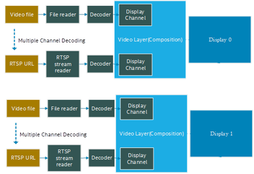
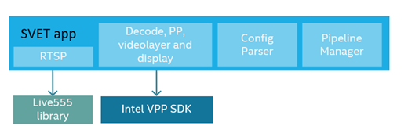
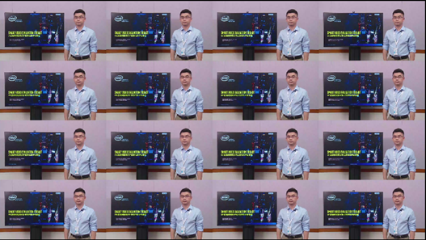

# Get Started Guide
  
-   **Time to Complete:** 20min
-   **Programming Language:** c++

## Get Started
The svet_app sample application is based on Intel VPP SDK. It can be configured to run typical video composition workloads. You can use it for performance evaluation and implementation reference.  
  
Figure 1 shows a typical multi-channel decode, composition, and display workload.  
  
Figure 1. Multi-channel Decode, Composition, and Display Workload  
  
The workload above includes different blocks: input video file reader or RTSP reader, decoder, display channel, video layer, and display. The display channel represents an area of the video layer. The video layers are composites of multiple display channels to form a single surface that will be sent to display.  
  
svet_app allows you to use a configuration file to specify the parameters of each function block, like the input video file path, codec, display channel’s position on the video layer, video layer's resolution, and composition fps. Chapter 4.0 provides an explanation of all parameters. The folder sample_config contains sample configuration files. For descriptions of each configuration file, refer to sample_config/README.md.  
  
In Figure 2, the sample application svet_app consists of 4 main blocks, RTSP streaming in, video decode/post-process/composition/display, configuration parser, and pipeline manager. It depends on live555 and Intel VPP SDK libraries. Chapter 2.2 provide detailed steps to install these two dependencies.  
  
High-level Architecture of svet_app  
  
Figure 2. High-level Architecture of svet_app   

### Prerequisites

**Operating System:**
* Ubuntu 24.04

**Software:**
* VPP SDK

## 2. Installation Guide

### 2.1	System Installation
Install Ubuntu* 24.04 and set up the network correctly and run the sudo apt update.  

### 2.2 Install Software Dependencies
The SVET2 sample application depends on Intel VPP SDK for video decode, encoding, and post-processing functionalities. It also depends on the live555 library for RTSP streaming.  

#### 2.2.1 Install Intel VPP SDK
Install VPP SDK first. 
```
sudo -E wget -O- https://eci.intel.com/sed-repos/gpg-keys/GPG-PUB-KEY-INTEL-SED.gpg | sudo tee /usr/share/keyrings/sed-archive-keyring.gpg > /dev/null
echo "deb [signed-by=/usr/share/keyrings/sed-archive-keyring.gpg] https://eci.intel.com/sed-repos/$(source /etc/os-release && echo $VERSION_CODENAME) sed main" | sudo tee /etc/apt/sources.list.d/sed.list
echo "deb-src [signed-by=/usr/share/keyrings/sed-archive-keyring.gpg] https://eci.intel.com/sed-repos/$(source /etc/os-release && echo $VERSION_CODENAME) sed main" | sudo tee -a /etc/apt/sources.list.d/sed.list
sudo bash -c 'echo -e "Package: *\nPin: origin eci.intel.com\nPin-Priority: 1000" > /etc/apt/preferences.d/sed'
sudo apt update
sudo apt install intel-vppsdk

sudo bash /opt/intel/vppsdk/install_vppsdk_dependencies.sh
source /opt/intel/vppsdk/env.sh
```
Assume the VPP SDK package directory is vppsdk and the default install path is /opt/intel/media/. Run command `vainfo` to verify the media stack is installed successfully:  
  
```
# sudo su
# export LIBVA_DRIVER_NAME="iHD"
# export LIBVA_DRIVERS_PATH="/opt/intel/media/lib64"
# /opt/intel/media/bin/vainfo
```
  
In the terminal, you will see the output below:  
  
```
Trying display: drm
libva info: VA-API version 1.22.0
libva info: User environment variable requested driver 'iHD'
libva info: Trying to open /opt/intel/media/lib64/iHD_drv_video.so
libva info: Found init function __vaDriverInit_1_22
libva info: va_openDriver() returns 0
vainfo: VA-API version: 1.22 (libva 2.22.0.1)
vainfo: Driver version: Intel iHD driver for Intel(R) Gen Graphics - 24.2.5 (12561f6)
vainfo: Supported profile and entrypoints
      VAProfileNone                   : VAEntrypointVideoProc
      VAProfileNone                   : VAEntrypointStats
      VAProfileMPEG2Simple            : VAEntrypointVLD
      VAProfileMPEG2Simple            : VAEntrypointEncSlice
```
  
Then you can try to run one VPP SDK API test.  
  
Note:	Make sure there is at least one display connected to the device and switch to `root` before running the command below:  
  
```
# cd /opt/intel/vppsdk/bin
# source /opt/intel/vppsdk/env.sh
# export MULTI_DISPLAY_PATCH=1
# ./api_test --gtest_filter=*1_input_pipeline_setup*
```
  
It will start to run a decode and display pipeline. You will see below message if the test can run successfully.  
  
```
[       OK ] testPipeline.1_input_pipeline_setup (23877 ms)
[----------] 1 test from testPipeline (23877 ms total)
[----------] Global test environment tear-down
[==========] 1 test from 1 test suite ran. (23877 ms total)
[  PASSED  ] 1 test.
```
  
#### 2.2.2	Install the live555 library
There is a `live555_install.sh` under the root directory of SVET2 source code package. Make sure the network connection is good on your system, then run this script, and it will download, build, and install live555 libraries. The libraries will be installed to /usr/local/lib/.  
  
### 2.3	Build sample application svet_app
If you have not run the commands below in the current terminal, run them first to set up the correct environment variables:  
  
```
$ source /opt/intel/vppsdk/env.sh
$ export LD_LIBRARY_PATH=/usr/local/lib:$LD_LIBRARY_PATH
```
  
Then run build.sh to build the svet_app binary:  
  
```
$ cd svet2
$ ./build.sh
```
  
If the build.sh runs successfully, you can find `svet_app` binary under the build directory.  
  
## 3. Run Sample Application svet_app
### 3.1	Configuration Files
You can pass the configuration file to svet_app by option `load`.  
  
```
#./build/svet_app load  config_file.txt
```
  
You can use `quit` or `Ctrl+C` to exit the application.  
  
### 3.2	Switch to root and Set Environment Variables
Before running the sample application, make sure the environment variables are set correctly in the current bash:  
  
```
# sudo su
# init 3
# source /opt/intel/vppsdk/env.sh
# export LD_LIBRARY_PATH=/usr/local/lib:$LD_LIBRARY_PATH
# export MULTI_DISPLAY_PATCH=1
```
  
Note:	VPP SDK uses drm display, which requires that there is no X server running and with root privileges.  
  
### 3.3	Run Basic Decode and Display Pipeline
Run the command below:  
  
```
# ./build/svet_app load sample_config/basic/1dec1disp.txt
```
  
It will start to decode the 1080p.h264 and show the video on the 1st display.  
The following is the content of the configuration file 1dec1disp.txt. Each line starts with a subcommand. You can refer to Chapter 4.0 for all the supported sub-commands.
  
```
newvl -I 0 -W 1920 -H 1080 –refresh=60 –fps=30 --format=nv12 --dispid=0
dispch --id=0 -W 1920 -H 1080 -x 0 -y 0 --videolayer 0
newdec --id=0 --input=1080p.h265 --codec=h265  --sink=disp0 -f NV12
ctrl --cmd=run  --time=8000
ctrl --cmd=stop  --time=0
```
  
The `newvl` line specifies a video layer with display mode 1920x1080@60fps, and the fps of this video layer is 30. `--displayid=0` means the first display is used.  
You can run `./build/svet_app load  sample_config/basic/show_displays.txt` to check how many displays are connected and the corresponding display id. In the terminal, it will output the messages below if there are two displays connected. You can specify the displays with the display ids (first column).  
  
```
-------2 displays connected-------
display id      device id       Max resolution  Refresh rate    name
0               318             1920X1080       60
1               326             3840X2160       60
```
  
### 3.4	Run 16 Channel Decode and Display Pipeline
Configuration file `sample_config/multiview/16dec_4kdisp.txt` defines workload that includes 16 channel H265 decode, composition to 4K surface and show on display. Below is the command line to run this workload.
    
```
# ./build/svet_app load sample_config/multiview/16dec_4kdisp.txt
```
  
You will see a 4x4 video on display:  
  
Figure 3. Screenshot of sample_config/multiview/16dec_4kdisp.txt  
The following is the first line of sample_config/multiview/16dec_4kdisp.txt:  
  
```
Newvl -i 0 -W 3840 -H 2160 --refresh=30 --format=nv12 --dispid=0
```
  
It chooses display with id=0 and display mode 3840x2160@30. If the maximum resolution of the connected display is 1080p, you can only see the 4 video playbacks in the top left of the above screenshot. This is because svet_app will select the top display mode if it has not found the display mode specified in the configuration file.  

### 3.5	Run 32 Channel Decode on 2 Displays
  
The configuration file `sample_config/multiview/16_16dec_2disp4k.txt` defines a workload that includes a 16-channel decode and shows on the 1st and 2nd 4k displays.
Below is the command line to run this workload.  
  
```
# ./build/svet_app load sample_config/multiview/16_16dec_2disp4k.txt
```
You need to connect two 4K displays to the system before you run the tests.  

Configuration File sample_config/multiview/16dec_4kdisp.txt  
  
```
newvl -i 0 -W 3840 -H 2160 --refresh=30 --format=nv12  --dispid=0
dispch  --id=0 -W 960 -H 540 -x 0 -y 0 --videolayer=0
newdec --id=0 --input=1080p.h265 --codec=h265    --sink=disp0 -f NV12
…
dispch  --id=15 -W 960 -H 540 -x 2880 -y 1620 --videolayer=0
newdec --id=15 --input=1080p.h265 --codec=h265    --sink=disp15 -f NV12
ctrl --cmd=run  --time=0
newvl -i 1 -W 3840  -H 2160  --refresh=30  --format=nv12  --dispid=1
dispch  --id=0 -W 960 -H 540 -x 0 -y 0 --videolayer=1
newdec --id=16 --input=1080p.h265 --codec=h265    --sink=disp0 -f NV12
…
dispch  --id=15 -W 960 -H 540 -x 2880 -y 1620 --videolayer=1
newdec --id=31 --input=1080p.h265 --codec=h265    --sink=disp15 -f NV12
ctrl --cmd=run  --time=15000
ctrl --cmd=stop  --time=0
```