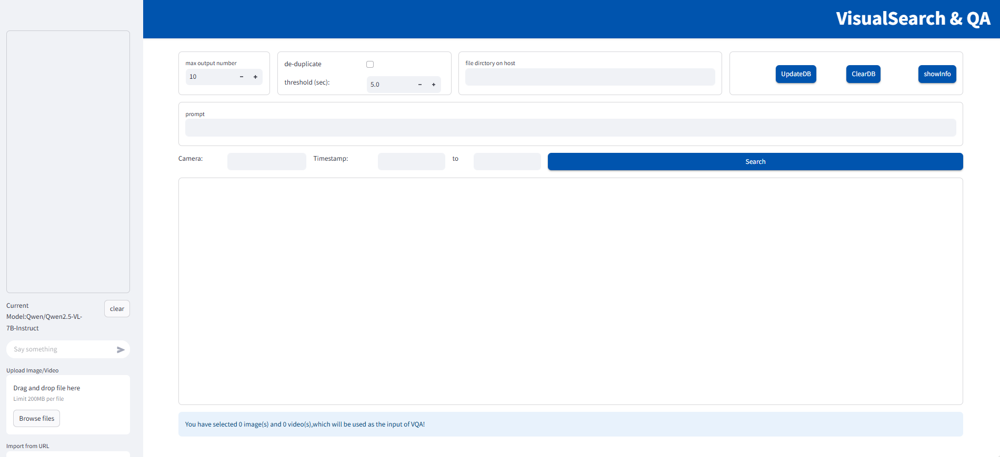
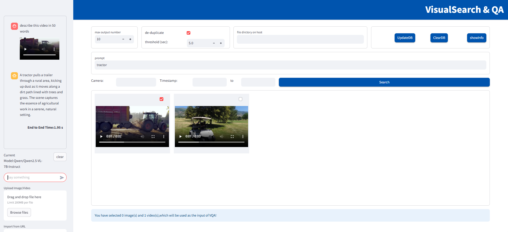

# Visual Search and QA

Combination of a multi-modal search engine and a visual Q&A assistant, allowing users to add search results as context for more related answers.

## Overview

We deliver a Reference Implementation, named "Visual Search and QA". It is mainly composed of three parts: a multi-modal search engine, a multi-modal visual QnA chatbot which can answer questions based on the search results, and a fronted web UI which allows users to interact with and examine the search engine and chatbot.

The search engine is equipped with a data preparation microservice and a retriever microservice. Together they support a typical workflow: images and videos data are processed and stored into a database, then users can start a query with text description, the images and videos that fit the description would be found in the database and returned to users.

The visual QnA chatbot is a large vision language model that can take text and/or visual content (image/video) as input to chat with. In this RI, we further support adding the results from the search engine directly to the chatbot, and let the chatbot answer questions based on the context.

-    **Programming Language:** Python

## How It Works

The high-level architecture is shown below

Figure 1: Architecture Diagram

### Dataprep

The dataprep microservice processes images and videos, extracts their embeddings using the image encoder from the CLIP model, and stores them in a vector database. 

#### Video Processing:
-    Extract frames at configurable intervals.

#### Image/Frame Processing:
-    Resize, convert colors, normalize, and apply object detection with cropping.

> **Note:**  
> Object detection and cropping improve retrieval performance for large-scale scene images (e.g., high-resolution surveillance images with multiple objects).  
> Since the image encoder input size is 224x224, resizing may render some objects (e.g., humans, vehicles) unrecognizable.  
> Object detection and cropping preserve these objects as clear targets in separate cropped images. Metadata links the original image to its cropped versions. During retrieval, if a cropped image matches, the original image is returned.
Instead of uploading data, users can specify directories on the host machine as data sources. This approach is more efficient for large datasets, which are common in the application's target scenarios. Assuming the application is self-hosted, users have certain access to the server. Then users know where the files are stored on the host machine, and can provide the file directory as input so that the microservice can process one-after-another or in batches.  

### Retriever

The retriever microservice consists of a local multi-modal embedding model (same as the dataprep microservice) and a vector DB search engine.  

#### Workflow:
1. The embedding model generates text embeddings for input descriptions (e.g., "traffic jam").
2. The search engine searches the vector database for the top-k most similar matches.

### Model Serving

Check the [model serving doc](https://github.com/open-edge-platform/edge-ai-libraries/tree/main/microservices) for more details.

### Web UI
The UI, built with `streamlit`, allows users to:
-    Enter search queries.
-    View matched results.
-    Interact with the LVM in a chatbox with upload tools.

#### Visual Search and QA UI Initial Interface:

Figure 2: Initial Web UI

#### Visual Search and QA UI Example:

Figure 3: Web UI with an example

## Learn More
-    Check the [System requirements](./system-requirements.md)
-    Start with the [Get Started](./get-started.md).