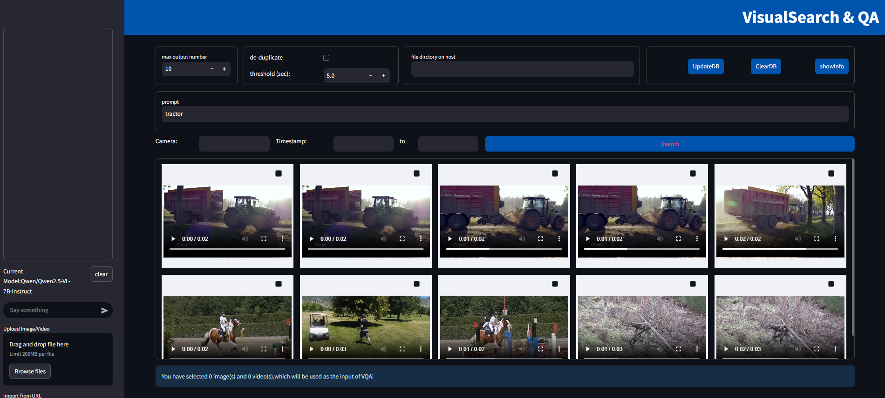
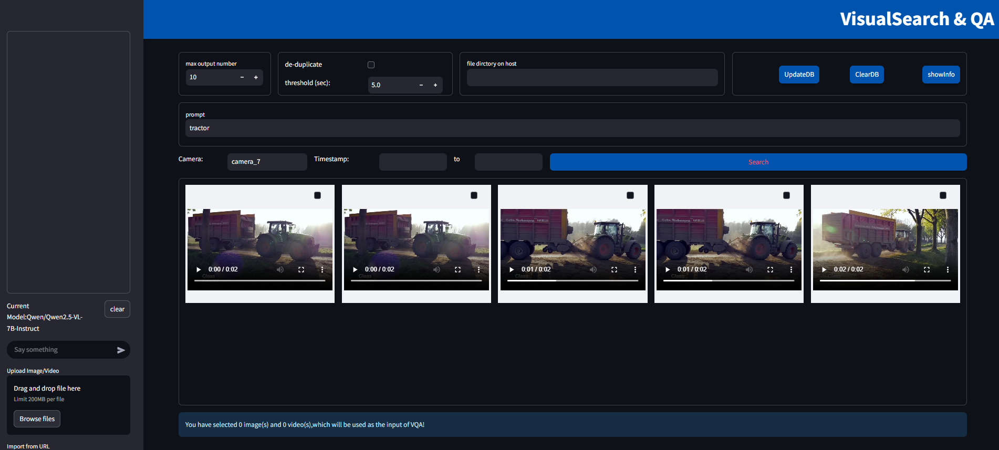
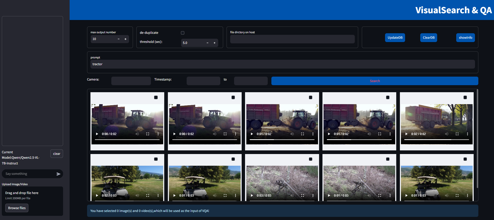
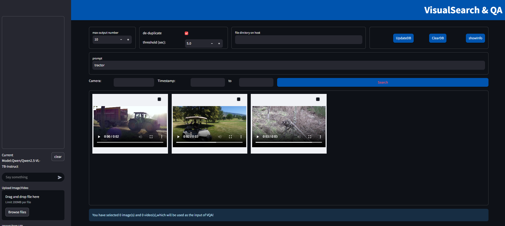

# Tutorials

These tutorials demonstrate how to use the Visual Search and QA reference implementation. 

-    Use your own dataset for searching 
-    Filtered search
-    Configurable parameters


## Tutorial 1: Use your own dataset for searching

In this tutorial, you will learn how to use your own dataset for searching.

### Learning Objectives

-   By the end of this tutorial, you will be able to ingest your own dataset to vector DB and conduct search and QA based on them.

### Step 1: Put the dataset under designated host directory

1.  Check `env.sh` which is sourced before executing `docker compose`, find `HOST_DATA_PATH`, which should be pre-created according to [Get Started](./get-started.md). 

    ``` bash
    export HOST_DATA_PATH="$HOME/data"
    ```

2.  Put your dataset (including images and videos) under this directory


### Step 2: ingest the dataset to vector DB

1.  Deploy the application

2.  Go to the web UI, fill in `file dirctory on host` with the absolute path to your dataset directory, and click `UpdateDB`

### Summary

In this tutorial, you learned how to use your own dataset for searching.

## Tutorial 2: Filtered search

In this tutorial, you will learn how to ingest data along with metadata to support filtered search

### Learning Objectives

-   By the end of this tutorial, you will be able to ingest data with metadata by providing matched metadata json file for each media data file in the `file dirctory on host` used for updating DB
-   By the end of this tutorial, you will be able to manually ingest single data file with specified metadata using dataprep microservice API

-   By the end of this tutorial, you will be able to conduct filtered search on web UI

### Step 1: Prepare metadata json file

1.  When processing data files in `file dirctory on host` (for simplicity, noted as `<host_data_path>` in the following steps), the dataprep microservice automatically looks for a json file in `<host_data_path>/meta` with the same basename with the file that is being processing. For example, when processing file ``<host_data_path>/image123.png`, it looks for a `<host_data_path>/meta/image123.json`. If found, the fields in the json file would be recorded into the vector DB along with the media file as its metadata.

2.  In the web UI, two example fields are supported: `camera` and `timestamp`. An example json is like:

    ``` 
    {
        "camera": "camera_1",
        "timestamp": 20250101
    }
    ```

3.  Here is an example python function to generate fake metadata json files given the file directory
    ```
    def generate_fake_meta(file_dir):
        if not os.path.isdir(file_dir):
            raise ValueError(f"The provided path '{file_dir}' is not a valid directory.")
        
        timestamp = datetime.date(2025, 1, 1)
        timestamp = int(timestamp.strftime("%Y%m%d"))  # 20250101

        cnt = 1
        month = 1

        meta_dir = os.path.join(file_dir, "meta")
        os.makedirs(meta_dir, exist_ok=True)

        for root, _, files in os.walk(file_dir): 
            if root.split("/")[-1] == "meta":
                continue
            for file_name in files:                
                file_path = os.path.join(root, file_name)
                # Skip directories, only process files
                if os.path.isfile(file_path):
                    # Generate the JSON file name
                    base_name, _ = os.path.splitext(file_name)
                    json_file_path = os.path.join(meta_dir, f"{base_name}.json")
                    fake_label = f"camera_{cnt}"
                    timestamp = datetime.date(2025, month, cnt % 30 + 1)  # Increment day, reset to 1 if exceeds 30
                    fake_timestamp = int(timestamp.strftime("%Y%m%d"))
                    fake_meta = {
                        "camera": fake_label,  
                        "timestamp": fake_timestamp  
                    }

                    cnt += 1
                    if cnt > month*30:
                        month += 1

                    # Write the JSON content to the file
                    with open(json_file_path, "w") as json_file:
                        json.dump(fake_meta, json_file, indent=4)
    ```

4.  Also, you may try using the dateprep microservice API to manually ingest a single data file with given metadata, for example:
    ```curl
    # if it is already ingested, delete first
    curl -X DELETE "http://10.67.106.227:9990/v1/dataprep/delete?file_path=<path_to_your_file.mp4>"

    # re-ingest with metadata
    curl -X POST "http://${host_ip}:${DATAPREP_SERVICE_PORT}/v1/dataprep/ingest" \
    -H "Content-Type: application/json" \
    -d '{
        "file_path": <path_to_your_file.mp4>,
        "meta": {"camera": "camera_7"}
    }'
    ```

### Step 2: Use metadata as filter on web UI

1.  Once the metadata is available, it can be used for filtered search



Figure 1: Search without filter



Figure 2: Search with filter

### Supported filters
-    Any string key-value pair: for example, {"camera": "camera_1"}, {"city": "Shanghai"}, {"location": "front_door"} etc. The rule for such filters is that the values must match with the entities meta in DB
-    `timestamp_start` and `timestamp_end`: a range of timestamp, should be integers, such as UNIX timestamp or date in YYYYMMDD format 

### Summary

In this tutorial, you learned how to: ingest data with metadata (both via providing a json file or via API), and search with filters enabled


## Tutorial 3: Configurable parameters

In this tutorial, you will learn how to adjust the configuarable parameters for the application

### Learning Objectives

-   By the end of this tutorial, you will be able to know which parameters to modify when needed

### Configurable parameters

-    The number of results shown per row in UI layout: default as 5. Change it by exporting this environment variable and re-deploy the application
        ```bash
        export  SHOW_RESULT_PER_ROW=10
        ```

-    Deduplicate switch and threshold: deduplicate switch decides whether or not to enable deduplication for similar search results. Note that this function currently supports video only. Once enabled, video search results that are the same video and start within the interval of threshold would be deduplicated. Only one remains. For example:



Figure 1: Search without deduplication



Figure 2: Search with deduplication

Without deduplication enabled, the first row of results are from the same video, and the time difference among them are less than 5 seconds. Therefore, when deduplication is ticked, search button returns only one result from that video.

## Learn More
-    Deploy the application with the [Get Started](./get-started.md).
-    Understand the components, services, architecture, and data flow, in
     the [Overview](./Overview.md).